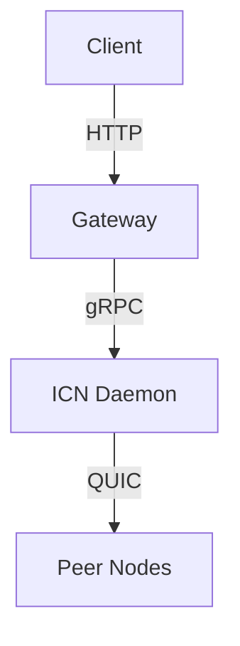

# Documentation Instructions

These instructions apply to documentation files in the `docs/` directory.

## Documentation Philosophy

- **Clarity over cleverness**: Simple, direct language
- **Examples over abstractions**: Show, don't just tell
- **User-focused**: Write for the reader's needs, not your knowledge
- **Maintainable**: Keep docs up to date with code changes

## Documentation Structure

```
docs/
├── ARCHITECTURE.md       # System design and component interactions
├── GETTING_STARTED.md    # New developer onboarding
├── FAQ.md               # Common questions
├── PHASE_HISTORY.md     # Completed development phases
├── dev-journal/         # Development session notes
├── demo/                # Demo and testing documentation
├── security/            # Security audits and threat models
└── [domain]/            # Domain-specific documentation
```

## Writing Style

### Tone

- Professional but friendly
- Clear and concise
- Active voice preferred
- Present tense for current features
- Avoid jargon unless necessary (define when used)

### Structure

- Start with a clear purpose statement
- Use headings to organize content
- Include table of contents for long documents
- Add cross-references to related docs
- End with "Next Steps" or "See Also" section

### Code Examples

Always include:
- Context: What the example demonstrates
- Complete, runnable code
- Expected output or result
- Any prerequisites or setup needed

Example structure:
````markdown
## Creating a Transaction

To create a transaction in the mutual credit ledger:

```bash
# Prerequisites: ICN daemon must be running
# and you must have a valid authentication token

icnctl ledger create-tx \
  --recipient did:icn:abc123 \
  --amount 2.5 \
  --description "Website design"
```

Expected output:
```
Transaction created successfully
ID: tx_xyz789
Status: Pending
```
````

## Markdown Conventions

### Headers

- Use ATX-style headers (`#`, `##`, `###`)
- One H1 (`#`) per document
- Hierarchical structure (don't skip levels)
- Sentence case for headers

### Lists

- Use `-` for unordered lists
- Use `1.` for ordered lists
- Indent nested lists with 2 spaces
- Add blank line before and after lists

### Code Blocks

- Use fenced code blocks with language identifier
- Use `bash` for shell commands
- Use `rust` for Rust code
- Use `typescript` or `javascript` for SDK examples
- Use `toml` for config files

### Links

- Use descriptive link text (not "click here")
- Use relative links for internal docs
- Verify links are not broken

Example:
```markdown
See [Getting Started Guide](GETTING_STARTED.md) for setup instructions.
```

### Emphasis

- Use **bold** for important concepts and UI elements
- Use *italics* for emphasis (sparingly)
- Use `code` for technical terms, commands, filenames

## Documentation Types

### Architecture Documents

- Explain the "why" behind design decisions
- Include diagrams where helpful
- Describe component interactions
- Document trade-offs considered

### API Documentation

- Auto-generate from code where possible (rustdoc, JSDoc)
- Supplement with narrative guides
- Include complete examples
- Document error conditions

### Guides and Tutorials

- Step-by-step instructions
- Prerequisites clearly stated
- Expected outcomes defined
- Troubleshooting section

### Release Notes / Changelogs

- Follow [Keep a Changelog](https://keepachangelog.com/) format
- Group changes by type: Added, Changed, Deprecated, Removed, Fixed, Security
- Include issue/PR references
- Note breaking changes prominently

## Maintenance

### Keeping Docs Current

- Update docs in the same PR as code changes
- Mark outdated docs with a warning banner:
  ```markdown
  > ⚠️ **Warning**: This document may be outdated. Last reviewed: YYYY-MM-DD
  ```
- Regular doc review cycles (quarterly)
- Remove or archive obsolete documentation

### Documentation Reviews

- Treat docs like code - review for accuracy and clarity
- Test all code examples
- Verify all links work
- Check for consistency with current codebase

## Common Documentation Tasks

### Adding a New Feature Doc

1. Determine the appropriate location (`docs/` subdirectory)
2. Create file with descriptive name (`feature-name.md`)
3. Follow the standard structure (purpose, examples, API, troubleshooting)
4. Add cross-references from related docs
5. Update main README.md or index if needed

### Documenting Breaking Changes

1. Add prominent warning at the top
2. Explain what changed and why
3. Provide migration guide with examples
4. Document in CHANGELOG.md
5. Update version number appropriately

### Creating Diagrams

- Use Mermaid for diagrams in Markdown (GitHub supports it)
- Keep diagrams simple and focused
- Include alt text for accessibility
- Store complex diagrams as SVG in `docs/diagrams/`

Example Mermaid:
````markdown

````

## Important Notes

- **Never save documentation to project root** (except README, CHANGELOG, CONTRIBUTING, CODE_OF_CONDUCT)
- All other docs go in `docs/` subdirectories
- Use consistent terminology (see `docs/glossary.md`)
- Consider non-native English speakers
- Make docs searchable (good keywords and structure)

## References

- [Keep a Changelog](https://keepachangelog.com/)
- [Conventional Commits](https://www.conventionalcommits.org/)
- [Markdown Guide](https://www.markdownguide.org/)
- [Write the Docs](https://www.writethedocs.org/)
