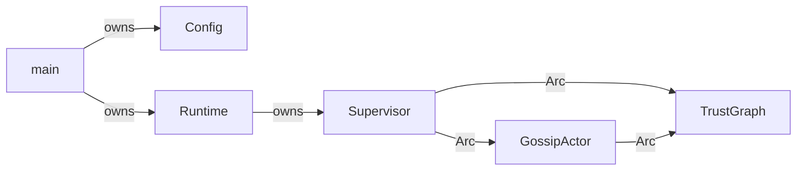
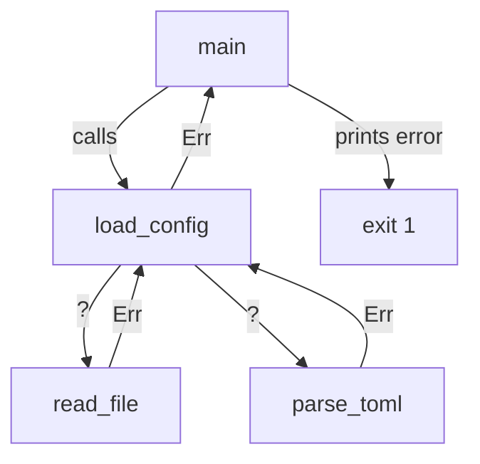
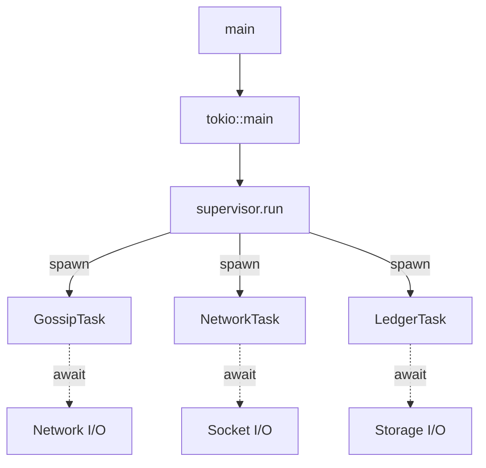

# Module 1: Rust Fundamentals

## Overview
This module teaches the Rust concepts essential for understanding ICN code. Even
if you know Rust, review this module to understand ICN's specific patterns and
conventions.

## Objectives
- Understand ownership, borrowing, and lifetimes
- Master error handling with `Result`, `Option`, and the `?` operator
- Read and write async Rust code using Tokio
- Understand smart pointers (`Arc`, `Mutex`, `RwLock`) for shared state

## Prerequisites
- Module 0 (Setup)
- Basic programming knowledge (variables, functions, control flow)

## Key Reading
- `icn/bins/icnd/src/main.rs` - Entry point with error handling
- `icn/crates/icn-core/src/runtime.rs` - Async runtime patterns
- `icn/crates/icn-core/src/supervisor/mod.rs` - Shared ownership patterns

---

## Core Concepts

### 1. Ownership: Rust's Memory Safety Foundation

**What is ownership?**

In most languages, you either manage memory manually (C/C++) or rely on garbage
collection (Java, Go, Python). Rust takes a third approach: **ownership**.

Every value in Rust has exactly one owner. When the owner goes out of scope,
the value is automatically dropped (freed).

```rust
fn main() {
    let s1 = String::from("hello");  // s1 owns the string
    let s2 = s1;                      // ownership MOVES to s2
    // println!("{}", s1);            // ERROR! s1 no longer owns anything
    println!("{}", s2);               // OK, s2 is the owner
}
```

**Why does ICN care?**

Ownership prevents data races at compile time. In a distributed system like ICN,
where multiple actors process messages concurrently, ownership rules guarantee
that two actors can't accidentally corrupt shared data.

### 2. Borrowing: Temporary Access Without Ownership

**What is borrowing?**

Instead of transferring ownership, you can **borrow** a reference to data:

```rust
fn calculate_length(s: &String) -> usize {  // &String is a reference (borrow)
    s.len()
}

fn main() {
    let s = String::from("hello");
    let len = calculate_length(&s);  // borrow s, don't take ownership
    println!("Length of '{}' is {}", s, len);  // s is still valid!
}
```

**Two types of borrows:**
- `&T` - Immutable borrow (read-only, many allowed simultaneously)
- `&mut T` - Mutable borrow (read-write, only ONE allowed at a time)

```rust
let mut s = String::from("hello");

// Many immutable borrows OK
let r1 = &s;
let r2 = &s;
println!("{} and {}", r1, r2);

// Mutable borrow (exclusive)
let r3 = &mut s;
r3.push_str(" world");
```

**The borrowing rule:**
> You can have EITHER multiple immutable references OR exactly one mutable
> reference, but never both at the same time.

This rule prevents data races at compile time!

### 3. Lifetimes: How Long References Are Valid

**What are lifetimes?**

Lifetimes tell the compiler how long a reference is valid. Usually, the compiler
infers them automatically (lifetime elision).

```rust
// Compiler infers: the returned &str lives as long as input s
fn first_word(s: &str) -> &str {
    &s[..s.find(' ').unwrap_or(s.len())]
}
```

Sometimes you need explicit lifetime annotations:

```rust
// 'a says: the returned reference lives as long as BOTH inputs
fn longest<'a>(x: &'a str, y: &'a str) -> &'a str {
    if x.len() > y.len() { x } else { y }
}
```

**In ICN:** Most lifetime complexity is hidden behind smart pointers (`Arc`).
You'll rarely write explicit lifetime annotations.

---

## Error Handling

### 4. Result: Recoverable Errors

**What is Result?**

`Result<T, E>` represents an operation that can succeed (`Ok(T)`) or fail (`Err(E)`):

```rust
enum Result<T, E> {
    Ok(T),   // Success, contains value of type T
    Err(E),  // Failure, contains error of type E
}
```

**Using Result:**

```rust
use std::fs::File;

fn open_config() -> Result<File, std::io::Error> {
    File::open("config.toml")
}

fn main() {
    match open_config() {
        Ok(file) => println!("Opened file: {:?}", file),
        Err(e) => println!("Failed to open: {}", e),
    }
}
```

### 5. The `?` Operator: Error Propagation

**What does `?` do?**

The `?` operator propagates errors up the call stack. It's syntactic sugar for:

```rust
// This:
let file = File::open("config.toml")?;

// Is equivalent to:
let file = match File::open("config.toml") {
    Ok(f) => f,
    Err(e) => return Err(e.into()),
};
```

**Chaining with `?`:**

```rust
fn read_config() -> Result<String, std::io::Error> {
    let mut file = File::open("config.toml")?;  // propagate if error
    let mut contents = String::new();
    file.read_to_string(&mut contents)?;         // propagate if error
    Ok(contents)
}
```

### 6. Option: Nullable Values

**What is Option?**

`Option<T>` represents a value that might be absent:

```rust
enum Option<T> {
    Some(T),  // Value is present
    None,     // Value is absent
}
```

**Using Option:**

```rust
fn find_user(id: u64) -> Option<User> {
    // Returns Some(user) if found, None if not
}

// Using match
match find_user(42) {
    Some(user) => println!("Found: {}", user.name),
    None => println!("User not found"),
}

// Using if let (concise)
if let Some(user) = find_user(42) {
    println!("Found: {}", user.name);
}

// Using unwrap_or (default value)
let user = find_user(42).unwrap_or(default_user);
```

### 7. anyhow and thiserror: ICN's Error Strategy

**thiserror: Domain-Specific Errors**

ICN uses `thiserror` to define structured errors for each subsystem:

```rust
use thiserror::Error;

#[derive(Debug, Error)]
pub enum LedgerError {
    #[error("Insufficient balance: needed {needed}, have {available}")]
    InsufficientBalance { needed: i64, available: i64 },

    #[error("Account not found: {0}")]
    AccountNotFound(String),

    #[error("Storage error: {0}")]
    Storage(#[from] StorageError),  // Automatic conversion
}
```

**anyhow: Application-Level Errors**

At application boundaries (CLI, main), ICN uses `anyhow` for flexible error handling:

```rust
use anyhow::{Context, Result};

fn load_config(path: &Path) -> Result<Config> {
    let data = std::fs::read_to_string(path)
        .context("Failed to read config file")?;  // Add context

    let config: Config = toml::from_str(&data)
        .context("Failed to parse config")?;

    Ok(config)
}
```

**When to use which:**
- `thiserror` - Library code with specific error types
- `anyhow` - Application code, CLI, test helpers

---

## Async Programming

### 8. What is Async?

**The problem:** In network applications, most time is spent waiting for I/O
(network, disk). Blocking threads is wasteful.

**The solution:** Async programming lets a single thread handle many tasks by
switching between them while waiting.

```rust
// Synchronous (blocking)
let response = client.get(url).send();  // Thread blocked until response

// Asynchronous (non-blocking)
let response = client.get(url).send().await;  // Task yields while waiting
```

### 9. Futures and `async`/`await`

**What is a Future?**

A Future represents a value that will be available later. It's like a promise
or deferred value.

```rust
// async fn returns a Future
async fn fetch_data(url: &str) -> Result<String> {
    let response = reqwest::get(url).await?;
    let text = response.text().await?;
    Ok(text)
}
```

**What does `await` do?**

`.await` pauses the current task until the Future completes. While paused,
other tasks can run on the same thread.

```rust
async fn process_messages() {
    let msg1 = receive_message().await;  // Pause here until message arrives
    process(msg1);
    let msg2 = receive_message().await;  // Pause here for next message
    process(msg2);
}
```

### 10. Tokio: ICN's Async Runtime

**What is Tokio?**

Tokio is an async runtime that provides:
- Task scheduler (runs async tasks efficiently)
- I/O primitives (async networking, file I/O)
- Synchronization (channels, mutexes)
- Timers and utilities

**Starting the runtime:**

```rust
#[tokio::main]
async fn main() -> Result<()> {
    // This is now an async context
    let result = do_async_work().await?;
    Ok(())
}
```

**Spawning tasks:**

```rust
// Spawn a task that runs concurrently
let handle = tokio::spawn(async {
    // This runs in the background
    process_messages().await
});

// Later, wait for it to complete
let result = handle.await?;
```

**ICN uses `tokio::spawn` for:**
- Background message processing
- Periodic maintenance tasks
- Parallel I/O operations

---

## Smart Pointers for Shared State

### 11. Arc: Shared Ownership Across Threads

**What is Arc?**

`Arc` (Atomic Reference Counted) allows multiple owners of the same data across
threads. It keeps a count of references and drops the data when count reaches zero.

```rust
use std::sync::Arc;

let data = Arc::new(vec![1, 2, 3]);

let data_clone = Arc::clone(&data);  // Increment reference count

// Both data and data_clone point to the same vector
// Vector is dropped when BOTH go out of scope
```

**Why "Atomic"?**

The reference count is updated atomically (thread-safe), so `Arc` is safe to
share across threads. Regular `Rc` is NOT thread-safe.

### 12. Mutex: Exclusive Access

**What is Mutex?**

`Mutex` (Mutual Exclusion) ensures only one thread can access data at a time:

```rust
use std::sync::Mutex;

let counter = Mutex::new(0);

// Lock to get exclusive access
let mut num = counter.lock().unwrap();
*num += 1;
// Lock is automatically released when `num` goes out of scope
```

**In async code, use `tokio::sync::Mutex`:**

```rust
use tokio::sync::Mutex;

let counter = Arc::new(Mutex::new(0));

async fn increment(counter: Arc<Mutex<i32>>) {
    let mut num = counter.lock().await;  // async lock
    *num += 1;
}
```

### 13. RwLock: Multiple Readers OR One Writer

**What is RwLock?**

`RwLock` allows either:
- Multiple simultaneous readers (shared read access)
- One exclusive writer (no readers while writing)

```rust
use tokio::sync::RwLock;

let data = Arc::new(RwLock::new(HashMap::new()));

// Multiple readers OK
let read_guard = data.read().await;
println!("Value: {:?}", read_guard.get("key"));

// Exclusive writer
let mut write_guard = data.write().await;
write_guard.insert("key", "value");
```

**When to use which:**
- `Mutex` - When all access is read-write
- `RwLock` - When reads are much more common than writes

### 14. ICN's Pattern: `Arc<RwLock<T>>`

ICN actors share state using `Arc<RwLock<T>>`:

```rust
// In supervisor
let trust_graph: Arc<RwLock<TrustGraph>> = Arc::new(RwLock::new(
    TrustGraph::new(store)
));

// Share with multiple actors
let gossip_actor = GossipActor::new(
    Arc::clone(&trust_graph),  // Gossip can read/write trust
);

let network_actor = NetworkActor::new(
    Arc::clone(&trust_graph),  // Network can read/write trust
);
```

**Why this pattern?**
- `Arc` - Multiple actors can hold references
- `RwLock` - Safe concurrent access with read preference
- Interior mutability - Can modify through shared reference

---

## Putting It Together: ICN Startup Flow

```rust
// icn/bins/icnd/src/main.rs
#[tokio::main]  // Start Tokio runtime
async fn main() -> Result<()> {  // anyhow::Result for error handling
    // Load config (ownership: main owns config)
    let config = Config::from_file(&args.config)
        .context("Failed to load config")?;  // ? propagates errors

    // Open keystore (Result propagation)
    let identity = open_keystore(&config).await?;

    // Create runtime (ownership transfer)
    let runtime = Runtime::new(config, identity);

    // Run until shutdown (async/await)
    runtime.run().await?;

    Ok(())
}
```

---

## Diagrams

### Ownership Flow


### Error Propagation


### Async Task Flow


---

## Code Examples from ICN

### Error Handling Pattern
```rust
// From icn/bins/icnd/src/main.rs
let config = if let Some(config_path) = &args.config {
    Config::from_file(config_path)
        .context("Failed to load config file")?
} else {
    Config::default()
};
```

### Shared State Pattern
```rust
// From icn/crates/icn-core/src/supervisor/mod.rs
let trust_graph: Arc<RwLock<TrustGraph>> = Arc::new(RwLock::new(
    TrustGraph::new(trust_store.clone())
        .map_err(|e| anyhow::anyhow!("Failed to create trust graph: {e}"))?
));
```

### Async Actor Pattern
```rust
// From icn/crates/icn-core/src/runtime.rs
pub async fn run(self) -> Result<()> {
    info!("ICNd runtime starting");

    let supervisor = Supervisor::new(
        self.config.clone(),
        self.identity_bundle,
        self.shutdown_tx.clone(),
    );

    supervisor.run().await?;

    info!("ICNd runtime stopped");
    Ok(())
}
```

---

## Exercises

1. **Error Propagation**: Find all uses of `?` in `icnd/src/main.rs`. For each,
   explain what error type is being propagated.

2. **Ownership Analysis**: In `supervisor/mod.rs`, find a struct that uses `Arc`.
   Explain why `Arc` is needed instead of a regular reference.

3. **Async Understanding**: Find a `tokio::spawn` call in the codebase. Explain
   why the task is spawned rather than awaited directly.

4. **Write Code**: Write a function that:
   - Takes a file path
   - Reads the file contents
   - Returns `Result<String>`
   - Uses `?` for error propagation
   - Adds context with `.context()`

---

## Checkpoints

- [ ] You can explain ownership vs borrowing with an example
- [ ] You understand when to use `&T` vs `&mut T`
- [ ] You can read code using `?` and explain the error flow
- [ ] You know the difference between `Result` and `Option`
- [ ] You understand what `async`/`await` does
- [ ] You can explain why ICN uses `Arc<RwLock<T>>` for shared state
- [ ] You know when to use `Mutex` vs `RwLock`

---

## Quick Reference

| Concept | Purpose | Example |
|---------|---------|---------|
| Ownership | Memory safety | `let s2 = s1;` (move) |
| `&T` | Immutable borrow | `fn f(s: &String)` |
| `&mut T` | Mutable borrow | `fn f(s: &mut String)` |
| `Result<T,E>` | Fallible operation | `File::open(path)` |
| `Option<T>` | Nullable value | `map.get(key)` |
| `?` | Propagate error | `file.read()?` |
| `async fn` | Async function | `async fn fetch()` |
| `.await` | Wait for future | `response.await` |
| `Arc<T>` | Shared ownership | `Arc::new(data)` |
| `Mutex<T>` | Exclusive access | `mutex.lock()` |
| `RwLock<T>` | Read/write lock | `rwlock.read()` |

---

## Next Steps

Proceed to **Module 2: Architecture Overview** to understand how these Rust
patterns fit into ICN's layered system design.
