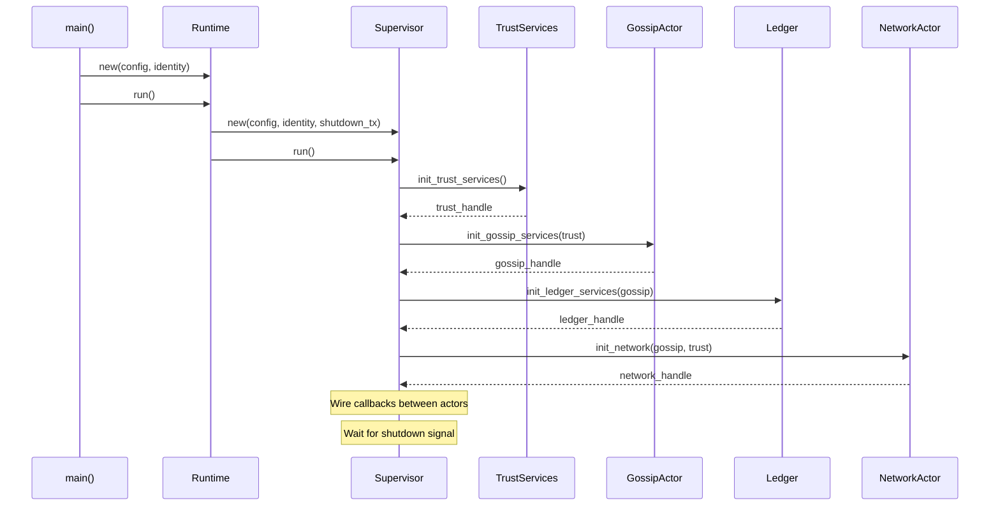
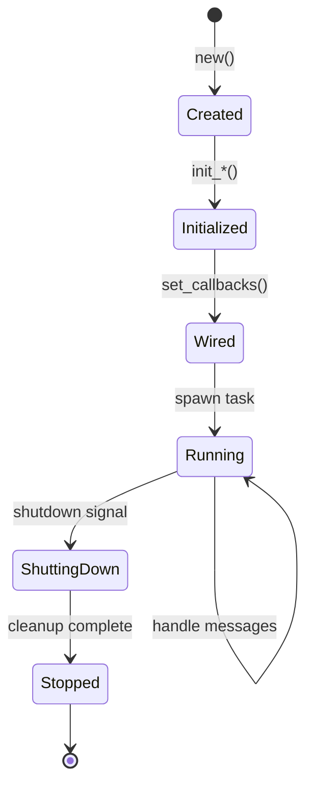

# Module 3: Runtime and Actor Model

## Overview

> **ICN is a constraint engine: apps translate meaning into constraints; the kernel enforces constraints without understanding meaning.**

This module teaches you how ICN starts up, manages long-running services, and coordinates graceful shutdown. Understanding the runtime and actor model is essential for contributing to any ICN subsystem.

In the constraint engine model, the runtime and supervisor are part of the **kernel** (enforcement mechanisms), while actors like Trust, Governance, and Ledger are **policy oracles** that translate domain semantics into constraints.

## Objectives
- Trace the startup flow from `icnd` main to running actors
- Understand the actor pattern and why ICN uses it
- Learn how actors are initialized in dependency order
- Understand graceful shutdown coordination
- Know how to add a new actor to the system

## Prerequisites
- Module 2 (Architecture)
- Module 1 (Rust async and smart pointers)

## Key Reading
- `icn/bins/icnd/src/main.rs` - Entry point
- `icn/crates/icn-core/src/runtime.rs` - Runtime lifecycle
- `icn/crates/icn-core/src/supervisor/mod.rs` - Actor orchestration

---

## Core Concepts

### 1. The ICN Process Lifecycle

When you run `icnd`, here's what happens:

```
┌──────────────────────────────────────────────────────────────────┐
│                         PROCESS STARTUP                          │
├──────────────────────────────────────────────────────────────────┤
│                                                                  │
│  1. main()                 Parse CLI args, load config           │
│       │                                                          │
│       ▼                                                          │
│  2. Initialize tracing     Set up logging and metrics            │
│       │                                                          │
│       ▼                                                          │
│  3. Open keystore          Unlock identity (passphrase)          │
│       │                                                          │
│       ▼                                                          │
│  4. Runtime::new()         Create runtime with config            │
│       │                                                          │
│       ▼                                                          │
│  5. Runtime::run()         Start supervisor                      │
│       │                                                          │
│       ▼                                                          │
│  6. Supervisor::run()      Initialize and run actors             │
│       │                                                          │
│       ▼                                                          │
│  7. Wait for shutdown      CTRL+C or signal                      │
│       │                                                          │
│       ▼                                                          │
│  8. Graceful shutdown      Stop actors, flush state              │
│                                                                  │
└──────────────────────────────────────────────────────────────────┘
```

### 2. The Runtime: Process-Level Concerns

**What is the Runtime?**

The Runtime is a thin lifecycle shell that:
- Holds configuration
- Manages the identity bundle
- Owns the shutdown broadcast channel
- Starts the Supervisor

**It does NOT implement system logic**—that's the Supervisor's job.

```rust
// From icn-core/src/runtime.rs
pub struct Runtime {
    config: Config,
    identity_bundle: Option<IdentityBundle>,
    shutdown_tx: ShutdownTx,  // broadcast::Sender<()>
}

impl Runtime {
    pub fn new(config: Config, identity_bundle: Option<IdentityBundle>) -> Self {
        let (shutdown_tx, _) = broadcast::channel(1);
        Runtime { config, identity_bundle, shutdown_tx }
    }

    pub async fn run(self) -> Result<()> {
        info!("ICNd runtime starting");

        // Create and run supervisor
        let supervisor = Supervisor::new(
            self.config.clone(),
            self.identity_bundle,
            self.shutdown_tx.clone(),
        );

        supervisor.run().await?;

        info!("ICNd runtime stopped");
        Ok(())
    }
}
```

**Why separate Runtime from Supervisor?**
- **Separation of concerns**: Process lifecycle vs. actor orchestration
- **Testability**: Can test Supervisor without full process setup
- **Flexibility**: Different entry points (daemon, tests) share Supervisor

### 3. The Supervisor: Actor Orchestration

**What is the Supervisor?**

The Supervisor is the orchestration layer that:
- Creates actors in the correct dependency order
- Wires connections between actors (callbacks, channels)
- Holds long-lived handles to keep actors alive
- Coordinates graceful shutdown

```rust
// From icn-core/src/supervisor/mod.rs
pub struct Supervisor {
    config: Config,
    identity_bundle: Option<IdentityBundle>,
    shutdown_tx: ShutdownTx,
}

impl Supervisor {
    pub async fn run(self) -> Result<()> {
        // Initialize metrics server
        icn_obs::init_metrics()?;

        // Track background tasks for graceful shutdown
        let mut background_tasks: JoinSet<()> = JoinSet::new();

        if let Some(identity_bundle) = &self.identity_bundle {
            // Full node: initialize all actors
            let did = identity_bundle.did().clone();

            // 1. Trust services first (needed by everyone)
            let trust_services = init_trust::init_trust_services(&self.config, did.clone()).await?;

            // 2. Gossip services (needs trust)
            let gossip_services = init_gossip::init_gossip_services(/*...*/).await?;

            // 3. Ledger services (needs gossip)
            let ledger_services = init_ledger::init_ledger_services(/*...*/).await?;

            // 4. Network actor (needs everything wired)
            let network_handle = init_network::init_network(/*...*/).await?;

            // 5. Gateway (exposes everything via API)
            let gateway = init_gateway::init_gateway(/*...*/).await?;

            // ... wait for shutdown
        } else {
            // Limited mode: no identity-dependent actors
            warn!("No identity bundle - running in limited mode");
        }

        Ok(())
    }
}
```

---

## The Actor Model

### 4. What is an Actor?

An **actor** is a concurrent component that:
- **Encapsulates state**: Only the actor can modify its internal state
- **Communicates via messages**: No shared mutable state between actors
- **Has a handle**: External code interacts through a handle
- **Runs as an async task**: Non-blocking, event-driven

**Why actors?**

| Problem | Actor Solution |
|---------|----------------|
| Shared mutable state | Each actor owns its state exclusively |
| Data races | Message passing eliminates races |
| Circular dependencies | Callbacks avoid direct references |
| Testing | Actors can be tested in isolation |
| Shutdown | Clear lifecycle management |

### 5. Actor Structure

Every ICN actor follows this pattern:

```rust
// 1. The actor struct holds internal state
pub struct MyActor {
    state: MyState,
    config: MyConfig,
    // ... internal fields
}

// 2. The handle provides concurrent access
#[derive(Clone)]
pub struct MyActorHandle {
    // Option A: Arc<RwLock<Actor>> for direct access
    inner: Arc<RwLock<MyActor>>,

    // Option B: Channel for message passing
    // tx: mpsc::Sender<MyCommand>,
}

impl MyActorHandle {
    pub async fn do_something(&self) -> Result<Something> {
        let actor = self.inner.read().await;
        actor.internal_operation()
    }

    pub async fn mutate(&self, data: Data) -> Result<()> {
        let mut actor = self.inner.write().await;
        actor.apply_mutation(data)
    }
}

// 3. Constructor creates both actor and handle
impl MyActor {
    pub fn new(config: MyConfig) -> (Self, MyActorHandle) {
        let actor = MyActor {
            state: MyState::default(),
            config,
        };
        let handle = MyActorHandle {
            inner: Arc::new(RwLock::new(actor)),
        };
        (actor, handle)
    }
}
```

### 6. Handle Patterns

ICN uses two main handle patterns:

**Pattern A: Arc<RwLock<Actor>>**

Direct access to actor state through a read-write lock.

```rust
pub struct GossipHandle {
    inner: Arc<RwLock<GossipActor>>,
}

impl GossipHandle {
    pub async fn subscribe(&self, topic: &str) -> Result<()> {
        let mut actor = self.inner.write().await;
        actor.add_subscription(topic)
    }

    pub async fn get_subscriptions(&self) -> Vec<String> {
        let actor = self.inner.read().await;
        actor.subscriptions.keys().cloned().collect()
    }
}
```

**Pros**: Simple, direct access
**Cons**: Lock contention if many readers/writers

**Pattern B: Channel-Based (mpsc)**

Commands sent through channels, processed by actor loop.

```rust
pub struct NetworkHandle {
    tx: mpsc::Sender<NetworkCommand>,
}

enum NetworkCommand {
    SendMessage {
        to: Did,
        msg: NetworkMessage,
        reply: oneshot::Sender<Result<()>>,
    },
    GetPeer {
        did: Did,
        reply: oneshot::Sender<Option<PeerInfo>>,
    },
}

impl NetworkHandle {
    pub async fn send_message(&self, to: Did, msg: NetworkMessage) -> Result<()> {
        let (reply_tx, reply_rx) = oneshot::channel();
        self.tx.send(NetworkCommand::SendMessage {
            to,
            msg,
            reply: reply_tx,
        }).await?;
        reply_rx.await?
    }
}

// Actor loop
impl NetworkActor {
    pub async fn run(mut self, mut rx: mpsc::Receiver<NetworkCommand>) {
        while let Some(cmd) = rx.recv().await {
            match cmd {
                NetworkCommand::SendMessage { to, msg, reply } => {
                    let result = self.internal_send(&to, msg).await;
                    let _ = reply.send(result);
                }
                // ... handle other commands
            }
        }
    }
}
```

**Pros**: Backpressure, no lock contention, clear command boundaries
**Cons**: More boilerplate, indirect access

---

## Actor Communication

### 7. Callbacks: Connecting Actors

Actors communicate through callbacks to avoid circular dependencies.

**The problem:**
```rust
// This creates circular dependency - won't compile
struct GossipActor {
    network: NetworkHandle,  // Gossip depends on Network
}

struct NetworkActor {
    gossip: GossipHandle,    // Network depends on Gossip
}
```

**The solution: Callbacks**
```rust
// Callback type for sending messages
pub type SendCallback = Arc<dyn Fn(Did, GossipMessage) -> Result<()> + Send + Sync>;

struct GossipActor {
    send_callback: Option<SendCallback>,  // Set after creation
}

impl GossipActor {
    pub fn set_send_callback(&mut self, callback: SendCallback) {
        self.send_callback = Some(callback);
    }

    fn broadcast(&self, msg: GossipMessage) -> Result<()> {
        if let Some(ref cb) = self.send_callback {
            for peer in self.subscribers.keys() {
                cb(peer.clone(), msg.clone())?;
            }
        }
        Ok(())
    }
}
```

**Wiring in Supervisor:**
```rust
// Create actors first
let gossip_handle = GossipActor::new(config).1;
let network_handle = NetworkActor::new(config).1;

// Then wire callbacks
let network_for_gossip = network_handle.clone();
let send_callback: SendCallback = Arc::new(move |to, msg| {
    // This closure captures network_handle
    network_for_gossip.blocking_send(to, msg)
});

gossip_handle.write().await.set_send_callback(send_callback);
```

### 8. Common Callback Types

```rust
// Network → Gossip: Handle incoming messages
pub type IncomingMessageHandler = Arc<
    dyn Fn(NetworkMessage) -> Result<()> + Send + Sync
>;

// Gossip → Network: Send outgoing messages
pub type SendMessageCallback = Arc<
    dyn Fn(Did, GossipMessage) -> Result<()> + Send + Sync
>;

// Gossip → Ledger: Notify of new entries
pub type LedgerNotificationCallback = Arc<
    dyn Fn(LedgerEntry) -> Result<()> + Send + Sync
>;

// Trust → Security: Report misbehavior
pub type MisbehaviorCallback = Arc<
    dyn Fn(Did, MisbehaviorEvent) -> Result<()> + Send + Sync
>;
```

---

## Initialization Order

### 9. Why Order Matters

Actors have dependencies. The Supervisor must initialize them in the right order:

```
┌─────────────────────────────────────────────────────────────────┐
│                    INITIALIZATION ORDER                          │
├─────────────────────────────────────────────────────────────────┤
│                                                                 │
│  1. Metrics/Observability    ← Needed for all subsequent steps  │
│       │                                                         │
│       ▼                                                         │
│  2. Storage (Sled)           ← Persistence for everyone         │
│       │                                                         │
│       ▼                                                         │
│  3. Trust Services           ← Access control for network       │
│       ├── TrustGraph                                            │
│       ├── MisbehaviorDetector                                   │
│       └── RecoveryStore                                         │
│       │                                                         │
│       ▼                                                         │
│  4. Gossip Services          ← Needs trust for gating           │
│       ├── GossipActor                                           │
│       └── Topic subscriptions                                   │
│       │                                                         │
│       ▼                                                         │
│  5. Ledger Services          ← Needs gossip for replication     │
│       ├── Ledger                                                │
│       ├── ContractRuntime                                       │
│       └── TreasuryManager                                       │
│       │                                                         │
│       ▼                                                         │
│  6. Cooperative Services     ← Domain logic on ledger           │
│       ├── CoopActor                                             │
│       └── CommunityActor                                        │
│       │                                                         │
│       ▼                                                         │
│  7. Network Actor            ← Needs gossip handler wired       │
│       │                                                         │
│       ▼                                                         │
│  8. Gateway                  ← Exposes everything via API       │
│                                                                 │
└─────────────────────────────────────────────────────────────────┘
```

### 10. Dependency Wiring

After actors are created, the Supervisor wires their connections:

```rust
// From supervisor initialization
async fn wire_actors(
    network_handle: &NetworkHandle,
    gossip_handle: &GossipHandle,
    ledger_handle: &LedgerHandle,
    trust_graph: &Arc<RwLock<TrustGraph>>,
) -> Result<()> {
    // 1. Network → Gossip (incoming messages)
    let gossip_for_network = gossip_handle.clone();
    let incoming_handler: IncomingMessageHandler = Arc::new(move |msg| {
        if let MessagePayload::Gossip(gossip_msg) = msg.payload {
            gossip_for_network.blocking_write().handle_message(gossip_msg)?;
        }
        Ok(())
    });
    network_handle.write().await.set_incoming_handler(incoming_handler);

    // 2. Gossip → Network (outgoing messages)
    let network_for_gossip = network_handle.clone();
    let send_callback: SendCallback = Arc::new(move |to, msg| {
        network_for_gossip.blocking_send(to, wrap_gossip(msg))
    });
    gossip_handle.write().await.set_send_callback(send_callback);

    // 3. Gossip → Ledger (new entry notifications)
    let ledger_for_gossip = ledger_handle.clone();
    let ledger_callback: LedgerCallback = Arc::new(move |entry| {
        ledger_for_gossip.blocking_write().apply_entry(entry)
    });
    gossip_handle.write().await.subscribe_ledger(ledger_callback);

    Ok(())
}
```

---

## Shutdown Coordination

### 11. The Shutdown Channel

Graceful shutdown uses a broadcast channel:

```rust
// Shutdown signal type
pub type ShutdownTx = broadcast::Sender<()>;
pub type ShutdownRx = broadcast::Receiver<()>;

// In Runtime
let (shutdown_tx, _) = broadcast::channel(1);

// Each actor subscribes
let mut shutdown_rx = shutdown_tx.subscribe();
```

### 12. Actor Shutdown Pattern

Every actor loop includes shutdown handling:

```rust
impl MyActor {
    pub async fn run(
        mut self,
        mut cmd_rx: mpsc::Receiver<Command>,
        mut shutdown_rx: ShutdownRx,
    ) {
        loop {
            tokio::select! {
                // Handle commands
                Some(cmd) = cmd_rx.recv() => {
                    self.handle_command(cmd).await;
                }

                // Handle shutdown
                _ = shutdown_rx.recv() => {
                    info!("MyActor received shutdown signal");
                    break;
                }
            }
        }

        // Cleanup
        self.persist_state().await;
        info!("MyActor shutdown complete");
    }
}
```

### 13. Triggering Shutdown

Shutdown is triggered by:
- **CTRL+C**: Signal handler sends to channel
- **API call**: Runtime::shutdown() method
- **Fatal error**: Supervisor drops channel

```rust
// Signal handler
tokio::spawn(async move {
    tokio::signal::ctrl_c().await.expect("Failed to listen for ctrl_c");
    info!("Received CTRL+C, initiating shutdown");
    let _ = shutdown_tx.send(());
});

// Explicit shutdown
impl Runtime {
    pub fn shutdown(&self) {
        info!("Triggering shutdown");
        let _ = self.shutdown_tx.send(());
    }
}
```

### 14. Shutdown Order

Shutdown happens in reverse initialization order:

```
1. Gateway stops accepting requests
2. Network stops accepting connections
3. Cooperative services flush state
4. Ledger persists pending entries
5. Gossip flushes message queues
6. Trust saves graph updates
7. Storage syncs to disk
8. Metrics final flush
```

---

## Limited Mode (No Identity)

### 15. Running Without Identity

If the keystore is missing or locked, ICN runs in limited mode:

```rust
if let Some(identity_bundle) = &self.identity_bundle {
    // Full node: all actors
    let network = init_network(/*...*/);
    let gossip = init_gossip(/*...*/);
    // ...
} else {
    // Limited mode: skip identity-dependent actors
    warn!("No identity bundle - running in limited mode");

    // Can still run:
    // - Metrics server
    // - Health check endpoints
    // - Read-only operations

    // Cannot run:
    // - Network (can't prove identity)
    // - Gossip (can't sign messages)
    // - Ledger (can't create entries)
}
```

**Why?**
- Process stays healthy (can report status)
- Operator can initialize identity while running
- Graceful degradation

---

## Adding a New Actor

### 16. Step-by-Step Guide

**Step 1: Define the actor struct**
```rust
// In icn-myactor/src/lib.rs
pub struct MyActor {
    config: MyConfig,
    state: MyState,
}
```

**Step 2: Create the handle**
```rust
#[derive(Clone)]
pub struct MyActorHandle {
    inner: Arc<RwLock<MyActor>>,
}

impl MyActorHandle {
    pub async fn do_thing(&self) -> Result<()> {
        self.inner.write().await.internal_do_thing()
    }
}
```

**Step 3: Add constructor**
```rust
impl MyActor {
    pub fn new(config: MyConfig) -> MyActorHandle {
        let actor = Self {
            config,
            state: MyState::default(),
        };
        MyActorHandle {
            inner: Arc::new(RwLock::new(actor)),
        }
    }
}
```

**Step 4: Create initialization module**
```rust
// In icn-core/src/supervisor/init_myactor.rs
pub struct MyActorDeps {
    pub trust_graph: Arc<RwLock<TrustGraph>>,
    // ... other dependencies
}

pub async fn init_myactor(
    config: &Config,
    deps: MyActorDeps,
) -> Result<MyActorHandle> {
    let handle = MyActor::new(config.myactor.clone());

    // Wire callbacks if needed
    // ...

    Ok(handle)
}
```

**Step 5: Add to Supervisor**
```rust
// In supervisor/mod.rs
mod init_myactor;

// In Supervisor::run()
let myactor_handle = init_myactor::init_myactor(
    &self.config,
    init_myactor::MyActorDeps {
        trust_graph: trust_graph_handle.clone(),
    },
).await?;
icn_obs::metrics::supervisor::actor_spawned_inc("myactor");
```

**Step 6: Add metrics**
```rust
// In icn-obs/src/metrics/myactor.rs
pub fn operation_completed_inc() {
    counter!("icn_myactor_operations_total").increment(1);
}
```

---

## Diagrams

### Startup Sequence



### Actor Lifecycle



---

## Exercises

1. **Trace Startup**: Starting from `icnd/src/main.rs`, trace the code path
   until the first actor is spawned. List each function called.

2. **Dependency Analysis**: Why must TrustGraph be initialized before GossipActor?
   Find the code that passes trust to gossip.

3. **Handle Lifetime**: Find where subscription handles are stored in the
   Supervisor. What happens if they're dropped early?

4. **Shutdown Path**: Add logging to trace shutdown order. Which actor
   receives the shutdown signal first?

5. **Add an Actor**: Create a skeleton for a new "AuditActor" that logs all
   ledger entries. Where would it be initialized in the Supervisor?

---

## Checkpoints

- [ ] You can trace the path from `main()` to `Supervisor::run()`
- [ ] You understand why Runtime and Supervisor are separate
- [ ] You can explain the actor pattern and its benefits
- [ ] You know why initialization order matters
- [ ] You understand how callbacks connect actors
- [ ] You can describe the shutdown flow
- [ ] You know what limited mode means and when it's used

---

## Quick Reference

| Concept | Definition |
|---------|------------|
| Runtime | Process-level lifecycle shell |
| Supervisor | Actor orchestration layer |
| Actor | Concurrent component with encapsulated state |
| Handle | External interface to an actor |
| Callback | Function connecting actors without direct dependency |
| ShutdownTx | Broadcast channel for coordinated shutdown |
| Limited Mode | Running without identity-dependent actors |

---

## Next Steps

Proceed to **Module 4: Identity & Trust** to understand DIDs, keystores,
trust computation, and how identity underlies all ICN operations.
