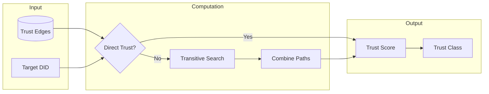

# Module 4: Identity and Trust

## Overview
This module teaches you ICN's foundational identity and trust systems. Identity
proves who you are; trust determines how much the system trusts you. Together,
they enable secure, socially-aware coordination without central authorities.

## Objectives
- Understand DIDs (Decentralized Identifiers) and why ICN uses them
- Master the keystore lifecycle: creation, encryption, rotation
- Learn how trust graphs model social relationships
- Understand trust computation: direct, transitive, and multi-dimensional
- Know how trust influences access control and rate limiting

## Prerequisites
- Module 3 (Runtime & Actors)
- Module 1 (Rust Fundamentals)

## Key Reading
- `icn/crates/icn-identity/src/keystore.rs` - Key storage
- `icn/crates/icn-trust/src/lib.rs` - Trust graph
- `docs/ARCHITECTURE.md` - Sections 1 and 2

---

## Core Concepts

### 1. What is a DID?

A **DID** (Decentralized Identifier) is a globally unique identifier that:
- Is **self-certifying**: The identifier itself proves ownership
- Requires **no registry**: No central authority needed
- Enables **cryptographic verification**: Anyone can verify signatures

**ICN's DID format:**
```
did:icn:5KQwrPbwdL6PhXujxW37FSSQZ1JiwsST4cqQzDeyXtP
├──┼──┼──────────────────────────────────────────────
│  │  └─ Base58-encoded Ed25519 public key
│  └──── ICN method (our DID scheme)
└─────── DID scheme prefix
```

**Why this format?**
- **Simple**: DID = public key (no lookup needed)
- **Verifiable**: Anyone can verify signatures
- **Portable**: Works offline, no network required
- **Deterministic**: Same key = same DID always

### 2. Ed25519 Cryptography

ICN uses **Ed25519** for all identity operations:

| Property | Value |
|----------|-------|
| Key type | EdDSA (Edwards curve) |
| Public key | 32 bytes |
| Private key | 32 bytes |
| Signature | 64 bytes |
| Security | ~128-bit equivalent |

**Why Ed25519?**
- **Fast**: Signing and verification are quick
- **Secure**: No known practical attacks
- **Deterministic**: Same key + message = same signature
- **Small**: Compact keys and signatures
- **Audited**: Well-studied, widely deployed

```rust
// DID from public key
pub struct Did(String);

impl Did {
    pub fn from_public_key(pubkey: &[u8; 32]) -> Self {
        let encoded = bs58::encode(pubkey).into_string();
        Did(format!("did:icn:{}", encoded))
    }

    pub fn to_public_key(&self) -> Result<[u8; 32]> {
        let encoded = self.0.strip_prefix("did:icn:")
            .ok_or(anyhow!("Invalid DID format"))?;
        let bytes = bs58::decode(encoded).into_vec()?;
        Ok(bytes.try_into()?)
    }
}
```

---

## The Keystore

### 3. Keystore Architecture

The **keystore** securely stores private keys:

```
┌─────────────────────────────────────────────────────────┐
│                      KEYSTORE                            │
├─────────────────────────────────────────────────────────┤
│                                                         │
│  {data_dir}/identity.age                                │
│                                                         │
│  ┌─────────────────────────────────────────────────┐   │
│  │  Encrypted with Age (passphrase or YubiKey)     │   │
│  │                                                  │   │
│  │  Contents:                                       │   │
│  │  - Ed25519 signing key (32 bytes)               │   │
│  │  - X25519 encryption key (32 bytes)             │   │
│  │  - TLS certificate (self-signed)                │   │
│  │  - Metadata (version, created_at)               │   │
│  │                                                  │   │
│  └─────────────────────────────────────────────────┘   │
│                                                         │
└─────────────────────────────────────────────────────────┘
```

### 4. Keystore Lifecycle

```rust
pub trait KeyStore: Send + Sync {
    /// Unlock the keystore with a passphrase
    fn unlock(&mut self, passphrase: &[u8]) -> Result<()>;

    /// Lock the keystore (clear in-memory keys)
    fn lock(&mut self);

    /// Check if the keystore is locked
    fn is_locked(&self) -> bool;

    /// Get the keypair (fails if locked)
    fn get_keypair(&self) -> Result<&KeyPair>;

    /// Rotate to a new keypair
    fn rotate(&mut self, new_keypair: KeyPair) -> Result<KeyRotation>;
}
```

**Lifecycle stages:**

1. **Creation**: `icnctl id init` generates keypair, encrypts with Age
2. **Storage**: Written to `{data_dir}/identity.age`
3. **Unlock**: At daemon startup, passphrase decrypts keys
4. **Usage**: IdentityBundle available for signing, TLS, etc.
5. **Lock**: On shutdown or explicit lock, keys cleared from memory
6. **Rotation**: Create new keypair, publish rotation record

### 5. The Identity Bundle

When the keystore is unlocked, it produces an **IdentityBundle**:

```rust
pub struct IdentityBundle {
    /// The DID for this identity
    did: Did,
    /// Ed25519 keypair for signing
    did_keypair: KeyPair,
    /// X25519 secret for encryption
    x25519_secret: x25519_dalek::StaticSecret,
    /// Self-signed TLS certificate
    tls_cert: CertificateDer<'static>,
    /// TLS private key
    tls_key: PrivateKeyDer<'static>,
    /// Binding signature: Sign_did(SHA256(tls_cert))
    tls_binding_sig: Vec<u8>,
}

impl IdentityBundle {
    /// Get the DID
    pub fn did(&self) -> &Did {
        &self.did
    }

    /// Sign a message
    pub fn sign(&self, message: &[u8]) -> Signature {
        self.did_keypair.sign(message)
    }

    /// Get TLS config for network connections
    pub fn tls_config(&self) -> TlsConfig {
        TlsConfig {
            cert: self.tls_cert.clone(),
            key: self.tls_key.clone(),
            binding_sig: self.tls_binding_sig.clone(),
        }
    }
}
```

### 6. DID-TLS Binding

The TLS certificate is cryptographically bound to the DID:

```
┌─────────────────────────────────────────────────────────┐
│                    DID-TLS BINDING                       │
├─────────────────────────────────────────────────────────┤
│                                                         │
│  1. Generate self-signed TLS certificate                │
│                                                         │
│  2. Hash the certificate:                               │
│     cert_hash = SHA256(tls_certificate)                 │
│                                                         │
│  3. Sign with DID key:                                  │
│     binding_sig = Sign_did_key(cert_hash)               │
│                                                         │
│  4. Verification (by peer):                             │
│     a. Receive certificate during TLS handshake         │
│     b. Extract DID from certificate                     │
│     c. Compute cert_hash                                │
│     d. Verify: Verify_did_pubkey(cert_hash, binding_sig)│
│                                                         │
└─────────────────────────────────────────────────────────┘
```

**This proves:** "The entity with this DID controls this TLS connection."

### 7. Key Rotation

Keys can be rotated without losing identity (with caveats):

```rust
pub struct KeyRotation {
    /// Old DID (being rotated from)
    old_did: Did,
    /// New DID (being rotated to)
    new_did: Did,
    /// When rotation occurred
    timestamp: u64,
    /// Why rotation happened
    reason: RotationReason,
    /// Signature from old key
    old_signature: Signature,
    /// Signature from new key
    new_signature: Signature,
}

pub enum RotationReason {
    /// Scheduled key refresh
    Scheduled,
    /// Key suspected compromised
    Compromised,
    /// Upgrading key algorithm
    Upgrade,
    /// Device lost/replaced
    DeviceLost,
}
```

**Rotation protocol:**
1. Generate new keypair
2. Create rotation record signed by BOTH old and new keys
3. Publish rotation record (gossip)
4. Old key enters grace period
5. After grace period, old key is invalid

### 8. Hardware-Backed Keys (TPM/HSM)

> **Current Status**: ⏳ Planned for Phase 22 (Security Hardening)
>
> TPM/HSM support is not yet implemented. The APIs shown below represent the
> intended design. All current deployments use software-backed Age-encrypted
> keystores.

For production deployments, ICN supports **hardware security modules** that protect
private keys from software extraction:

```
┌─────────────────────────────────────────────────────────────────┐
│                    KEY BACKEND ARCHITECTURE                      │
├─────────────────────────────────────────────────────────────────┤
│                                                                 │
│   Application Code                                              │
│         │                                                       │
│         ▼                                                       │
│   ┌─────────────────┐                                          │
│   │   DidSigner     │  Trait abstraction for signing           │
│   │   interface     │                                          │
│   └────────┬────────┘                                          │
│            │                                                    │
│     ┌──────┴──────┬────────────────┐                           │
│     ▼             ▼                ▼                           │
│  ┌───────┐   ┌─────────┐     ┌──────────┐                      │
│  │Soft   │   │  TPM    │     │  PKCS#11 │                      │
│  │ware  │   │  2.0    │     │   (HSM)  │                      │
│  └───────┘   └─────────┘     └──────────┘                      │
│  In-memory   Hardware        Hardware                          │
│  keys        sealed keys     external module                    │
│                                                                 │
└─────────────────────────────────────────────────────────────────┘
```

**DidKey enum for honest semantics:**
```rust
pub enum DidKey {
    /// Key is stored in software (extractable)
    Software(SoftwareKeyPair),
    /// Key is protected by hardware (non-extractable)
    Hardware(HardwareKeyHandle),
}

impl DidKey {
    /// Returns true if key material can be exported
    pub fn is_extractable(&self) -> bool {
        matches!(self, DidKey::Software(_))
    }
}
```

**TPM 2.0 Features:**
- **Key sealing**: Keys encrypted to TPM state, bound to boot configuration
- **PCR policies**: Keys only usable when system is in expected state
- **Non-exportable**: Private key never leaves the TPM chip
- **Attestation**: Prove key is hardware-protected to remote parties

```rust
pub struct TpmBackend {
    context: tss_esapi::Context,
    primary_handle: KeyHandle,
}

impl DidSigner for TpmBackend {
    fn sign(&self, data: &[u8]) -> Result<Signature> {
        // Sign operation happens inside TPM
        // Private key never exposed to software
        let signature = self.context.sign(
            self.primary_handle,
            data,
            SignatureScheme::Ed25519,
        )?;
        Ok(Signature::from_tpm(signature))
    }
}
```

**Configuration:**
```toml
# config.toml
[keystore]
# Options: "software", "tpm", "pkcs11"
backend = "tpm"

[keystore.tpm]
# TPM device path (Linux)
device = "/dev/tpmrm0"
# Optional: PCR policy for key usage
pcr_policy = [0, 7]
```

**Use cases for hardware keys:**
| Scenario | Recommendation |
|----------|----------------|
| Development | Software backend (easier debugging) |
| Test nodes | Software backend |
| Production servers | TPM 2.0 (built-in, no extra cost) |
| High-security nodes | External HSM (PKCS#11) |

**Limitations:**
- TPM operations are slower than software (~100ms vs ~1ms per signature)
- Key rotation requires re-enrollment with the TPM
- Remote attestation requires additional infrastructure

---

## The Trust Graph

### 8. What is Trust in ICN?

**Trust** models social relationships between identities:

```
       Alice ────0.8───► Bob
         │                 │
        0.6               0.5
         │                 │
         ▼                 ▼
      Charlie ◄───0.4─── David
```

- **Edges** represent trust relationships
- **Weights** (0.0 to 1.0) represent trust level
- **Directed**: Alice trusting Bob ≠ Bob trusting Alice

### 9. Trust Dimensions

ICN models trust across multiple **dimensions**:

```rust
pub enum TrustGraphType {
    /// Social relationships (friendship, community membership)
    Social,
    /// Economic reliability (payment history, credit worthiness)
    EconomicReliability,
    /// Technical reliability (uptime, correct behavior)
    TechnicalReliability,
}
```

**Why separate dimensions?**
- Someone can be socially trusted but technically unreliable
- Someone can pay reliably but be new to the community
- Prevents gaming: can't boost economic trust through social manipulation

### 10. Trust Storage

```rust
pub struct TrustEdge {
    /// Who is granting trust
    pub from: Did,
    /// Who is receiving trust
    pub to: Did,
    /// Trust level (0.0 to 1.0)
    pub weight: f64,
    /// Which dimension
    pub graph_type: TrustGraphType,
    /// When this edge was created/updated
    pub timestamp: u64,
    /// Optional expiration
    pub expires_at: Option<u64>,
    /// Signature from grantor
    pub signature: Signature,
}

pub struct TrustGraph {
    /// Stored edges by (from, to, type)
    edges: HashMap<(Did, Did, TrustGraphType), TrustEdge>,
    /// Our identity for self-trust
    our_did: Did,
    /// Persistent storage
    store: Arc<dyn Store>,
}
```

### 11. Computing Trust Scores

**Direct trust:** Explicitly stated edges
```rust
pub fn get_direct_trust(&self, from: &Did, to: &Did, graph_type: TrustGraphType) -> Option<f64> {
    self.edges.get(&(from.clone(), to.clone(), graph_type))
        .map(|edge| edge.weight)
}
```

**Transitive trust:** Trust through intermediaries
```rust
pub fn compute_trust_score(&self, target: &Did) -> Result<f64> {
    // Start from our perspective
    let from = &self.our_did;

    // Direct trust (if exists)
    if let Some(direct) = self.get_direct_trust(from, target, TrustGraphType::Social) {
        return Ok(direct);
    }

    // Transitive trust via graph traversal
    self.compute_transitive_trust(from, target, MAX_DEPTH, DECAY_FACTOR)
}

fn compute_transitive_trust(
    &self,
    from: &Did,
    to: &Did,
    max_depth: usize,
    decay: f64,
) -> Result<f64> {
    // BFS/DFS with decay per hop
    // Combine multiple paths (max, average, or custom)
    // Return 0.0 if no path found
}
```

**Example calculation:**
```
Alice trusts Bob: 0.8
Bob trusts Carol: 0.6
Decay per hop: 0.5

Alice's transitive trust of Carol:
= Alice→Bob × Bob→Carol × decay
= 0.8 × 0.6 × 0.5
= 0.24
```

### 12. Trust Classes

Trust scores map to **trust classes** for policy decisions:

```rust
pub enum TrustClass {
    /// Trust < 0.1 - Unknown or untrusted
    Isolated,
    /// Trust 0.1 - 0.4 - Recognized but not trusted
    Known,
    /// Trust 0.4 - 0.7 - Regular collaborators
    Partner,
    /// Trust > 0.7 - Highly trusted (federation partners)
    Federated,
}

impl TrustClass {
    pub fn from_score(score: f64) -> Self {
        match score {
            s if s < 0.1 => TrustClass::Isolated,
            s if s < 0.4 => TrustClass::Known,
            s if s < 0.7 => TrustClass::Partner,
            _ => TrustClass::Federated,
        }
    }

    pub fn rate_limit(&self) -> u32 {
        match self {
            TrustClass::Isolated => 10,    // messages per second
            TrustClass::Known => 50,
            TrustClass::Partner => 100,
            TrustClass::Federated => 200,
        }
    }
}
```

---

## Trust in Action

### 13. Trust-Based Rate Limiting

Network traffic is limited based on trust:

```rust
pub struct TrustRateLimiter {
    /// Remaining tokens per peer
    tokens: HashMap<Did, u32>,
    /// Trust graph for score lookup
    trust_graph: Arc<RwLock<TrustGraph>>,
}

impl TrustRateLimiter {
    pub fn allow(&mut self, peer: &Did) -> bool {
        let trust_score = self.trust_graph.read()
            .unwrap()
            .compute_trust_score(peer)
            .unwrap_or(0.0);

        let class = TrustClass::from_score(trust_score);
        let limit = class.rate_limit();

        let tokens = self.tokens.entry(peer.clone()).or_insert(limit);
        if *tokens > 0 {
            *tokens -= 1;
            true
        } else {
            false
        }
    }
}
```

### 14. Trust-Gated Topic Access

Gossip topics can require minimum trust:

```rust
pub fn check_topic_access(&self, peer: &Did, topic: &str) -> Result<()> {
    let policy = self.get_topic_policy(topic);

    match policy {
        AccessControl::Public => Ok(()),

        AccessControl::TrustGated { min_trust } => {
            let score = self.trust_graph.compute_trust_score(peer)?;
            if score < min_trust {
                bail!("Insufficient trust for topic: {:.2} < {:.2}", score, min_trust);
            }
            Ok(())
        }

        AccessControl::CoopMembers { coop_did } => {
            // Check membership through coop registry
            if !self.is_coop_member(peer, &coop_did)? {
                bail!("Not a member of cooperative");
            }
            Ok(())
        }
    }
}
```

### 15. Trust in Ledger Operations

Ledger entries can require author trust:

```rust
impl Ledger {
    fn validate_entry(&self, entry: &JournalEntry) -> Result<()> {
        // ... other validation ...

        // Optional trust validation
        if let Some(min_trust) = self.config.min_author_trust {
            let trust = self.trust_graph
                .read().await
                .compute_trust_score(&entry.author)?;

            if trust < min_trust {
                bail!("Entry author has insufficient trust: {:.2}", trust);
            }
        }

        Ok(())
    }
}
```

---

## Diagrams

### Identity Flow

```mermaid
flowchart TB
    subgraph Creation
        Init[icnctl id init]
        Gen[Generate Ed25519 keypair]
        Enc[Encrypt with Age]
        Save[Save to {data_dir}/identity.age]
    end

    subgraph Runtime
        Load[Load keystore]
        Unlock[Unlock with passphrase]
        Bundle[Create IdentityBundle]
    end

    subgraph Usage
        Sign[Sign messages]
        TLS[TLS connections]
        Author[Author entries]
    end

    Init --> Gen --> Enc --> Save
    Save --> Load --> Unlock --> Bundle
    Bundle --> Sign
    Bundle --> TLS
    Bundle --> Author
```

### Trust Computation



---

## Exercises

1. **DID Parsing**: Write a function that extracts the public key bytes from
   a DID string `did:icn:5KQwrPbwdL6PhXujxW37...`.

2. **Trust Calculation**: Given these edges, compute Alice's trust of Eve:
   - Alice → Bob: 0.8
   - Bob → Carol: 0.6
   - Carol → David: 0.7
   - David → Eve: 0.5
   - Decay per hop: 0.5

3. **Trust Classes**: Find where trust classes are used for rate limiting in
   the codebase. What are the rate limits for each class?

4. **Key Rotation**: Trace the key rotation code path. What signatures are
   required in a KeyRotation record?

5. **Multi-Graph**: ICN supports multiple trust graph types. Find where
   `TrustGraphType` is used differently for different purposes.

---

## Checkpoints

- [ ] You can explain the DID format and why it's self-certifying
- [ ] You understand the keystore lifecycle (create, unlock, rotate)
- [ ] You know what the IdentityBundle contains
- [ ] You can explain DID-TLS binding
- [ ] You understand trust dimensions (social, economic, technical)
- [ ] You can compute transitive trust with decay
- [ ] You know how trust classes affect rate limiting

---

## Quick Reference

| Concept | Definition |
|---------|------------|
| DID | Decentralized Identifier - `did:icn:<base58-pubkey>` |
| Keystore | Age-encrypted file storing private keys |
| IdentityBundle | Runtime identity (DID + keys + TLS binding) |
| Trust Edge | Directed, weighted relationship between DIDs |
| Trust Dimension | Category of trust (social, economic, technical) |
| Transitive Trust | Trust computed through graph traversal |
| Trust Class | Category based on trust score (Isolated → Federated) |
| Key Rotation | Protocol for changing keys while preserving identity |

---

## Next Steps

Proceed to **Module 5: Network & Gossip** to understand how identities connect
and how trust enables secure peer-to-peer communication.
