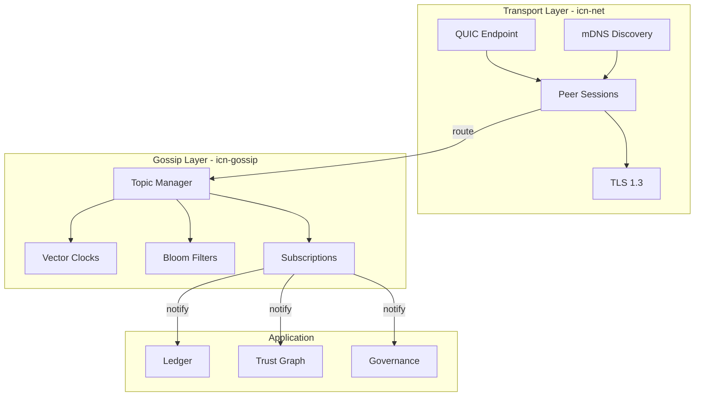
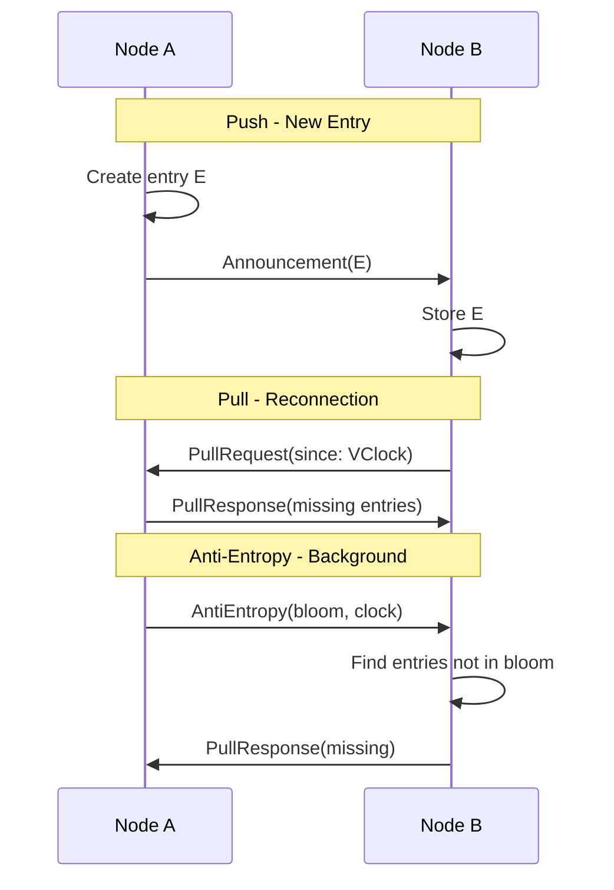

# Module 5: Network and Gossip

## Overview
This module teaches you how ICN nodes communicate: establishing secure connections
(transport layer) and synchronizing state across the network (gossip layer).
Understanding these layers is essential for debugging connectivity issues and
implementing features that involve peer communication.

## Objectives
- Understand the QUIC transport protocol and why ICN uses it
- Learn how peer discovery works (mDNS, bootstrap)
- Understand DID-TLS binding for authenticated connections
- Master the gossip protocol: push, pull, and anti-entropy
- Learn how vector clocks track causality
- Understand topic-based message routing

## Prerequisites
- Module 4 (Identity & Trust)
- Module 3 (Runtime & Actors)

## Key Reading
- `icn/crates/icn-net/src/actor/mod.rs` - NetworkActor implementation
- `icn/crates/icn-gossip/src/gossip.rs` - GossipActor implementation
- `docs/ARCHITECTURE.md` - Sections 3 and 6

---

## Core Concepts

### 1. Transport vs. Gossip

ICN separates communication into two layers:

| Layer | Responsibility | Crate |
|-------|---------------|-------|
| **Transport** | Establishing secure connections between nodes | `icn-net` |
| **Gossip** | Synchronizing state across the network | `icn-gossip` |

```
┌────────────────────────────────────────────────────────┐
│                     APPLICATION                         │
│           (Ledger, Contracts, Governance)              │
├────────────────────────────────────────────────────────┤
│                       GOSSIP                            │
│   Topic routing, vector clocks, anti-entropy sync      │
├────────────────────────────────────────────────────────┤
│                      TRANSPORT                          │
│        QUIC connections, TLS, peer discovery           │
├────────────────────────────────────────────────────────┤
│                      NETWORK                            │
│                 IP, UDP, mDNS                          │
└────────────────────────────────────────────────────────┘
```

**Why separate them?**
- Transport handles "can I connect to this peer?"
- Gossip handles "what data do we need to exchange?"
- Separation allows different sync strategies without changing transport

---

## The Transport Layer (icn-net)

### 2. QUIC Protocol

**What is QUIC?**

QUIC (Quick UDP Internet Connections) is a modern transport protocol:

| Feature | TCP | QUIC |
|---------|-----|------|
| Encryption | Separate TLS handshake | Built-in TLS 1.3 |
| Streams | One per connection | Multiple per connection |
| Connection migration | IP change = reconnect | Survives IP changes |
| Head-of-line blocking | Yes (TCP) | No (per-stream) |
| Connection setup | 1-3 RTT | 0-1 RTT |

**Why ICN uses QUIC:**

1. **Multiplexed streams**: Multiple conversations on one connection
   - Gossip, RPC, and control messages share a connection
   - No head-of-line blocking between streams

2. **Built-in encryption**: TLS 1.3 is mandatory
   - No unencrypted fallback
   - Perfect forward secrecy

3. **Connection migration**: Handles network changes
   - Mobile nodes can change WiFi/cellular
   - NAT rebinding doesn't break connections

4. **Fast connection setup**: 0-RTT for resumed connections
   - Critical for frequent peer reconnections

```rust
// From icn-net: QUIC endpoint setup
use quinn::{Endpoint, ServerConfig, ClientConfig};

pub struct NetworkActor {
    endpoint: Endpoint,              // QUIC endpoint
    sessions: HashMap<Did, Session>, // Active peer sessions
    discovery: Discovery,            // mDNS discovery
}
```

### 3. Peer Discovery

**How do nodes find each other?**

ICN uses multiple discovery mechanisms:

**mDNS (Multicast DNS)**
- Discovers peers on local network
- Zero configuration
- Announces `_icn._udp.local`

```rust
// mDNS service advertisement
pub struct MdnsConfig {
    enabled: bool,
    service_name: String,  // "_icn._udp.local"
    announce_interval: Duration,
}
```

**Bootstrap Peers**
- Known peers to connect to on startup
- Configured in `icn.toml`

```toml
# Configuration
[network]
bootstrap_peers = [
    "icn://did:icn:5K...@seed1.example.com:8443",
    "icn://did:icn:7H...@seed2.example.com:8443",
]
```

**Peer Exchange**
- Connected peers share their peer lists
- Gossip about network topology

**Discovery Flow:**
```
┌─────────────────────────────────────────────────────────────┐
│                    PEER DISCOVERY                            │
├─────────────────────────────────────────────────────────────┤
│                                                             │
│  1. mDNS Announcement                                       │
│     Node broadcasts: "_icn._udp.local"                      │
│     Contains: DID, port, capabilities                       │
│                                                             │
│  2. Bootstrap Connection                                    │
│     Connect to configured seed nodes                        │
│     Exchange peer lists                                     │
│                                                             │
│  3. Peer Exchange                                           │
│     Connected peers share known addresses                   │
│     Build routing table                                     │
│                                                             │
└─────────────────────────────────────────────────────────────┘
```

### 4. DID-TLS Binding

**The problem:** How do we know the peer is who they claim to be?

**The solution:** DID-TLS binding ties cryptographic identity to the connection.

**How it works:**

1. **TLS certificate contains DID**
   - Self-signed certificate
   - DID embedded in certificate

2. **Challenge-response during handshake**
   - Server sends random challenge
   - Client signs with DID private key
   - Server verifies signature

3. **Mutual authentication**
   - Both sides prove DID ownership
   - Connection is authenticated bidirectionally

```rust
// DID-TLS verification
pub struct TlsVerification {
    peer_certificate: Certificate,
    challenge: [u8; 32],
    signature: Signature,
}

impl TlsVerification {
    pub fn verify(&self, expected_did: &Did) -> Result<()> {
        // 1. Extract DID from certificate
        let cert_did = self.extract_did_from_cert()?;

        // 2. Verify DID matches expected
        if cert_did != *expected_did {
            bail!("DID mismatch");
        }

        // 3. Verify signature on challenge
        let public_key = expected_did.to_public_key()?;
        public_key.verify(&self.challenge, &self.signature)?;

        Ok(())
    }
}
```

### 5. Message Types

The transport layer handles different message types:

```rust
pub enum MessagePayload {
    /// Gossip protocol messages
    Gossip(GossipMessage),

    /// Topic subscription requests
    Subscribe { topics: Vec<String> },
    Unsubscribe { topics: Vec<String> },

    /// RPC calls (request/response)
    Rpc(RpcMessage),

    /// Connection handshake
    Hello { version: u32, capabilities: Vec<String> },

    /// Signed envelope (wrapped message)
    Signed(SignedEnvelope),

    /// Encrypted envelope (E2E encrypted)
    Encrypted(EncryptedEnvelope),
}
```

### 6. Signed Envelopes

All important messages are wrapped in signed envelopes:

```rust
pub struct SignedEnvelope {
    /// Sender's DID
    pub from: Did,
    /// Payload type for routing
    pub payload_type: PayloadType,
    /// Serialized payload
    pub payload: Vec<u8>,
    /// Ed25519 signature
    pub signature: Signature,
    /// Sequence number for replay protection
    pub sequence: u64,
}
```

**Replay Protection:**

The sequence number prevents replay attacks:

```rust
pub struct ReplayGuard {
    // Last seen sequence per sender
    sequences: HashMap<Did, u64>,
}

impl ReplayGuard {
    pub fn check(&mut self, from: &Did, sequence: u64) -> Result<()> {
        let last = self.sequences.get(from).copied().unwrap_or(0);

        if sequence <= last {
            bail!("Replay detected: got {}, last was {}", sequence, last);
        }

        self.sequences.insert(from.clone(), sequence);
        Ok(())
    }
}
```

---

## The Gossip Layer (icn-gossip)

### 7. What is Gossip?

**Gossip** is a protocol for spreading information through a network without
central coordination, similar to how rumors spread through a social network.

**Properties:**
- **Epidemic spread**: Information spreads exponentially
- **Fault tolerant**: Works despite node failures
- **Eventually consistent**: All nodes converge to same state
- **Decentralized**: No coordinator needed

**How it works:**

1. Node A receives new data
2. A tells random peers B, C, D
3. B, C, D each tell their random peers
4. Data spreads exponentially
5. Eventually everyone has it

### 8. Gossip Message Types

ICN's gossip protocol uses three message types:

```rust
pub enum GossipMessage {
    /// "I have this new entry"
    Announcement {
        topic: String,
        entry_hash: Hash,
        entry: Entry,
    },

    /// "What entries do you have since this vector clock?"
    PullRequest {
        topic: String,
        since: VectorClock,
    },

    /// "Here are the entries you're missing"
    PullResponse {
        topic: String,
        entries: Vec<Entry>,
    },

    /// "Let's sync - here's my bloom filter"
    AntiEntropy {
        topic: String,
        bloom: BloomFilter,
        clock: VectorClock,
    },
}
```

### 9. Push, Pull, and Anti-Entropy

**Push (Announcements):**
When a node creates or receives new data, it pushes to subscribers:

```
Node A creates entry E
    │
    ├──► Push to Node B (subscriber)
    ├──► Push to Node C (subscriber)
    └──► Push to Node D (subscriber)
```

**Pull (On-demand sync):**
When a node reconnects or suspects missing data, it pulls:

```
Node B reconnects
    │
    └──► Pull request to Node A
             │
             └──► Pull response with missing entries
```

**Anti-Entropy (Background sync):**
Periodic exchanges to ensure consistency:

```
Every 30 seconds:
    │
    ├──► Node A sends Bloom filter to random peer
    │
    └──► Peer responds with entries not in filter
```

### 10. Vector Clocks

**The problem:** How do we know which events happened before others?

**The solution:** Vector clocks track logical time per node.

```rust
pub struct VectorClock {
    clock: HashMap<Did, u64>,
}

impl VectorClock {
    /// Increment our entry
    pub fn tick(&mut self, node: &Did) {
        *self.clock.entry(node.clone()).or_default() += 1;
    }

    /// Merge with another clock (take max of each entry)
    pub fn merge(&mut self, other: &VectorClock) {
        for (node, &time) in &other.clock {
            let entry = self.clock.entry(node.clone()).or_default();
            *entry = (*entry).max(time);
        }
    }

    /// Check if this clock happened before other
    pub fn happened_before(&self, other: &VectorClock) -> bool {
        // All our entries ≤ theirs
        self.clock.iter().all(|(node, &time)| {
            other.clock.get(node).copied().unwrap_or(0) >= time
        })
        // AND at least one entry <
        && self.clock.iter().any(|(node, &time)| {
            other.clock.get(node).copied().unwrap_or(0) > time
        })
    }
}
```

**Example:**

```
Node A: {A:1, B:0, C:0}
Node B: {A:0, B:1, C:0}
Node C: {A:1, B:1, C:1}  ← C has seen both A and B's events
```

### 11. Bloom Filters

**The problem:** How do we efficiently check if peers have the same entries?

**The solution:** Bloom filters provide probabilistic set membership.

```rust
pub struct BloomFilter {
    bits: BitVec,
    hash_count: usize,
}

impl BloomFilter {
    /// Add an entry hash to the filter
    pub fn insert(&mut self, hash: &Hash) {
        for i in 0..self.hash_count {
            let idx = self.hash_index(hash, i);
            self.bits.set(idx, true);
        }
    }

    /// Check if hash might be in the filter
    pub fn might_contain(&self, hash: &Hash) -> bool {
        (0..self.hash_count).all(|i| {
            let idx = self.hash_index(hash, i);
            self.bits[idx]
        })
    }
}
```

**Properties:**
- **False positives possible**: Might say "yes" when entry isn't there
- **False negatives impossible**: Never says "no" when entry is there
- **Space efficient**: Much smaller than entry list
- **Perfect for sync**: Quickly identify what peer is missing

### 12. Topics

Gossip is organized around **topics**—namespaced channels for different data:

```
┌─────────────────────────────────────────────────────────┐
│                      TOPICS                              │
├─────────────────────────────────────────────────────────┤
│                                                         │
│  ledger:entries        Ledger transactions              │
│  trust:edges           Trust graph updates              │
│  governance:proposals  Governance proposals             │
│  governance:votes      Voting events                    │
│  coop:{coop_id}        Per-cooperative messages         │
│  federation:agreements Inter-coop agreements            │
│                                                         │
└─────────────────────────────────────────────────────────┘
```

**Topic naming convention:**
```
{namespace}:{resource}[:{qualifier}]

Examples:
- ledger:entries
- governance:votes:proposal-123
- coop:did:icn:abc123:announcements
```

### 13. Access Control

Topics have access control policies:

```rust
pub enum AccessControl {
    /// Anyone can subscribe
    Public,

    /// Must be known (trust > 0.1)
    Known,

    /// Must be in cooperative
    CoopMembers { coop_did: Did },

    /// Must have specific trust level
    TrustGated { min_trust: f64 },

    /// Custom policy
    Custom(Box<dyn AccessPolicy>),
}

impl GossipActor {
    fn check_subscribe_access(&self, peer: &Did, topic: &str) -> Result<()> {
        let policy = self.get_topic_policy(topic);

        match policy {
            AccessControl::Public => Ok(()),

            AccessControl::TrustGated { min_trust } => {
                let score = self.trust_graph.compute_trust(peer)?;
                if score < min_trust {
                    bail!("Insufficient trust: {:.2} < {:.2}", score, min_trust);
                }
                Ok(())
            }

            // ... other policies
        }
    }
}
```

---

## Message Flow

### 14. Incoming Message Flow

```
┌─────────────────────────────────────────────────────────────────┐
│                  INCOMING MESSAGE FLOW                           │
├─────────────────────────────────────────────────────────────────┤
│                                                                 │
│  Peer                                                           │
│    │                                                            │
│    │ QUIC packet                                                │
│    ▼                                                            │
│  NetworkActor ────────────────────────────────────────────────  │
│    │  - Decrypt TLS                                             │
│    │  - Verify peer identity                                    │
│    │  - Parse NetworkMessage                                    │
│    ▼                                                            │
│  IncomingHandler ─────────────────────────────────────────────  │
│    │  - Route by payload type                                   │
│    │  - Verify SignedEnvelope                                   │
│    │  - Check replay guard                                      │
│    ▼                                                            │
│  GossipActor ─────────────────────────────────────────────────  │
│    │  - Check trust score                                       │
│    │  - Validate topic access                                   │
│    │  - Process gossip message                                  │
│    ▼                                                            │
│  Topic Handler ───────────────────────────────────────────────  │
│    │  - Update vector clock                                     │
│    │  - Store entry                                             │
│    │  - Notify subscribers                                      │
│    ▼                                                            │
│  Subscriber Callback (e.g., Ledger)                             │
│                                                                 │
└─────────────────────────────────────────────────────────────────┘
```

### 15. Outgoing Message Flow

```
┌─────────────────────────────────────────────────────────────────┐
│                  OUTGOING MESSAGE FLOW                           │
├─────────────────────────────────────────────────────────────────┤
│                                                                 │
│  Application (e.g., Ledger creates entry)                       │
│    │                                                            │
│    │ new_entry(entry)                                           │
│    ▼                                                            │
│  GossipActor ─────────────────────────────────────────────────  │
│    │  - Store locally                                           │
│    │  - Update vector clock                                     │
│    │  - Get subscribers for topic                               │
│    ▼                                                            │
│  Send Callback ───────────────────────────────────────────────  │
│    │  - Create SignedEnvelope                                   │
│    │  - Increment sequence number                               │
│    │  - Sign with identity key                                  │
│    ▼                                                            │
│  NetworkActor ────────────────────────────────────────────────  │
│    │  - Look up peer connection                                 │
│    │  - Send on QUIC stream                                     │
│    ▼                                                            │
│  Peer receives message                                          │
│                                                                 │
└─────────────────────────────────────────────────────────────────┘
```

---

## Trust-Gated Networking

### 16. Trust-Based Rate Limiting

Network traffic is rate-limited based on trust:

```rust
pub fn get_rate_limit(trust_score: f64) -> u32 {
    match TrustClass::from_score(trust_score) {
        TrustClass::Isolated => 10,   // < 0.1
        TrustClass::Known => 50,      // 0.1 - 0.4
        TrustClass::Partner => 100,   // 0.4 - 0.7
        TrustClass::Federated => 200, // > 0.7
    }
}
```

**Why?**
- Unknown peers get limited bandwidth
- Trusted peers get priority
- Prevents spam from unknown sources
- Aligns network resources with social trust

### 17. Message Validation

Before processing, messages are validated:

```rust
impl GossipActor {
    async fn handle_message(&mut self, from: &Did, msg: GossipMessage) -> Result<()> {
        // 1. Check trust score
        let trust_score = self.compute_trust(from)?;
        if trust_score < MIN_TRUST_FOR_MESSAGE {
            bail!("Insufficient trust: {:.3}", trust_score);
        }

        // 2. Check rate limit
        if !self.rate_limiter.allow(from, trust_score) {
            bail!("Rate limited");
        }

        // 3. Validate message structure
        msg.validate()?;

        // 4. Check topic access
        if let Some(topic) = msg.topic() {
            self.check_topic_access(from, topic)?;
        }

        // 5. Process message
        match msg {
            GossipMessage::Announcement { .. } => self.handle_announcement(from, msg).await,
            GossipMessage::PullRequest { .. } => self.handle_pull_request(from, msg).await,
            // ...
        }
    }
}
```

---

## Diagrams

### Network Layer Architecture



### Gossip Sync Sequence



---

## Code Examples

### Creating a Gossip Subscription

```rust
// Subscribe to ledger entries
let gossip_handle = gossip_actor.handle();

let ledger_callback = {
    let ledger = ledger_handle.clone();
    move |entry: LedgerEntry| {
        let ledger = ledger.clone();
        tokio::spawn(async move {
            ledger.write().await.apply_entry(entry).await
        });
    }
};

gossip_handle.write().await.subscribe(
    "ledger:entries",
    Box::new(ledger_callback),
)?;
```

### Announcing a New Entry

```rust
// Announce a new entry to subscribers
impl GossipActor {
    pub async fn announce(&mut self, topic: &str, entry: Entry) -> Result<()> {
        // 1. Store locally
        self.store_entry(topic, &entry)?;

        // 2. Update vector clock
        self.vector_clock.tick(&self.our_did);

        // 3. Create announcement
        let msg = GossipMessage::Announcement {
            topic: topic.to_string(),
            entry_hash: entry.hash(),
            entry,
        };

        // 4. Send to subscribers
        if let Some(ref send_cb) = self.send_callback {
            for subscriber in self.get_subscribers(topic) {
                send_cb(subscriber.clone(), msg.clone())?;
            }
        }

        Ok(())
    }
}
```

---

## Exercises

1. **Transport Tracing**: Find where QUIC connections are established in
   `icn-net`. What happens during the TLS handshake?

2. **Gossip Message Types**: List all `GossipMessage` variants and explain
   when each is used.

3. **Vector Clock Merge**: Given two vector clocks `{A:3, B:2}` and `{A:1, B:4}`,
   what is the merged result?

4. **Topic Access**: Find a topic with trust-gated access control. What
   minimum trust is required?

5. **Anti-Entropy**: Explain why anti-entropy is necessary even with push
   announcements. What scenarios does it handle?

---

## Checkpoints

- [ ] You can explain why ICN uses QUIC instead of TCP
- [ ] You understand DID-TLS binding and its purpose
- [ ] You can describe the three gossip message types (push, pull, anti-entropy)
- [ ] You understand what vector clocks track
- [ ] You know how Bloom filters are used in anti-entropy
- [ ] You can trace a message from network to gossip to application
- [ ] You understand trust-based rate limiting

---

## Quick Reference

| Concept | Definition |
|---------|------------|
| QUIC | UDP-based transport with built-in encryption |
| mDNS | Multicast DNS for local peer discovery |
| DID-TLS | Binding DID identity to TLS connection |
| SignedEnvelope | Message wrapper with signature and replay protection |
| Vector Clock | Logical time per node for causality tracking |
| Bloom Filter | Probabilistic set for efficient sync |
| Topic | Namespaced channel for gossip messages |
| Anti-Entropy | Background sync to ensure consistency |

---

## Next Steps

Proceed to **Module 6: Ledger & Contracts** to understand mutual credit
accounting, the Merkle-DAG structure, and how CCL contracts execute.
