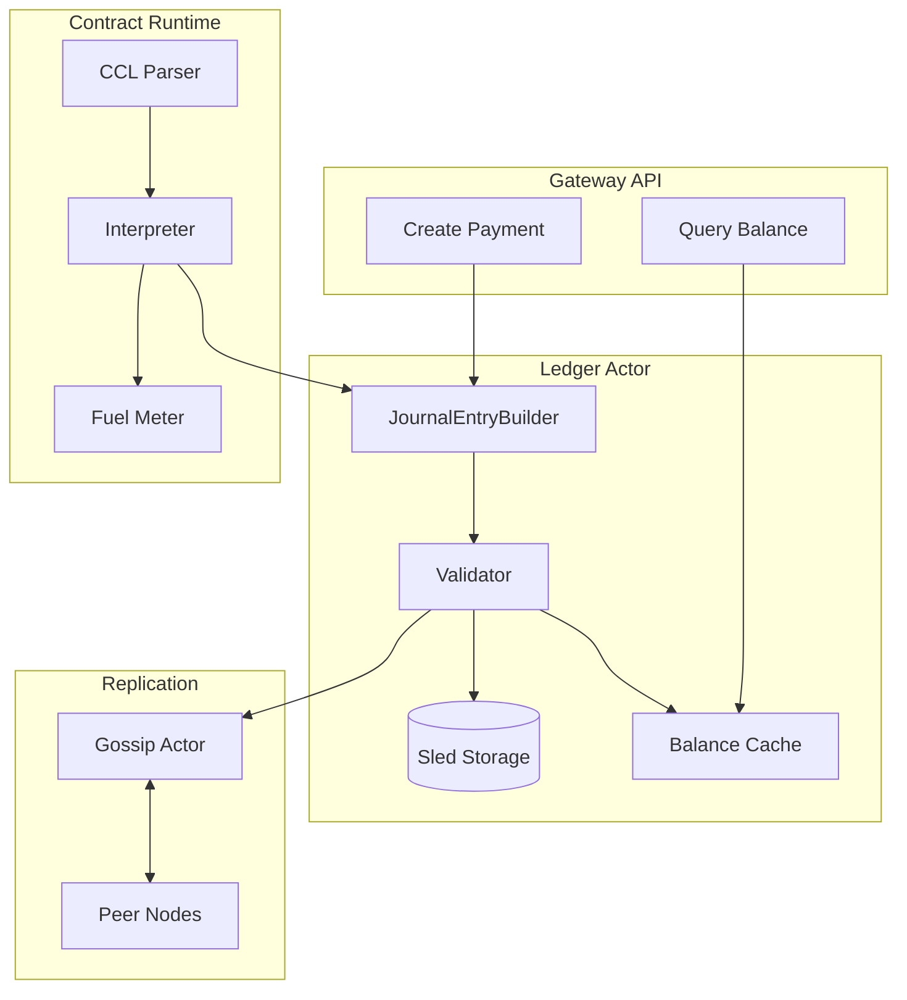
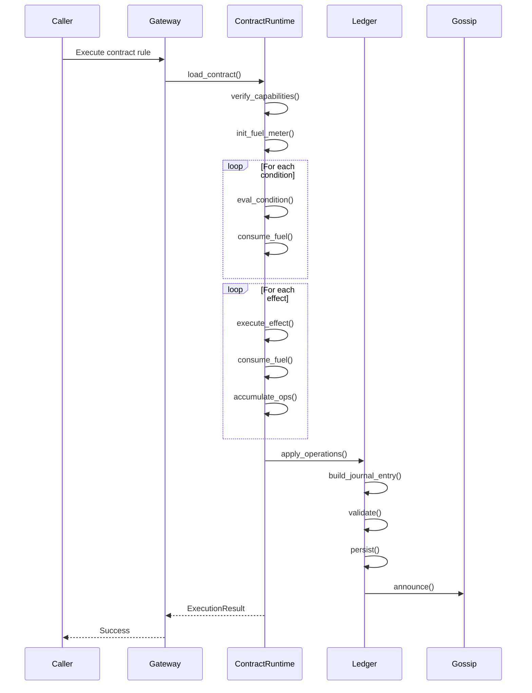

# Module 6: Ledger and Contracts

## Overview
This module teaches you ICN's economic layer: the mutual credit ledger for
accounting and the Cooperative Contract Language (CCL) for programmable rules.
Understanding these systems is essential for working on any feature involving
value exchange or automated agreements.

## Objectives
- Understand mutual credit and how it differs from traditional money
- Master double-entry accounting and the journal entry model
- Learn the Merkle-DAG structure for ledger integrity
- Understand CCL syntax, capabilities, and fuel metering
- Know how contracts interact with the ledger

## Prerequisites
- Module 5 (Network & Gossip) - for understanding replication
- Module 3 (Runtime & Actors) - for understanding integration

## Key Reading
- `icn/crates/icn-ledger/src/ledger.rs` - Ledger implementation
- `icn/crates/icn-ccl/src/lib.rs` - Contract language
- `docs/ARCHITECTURE.md` - Sections 4 and 5

---

## Core Concepts

### 1. What is Mutual Credit?

**Mutual credit** is an accounting system where credit is created through
transactions themselves, rather than being issued by a central authority.

**Traditional money:**
```
Bank creates $100
Bank gives to Alice
Alice: $100, Bob: $0

Alice pays Bob $30
Alice: $70, Bob: $30

Total money in system: $100 (fixed supply)
```

**Mutual credit:**
```
System starts empty
Alice: 0, Bob: 0, Carol: 0

Alice buys from Bob (30 credits)
Alice: -30, Bob: +30, Carol: 0

Bob buys from Carol (20 credits)
Alice: -30, Bob: +10, Carol: +20

Carol buys from Alice (30 credits)
Alice: 0, Bob: +10, Carol: -10

Total: ALWAYS sums to ZERO
```

**Key properties:**
- **No external money supply**: Credit is created through transactions
- **Zero-sum**: Total balances always sum to zero
- **Symmetric**: Every credit creates an equal debit
- **Interest-free**: No inherent interest on balances
- **Mutual obligation**: Negative balances represent obligations to the community

### 2. Why Mutual Credit for Cooperatives?

| Traditional Money | Mutual Credit |
|-------------------|---------------|
| Scarcity by design | Abundance by design |
| Accumulation incentivized | Circulation incentivized |
| External control (central bank) | Community control |
| Interest extracts value | No extraction |
| Requires capital to start | Starts from nothing |

**Cooperatives benefit because:**
- Members can trade without external capital
- Value stays within the cooperative
- No one needs to "have money" to participate
- Healthy circulation is economically optimal (balance near zero)

### 3. Credit Limits

To prevent unlimited negative balances, accounts have **credit limits**:

```rust
pub struct CreditLimit {
    /// Maximum negative balance allowed
    pub limit: i64,
    /// Who set this limit
    pub granted_by: Did,
    /// When it expires (optional)
    pub expires_at: Option<u64>,
}
```

**How limits work:**
- New members start with a small limit (e.g., -100)
- Limits increase with trust and participation
- Hitting limit prevents further spending
- Positive balances are unlimited

```
Alice's limit: -500
Alice's balance: -450

Alice tries to buy 100 credits:
New balance would be: -550
-550 < -500 (limit)
Transaction REJECTED
```

---

## Double-Entry Accounting

### 4. The Fundamental Principle

Every transaction creates TWO entries:
- A **debit** (value leaving an account)
- A **credit** (value entering an account)

**These MUST be equal.** This is the double-entry invariant.

```
Alice pays Bob 50 credits:

┌──────────────────────────────────────────────────┐
│  DEBIT:  Alice  -50  (value leaves Alice)        │
│  CREDIT: Bob    +50  (value enters Bob)          │
│                                                  │
│  TOTAL: -50 + 50 = 0 ✓                          │
└──────────────────────────────────────────────────┘
```

### 5. Journal Entries

A **journal entry** is the atomic unit of ledger change:

```rust
pub struct JournalEntry {
    /// Unique identifier (hash-based)
    pub id: Option<String>,
    /// When this entry was created
    pub timestamp: u64,
    /// Who authored this entry
    pub author: Did,
    /// Optional contract reference
    pub contract_ref: Option<ContractRef>,
    /// Account changes (debits and credits)
    pub accounts: Vec<AccountDelta>,
    /// Parent entries (Merkle-DAG)
    pub parents: Vec<String>,
    /// Cryptographic signature
    pub signature: Option<Signature>,
}

pub struct AccountDelta {
    pub account: Did,
    pub currency: String,
    pub amount: i64,  // Positive = credit, Negative = debit
}
```

**Validation rules:**
1. **Balance**: Sum of all deltas must be zero per currency
2. **Positive amounts**: Amounts must be > 0
3. **Valid accounts**: All DIDs must be valid
4. **Signature**: Must be signed by author
5. **Timestamp**: Must be reasonable (not in future)

### 6. Building Journal Entries

```rust
// Creating a payment from Alice to Bob
let entry = JournalEntryBuilder::new(alice_did.clone())
    .debit(alice_did.clone(), "ICN".to_string(), 50)
    .credit(bob_did.clone(), "ICN".to_string(), 50)
    .memo("Payment for services".to_string())
    .build()?;

// Multi-party transaction
let entry = JournalEntryBuilder::new(contract_did.clone())
    .debit(alice_did.clone(), "ICN".to_string(), 100)
    .credit(bob_did.clone(), "ICN".to_string(), 60)
    .credit(carol_did.clone(), "ICN".to_string(), 40)
    .contract_ref(contract_ref)
    .build()?;
```

---

## The Merkle-DAG Structure

### 7. What is a Merkle-DAG?

A **Merkle-DAG** (Directed Acyclic Graph) links entries through cryptographic
hashes, creating an immutable, verifiable history.

```
Entry A (Genesis)
   │
   ├──► Entry B (parent: A)
   │       │
   │       └──► Entry D (parent: B)
   │
   └──► Entry C (parent: A)
           │
           └──► Entry E (parents: C, D)
                        ↑
                   Merge point
```

**Properties:**
- **Immutable**: Changing an entry changes its hash, breaking all links
- **Verifiable**: Anyone can verify the chain by recomputing hashes
- **Forkable**: Different nodes can have different branches
- **Mergeable**: Branches can be reconciled

### 8. Entry Hashing

```rust
impl JournalEntry {
    pub fn compute_hash(&mut self) -> Result<()> {
        // Serialize entry fields (excluding id and signature)
        let content = self.content_for_hash();

        // SHA-256 hash
        let hash = sha256(&content);

        // Base58 encode for human-readable ID
        self.id = Some(bs58::encode(hash).into_string());
        Ok(())
    }
}
```

**Hash includes:**
- Timestamp
- Author DID
- Account deltas
- Parent hashes
- Contract reference

**Hash excludes:**
- Entry ID (it IS the hash)
- Signature (signs the hash)

### 9. Fork Detection and Resolution

When nodes diverge (different parents for new entries), forks are detected:

```rust
pub struct ForkDetector {
    /// Known entry hashes per author
    entries_by_author: HashMap<Did, Vec<String>>,
    /// Detected forks
    forks: Vec<Fork>,
}

pub struct Fork {
    /// Common ancestor
    base: String,
    /// Diverging branches
    branches: Vec<Branch>,
    /// Resolution status
    resolved: bool,
}
```

**Resolution strategies:**
- **Automatic**: Merge if no conflicts (different accounts affected)
- **Manual**: Human intervention for conflicting changes
- **Policy-based**: Configured rules (e.g., prefer higher trust author)

---

## The Ledger Actor

### 10. Ledger Structure

```rust
pub struct Ledger {
    /// Persistent storage
    store: Arc<dyn Store>,
    /// Our identity
    our_did: Did,
    /// Cached balances (for fast reads)
    balances: HashMap<(Did, String), i64>,
    /// Credit limits
    credit_limits: HashMap<Did, CreditLimit>,
    /// Fork detector
    fork_detector: ForkDetector,
    /// Gossip handle for replication
    gossip_handle: Option<GossipHandle>,
    /// Trust graph for validation
    trust_graph: Option<Arc<RwLock<TrustGraph>>>,
}
```

### 11. Appending Entries

```rust
impl Ledger {
    pub async fn append_entry(&mut self, entry: JournalEntry) -> Result<String> {
        // 1. Validate entry
        self.validate_entry(&entry)?;

        // 2. Check credit limits
        self.check_credit_limits(&entry)?;

        // 3. Persist to storage
        let entry_id = entry.id.clone().unwrap();
        self.store.put(
            &format!("ledger:entry:{}", entry_id).as_bytes(),
            &entry.serialize()?,
        )?;

        // 4. Update cached balances
        for delta in &entry.accounts {
            let key = (delta.account.clone(), delta.currency.clone());
            *self.balances.entry(key).or_default() += delta.amount;
        }

        // 5. Gossip to peers
        if let Some(ref gossip) = self.gossip_handle {
            gossip.write().await.announce(
                "ledger:entries",
                Entry::Journal(entry.clone()),
            ).await?;
        }

        Ok(entry_id)
    }
}
```

### 12. Querying Balances

```rust
impl Ledger {
    /// Get current balance for an account
    pub fn get_balance(&self, account: &Did, currency: &str) -> i64 {
        self.balances
            .get(&(account.clone(), currency.to_string()))
            .copied()
            .unwrap_or(0)
    }

    /// Get all balances for an account
    pub fn get_all_balances(&self, account: &Did) -> HashMap<String, i64> {
        self.balances
            .iter()
            .filter(|((did, _), _)| did == account)
            .map(|((_, currency), &amount)| (currency.clone(), amount))
            .collect()
    }

    /// Get transaction history
    pub fn get_history(
        &self,
        account: &Did,
        limit: usize,
    ) -> Result<Vec<JournalEntry>> {
        // Query from storage with index
        self.store.query_entries_by_account(account, limit)
    }
}
```

---

## The Cooperative Contract Language (CCL)

### 13. What is CCL?

**CCL** is a domain-specific language for expressing cooperative agreements:

| Feature | CCL | General-Purpose |
|---------|-----|-----------------|
| Turing-complete | No | Yes |
| Deterministic | Yes | No (I/O, time) |
| Capability-gated | Yes | No |
| Fuel-metered | Yes | No |
| Purpose | Agreements | General |

**Why not Turing-complete?**
- Halting problem: Can't guarantee termination
- Security: Simpler model = easier to audit
- Determinism: Same inputs = same outputs everywhere

### 14. CCL Structure

```rust
/// A contract is a collection of rules
pub struct Contract {
    /// Contract name
    pub name: String,
    /// Contract version
    pub version: u32,
    /// Parties involved
    pub parties: Vec<Did>,
    /// Rules that define behavior
    pub rules: Vec<Rule>,
    /// Current contract state
    pub state: ContractState,
}

/// A rule defines when and what happens
pub struct Rule {
    /// Rule name
    pub name: String,
    /// Conditions that must be true to trigger
    pub conditions: Vec<Expr>,
    /// Actions to take when triggered
    pub effects: Vec<Stmt>,
}

/// Expressions evaluate to values
pub enum Expr {
    Literal(Value),
    Variable(String),
    BinaryOp { left: Box<Expr>, op: BinaryOp, right: Box<Expr> },
    FunctionCall { name: String, args: Vec<Expr> },
    FieldAccess { object: Box<Expr>, field: String },
}

/// Statements produce effects
pub enum Stmt {
    Transfer { from: Expr, to: Expr, amount: Expr, currency: Expr },
    SetVariable { name: String, value: Expr },
    Emit { event: String, data: Expr },
    If { condition: Expr, then: Vec<Stmt>, else_: Vec<Stmt> },
}
```

### 15. Example Contract

```
contract MembershipDues {
    version: 1
    parties: [cooperative_did, member_did]

    state {
        last_payment: timestamp
        amount_due: 100
    }

    rule PayDues {
        when {
            caller == member_did
            time.now > last_payment + 30 days
        }
        then {
            transfer(member_did, cooperative_did, amount_due, "ICN")
            set last_payment = time.now
            emit("DuesPaid", { member: member_did, amount: amount_due })
        }
    }

    rule WaiveDues {
        when {
            caller == cooperative_did
            member has role("hardship")
        }
        then {
            set amount_due = 0
            emit("DuesWaived", { member: member_did })
        }
    }
}
```

### 16. Capabilities

Contracts must declare what they're allowed to do:

```rust
pub enum Capability {
    /// Read ledger balances
    ReadLedger,
    /// Transfer up to N credits
    WriteLedger(i64),
    /// Read trust scores
    ReadTrust,
    /// Send gossip messages to topic
    SendMessage(String),
    /// Read contract state
    ReadState,
    /// Modify contract state
    WriteState,
}

pub struct ContractCapabilities {
    /// Capabilities this contract has
    capabilities: HashSet<Capability>,
}

impl ContractCapabilities {
    pub fn can_transfer(&self, amount: i64) -> bool {
        self.capabilities.iter().any(|cap| {
            matches!(cap, Capability::WriteLedger(limit) if *limit >= amount)
        })
    }
}
```

**Capability enforcement:**
```rust
impl ContractRuntime {
    fn execute_transfer(&self, transfer: &Transfer) -> Result<()> {
        let amount = self.eval_expr(&transfer.amount)?;

        // Check capability
        if !self.capabilities.can_transfer(amount) {
            bail!("Contract lacks WriteLedger({}) capability", amount);
        }

        // Execute transfer
        self.ledger.transfer(
            &transfer.from,
            &transfer.to,
            amount,
            &transfer.currency,
        )
    }
}
```

### 17. Fuel Metering

To prevent infinite loops and resource exhaustion, CCL uses **fuel**:

```rust
pub struct FuelMeter {
    /// Remaining fuel
    remaining: u64,
    /// Operations executed
    operations: u64,
}

impl FuelMeter {
    pub fn consume(&mut self, amount: u64) -> Result<()> {
        if amount > self.remaining {
            bail!("Out of fuel: needed {}, have {}", amount, self.remaining);
        }
        self.remaining -= amount;
        self.operations += 1;
        Ok(())
    }
}

// Fuel costs
const FUEL_EXPR_EVAL: u64 = 1;
const FUEL_TRANSFER: u64 = 100;
const FUEL_STATE_READ: u64 = 5;
const FUEL_STATE_WRITE: u64 = 20;
```

**Fuel allocation:**
- Caller provides fuel with contract invocation
- Unused fuel is returned
- Running out of fuel reverts the transaction

---

## Contract Execution Flow

### 18. Execution Pipeline

```
┌─────────────────────────────────────────────────────────────────┐
│                  CONTRACT EXECUTION FLOW                         │
├─────────────────────────────────────────────────────────────────┤
│                                                                 │
│  1. Request arrives (Gateway or Gossip)                         │
│       │                                                         │
│       ▼                                                         │
│  2. Load contract from storage                                  │
│       │                                                         │
│       ▼                                                         │
│  3. Verify caller authorization                                 │
│       │                                                         │
│       ▼                                                         │
│  4. Initialize fuel meter                                       │
│       │                                                         │
│       ▼                                                         │
│  5. Evaluate rule conditions                                    │
│       │  (consumes fuel)                                        │
│       ▼                                                         │
│  6. Execute matching rule effects                               │
│       │  (consumes fuel, may produce LedgerOperations)          │
│       ▼                                                         │
│  7. Apply LedgerOperations as JournalEntries                    │
│       │                                                         │
│       ▼                                                         │
│  8. Return ExecutionResult                                      │
│                                                                 │
└─────────────────────────────────────────────────────────────────┘
```

### 19. The Contract Runtime

```rust
pub struct ContractRuntime {
    /// Contract being executed
    contract: Contract,
    /// Available capabilities
    capabilities: ContractCapabilities,
    /// Fuel meter
    fuel: FuelMeter,
    /// Ledger handle
    ledger: Arc<RwLock<Ledger>>,
    /// Accumulated ledger operations
    pending_ops: Vec<LedgerOperation>,
}

impl ContractRuntime {
    pub async fn execute_rule(&mut self, rule_name: &str, caller: &Did) -> Result<ExecutionResult> {
        let rule = self.contract.get_rule(rule_name)?;

        // 1. Evaluate conditions
        for condition in &rule.conditions {
            self.fuel.consume(FUEL_EXPR_EVAL)?;
            if !self.eval_expr_as_bool(condition)? {
                return Ok(ExecutionResult::ConditionNotMet);
            }
        }

        // 2. Execute effects
        for effect in &rule.effects {
            self.execute_stmt(effect)?;
        }

        // 3. Apply pending operations to ledger
        for op in &self.pending_ops {
            self.apply_ledger_operation(op).await?;
        }

        Ok(ExecutionResult::Success {
            fuel_used: self.fuel.operations,
            operations: self.pending_ops.len(),
        })
    }
}
```

---

## Integration with Gossip

### 20. Ledger Replication

Ledger entries replicate through gossip:

```rust
impl Ledger {
    fn setup_gossip_subscription(&mut self, gossip: &GossipHandle) -> Result<()> {
        let ledger = self.handle();

        // Subscribe to incoming entries
        gossip.write().await.subscribe(
            "ledger:entries",
            Box::new(move |entry: Entry| {
                if let Entry::Journal(journal) = entry {
                    let ledger = ledger.clone();
                    tokio::spawn(async move {
                        if let Err(e) = ledger.write().await.apply_remote_entry(journal).await {
                            warn!("Failed to apply remote entry: {}", e);
                        }
                    });
                }
            }),
        )?;

        Ok(())
    }

    async fn apply_remote_entry(&mut self, entry: JournalEntry) -> Result<()> {
        // 1. Verify signature
        entry.verify_signature()?;

        // 2. Check if we already have it
        if self.has_entry(&entry.id.as_ref().unwrap())? {
            return Ok(()); // Idempotent
        }

        // 3. Check parents exist (or request them)
        for parent in &entry.parents {
            if !self.has_entry(parent)? {
                self.request_entry(parent).await?;
            }
        }

        // 4. Apply entry
        self.apply_entry_internal(entry)?;

        Ok(())
    }
}
```

---

## Diagrams

### Ledger Data Flow



### Contract Execution Sequence



---

## Exercises

1. **Balance Calculation**: Given these transactions, calculate final balances:
   - Alice → Bob: 50
   - Bob → Carol: 30
   - Carol → Alice: 20

2. **Double-Entry**: Write the JournalEntry (debits/credits) for a transaction
   where Alice pays 100 to split between Bob (60) and Carol (40).

3. **Contract Design**: Design a CCL contract for a lending agreement:
   - Lender provides credit
   - Borrower repays over time
   - Interest is forbidden (mutual credit)

4. **Fuel Calculation**: If a contract has 1000 fuel, and each condition costs
   1 fuel and each transfer costs 100 fuel, how many transfers can it do with
   5 conditions?

5. **Fork Scenario**: Two nodes create entries at the same time. Both have
   entry A as parent. How does the Merkle-DAG look? How is this resolved?

---

## Checkpoints

- [ ] You can explain mutual credit vs. traditional money
- [ ] You understand the double-entry invariant
- [ ] You can trace how a journal entry is created and validated
- [ ] You understand the Merkle-DAG structure
- [ ] You know what capabilities a contract needs
- [ ] You understand fuel metering and why it exists
- [ ] You can describe how ledger entries replicate via gossip

---

## Quick Reference

| Concept | Definition |
|---------|------------|
| Mutual Credit | Accounting system where credit is created through transactions |
| Double-Entry | Every transaction has equal debits and credits |
| Journal Entry | Atomic unit of ledger change |
| Merkle-DAG | Hash-linked graph of entries for integrity |
| CCL | Cooperative Contract Language |
| Capability | Permission grant for contract actions |
| Fuel | Resource limit for contract execution |
| Credit Limit | Maximum negative balance allowed |

---

## Next Steps

Proceed to **Module 7: Gateway & SDK** to understand how external applications
interact with ICN through REST APIs, WebSocket connections, and the TypeScript SDK.
