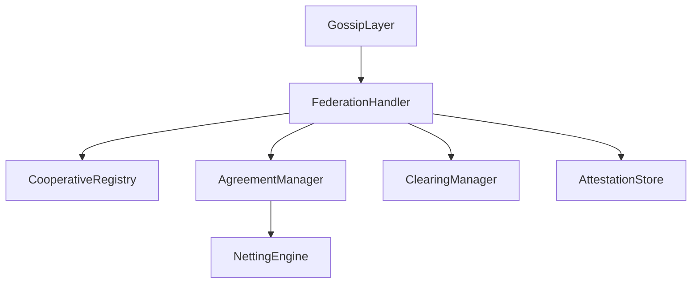
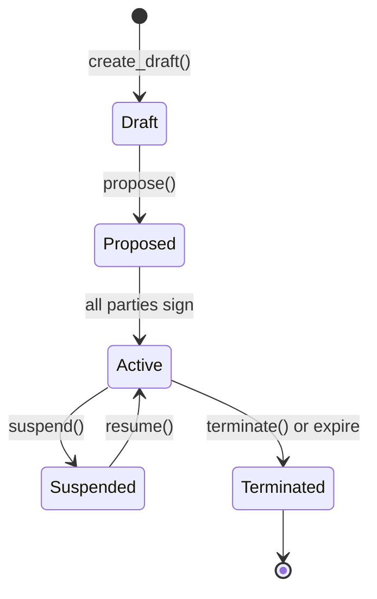

# Module 11: Federation and Inter-Cooperative Agreements

## Objectives
- Understand how cooperatives federate with each other
- Learn the agreement lifecycle for inter-cooperative collaboration
- Explore clearing, netting, and attestation mechanisms

## Prerequisites
- Module 5 (Network and Gossip)
- Module 6 (Ledger and Contracts)

## Key reading
- `icn/crates/icn-federation/src/lib.rs`
- `icn/crates/icn-federation/src/agreement/`
- `icn/crates/icn-federation/src/gossip.rs`
- `icn/crates/icn-federation/src/netting_example.md`

## Walkthrough
Federation enables cooperatives to collaborate across network boundaries. This
includes discovering other cooperatives, negotiating agreements, settling
cross-coop transactions, and building trust through attestations.

## Concepts (textbook style)

### Federation vs. single cooperative
A single cooperative operates autonomously within ICN. Federation extends this
to allow multiple cooperatives to interact: share resources, settle debts,
exchange attestations, and establish trust relationships.

### Cooperative registry
The registry tracks known cooperatives and their metadata. When a cooperative
announces itself via gossip, other nodes add it to their registry and can
begin relationship establishment.

### Federation layer stack (diagram)


### Inter-cooperative agreements
Agreements formalize relationships between cooperatives. They have a lifecycle:



### Agreement types
- **ResourceSharing**: Share compute, storage, or other resources
- **ClearingArrangement**: Settle cross-coop transactions
- **MutualRecognition**: Recognize each other's members/attestations
- **JointGovernance**: Coordinate on shared decisions
- **Custom**: Extensible for domain-specific agreements

## Detailed walkthrough (federation flow)

### 1) Cooperative discovery
A cooperative announces itself via gossip on the `federation:announce` topic.
Other nodes receive the announcement and add the cooperative to their registry.

### 2) Agreement proposal
One cooperative creates a draft agreement specifying terms, parties, and type.
The draft is proposed to counterparties via gossip.

### 3) Multi-party signing
Each party reviews and signs the agreement. When all required signatures are
collected, the agreement becomes active.

### 4) Ongoing operations
Active agreements enable cross-coop operations:
- Clearing: net settlement of mutual obligations
- Attestations: trust assertions between coops
- Resource access: shared services per agreement terms

### 5) Amendment and termination
Agreements can be amended (requires re-signing) or terminated by mutual
consent, expiration, breach, or withdrawal.

## Clearing and netting

### What is clearing?
Clearing settles mutual obligations between cooperatives. Instead of each
transaction requiring immediate settlement, obligations accumulate and net
out periodically.

### Bilateral clearing
Two cooperatives accumulate credits and debits. Periodically, they calculate
the net position and settle only the difference.

### Multilateral netting
Multiple cooperatives participate in a netting cycle. The netting engine
calculates optimal settlement paths to minimize total transfers.

### Netting example
```
Before netting:
  Coop A owes Coop B: 100
  Coop B owes Coop C: 80
  Coop C owes Coop A: 60

After netting:
  Coop A pays Coop B: 40 (net: 100 - 60 = 40)
  Coop B pays Coop C: 80
  Total transfers: 120 (vs 240 without netting)
```

## Attestations and trust

### Cross-coop attestations
Cooperatives can attest to facts about each other or their members:
- Member in good standing
- Payment reliability
- Resource availability
- Governance participation

### Attestation store
The `AttestationStore` persists attestations with cryptographic signatures.
These can be queried when making trust decisions about federated entities.

## Annotated code excerpts

### Agreement lifecycle in AgreementManager
Source: `icn/crates/icn-federation/src/agreement/manager.rs`
```rust
impl<S: AgreementStorage> AgreementManager<S> {
    /// Create a new draft agreement
    pub fn create_draft(&self, terms: AgreementTerms) -> Result<AgreementId> {
        let id = AgreementId::new_v4();
        let agreement = Agreement {
            id,
            status: AgreementStatus::Draft,
            terms,
            signatures: vec![],
            created_at: Utc::now(),
            // ...
        };
        self.storage.store(agreement)?;
        Ok(id)
    }

    /// Sign an agreement (triggers activation when all parties have signed)
    pub fn sign(&self, id: &AgreementId, party: &Did, sig: Signature) -> Result<()> {
        let mut agreement = self.storage.get(id)?;
        agreement.signatures.push((party.clone(), sig));

        if self.all_parties_signed(&agreement) {
            agreement.status = AgreementStatus::Active;
        }
        self.storage.store(agreement)
    }
}
```
This shows the core agreement state machine implementation.

### Federation gossip handler
Source: `icn/crates/icn-federation/src/gossip.rs`
```rust
impl FederationGossipHandler {
    /// Handle incoming federation messages
    pub fn handle_message(&self, topic: &str, data: &[u8]) -> Result<()> {
        match topic {
            "federation:announce" => self.handle_announcement(data),
            "federation:agreements" => self.handle_agreement_message(data),
            "federation:clearing" => self.handle_clearing_message(data),
            _ => Ok(()) // Unknown topic, ignore
        }
    }
}
```
The handler routes messages to appropriate subsystems based on topic.

### Clearing manager operations
Source: `icn/crates/icn-federation/src/clearing_manager.rs`
```rust
impl ClearingManager {
    /// Record an obligation between cooperatives
    pub fn record_obligation(&self, from: &str, to: &str, amount: i64) -> Result<()> {
        self.store.record_obligation(from, to, amount)
    }

    /// Calculate net position with another cooperative
    pub fn net_position(&self, counterparty: &str) -> Result<i64> {
        self.store.net_position(&self.own_coop_id, counterparty)
    }
}
```

## Code map
- `icn/crates/icn-federation/src/lib.rs`: Module exports and public API
- `icn/crates/icn-federation/src/registry.rs`: Cooperative discovery and registry
- `icn/crates/icn-federation/src/agreement/`: Agreement types, manager, storage
- `icn/crates/icn-federation/src/gossip.rs`: Federation message handling
- `icn/crates/icn-federation/src/clearing.rs`: Bilateral clearing primitives
- `icn/crates/icn-federation/src/clearing_manager.rs`: Clearing orchestration
- `icn/crates/icn-federation/src/netting.rs`: Multilateral netting engine
- `icn/crates/icn-federation/src/attestation_store.rs`: Cross-coop attestations

## Reference files (follow-up)
- `icn/crates/icn-federation/src/agreement/types.rs`: Agreement data structures
- `icn/crates/icn-federation/src/agreement/manager.rs`: Lifecycle operations
- `icn/crates/icn-federation/src/netting_example.md`: Detailed netting walkthrough
- `icn/crates/icn-core/src/supervisor/init_federation.rs`: Federation initialization

## Failure modes and safeguards
- **Missing counterparty**: Agreement proposal fails if counterparty unknown
- **Signature mismatch**: Invalid signatures rejected during verification
- **Expired agreement**: Automatic termination via periodic expiration check
- **Network partition**: Gossip ensures eventual consistency on reconnection

## Exercises
- Trace the agreement lifecycle from draft to active
- Find where netting calculations are performed
- Explain how attestations differ from trust graph edges

## Checkpoints
- You can explain the federation layer architecture
- You can describe the agreement lifecycle states
- You understand clearing and netting concepts
