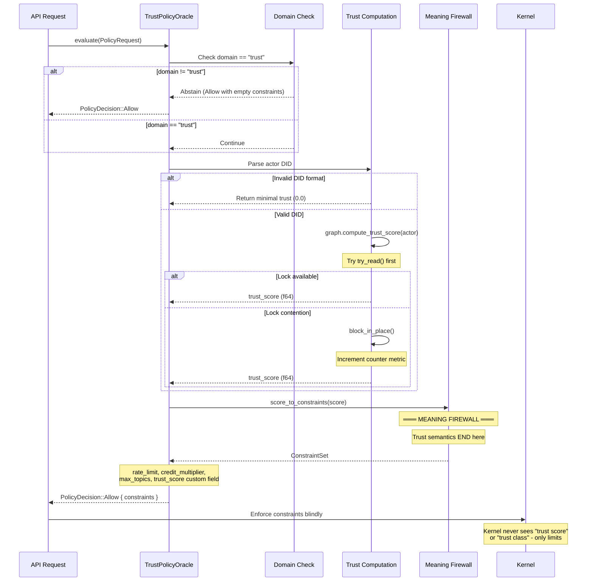

# CLAUDE.md

This file provides guidance to Claude Code (claude.ai/code) when working with code in this repository.

## Non-Negotiables

1. **Concise.** No long narratives. No excessive status updates. No unrequested infrastructure.
2. **Merge = merge.** No polling loops. Use `gh --json` not tabular parsing. Prefer `--auto`, use `--admin` when told.
3. **Toolchain pinned.** Do not upgrade `rust-toolchain.toml`. `cargo clean` for SIGSEGV. No unrelated clippy fixes.
4. **Port 8080.** Gateway binds 8080 (see `icn-core/src/config/gateway.rs`). Never assume 8000.
5. **Preflight first.** Run `/icn-preflight` at session start. Check stale state before rewriting code.
6. **Scope is law.** The user's request defines scope. Do not expand. Note adjacent concerns but do not act on them.

## Project Overview

> **ICN is a constraint engine: apps translate meaning into constraints; the kernel enforces constraints without understanding meaning.**

ICN (Intercooperative Network) is a substrate daemon for the cooperative internet. It is **not** a blockchain or federation server - it's a P2P coordination layer for cooperatives, communities, and federations to coordinate without central servers.

ICN implements a **constraint enforcement architecture** where Policy Oracles (apps/governance) translate domain semantics into generic constraints that the kernel enforces blindly. This ensures the kernel remains predictable while cooperative governance adapts policies.

### Core Subsystems

- **Identity**: Decentralized identifiers (DIDs) with Ed25519 cryptography
- **Trust Graph**: Web-of-participation trust computation → **Policy Oracle**
- **Networking**: QUIC/TLS secure sessions with mDNS discovery → **Kernel**
- **Ledger**: Mutual credit with double-entry accounting → **Policy Oracle**
- **Contracts**: CCL (Cooperative Contract Language) execution → **Policy Oracle**
- **Gossip**: Topic-based replication with causal ordering → **Kernel**
- **Governance**: Democratic proposals and voting → **Policy Oracle**
- **Compute**: Trust-gated distributed task execution → **Policy Oracle**

## Live Deployment

ICN daemon running on K3s cluster (deployed 2025-12-03). See **[docs/HOMELAB_DEPLOYMENT.md](docs/HOMELAB_DEPLOYMENT.md)** for:
- Cluster details and node identity
- Quick access commands
- CI/CD pipeline and monitoring
- Pilot testing status

**Quick Commands**:
```bash
cd deploy/k8s && make full-deploy-dev  # Deploy new version
make status                              # Check pod status
make logs                                # View logs
```

## Workspace Structure

The Cargo workspace is located in the `icn/` subdirectory. All build/test commands must be run from the `icn/` directory within the repository root.

### Repo Topology (Two Roots)

This monorepo has **two important roots** — mixing them up causes subtle failures:

| Root | Path | Contains |
|------|------|----------|
| **Monorepo root** | `/home/ubuntu/projects/icn` | `sdk/`, `docs/`, `web/`, `deploy/`, `scripts/`, `CLAUDE.md` |
| **Rust workspace** | `/home/ubuntu/projects/icn/icn` | `Cargo.toml`, `crates/`, `bins/`, `Cargo.lock` |

**Rule**: Rust commands (`cargo *`) run from `icn/icn/`. SDK/OpenAPI commands run from the monorepo root's subdirectories (`sdk/typescript/`, `docs/api/`).

```bash
# Quick "where am I?" check
git rev-parse --show-toplevel
test -f Cargo.toml && echo "Rust root" || echo "Not Rust root"
```

**Crates** (34 in `icn/crates/`):
- `icn-core` - Tokio runtime, supervisor, actor lifecycle management
- `icn-identity` - DID generation, Ed25519 keypairs, Age-encrypted keystore
- `icn-trust` - Trust graph storage & transitive trust computation
- `icn-net` - QUIC/TLS sessions, mDNS discovery, NetworkActor
- `icn-gossip` - Topic-based gossip with vector clocks & Bloom filters
- `icn-ledger` - Double-entry mutual credit / state change journal (Merkle-DAG)
- `icn-ccl` - Contract language AST, interpreter, fuel metering
- `icn-store` - Persistent KV storage (Sled)
- `icn-rpc` - gRPC API server
- `icn-obs` - Prometheus metrics, tracing, logging
- `icn-gateway` - REST + WebSocket API for cooperative applications
- `icn-governance` - Governance primitives for community decision-making
- `icn-compute` - Distributed compute layer with trust-gated task execution
- `icn-federation` - Inter-cooperative coordination and federation protocol
- `icn-privacy` - Privacy primitives and metadata protection
- `icn-security` - Byzantine fault detection and reputation
- `icn-time` - Clock synchronization (Rough Time Protocol)
- `icn-snapshot` - State snapshots for graceful restarts
- `icn-crypto-pq` - Post-quantum hybrid cryptography
- `icn-steward` - SDIS steward network & VUI computation
- `icn-zkp` - Zero-knowledge proofs for SDIS
- `icn-coop` - Cooperative management & lifecycle
- `icn-community` - Community structures & civic engine
- `icn-entity` - Unified entity model (individuals/coops/federations)
- `icn-api` - Shared service layer for RPC and Gateway (unified validation, error handling)
- `icn-encoding` - Serialization utilities
- `icn-testkit` - Test utilities for multi-node scenarios
- `icn-protocol` - Unified protocol layer (facade re-exporting icn-gossip + icn-net)
- `icn-services` - Unified service layer (facade re-exporting icn-api + icn-rpc + icn-gateway)
- `icn-crypto` - Unified crypto layer (facade re-exporting icn-crypto-pq)
- `icn-authz` - Authorization primitives and capability tokens
- `icn-http-kit` - HTTP utilities shared across gateway and API layers
- `icn-kernel-api` - Kernel API surface (enforces kernel/app boundary)
- `icn-naming` - Cooperative naming service and DID resolution

**Apps** (4 in `icn/apps/`):
- `governance` - Governance app (PolicyOracle wiring)
- `ledger` - Ledger/journal app (PatronageTracker, settlement engine)
- `membership` - Membership management app
- `charter` - Charter and org lifecycle app

**Binaries** (in `icn/bins/`):
- `icnd` - The ICN daemon
- `icnctl` - CLI management tool (`audit verify`, node mgmt)
- `icn-console` - Interactive TUI for cooperative management

## Documentation Structure

**IMPORTANT: Never save documentation files to the project root.** All documentation must go in the appropriate `docs/` subdirectory.

**Project root** (only these files):
- `README.md` - Project overview and quick start
- `CHANGELOG.md` - User-facing changelog
- `CLAUDE.md` - This file (Claude Code guidance)
- `CODE_OF_CONDUCT.md` - Community guidelines
- `CONTRIBUTING.md` - Contribution guidelines
- `AGENTS.md` - Agent coding instructions

**Documentation directory (`docs/`):**

Navigate using `docs/INDEX.md` (complete index) or `docs/README.md` (overview).

**Core Documents:**
- `ARCHITECTURE.md` - Comprehensive system architecture (160KB+)
- `GETTING_STARTED.md` - Quick start guide
- `PHASE_HISTORY.md` - Completed development phases
- `STATE.md` - Current project state
- `TODO.md` - Active work items
- `glossary.md` - Terminology definitions

**Current Planning & Strategy (read these for project direction):**
- `planning/` - Forward plan, crate reference, ecosystem map, vertical slice assessment
- `strategy/` - Gap analysis, active sprint, roadmaps, whitepaper, pitch docs (March 2026)
- `mobile/icn-mobile-ux-spec-v1.md` - Mobile member UX spec (build-facing, anchored to gateway API)
- `status/icn-status-march-2026.md` - Current status report
- `GOLDEN_PROMPT.md` - Master agent context (27KB, complete project state)

**Main Categories:**
- `architecture/` - Architecture documentation, design decisions, audits
- `design/` - Feature designs, proposals, evolution plans
  - `design/economics/` - Economic system design
  - `design/governance/` - Governance system design
  - `design/sdis/` - SDIS design documentation
- `spec/` - Formal protocol and contract specifications
- `reference/` - Technical references
  - `reference/api/` - REST API, WebSocket, SDK documentation
  - `reference/config/` - Configuration files and settings
- `guides/` - User and developer guides
  - `guides/developer/` - Development guides
  - `guides/operations/` - Deployment and operations
  - `guides/user/` - End-user documentation
- `planning/` - Project planning docs (crate reference, ecosystem map, demo docs)
- `strategy/` - Strategic direction (gap analysis, sprint plans, roadmaps)
- `mobile/` - Mobile UX spec (v1 supersedes Dec 2024 docs in archive/)
- `development/` - Development resources (sprints, testing)
- `security/` - Security documentation and threat models
- `sdis/` - SDIS implementation documentation
- `internal/` - Internal planning and pilot programs
- `status/` - Current status reports
- `archive/` - Historical documentation (organized by year)

**See `docs/DOCUMENTATION_MAINTENANCE.md` for where to put new documentation.**

## Build & Test Commands

All commands run from `icn/` directory:

```bash
cargo check                              # Fast type-check (use before full build)
cargo build                              # Build everything
cargo build --release                    # Build release binaries
cargo test                               # Run all tests
cargo test -p icn-gossip                 # Test specific package
cargo test test_two_node_convergence     # Test by name
cargo build && ./target/debug/icnd       # Run daemon
cargo build && ./target/debug/icnctl status
```

### Rust Build Notes
- This is a large workspace (~414K lines). Use `cargo check` before `cargo build` for faster feedback.
- Toolchain is pinned in `icn/rust-toolchain.toml` — do NOT upgrade unless explicitly asked.
- If builds SIGSEGV or fail mysteriously, run `cargo clean` first — incremental compilation cache corruption is a known issue on this machine.
- Do not fix pre-existing clippy lints unrelated to the current task.

## Architecture: Actor-Based Runtime

ICNd uses Tokio with an actor pattern. The supervisor (`icn-core/src/supervisor.rs`) spawns and manages actors:

1. **Runtime** (`icn-core/src/runtime.rs`): Entry point, shutdown signal, config loading
2. **Supervisor** (`icn-core/src/supervisor.rs`): Spawns actors, initializes metrics, bridges gossip/network
3. **GossipActor** (`icn-gossip/src/gossip.rs`): Topic subscriptions, vector clocks, anti-entropy
4. **NetworkActor** (`icn-net/src/actor.rs`): QUIC sessions, mDNS discovery, message routing
5. **Ledger** (`icn-ledger/src/ledger.rs`): Double-entry accounting, gossip sync

**Actor Communication**:
```rust
// Network → Gossip: Incoming message handler
let incoming_handler: IncomingMessageHandler = Arc::new(move |net_msg| {
    if let MessagePayload::Gossip(gossip_msg) = net_msg.payload {
        gossip_handle.blocking_write().handle_message(gossip_msg)?;
    }
});

// Gossip → Network: Send callback
let send_callback: SendMessageCallback = Arc::new(move |recipient, gossip_msg| {
    network_handle.send_message(recipient, net_msg).await?;
});
```

## Key Protocols

**Gossip Protocol** (`icn-gossip`):
- Push announcements, pull requests, anti-entropy
- Vector clocks for causal ordering
- Subscription notifications via callbacks

**Network Protocol** (`icn-net/src/protocol.rs`):
- `NetworkMessage` envelope with `from_did`, `to_did`, `payload`
- Payload types: `Gossip`, `Rpc`, `Subscribe`, `Hello`, `Signed`
- Length-prefixed framing over QUIC streams

**Signed Messages** (`icn-net/src/envelope.rs`):
- `SignedEnvelope` with Ed25519 signatures
- `ReplayGuard` with sequence tracking
- Automatic verification in NetworkActor

## Cooperative Contract Language (CCL)

CCL (`icn-ccl`) is a domain-specific language for expressing agreements:

- AST-based: `Contract`, `Rule`, `Stmt`, `Expr`, `Value`
- Capability system: `ReadLedger`, `WriteLedger`, `ReadTrust`
- Fuel metering, not Turing-complete, deterministic

## Testing Patterns

**Integration Tests**: Located in `icn/crates/icn-core/tests/` and `icn/crates/icn-ledger/tests/`
- Use `TestNode` helper pattern
- Each node gets unique port and keypair
- Verify convergence with retries

## Identity & Keystore

- DIDs: `did:icn:<base58-pubkey>` (Ed25519)
- Keystore: Age-encrypted at `~/.icn/keystore.age`
- Auto-migration: v1 → v2 → v2.1 (adds TLS binding + X25519 keys)

**icnctl commands**: `id init`, `id show`, `id rotate`, `id export/import`

## Roadmap & Phase Tracking

**Standard**: All development is tracked as sequential phases. No parallel tracks, no letter suffixes.

### Phase Format

Each phase in documentation must follow this format:

```
### Phase N: <Name>
**Status**: ✅ Complete | 🚧 In Progress | ⏳ Planned
**Completed**: YYYY-MM-DD (if done)

<One paragraph description of what this phase accomplishes>

**Deliverables**:
- Bullet list of concrete outputs
```

### Status Indicators

| Symbol | Meaning |
|--------|---------|
| ✅ | Complete - merged to main, tested, deployed |
| 🚧 | In Progress - active development |
| ⏳ | Planned - scoped but not started |

### Source of Truth

- **Completed phases**: [docs/PHASE_HISTORY.md](docs/PHASE_HISTORY.md)
- **Current & planned phases**: [docs/dev-journal/ROADMAP.md](docs/dev-journal/ROADMAP.md)
- **This file**: Quick reference only, not authoritative

### Current Status

**Last Completed**: Phase 18 (Pre-Pilot Hardening) - 2025-11-27
**Implementation**: ~75% complete (272K LOC, 2,287 tests)
**Deployed**: K3s cluster since 2025-12-03

**Remaining phases (19-35)**:
- 19-20: Release Infrastructure + Testing Foundation
- 21-22: Network Connectivity + Security Hardening
- 23-26: Identity, SDK, Observability, Documentation
- 27-29: Ledger/Economics, CCL/Governance, Code Quality
- 30-33: Mobile, Infrastructure, Federation, CLI/UX
- 34: Release Candidate
- 35: Pilot Deployment

See [docs/dev-journal/ROADMAP.md](docs/dev-journal/ROADMAP.md) for full details and issue mapping.

### Rules for Agents

1. **Never invent new tracking systems** - use phases with sequential numbers
2. **Never use "Track A/B/C"** - everything is sequential
3. **Update PHASE_HISTORY.md** when completing a phase
4. **Update ROADMAP.md** when planning changes
5. **Keep this section as quick reference only** - detail goes in the dedicated docs

## Common Development Workflows

**Adding a new actor**:
1. Create actor struct with state
2. Implement message enum
3. Create handle struct with `mpsc::Sender<Msg>`
4. Implement `spawn()` method
5. Register with supervisor
6. Wire up callbacks/channels

**Adding a new gossip topic**:
1. Define topic string (`namespace:purpose`)
2. Configure `AccessControl` enum
3. Subscribe in relevant actor
4. Set up notification callback
5. Handle incoming messages

**Adding metrics**:
1. Define in `icn-obs/src/metrics/{module}.rs`
2. Register in `init_metrics()`
3. Follow naming: `{actor}_{metric}_{unit}`

**Adding a new crate** (template from `icn-authz`):
1. Create `crates/<name>/Cargo.toml` — workspace-inherited version/edition/license/repository, `[lints] workspace = true`
2. Create `src/lib.rs` with module declarations + public re-exports
3. Create `src/error.rs` with crate-specific error enum (derives `thiserror::Error`)
4. Organize by concern: `model/`, `graph/`, `adapters/` (or domain-appropriate dirs)
5. Add to workspace `members` in `icn/Cargo.toml` (alphabetical within group)
6. Add to workspace `[dependencies]` with `path = "crates/<name>"`
7. Integration tests in `tests/` directory
8. Verify: `cargo check -p <name> && cargo test -p <name>`
9. If kernel-level: no persistence, no domain imports, no side effects

## Git Workflow

**Goal**: `main` is always releasable. Work happens on short-lived branches, merged via PR.

### Branch Policy

**Protected Branch: `main`**
- **No direct commits to `main`** - all changes land via Pull Request
- Only merge when CI passes (or local checks pass)

**Branch Naming**:
- `feat/<short-slug>` - new capability
- `fix/<short-slug>` - bug fix
- `refactor/<short-slug>` - structure change, behavior preserved
- `docs/<short-slug>` - documentation only
- `chore/<short-slug>` - build tooling, formatting, deps

Examples: `feat/gossip-compression`, `fix/trust-rate-limit-overflow`, `refactor/actor-message-routing`

### Multi-Agent Parallel Work

For running multiple agents simultaneously, use Git worktrees. Each agent gets an isolated working directory and branch. See `docs/dev/WORKTREES.md` for full documentation and `scripts/worktrees.sh` for the helper script.

### Daily Flow

```bash
# 1) Start from updated main
git checkout main
git pull origin main

# 2) Create a branch
git checkout -b feat/<slug>

# 3) Work in small commits
git add -A
git commit -m "feat(gossip): add message compression header"

# 4) Keep branch synced (if main moved)
git fetch origin
git rebase origin/main
git push --force-with-lease   # Only on YOUR branch

# 5) Push and open PR
git push -u origin feat/<slug>
```

### Commit Message Convention

Format: `<type>(<scope>): <summary>`

**Types**: `feat`, `fix`, `refactor`, `docs`, `test`, `chore`

**Scopes**: `gossip`, `net`, `identity`, `trust`, `ledger`, `ccl`, `gateway`, `cli`, `runtime`, `sdk`, `governance`, `compute`

Examples:
- `feat(ledger): add demurrage scheduler`
- `fix(trust): prevent negative reputation underflow`
- `refactor(runtime): isolate actor mailbox logic`

### PR Requirements

**Size**: One coherent change, reviewable in <20 minutes. Split large changes.

**Description must include**:
- **What**: Summary of changes
- **Why**: Motivation / issue link
- **How**: Implementation notes
- **Risk**: What could break
- **Test plan**: How you verified

### Required Checks (before merge)

```bash
# Rust
cargo fmt --check
cargo clippy --all-targets --all-features -- -D warnings
cargo test --all-features

# TypeScript SDK (if changed)
cd sdk/typescript && npm test && npm run build
```

### CI Failure Index

Common CI failures and their minimal fixes:

| CI Check | Usual Cause | Fix |
|----------|------------|-----|
| **Check API Types Drift** | TS types out of date after API change | `cd sdk/typescript && npm ci && npm run generate-types` — commit only `src/generated/api-types.ts` |
| **non-exhaustive patterns** | Enum variant added in shared crate | Add match arm in consumer crate, map to closest existing semantics |
| **Clippy** | Lint regression in changed code | Fix the warning — never suppress with `#[allow]` unless pre-existing |
| **Compare Against Base** | Benchmark compare flaky | If not required: ignore. If required: `gh run rerun <run-id> --failed` once before touching code |
| **claude-review** | 15-min job timeout (infra flake) | Never blocks merge |

**Full drift chain**: shared crate change → gateway/API match updates → OpenAPI regen → TS type regen → CI passes. Don't skip the second half.

**Drift fix recipe** (TypeScript API Types):
```bash
cd sdk/typescript && npm ci && npm run generate-types
git diff --stat  # must show ONLY sdk/typescript/src/generated/* paths
git add sdk/typescript/src/generated/api-types.ts
git commit -m "chore(sdk): regenerate TypeScript API types"
```

**Generated-commit gate**: A regen commit must touch only `sdk/typescript/src/generated/*`. No lockfile changes unless `npm ci` actually updated deps (rare). No mixed "refactor + regen" commits.

### Agent Behavior

The Claude Code agent **must**:
- Never push directly to `main`
- Always work on feature branches and open PRs
- Run required checks before requesting review
- Explain any skipped checks in the PR description
- **When working on an existing PR**: Always check for new/updated comments and CI status before making changes
  ```bash
  gh pr view <PR_NUMBER> --comments  # Check for review comments
  gh pr checks <PR_NUMBER>           # Check CI status
  gh pr diff <PR_NUMBER>             # Review current changes
  ```
- **When CI fails**: Fetch and review the CI logs to understand the failure
  ```bash
  gh run view <RUN_ID> --log-failed  # Get failed job logs
  ```

## Issue Management

See **[.github/ISSUE_POLICY.md](.github/ISSUE_POLICY.md)** for the complete issue taxonomy.

### Label System (19 labels)

**Every issue MUST have**:
- Exactly one `epic:*` label (`epic:kernel-separation`, `epic:arch-invariants`, `epic:trust-hardening`, `epic:service-discovery`, `epic:commons-compute`, `epic:kernel-perf`)
- Exactly one `type:*` label (`type:spec`, `type:impl`, `type:refactor`, `type:test`, `type:doc`)
- If `epic:trust-hardening`: exactly one `tier:*` (`tier:1-correctness`, `tier:2-observability`, `tier:3-perf`)

**Dependencies** go in the issue body as checklists, not labels.

**Issue Title Format**: `<type>(<domain>): <action>`
- Examples: `feat(ledger): Add demurrage scheduler`, `fix(gossip): Remove blocking operations`

**Before Creating Issues**:
1. Search for existing duplicates
2. If duplicate exists, comment + link instead of creating new
3. No new labels without explicit human approval

## Security & Production Hardening

**Three-Layer Security**:
1. Transport: QUIC/TLS with DID-TLS binding
2. Message: SignedEnvelope with Ed25519 + replay protection
3. Application: EncryptedEnvelope with E2E encryption

**Trust-gated rate limiting** (per trust class):
- Isolated (< 0.1): 10 msg/sec
- Known (0.1-0.4): 20 msg/sec
- Partner (0.4-0.7): 100 msg/sec
- Federated (0.7+): 200 msg/sec

See [docs/production-hardening.md](docs/production-hardening.md) for complete details.

## Notes

- Daemon requires unlocked keystore (passphrase on startup)
- Actor handles use `Arc<RwLock<T>>` or message passing
- Shutdown via `tokio::sync::broadcast`
- Integration tests need unique ports per node
- Vector clocks prevent duplicate gossip processing

### Canonical Type Ownership

| Type | Canonical Home | Notes |
|------|---------------|-------|
| `Did` | `icn-identity` | Newtype `Did(String)` — `.as_str()` for &str, `.to_string()` for String |
| `BlockHeight` | `icn-kernel-api::invariants` | `pub type BlockHeight = u64` (alias, not newtype) |
| `ErrCode` | `icn-kernel-api::error` | 10 codes, lowercase snake_case wire format |
| `ArtifactReceipt` | `icn-kernel-api::proofs` | Phase A addition |
| `GovernanceProof` | `icn-governance::proof` | Phase A addition |

If a type can't be imported yet (unmerged PR), use a local alias with a migration comment citing the PR number.

### Lockfile Policy

- Rust `Cargo.lock` changes belong in Rust commits only
- Node `package-lock.json` changes belong in SDK commits only
- If a lockfile changed unintentionally (branch switching churn), revert it before committing

## Kernel/App Separation Architecture

> **Detailed Documentation**: See [docs/architecture/KERNEL_APP_SEPARATION.md](docs/architecture/KERNEL_APP_SEPARATION.md) for comprehensive documentation including migration guides, implementation patterns, and request flow diagrams.

### The Meaning Firewall

The kernel enforces constraints WITHOUT understanding their semantic origin. This is the core architectural principle.

**Rule**: Domain semantics (trust scores, governance rules, membership criteria) stay in apps. Kernel only sees:
- `ConstraintSet` (rate limits, credit multipliers, voting weights)
- `PolicyDecision` (Allow/Deny)
- Capabilities (bearer tokens)

**Violation Detection**:
```rust
// VIOLATION - kernel code importing domain types
use icn_trust::{TrustGraph, TrustClass};  // ❌ NEVER in kernel crates

// CORRECT - kernel code using generic types
use icn_kernel_api::{PolicyOracle, ConstraintSet};  // ✅
```

### PolicyOracle Pattern

Apps implement `PolicyOracle` to provide domain-specific authorization:

```rust
impl PolicyOracle for TrustPolicyOracle {
    fn evaluate(&self, request: &PolicyRequest) -> PolicyDecision {
        // 1. Compute domain-specific value (trust score)
        let score = self.graph.compute_trust_score(&actor);

        // 2. Convert to generic constraints (MEANING FIREWALL BOUNDARY)
        let constraints = ConstraintSet::new()
            .with_rate_limit(score_to_rate_limit(score))
            .with_credit_multiplier(score);

        // 3. Return decision kernel can enforce blindly
        PolicyDecision::Allow { constraints }
    }
}
```

### TrustPolicyOracle Flow

The following diagram shows the complete request flow through the TrustPolicyOracle:



**Key Points**:
- The **Meaning Firewall** boundary is where trust semantics (scores, classes) are converted to generic constraints
- The kernel enforces rate limits without knowing they came from trust scores
- Lock contention is tracked via `trust_oracle_block_in_place_total` metric


### App Lifecycle

```
[Prepare] → [Install] → [Start] → [Stop] → [Uninstall]
     ↓           ↓          ↓         ↓
  Validate   Create     Spawn    Signal    Remove
  manifest   state      task     shutdown  from
             handles              +timeout  registry
```

### CCL (Cooperative Contract Language)

CCL is the constitutional layer for governed entities:
- **Entities**: Community, Cooperative, Federation, Individual
- **Governance**: Bodies, decisions, delegation, thresholds
- **Economics**: Capital, surplus allocation, credit policy
- **Agreements**: Federation treaties, boundary protocols

CCL documents are stored as state, interpreted by apps, and converted to `ConstraintSet` for kernel enforcement.

### Bootstrap Phases

1. **Genesis**: AllowAllOracle active, genesis capabilities can be issued
2. **CoreApps**: First-party apps loading, trust oracle registering
3. **Running**: Deny-by-default for unknown domains, full enforcement

### Crate Organization

**Kernel crates** (domain-agnostic):
- `icn-kernel-api`: Primitive traits (PolicyOracle, State, Compute, Comms)
- `icn-core`: Runtime, supervisor, dispatcher
- `icn-net`, `icn-gateway`, `icn-gossip`: Network primitives

**App crates** (domain-specific):
- `apps/trust`: Trust graph → PolicyOracle
- `apps/governance`: CCL governance → PolicyOracle (future)
- `apps/membership`: Entity management (future)

**Never import domain crates into kernel crates.**

## Claude Execution Contract

### Default Mode
You are operating as an execution engine. Be concise. Do not narrate routine steps.
- Do not over-verify or provide excessive status updates.
- Do not build elaborate infrastructure (justfiles, bootstrap scripts, custom actions) beyond what is explicitly requested.
- When merging PRs, use `gh pr merge --admin` if CI is queue-stalled — do not write polling loops to wait for CI.

### Scope is Law
- The user's request defines the complete scope.
- Do not expand scope.
- If something adjacent is important, add a short NOTE section at the end, but do not act on it.

### Branch/Target Hygiene (mandatory)
Before making ANY code change:
1. Print current branch
2. Identify PR number (if any) and its base branch
3. Confirm correct repo + correct directory

If any of these are ambiguous, STOP and ask.

**Cross-PR rule**: One phase = one branch = one PR. Never commit Phase B work onto a Phase A branch (or vice versa). If scope bleed happens, fix immediately via `git reset --hard HEAD~N` + `git cherry-pick` onto the correct branch.

**Stashes are debt**: Before switching branches, `git status --short` must be clean — commit or stash intentionally. After switching, `git stash list` should be empty. Drop unneeded stashes immediately; don't leave them for archaeology.

### PR Workflow Gates (for Rust workspace)
When applying review feedback or fixing CI:
- After changes and before pushing:
  - `cargo fmt --check`
  - `cargo clippy --all-targets -- -D warnings`
  - `cargo test` (or `cargo test --workspace` if appropriate)
- Do not push broken formatting/lints/tests.
- **Never run `git push` directly. Always use `/push`.** This is the only sanctioned push path.

### PR Readiness Definition
A PR is ready to merge when:
- All review feedback, comments, and review threads addressed (`gh pr view <id> --json reviews,reviewRequests,comments`)
- Required CI checks green (flaky non-required checks don't block)
- No scope-bleed commits (every commit belongs to this phase)
- Diff size matches phase expectations (no surprise 2000-line PRs)
- Generated commits labeled as such (`chore(sdk): …`) and contain only generated files

**Do not merge until PR Readiness Definition is satisfied.**

```bash
# Merge preflight
gh pr view <id> --json state,mergeable,reviews,reviewRequests,comments,statusCheckRollup
gh pr checks <id>
git status --short
```

### CI Owns the Truth
- **Local green does not override CI red.** Fix exactly what CI says, nothing more.
- Don't pre-fix unrelated suspected issues before CI runs.
- Rerun flaky checks once before touching code (see CI Failure Index for classification).

### Do Not "Fix the World"
- Do NOT upgrade toolchains, refactor unrelated code, or address pre-existing lints unless explicitly asked.
- If you encounter unrelated failures, report them, but do not start a toolchain/infra project.
- Toolchain is pinned in `icn/rust-toolchain.toml` — do NOT change it without explicit approval.
- SIGSEGV or sccache corruption? Run `cargo clean` first before theorizing further.

### Infrastructure Tasks = No ICN Code Changes
If the task is homelab/infra/proxmox/networking:
- Do not modify ICN repo code unless explicitly instructed.
- Document findings in the infra/homelab notes repo (or a designated doc), not in ICN code.

### Debugging Protocol (stop wrong-path spirals)
Before pursuing any hypothesis:
1. List top 3 hypotheses ranked by likelihood
2. For each: evidence FOR, evidence AGAINST, cheapest test
3. Start with the cheapest test

Do not jump to hardware/compiler blame without strong evidence.

### Sequential by Default
- Do not make parallel changes without explicit instruction.
- Do one change-set, verify it works, then proceed to the next.
- "Implement everything in parallel" requires the user to say "in parallel."

### Long-Running Shell Commands
- `nohup ... &` is unreliable in the Claude Code bash environment.
- For polling loops or long waits, use the Bash tool's `run_in_background: true` parameter instead.

### Prose Mode (when requested)
- Keep the user's voice: sharp, direct, not formalized, not melodramatic.
- "Sharper/edgier" means more authentic and raw, NOT more structured or sitcom cadence.
- If corrected on tone, internalize within the session.

## CRLF / Line Ending Gotchas
- Some branches predating `.gitattributes` line-ending normalization may show large phantom diffs on checkout.
- If you see hundreds of CRLF-only changes:
  - Prefer `git checkout -f main` to force-reset the worktree state.
  - Avoid rebasing noisy branches without normalizing; consider a one-time "line ending normalization" commit, then rebase.
- Recommended local config in all worktrees:
  - `git config core.autocrlf false`
  - `git config core.eol lf`

## Test Filtering Notes
- `cargo test <filter>` matches **test function names**, not file names.
- To run an integration test file:
  - `cargo test -p <crate> --test <filename>` (omit `.rs`)
- Example:
  - `cargo test -p icn-core --test backup_restore_integration`

## Domain Advisor Agents

Specialized agents in `.claude/agents/` auto-activate based on crate scope. Invoke via the `Task` tool with `subagent_type` matching the agent name.

| Agent | Auto-activates when working on... |
|-------|----------------------------------|
| `icn-economics-advisor` | `icn-ledger`, mutual credit, commons credits, settlement, `EarningTracker`, credit policy |
| `icn-governance-advisor` | `icn-governance`, `icn-ccl`, `icn-community`, `icn-coop`, proposals, voting, CCL semantics |
| `icn-identity-iam-advisor` | `icn-identity`, `icn-naming`, DIDs, keystore, key rotation, capability tokens, DID-TLS |
| `icn-trust-federation-advisor` | `icn-trust`, `icn-federation`, `TrustPolicyOracle`, trust scores, federation treaties |

## Multi-Agent Worktree Pattern
- Give each agent an isolated worktree and branch.
- Keep territory constraints strict: each agent only touches its assigned crate/app.
- Merge order:
  - smallest / most independent first
  - largest / most dependent last
- Crash recovery: worktrees survive VM crashes; rebase/stash workflow can salvage state.

## PR Merge Edge Cases
- Draft PRs must be marked ready before merge:
  - `gh pr ready <pr>`
- `--delete-branch` will fail if the branch is checked out in a worktree.
  - Remove the worktree first, then delete the branch.
- Use `--admin` sparingly (prefer fixing flake sources rather than normalizing bypass).
- `gh pr checks` exits code 8 on mixed results — always capture with `|| true`.
- `gh pr checks` output is tab-separated; multi-word check names (e.g. "Test Coverage") need `awk -F'\t' '{print $2}'`, not `awk '{print $2}'`.
- `claude-review` failure = 15-min job timeout (infra flake). Never blocks merge.
- "Test Coverage" at `pending / 0s` = queue-stalled, not running. Safe to `--admin` merge when all other required gates are green.
- When merging multiple PRs in dependency order, expect compilation errors from struct field changes across crates — fix forward, don't over-investigate.
- Prefer merge strategy over rebase for subtree commits (subtree squash commits do not rebase cleanly).
- **Stacked PRs**: Before merging a PR that is the base branch of another open PR, retarget the stacked PR first:
  `gh pr edit <stacked-pr-number> --base main`
  If you forget, GitHub leaves the stacked PR open but its base is gone — it shows as open with a stale diff. Verify with `gh pr view <pr> --json baseRefName`.
- **Branch cleanup**: `delete_branch_on_merge` is not enabled in repo settings (GitHub UI: Settings → General → Pull Requests). Until enabled, merged branches must be deleted manually or by Dependabot. Run `git fetch --prune` periodically to clean local refs.
