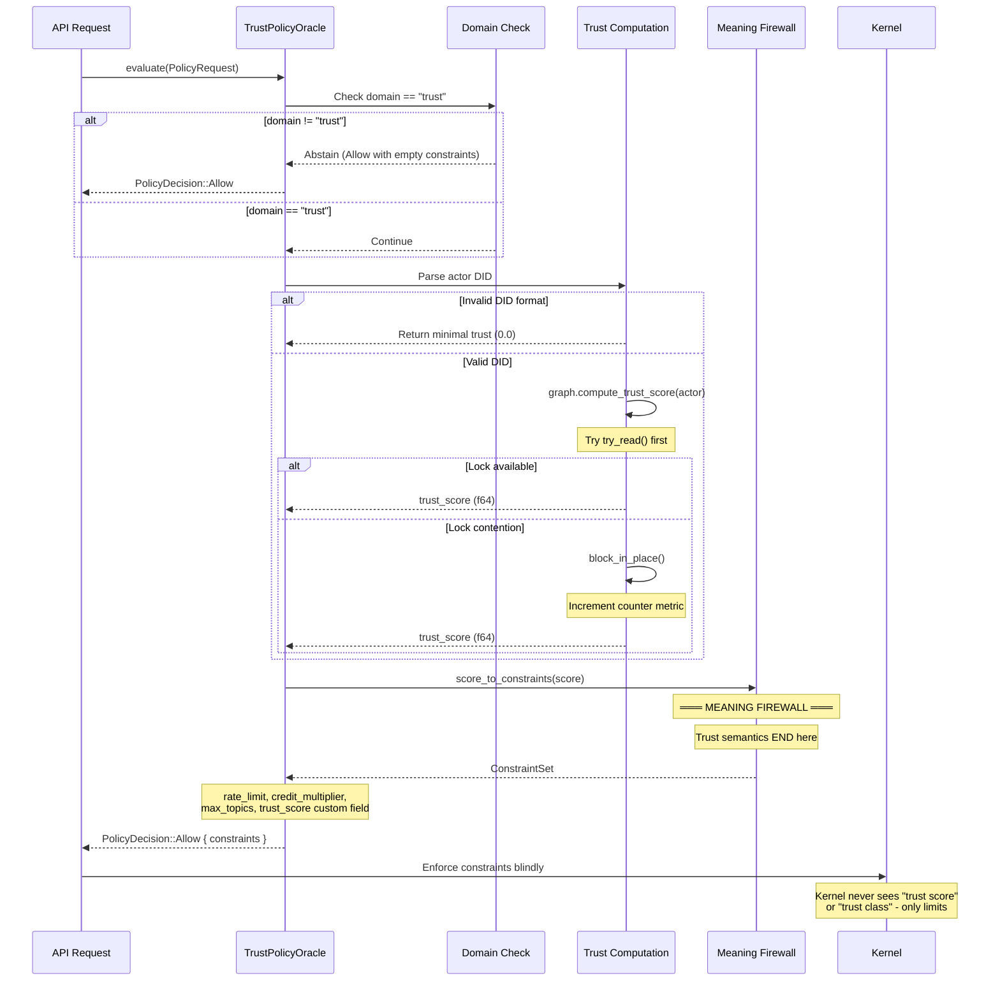

# CLAUDE.md

This file provides guidance to Claude Code (claude.ai/code) when working with code in this repository.

## Project Overview

> **ICN is a constraint engine: apps translate meaning into constraints; the kernel enforces constraints without understanding meaning.**

ICN (Intercooperative Network) is a substrate daemon for the cooperative internet. It is **not** a blockchain or federation server - it's a P2P coordination layer for cooperatives, communities, and federations to coordinate without central servers.

ICN implements a **constraint enforcement architecture** where Policy Oracles (apps/governance) translate domain semantics into generic constraints that the kernel enforces blindly. This ensures the kernel remains predictable while cooperative governance adapts policies.

### Core Subsystems

- **Identity**: Decentralized identifiers (DIDs) with Ed25519 cryptography
- **Trust Graph**: Web-of-participation trust computation → **Policy Oracle**
- **Networking**: QUIC/TLS secure sessions with mDNS discovery → **Kernel**
- **Ledger**: Mutual credit with double-entry accounting → **Policy Oracle**
- **Contracts**: CCL (Cooperative Contract Language) execution → **Policy Oracle**
- **Gossip**: Topic-based replication with causal ordering → **Kernel**
- **Governance**: Democratic proposals and voting → **Policy Oracle**
- **Compute**: Trust-gated distributed task execution → **Policy Oracle**

## Live Deployment

ICN daemon running on K3s cluster (deployed 2025-12-03). See **[docs/HOMELAB_DEPLOYMENT.md](docs/HOMELAB_DEPLOYMENT.md)** for:
- Cluster details and node identity
- Quick access commands
- CI/CD pipeline and monitoring
- Pilot testing status

**Quick Commands**:
```bash
cd deploy/k8s && make full-deploy-dev  # Deploy new version
make status                              # Check pod status
make logs                                # View logs
```

## Workspace Structure

The Cargo workspace is located in the `icn/` subdirectory. All build/test commands must be run from the `icn/` directory within the repository root.

**Crates** (in `icn/crates/`):
- `icn-core` - Tokio runtime, supervisor, actor lifecycle management
- `icn-identity` - DID generation, Ed25519 keypairs, Age-encrypted keystore
- `icn-trust` - Trust graph storage & transitive trust computation
- `icn-net` - QUIC/TLS sessions, mDNS discovery, NetworkActor
- `icn-gossip` - Topic-based gossip with vector clocks & Bloom filters
- `icn-ledger` - Double-entry mutual credit with Merkle-DAG
- `icn-ccl` - Contract language AST, interpreter, fuel metering
- `icn-store` - Persistent KV storage (Sled)
- `icn-rpc` - gRPC API server
- `icn-obs` - Prometheus metrics, tracing, logging
- `icn-gateway` - REST + WebSocket API for cooperative applications
- `icn-governance` - Governance primitives for community decision-making
- `icn-compute` - Distributed compute layer with trust-gated task execution
- `icn-federation` - Inter-cooperative coordination and federation protocol
- `icn-privacy` - Privacy primitives and metadata protection
- `icn-security` - Byzantine fault detection and reputation
- `icn-time` - Clock synchronization (Rough Time Protocol)
- `icn-snapshot` - State snapshots for graceful restarts
- `icn-crypto-pq` - Post-quantum hybrid cryptography
- `icn-steward` - SDIS steward network & VUI computation
- `icn-zkp` - Zero-knowledge proofs for SDIS
- `icn-coop` - Cooperative management & lifecycle
- `icn-community` - Community structures & civic engine
- `icn-entity` - Unified entity model (individuals/coops/federations)
- `icn-api` - Shared service layer for RPC and Gateway (unified validation, error handling)
- `icn-encoding` - Serialization utilities
- `icn-testkit` - Test utilities for multi-node scenarios

**Binaries** (in `icn/bins/`):
- `icnd` - The ICN daemon
- `icnctl` - CLI management tool
- `icn-console` - Interactive TUI for cooperative management

## Documentation Structure

**IMPORTANT: Never save documentation files to the project root.** All documentation (session notes, status reports, guides, etc.) must go in the appropriate `docs/` subdirectory.

**Project root** (only these files):
- `README.md` - Project overview and quick start
- `CHANGELOG.md` - User-facing changelog
- `CLAUDE.md` - This file (Claude Code guidance)
- `CODE_OF_CONDUCT.md` - Community guidelines
- `CONTRIBUTING.md` - Contribution guidelines
- `AGENTS.md` - Agent coding instructions

**Documentation directory (`docs/`):**
- `ARCHITECTURE.md` - System architecture and component design
- `PHASE_HISTORY.md` - Completed development phases
- `HOMELAB_DEPLOYMENT.md` - K3s deployment details
- `glossary.md` - ICN terminology definitions
- `production-hardening.md` - Security hardening measures
- `trust-multi-graph-migration.md` - Multi-graph trust migration guide
- `dev-journal/` - Development session journals and technical notes
- `demo/` - Demo session documentation and guides
- `security/` - Security audits, threat models, and fixes
- `ci/` - CI/CD status reports and configurations
- `status/` - System status reports and deployment verification
- `performance/` - Performance benchmarks and optimization docs

## Build & Test Commands

All commands run from `icn/` directory:

```bash
cargo build                              # Build everything
cargo build --release                    # Build release binaries
cargo test                               # Run all tests
cargo test -p icn-gossip                 # Test specific package
cargo test test_two_node_convergence     # Test by name
cargo build && ./target/debug/icnd       # Run daemon
cargo build && ./target/debug/icnctl status
```

## Architecture: Actor-Based Runtime

ICNd uses Tokio with an actor pattern. The supervisor (`icn-core/src/supervisor.rs`) spawns and manages actors:

1. **Runtime** (`icn-core/src/runtime.rs`): Entry point, shutdown signal, config loading
2. **Supervisor** (`icn-core/src/supervisor.rs`): Spawns actors, initializes metrics, bridges gossip/network
3. **GossipActor** (`icn-gossip/src/gossip.rs`): Topic subscriptions, vector clocks, anti-entropy
4. **NetworkActor** (`icn-net/src/actor.rs`): QUIC sessions, mDNS discovery, message routing
5. **Ledger** (`icn-ledger/src/ledger.rs`): Double-entry accounting, gossip sync

**Actor Communication**:
```rust
// Network → Gossip: Incoming message handler
let incoming_handler: IncomingMessageHandler = Arc::new(move |net_msg| {
    if let MessagePayload::Gossip(gossip_msg) = net_msg.payload {
        gossip_handle.blocking_write().handle_message(gossip_msg)?;
    }
});

// Gossip → Network: Send callback
let send_callback: SendMessageCallback = Arc::new(move |recipient, gossip_msg| {
    network_handle.send_message(recipient, net_msg).await?;
});
```

## Key Protocols

**Gossip Protocol** (`icn-gossip`):
- Push announcements, pull requests, anti-entropy
- Vector clocks for causal ordering
- Subscription notifications via callbacks

**Network Protocol** (`icn-net/src/protocol.rs`):
- `NetworkMessage` envelope with `from_did`, `to_did`, `payload`
- Payload types: `Gossip`, `Rpc`, `Subscribe`, `Hello`, `Signed`
- Length-prefixed framing over QUIC streams

**Signed Messages** (`icn-net/src/envelope.rs`):
- `SignedEnvelope` with Ed25519 signatures
- `ReplayGuard` with sequence tracking
- Automatic verification in NetworkActor

## Cooperative Contract Language (CCL)

CCL (`icn-ccl`) is a domain-specific language for expressing agreements:

- AST-based: `Contract`, `Rule`, `Stmt`, `Expr`, `Value`
- Capability system: `ReadLedger`, `WriteLedger`, `ReadTrust`
- Fuel metering, not Turing-complete, deterministic

## Testing Patterns

**Integration Tests**: Located in `icn/crates/icn-core/tests/` and `icn/crates/icn-ledger/tests/`
- Use `TestNode` helper pattern
- Each node gets unique port and keypair
- Verify convergence with retries

## Identity & Keystore

- DIDs: `did:icn:<base58-pubkey>` (Ed25519)
- Keystore: Age-encrypted at `~/.icn/keystore.age`
- Auto-migration: v1 → v2 → v2.1 (adds TLS binding + X25519 keys)

**icnctl commands**: `id init`, `id show`, `id rotate`, `id export/import`

## Roadmap & Phase Tracking

**Standard**: All development is tracked as sequential phases. No parallel tracks, no letter suffixes.

### Phase Format

Each phase in documentation must follow this format:

```
### Phase N: <Name>
**Status**: ✅ Complete | 🚧 In Progress | ⏳ Planned
**Completed**: YYYY-MM-DD (if done)

<One paragraph description of what this phase accomplishes>

**Deliverables**:
- Bullet list of concrete outputs
```

### Status Indicators

| Symbol | Meaning |
|--------|---------|
| ✅ | Complete - merged to main, tested, deployed |
| 🚧 | In Progress - active development |
| ⏳ | Planned - scoped but not started |

### Source of Truth

- **Completed phases**: [docs/PHASE_HISTORY.md](docs/PHASE_HISTORY.md)
- **Current & planned phases**: [docs/dev-journal/ROADMAP.md](docs/dev-journal/ROADMAP.md)
- **This file**: Quick reference only, not authoritative

### Current Status

**Last Completed**: Phase 18 (Pre-Pilot Hardening) - 2025-11-27
**Implementation**: ~75% complete (272K LOC, 2,287 tests)
**Deployed**: K3s cluster since 2025-12-03

**Remaining phases (19-35)**:
- 19-20: Release Infrastructure + Testing Foundation
- 21-22: Network Connectivity + Security Hardening
- 23-26: Identity, SDK, Observability, Documentation
- 27-29: Ledger/Economics, CCL/Governance, Code Quality
- 30-33: Mobile, Infrastructure, Federation, CLI/UX
- 34: Release Candidate
- 35: Pilot Deployment

See [docs/dev-journal/ROADMAP.md](docs/dev-journal/ROADMAP.md) for full details and issue mapping.

### Rules for Agents

1. **Never invent new tracking systems** - use phases with sequential numbers
2. **Never use "Track A/B/C"** - everything is sequential
3. **Update PHASE_HISTORY.md** when completing a phase
4. **Update ROADMAP.md** when planning changes
5. **Keep this section as quick reference only** - detail goes in the dedicated docs

## Common Development Workflows

**Adding a new actor**:
1. Create actor struct with state
2. Implement message enum
3. Create handle struct with `mpsc::Sender<Msg>`
4. Implement `spawn()` method
5. Register with supervisor
6. Wire up callbacks/channels

**Adding a new gossip topic**:
1. Define topic string (`namespace:purpose`)
2. Configure `AccessControl` enum
3. Subscribe in relevant actor
4. Set up notification callback
5. Handle incoming messages

**Adding metrics**:
1. Define in `icn-obs/src/metrics/{module}.rs`
2. Register in `init_metrics()`
3. Follow naming: `{actor}_{metric}_{unit}`

## Git Workflow

**Goal**: `main` is always releasable. Work happens on short-lived branches, merged via PR.

### Branch Policy

**Protected Branch: `main`**
- **No direct commits to `main`** - all changes land via Pull Request
- Only merge when CI passes (or local checks pass)

**Branch Naming**:
- `feat/<short-slug>` - new capability
- `fix/<short-slug>` - bug fix
- `refactor/<short-slug>` - structure change, behavior preserved
- `docs/<short-slug>` - documentation only
- `chore/<short-slug>` - build tooling, formatting, deps

Examples: `feat/gossip-compression`, `fix/trust-rate-limit-overflow`, `refactor/actor-message-routing`

### Daily Flow

```bash
# 1) Start from updated main
git checkout main
git pull origin main

# 2) Create a branch
git checkout -b feat/<slug>

# 3) Work in small commits
git add -A
git commit -m "feat(gossip): add message compression header"

# 4) Keep branch synced (if main moved)
git fetch origin
git rebase origin/main
git push --force-with-lease   # Only on YOUR branch

# 5) Push and open PR
git push -u origin feat/<slug>
```

### Commit Message Convention

Format: `<type>(<scope>): <summary>`

**Types**: `feat`, `fix`, `refactor`, `docs`, `test`, `chore`

**Scopes**: `gossip`, `net`, `identity`, `trust`, `ledger`, `ccl`, `gateway`, `cli`, `runtime`, `sdk`, `governance`, `compute`

Examples:
- `feat(ledger): add demurrage scheduler`
- `fix(trust): prevent negative reputation underflow`
- `refactor(runtime): isolate actor mailbox logic`

### PR Requirements

**Size**: One coherent change, reviewable in <20 minutes. Split large changes.

**Description must include**:
- **What**: Summary of changes
- **Why**: Motivation / issue link
- **How**: Implementation notes
- **Risk**: What could break
- **Test plan**: How you verified

### Required Checks (before merge)

```bash
# Rust
cargo fmt --check
cargo clippy --all-targets --all-features -- -D warnings
cargo test --all-features

# TypeScript SDK (if changed)
cd sdk/typescript && npm test && npm run build
```

### Agent Behavior

The Claude Code agent **must**:
- Never push directly to `main`
- Always work on feature branches and open PRs
- Run required checks before requesting review
- Explain any skipped checks in the PR description
- **When working on an existing PR**: Always check for new/updated comments and CI status before making changes
  ```bash
  gh pr view <PR_NUMBER> --comments  # Check for review comments
  gh pr checks <PR_NUMBER>           # Check CI status
  gh pr diff <PR_NUMBER>             # Review current changes
  ```
- **When CI fails**: Fetch and review the CI logs to understand the failure
  ```bash
  gh run view <RUN_ID> --log-failed  # Get failed job logs
  ```

## Issue Management

See **[.github/ISSUE_POLICY.md](.github/ISSUE_POLICY.md)** for the complete issue taxonomy.

### Label System (19 labels)

**Every issue MUST have**:
- Exactly one `epic:*` label (`epic:kernel-separation`, `epic:arch-invariants`, `epic:trust-hardening`, `epic:service-discovery`, `epic:commons-compute`, `epic:kernel-perf`)
- Exactly one `type:*` label (`type:spec`, `type:impl`, `type:refactor`, `type:test`, `type:doc`)
- If `epic:trust-hardening`: exactly one `tier:*` (`tier:1-correctness`, `tier:2-observability`, `tier:3-perf`)

**Dependencies** go in the issue body as checklists, not labels.

**Issue Title Format**: `<type>(<domain>): <action>`
- Examples: `feat(ledger): Add demurrage scheduler`, `fix(gossip): Remove blocking operations`

**Before Creating Issues**:
1. Search for existing duplicates
2. If duplicate exists, comment + link instead of creating new
3. No new labels without explicit human approval

## Security & Production Hardening

**Three-Layer Security**:
1. Transport: QUIC/TLS with DID-TLS binding
2. Message: SignedEnvelope with Ed25519 + replay protection
3. Application: EncryptedEnvelope with E2E encryption

**Trust-gated rate limiting** (per trust class):
- Isolated (< 0.1): 10 msg/sec
- Known (0.1-0.4): 20 msg/sec
- Partner (0.4-0.7): 100 msg/sec
- Federated (0.7+): 200 msg/sec

See [docs/production-hardening.md](docs/production-hardening.md) for complete details.

## Notes

- Daemon requires unlocked keystore (passphrase on startup)
- Actor handles use `Arc<RwLock<T>>` or message passing
- Shutdown via `tokio::sync::broadcast`
- Integration tests need unique ports per node
- Vector clocks prevent duplicate gossip processing

## Kernel/App Separation Architecture

> **Detailed Documentation**: See [docs/architecture/KERNEL_APP_SEPARATION.md](docs/architecture/KERNEL_APP_SEPARATION.md) for comprehensive documentation including migration guides, implementation patterns, and request flow diagrams.

### The Meaning Firewall

The kernel enforces constraints WITHOUT understanding their semantic origin. This is the core architectural principle.

**Rule**: Domain semantics (trust scores, governance rules, membership criteria) stay in apps. Kernel only sees:
- `ConstraintSet` (rate limits, credit multipliers, voting weights)
- `PolicyDecision` (Allow/Deny)
- Capabilities (bearer tokens)

**Violation Detection**:
```rust
// VIOLATION - kernel code importing domain types
use icn_trust::{TrustGraph, TrustClass};  // ❌ NEVER in kernel crates

// CORRECT - kernel code using generic types
use icn_kernel_api::{PolicyOracle, ConstraintSet};  // ✅
```

### PolicyOracle Pattern

Apps implement `PolicyOracle` to provide domain-specific authorization:

```rust
impl PolicyOracle for TrustPolicyOracle {
    fn evaluate(&self, request: &PolicyRequest) -> PolicyDecision {
        // 1. Compute domain-specific value (trust score)
        let score = self.graph.compute_trust_score(&actor);

        // 2. Convert to generic constraints (MEANING FIREWALL BOUNDARY)
        let constraints = ConstraintSet::new()
            .with_rate_limit(score_to_rate_limit(score))
            .with_credit_multiplier(score);

        // 3. Return decision kernel can enforce blindly
        PolicyDecision::Allow { constraints }
    }
}
```

### TrustPolicyOracle Flow

The following diagram shows the complete request flow through the TrustPolicyOracle:



**Key Points**:
- The **Meaning Firewall** boundary is where trust semantics (scores, classes) are converted to generic constraints
- The kernel enforces rate limits without knowing they came from trust scores
- Lock contention is tracked via `trust_oracle_block_in_place_total` metric


### App Lifecycle

```
[Prepare] → [Install] → [Start] → [Stop] → [Uninstall]
     ↓           ↓          ↓         ↓
  Validate   Create     Spawn    Signal    Remove
  manifest   state      task     shutdown  from
             handles              +timeout  registry
```

### CCL (Cooperative Contract Language)

CCL is the constitutional layer for governed entities:
- **Entities**: Community, Cooperative, Federation, Individual
- **Governance**: Bodies, decisions, delegation, thresholds
- **Economics**: Capital, surplus allocation, credit policy
- **Agreements**: Federation treaties, boundary protocols

CCL documents are stored as state, interpreted by apps, and converted to `ConstraintSet` for kernel enforcement.

### Bootstrap Phases

1. **Genesis**: AllowAllOracle active, genesis capabilities can be issued
2. **CoreApps**: First-party apps loading, trust oracle registering
3. **Running**: Deny-by-default for unknown domains, full enforcement

### Crate Organization

**Kernel crates** (domain-agnostic):
- `icn-kernel-api`: Primitive traits (PolicyOracle, State, Compute, Comms)
- `icn-core`: Runtime, supervisor, dispatcher
- `icn-net`, `icn-gateway`, `icn-gossip`: Network primitives

**App crates** (domain-specific):
- `apps/trust`: Trust graph → PolicyOracle
- `apps/governance`: CCL governance → PolicyOracle (future)
- `apps/membership`: Entity management (future)

**Never import domain crates into kernel crates.**
