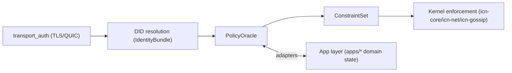

# ICN Architecture

**Status:** Living Document
**Version:** 0.1.0
**Last Updated:** 2025-12-10

**Abstract:**

> **ICN is a constraint engine: apps translate meaning into constraints; the kernel enforces constraints without understanding meaning.**

ICNd is a decentralized coordination substrate providing identity, trust computation, encrypted P2P transport, cooperative ledgering, contract execution, gossip-based synchronization, and a distributed compute fabric for federated cooperatives.

This document captures architectural decisions, design tradeoffs, and the reasoning behind ICNd's implementation.

---

## Design Principles

ICN is built on five foundational principles that guide all architectural decisions:

- **Local-first**: Nodes operate independently and reconcile via gossip, maximizing autonomy and resilience
- **Trust-native**: Security and coordination derive from social trust edges, not global consensus or proof-of-work
- **Deterministic compute**: Same inputs → same outputs → same ledger state on all nodes
- **Capability-based security**: Contracts cannot do anything they are not explicitly permitted to do
- **Human-governed**: Cooperative governance makes policy changes democratic and auditable

These principles ensure ICN remains decentralized, resilient, and aligned with cooperative values.

---

## Table of Contents

1. [Identity & Key Management](#1-identity--key-management)
    - 1.5 [SDIS Identity Extensions](#15-sdis-identity-extensions-experimental)
        - 1.5.9 [Zero-Knowledge Proofs](#159-zero-knowledge-proofs-phase-s4)
        - 1.5.10 [Credential Presentation](#1510-credential-presentation-phase-s5)
        - 1.5.11 [SDIS Governance](#1511-sdis-governance-phase-s6)
2. [Trust Graph Model](#2-trust-graph-model)
3. [Network Transport](#3-network-transport)
4. [Ledger Design](#4-ledger-design)
5. [Contract Execution (CCL)](#5-contract-execution-ccl)
6. [Gossip & Synchronization](#6-gossip--synchronization)
7. [Data Storage](#7-data-storage)
8. [Security Model](#8-security-model)
9. [Performance & Scalability](#9-performance--scalability)
10. [Operational Considerations](#10-operational-considerations)
11. [Distributed Compute Layer](#11-distributed-compute-layer)
    - 11.1 [Core Architecture](#111-core-architecture)
    - 11.2 [Scheduler Evolution](#112-scheduler-evolution-phase-16a-e)
    - 11.3 [Cooperative Scheduling Policies](#113-cooperative-scheduling-policies-phase-16e)
    - 11.4 [Example Policies](#114-example-policies)
    - 11.5 [API Surface](#115-api-surface)
    - 11.6 [Future Enhancements](#116-future-enhancements)
    - 11.7 [Decision Rationale](#117-decision-rationale)
    - 11.8 [Integration Summary](#118-integration-summary)
12. [Known Limitations & Future Work](#12-known-limitations--future-work)
13. [Node Morphogenesis](#13-node-morphogenesis)
    - 13.1 [Design Philosophy](#131-design-philosophy)
    - 13.2 [Principal vs Node Identity](#132-principal-vs-node-identity)
    - 13.3 [ServiceRole & Capabilities](#133-servicerole--capabilities)
    - 13.4 [NodeProfile Structure](#134-nodeprofile-structure)
    - 13.5 [Node Lifecycle (NodeStage)](#135-node-lifecycle-nodestage)
    - 13.6 [Role Inference](#136-role-inference)
    - 13.7 [Multi-Device & Shared Devices](#137-multi-device--shared-devices)
    - 13.8 [Integration with Existing Systems](#138-integration-with-existing-systems)
14. [Federation Layer](#14-federation-layer)
    - 14.1 [Overview](#141-overview)
    - 14.2 [Core Types](#142-core-types)
    - 14.3 [Trust Bridging](#143-trust-bridging-f2)
    - 14.4 [Credit Settlement](#144-credit-settlement-f3)
    - 14.5 [Federated DID Resolution](#145-federated-did-resolution-f5)
    - 14.6 [Gossip Topics](#146-gossip-topics)
    - 14.7 [Architecture](#147-architecture)
    - 14.8 [Metrics](#148-metrics)
    - 14.9 [Implementation Status](#149-implementation-status)

---

## How to Read This Document

**Sections 1–4** define ICN's identity, trust, transport, and ledger primitives—the foundational substrate.

**Sections 5–8** define contract execution, gossip synchronization, persistent storage, and the security model.

**Sections 9–10** outline performance considerations and operational best practices.

**Section 11** integrates all prior components into the distributed compute system, demonstrating how the substrate enables cooperative task execution.

---

## ICN Constraint Engine Model

ICN implements a **constraint enforcement architecture** where applications and governance systems translate domain semantics (trust relationships, governance rules, membership criteria) into generic constraints that the kernel enforces blindly.

```
┌─────────────────────────────────────────────────────────────────────┐
│                    CONSTRAINT ENFORCEMENT (Kernel)                   │
│  ┌─────────────────────────────────────────────────────────────────┐│
│  │  Transport  │  Replay  │  Rate     │  Capability │  Credit    │ ││
│  │   Auth      │  Guard   │  Limiter  │   Gate      │  Gate      │ ││
│  │  (verify)   │ (reject) │  (apply)  │   (check)   │  (check)   │ ││
│  └─────────────────────────────────────────────────────────────────┘│
│                                                                      │
│   Kernel enforces ConstraintSet values. Kernel does NOT decide them. │
└─────────────────────────────────────────────────────────────────────┘
         ▲              ▲           ▲            ▲           ▲
         │              │           │            │           │
    ConstraintSet {
      rate_limit: 20/s,      // ← value from PolicyOracle
      credit_ceiling: 1000,  // ← value from PolicyOracle
      capabilities: [...]    // ← value from PolicyOracle
    }
         │              │           │            │           │
┌────────┴──────────────┴───────────┴────────────┴───────────┴────────┐
│                      POLICY ORACLES (Apps)                           │
│                                                                      │
│   Apps/Governance DECIDE constraint values.                          │
│   Kernel ENFORCES them without knowing why.                          │
│  ┌──────────┐  ┌──────────┐  ┌──────────┐  ┌──────────┐            │
│  │  Trust   │  │  Ledger  │  │Governance│  │Membership│            │
│  │  Oracle  │  │  Oracle  │  │  Oracle  │  │  Oracle  │            │
│  └──────────┘  └──────────┘  └──────────┘  └──────────┘            │
└─────────────────────────────────────────────────────────────────────┘
```

### Key Distinction: Mechanism vs. Policy

The constraint engine model distinguishes between **enforcement mechanisms** (kernel) and **constraint values** (apps/governance):

| | Kernel (Hard) | Apps/Governance (Meta) |
|---|---|---|
| **Rate limiting** | Mechanism exists | Values decided (20/s vs 100/s) |
| **Credit gating** | Mechanism exists | Ceiling decided (1000 vs 5000) |
| **Capability gating** | Mechanism exists | Grants decided |
| **Replay guard** | Mechanism exists | N/A (no tunable values) |
| **Transport auth** | Mechanism exists | N/A (no tunable values) |

**Critical Property:**
- Governance can change **what** the rate limit is (e.g., from 20/s to 100/s)
- Governance **cannot** remove **that** rate limiting exists (enforcement mechanism is fixed)

This separation ensures the kernel remains predictable and auditable while allowing cooperative governance to adapt policies to changing needs.

### Component Organization

While the constraint engine model describes the **conceptual architecture**, the actual implementation organizes components into these functional areas:

- **Identity (§1)**: DID, Ed25519, keystore
- **Trust Graph (§2)**: Web-of-participation scores (→ Policy Oracle)
- **Transport (§3)**: QUIC/TLS, mDNS, NAT traversal (→ Kernel)
- **Ledger (§4)**: Mutual credit, double-entry (→ Policy Oracle)
- **Contracts (§5)**: CCL interpreter, capabilities (→ Policy Oracle)
- **Gossip (§6)**: Causal sync, anti-entropy (→ Kernel)
- **Storage (§7)**: Sled, persistent state
- **Security (§8)**: Production hardening
- **Distributed Compute (§11)**: Trust-gated task execution (→ Policy Oracle)

**Note on terminology:** You'll see references to "layers" throughout this document in a descriptive sense (e.g., "transport layer security", "network layer"). This is legitimate technical terminology. What ICN is **not** is an OSI-like strictly layered stack where higher layers can only access lower layers through defined interfaces. Instead, ICN uses the constraint engine model where policy oracles (apps) translate domain semantics into constraints that the kernel enforces.

---

## Kernel/App Separation

**Goal:** Remove direct domain imports from kernel crates (`icn-core`, `icn-net`, `icn-gossip`) by routing all domain knowledge through boundary traits in `icn-kernel-api`, implemented by adapters in `apps/*`.

### Definition

- **Kernel layer** (pure enforcement):
  - Networking transport, gossip plumbing, actor runtime, constraint enforcement, message validation.
  - Knows: DIDs, cert bindings, timestamps, constraints, capabilities, resource budgets.
  - Does **not** know: trust graphs, governance rules, ledger semantics, compute placement rules, community/entity domain objects.

- **App layer** (meaning + policy):
  - Trust graph, governance, ledger, CCL semantics, compute policy, federation/domain mappings, gateways/RPC.
  - Implements boundary traits and converts domain state into kernel constraints.

### Core flow

- `transport_auth` authenticates a connection and yields a DID.
- DID becomes the sole identity handle used by the kernel.
- Kernel asks `PolicyOracle` for constraints and authorization decisions.
- Kernel enforces those constraints without knowing why they exist.



### Pass 7 invariants as kernel-level contracts

These invariants must remain true regardless of app semantics:

1. **Identity ↔ Transport ↔ Policy**
   - Transport auth yields a DID bound to the certificate identity.
   - All policy decisions are made against that DID.
   - Kernel rejects any mismatch between transport identity and claimed identity.

2. **Misbehavior ↔ Trust ↔ Rate limits**
   - Kernel records violations + evidence; app converts to reputation/trust updates.
   - Enforcement is via constraints (quarantine/ban/rate limits), not domain interpretation.

3. **Time validation and replay protection**
   - Kernel validates timestamps via `ClockSync` windowing.
   - Replay rejection must preserve liveness during drift events.

4. **Store ↔ Snapshot ↔ Encoding integrity**
   - Kernel requires versioned, canonical encodings for state transitions/snapshots.
   - Snapshot boundaries align with transactional store writes.
   - Unknown versions must fail fast with a documented upgrade path.

5. **Privacy ↔ Observability budget**
   - Metrics/logging must not leak topic membership or sensitive identifiers.
   - Observability is an explicit budget with redlines.

6. **ZKP ↔ Revocation ↔ Governance**
   - Kernel verifies proofs deterministically and versioned.
   - Issuer roots/revocation state is app-owned but enforced through kernel checks.

7. **PQ dual-stack transition**
   - During migration, verification must accept old+new per negotiated capability.
   - Deprecation is governance-controlled, policy-enforced.

### Encoding and versioning policy

- Versioned encodings must be canonical and stable across releases.
- Snapshot and state payloads must use versioned encodings with explicit negotiation rules.
- Unknown versions fail fast with a documented upgrade path (no silent fallback).

### Migration principle

**Kernel compiles with zero direct imports of domain crates.**
All domain dependency crosses the boundary via `icn-kernel-api` traits.

### Boundary map (template)

| Kernel crate/file | Current forbidden import | Why it’s a violation | Replacement boundary trait | Adapter implementation |
| --- | --- | --- | --- | --- |
| `icn-core/src/policy.rs` | `icn_trust::*` | kernel reading trust semantics | `PolicyOracle`, `PolicyRequest`, `ConstraintSet` | `apps/trust::oracle` |
| `icn-core/src/identity.rs` | `icn_trust::*` | identity actor doing trust logic | `PolicyOracle` call with DID | `apps/trust::oracle` |
| `icn-core/src/supervisor/init_trust.rs` | `icn_trust::*` | kernel creating trust graph | `KernelInitHooks` or injected oracle | `apps/trust::init` |
| `icn-net/src/tls.rs` | `icn_trust::*` | TLS verifier using trust graph | `PolicyOracle` evaluate(DID, TransportContext) | `apps/trust::oracle` |
| `icn-gossip/src/gossip.rs` | legacy `TrustClass` | gossip depends on trust semantics | `ConstraintSet` (rate/topic gates) | `apps/trust::constraints` |

**Definition of done:** each row ends with “kernel no longer imports X; only imports `icn-kernel-api` and foundation crates.”

## 1. Identity & Key Management

Identity is the foundation of all authentication, trust computation, and ledger authorship in ICN. Every node, contract participant, and transaction is tied to a cryptographically verifiable decentralized identifier (DID).

### 1.1 DID Format

**Current:** `did:icn:<base58btc-ed25519-pubkey>`

**Decision: Single canonical public key per identity (v1)**

**Rationale:**
- Simplicity: DID = public key = identity (direct mapping)
- No registry: Self-certifying identifiers
- Verifiable: Any peer can verify signatures without infrastructure
- Compatible with existing Ed25519 tooling

**Tradeoffs:**
- ✅ Simple, auditable
- ✅ No central registry dependency
- ❌ Key compromise = identity loss (mitigated by rotation protocol)
- ❌ No key hierarchy (can add later)

**Future:**
- v2: DID documents with multiple keys (signing, encryption, delegation)
- v3: HD wallet support for key derivation

---

### 1.2 Key Derivation

**Options:**

| Approach | Pros | Cons |
|----------|------|------|
| **Single key** | Simple, clear ownership | No sub-keys, rotation is identity change |
| **HD wallet (BIP32-like)** | Derive unlimited keys from seed | Complexity, seed compromise = total loss |
| **Master + derived** | Balance of simplicity and flexibility | Requires rotation protocol |

**Decision: Single master key + rotation protocol (v1)**

**Rationale:**
- Start simple: one identity = one key
- Implement robust key rotation with signed transition records
- Add HD derivation in v2 when use cases emerge (e.g., per-contract keys)

**Implementation:**
```rust
pub struct KeyRotation {
    old_did: Did,
    new_did: Did,
    timestamp: u64,
    reason: RotationReason, // Scheduled, Compromised, Upgrade
    signature_old: Signature, // Signed by old key
    signature_new: Signature, // Signed by new key
}
```

---

### 1.3 Key Storage

**Options:**

| Approach | Pros | Cons | Use Case |
|----------|------|------|----------|
| **Age-encrypted file** | Simple, portable | No hardware protection | Development, personal nodes |
| **OS keychain** | OS-managed, encrypted at rest | Platform-specific | Desktop apps |
| **Hardware security module** | Strongest protection | Requires hardware, expensive | Production, high-value |
| **TPM chip** | Built into modern hardware | Complex setup | Server deployments |

**Decision: Age-encrypted file (v1), pluggable for HSM/TPM (v2)**

**Rationale:**
- Age encryption is simple, auditable (https://age-encryption.org/)
- Passphrase or YubiKey PIV slot for unlock
- File-based is portable across machines
- Clear migration path to HSM for production

**Implementation:**
```rust
pub trait KeyStore: Send + Sync {
    fn unlock(&mut self, passphrase: &[u8]) -> Result<()>;
    fn lock(&mut self);
    fn is_locked(&self) -> bool;
    fn get_keypair(&self) -> Result<&KeyPair>;
    fn rotate(&mut self, new_keypair: KeyPair) -> Result<KeyRotation>;
}

pub struct AgeKeyStore { /* ... */ }
pub struct HsmKeyStore { /* ... */ }  // Future
```

**Storage path:** `$ICN_DATA_DIR/identity/keypair.age`

---

### 1.4 Multi-Device Identity

**Problem:** Same identity across laptop, phone, server?

**Options:**

| Approach | Pros | Cons |
|----------|------|------|
| **Shared key** | Simple, truly same identity | Dangerous key duplication |
| **Delegate keys** | Separate keys per device, revocable | Requires delegation protocol |
| **Multi-sig** | No single point of failure | Complex, requires quorum |

**Decision: Delegate keys via signed capability grants (v2)**

**Rationale:**
- Primary key signs delegation to device keys
- Each device key has limited capabilities (time-bound, scope-bound)
- Revocation: primary key publishes revocation signed statement
- Preserves single canonical identity while allowing safe multi-device

**Future Implementation:**
```rust
pub struct Delegation {
    primary_did: Did,
    delegate_did: Did,
    capabilities: Vec<Capability>, // Sign contracts, read ledger, etc.
    expires_at: u64,
    signature: Signature, // Signed by primary key
}
```

**v1 compromise:** Manual key export/import with clear warnings

---

### 1.5 SDIS Identity Extensions (Experimental)

**Status:** Phase S1-S5 complete, governance integration in progress

ICN is evolving toward SDIS (Sovereign Digital Identity System) to provide:
- **Permanent anchor-based identity**: Key rotation without identity change
- **Post-quantum signatures**: Defense-in-depth against quantum threats
- **Sybil resistance**: VUI-based uniqueness verification

#### 1.5.1 Architecture Overview

```
┌─────────────────────────────────────────────────────────────┐
│                         Anchor                               │
│  ┌─────────────────────────────────────────────────────────┐│
│  │ ID: H(VUI || genesis)                                    ││
│  │ Created: timestamp                                       ││
│  │ Pathway: enrollment method                               ││
│  │ VUI Commitment: H(VUI)                                   ││
│  └─────────────────────────────────────────────────────────┘│
│                           │                                  │
│                           ▼                                  │
│  ┌─────────────────────────────────────────────────────────┐│
│  │              KeyBundle v1 (current)                      ││
│  │  Ed25519 + ML-DSA hybrid signatures                      ││
│  │  X25519 encryption keys                                  ││
│  └─────────────────────────────────────────────────────────┘│
│                           │                                  │
│                           ▼                                  │
│  ┌─────────────────────────────────────────────────────────┐│
│  │              KeyBundle v2 (after rotation)               ││
│  │  New hybrid keys, same anchor                            ││
│  └─────────────────────────────────────────────────────────┘│
└─────────────────────────────────────────────────────────────┘
```

#### 1.5.2 Anchor-Based Identity

**Problem:** Traditional DIDs couple identity to public key, requiring identity change on key rotation.

**Solution:** Anchors are permanent identity roots derived from VUI (Verifiable Unique Identifier):
- Anchor ID = H(VUI || genesis_random)
- Keys bound to anchor via KeyBundles
- Key rotation preserves anchor identity

```rust
pub struct Anchor {
    id: [u8; 32],           // Permanent identifier
    vui_commitment: [u8; 32], // H(VUI) for recovery verification
    pathway: EnrollmentPathway, // How identity was verified
    created_at: u64,
}

pub enum EnrollmentPathway {
    GovernmentId { country: [u8; 2], doc_type_hash: [u8; 8] },
    OrganizationalSponsorship { org_did: Did, org_internal_id_hash: [u8; 16] },
    BiometricCommitment { template_hash: [u8; 32] },
    WebOfTrust { vouchers: Vec<Did>, vouched_at: u64 },
    Genesis { reason: String }, // Bootstrap/testing
}
```

#### 1.5.3 Post-Quantum Hybrid Signatures

**Threat Model:** Quantum computers could break Ed25519 within ICN's operational lifetime.

**Solution:** Hybrid signatures combining classical and post-quantum algorithms:

| Component | Classical | Post-Quantum |
|-----------|-----------|--------------|
| Signature | Ed25519 (64 bytes) | ML-DSA-65 (3293 bytes) |
| Public Key | 32 bytes | 1952 bytes |
| **Total** | ~100 bytes | ~5.2 KB |

**Security:** Both signatures must verify—attacker must break both algorithms.

```rust
// icn-crypto-pq crate
pub struct HybridSignature {
    classical: Vec<u8>,  // Ed25519
    pq: Vec<u8>,         // ML-DSA
}

pub struct HybridKeypair {
    classical_signing: SigningKey,
    pq_keypair: MlDsaKeypair,
}

impl HybridKeypair {
    pub fn sign(&self, message: &[u8]) -> HybridSignature;
    pub fn sign_classical_only(&self, message: &[u8]) -> Signature; // Ephemeral use
}
```

#### 1.5.4 KeyBundle Rotation

KeyBundles contain rotatable cryptographic keys bound to an anchor:

```rust
pub struct KeyBundle {
    anchor: Anchor,
    version: u32,           // Monotonically increasing
    hybrid_keypair: HybridKeypair,
    x25519_secret: [u8; 32], // Encryption
    issued_at: u64,
    expires_at: Option<u64>,
}

pub struct RotationRequest {
    anchor_id: [u8; 32],
    old_version: u32,
    new_version: u32,       // Must be old + 1
    new_public: KeyBundlePublic,
    old_signature: HybridSignature, // Signed by old bundle
    reason: Option<RotationReason>,
}
```

**Rotation Protocol:**
1. Generate new KeyBundle with incremented version
2. Sign rotation request with old KeyBundle
3. Publish rotation event to gossip network
4. Stewards verify and attest to the rotation
5. Old KeyBundle enters revocation period
6. New KeyBundle becomes active

#### 1.5.5 VUI (Verifiable Unique Identifier)

**Problem:** Sybil attacks—one person creating many identities.

**Solution:** VUI computed via threshold PRF by steward network:

```rust
// User provides identity data (hashed locally, never transmitted)
let id_hash = IdDataHash::from_data(&identity_document, pathway);

// Stewards compute PRF partials (threshold secret sharing)
let partials: Vec<PrfPartial> = stewards.map(|s| s.compute_partial(&id_hash));

// User combines partials to get VUI
let vui = Vui::from_partials(&partials)?;

// VUI commitment stored in anchor (privacy-preserving)
let commitment = vui.commitment();
```

**Properties:**
- Same person → same VUI (deterministic via threshold PRF)
- VUI reveals nothing about person (PRF output)
- Unlinkable without steward pepper shares
- Distributed trust—no single steward knows full pepper

#### 1.5.6 Keystore v4 Format

The keystore now supports SDIS with v4 format:

```rust
struct StoredKeyV4 {
    version: u8,  // 4
    // Legacy fields (v3 compatibility)
    secret_bytes: [u8; 32],
    did_document: DidDocument,
    // ...

    // SDIS additions
    anchor: Option<Anchor>,
    keybundles: Vec<StoredKeyBundleV4>,
    current_keybundle_version: u32,
}
```

**API:**
```rust
impl AgeKeyStore {
    // SDIS initialization
    pub fn init_sdis(&mut self, anchor: Anchor, passphrase: &[u8]) -> Result<&KeyBundle>;

    // KeyBundle rotation
    pub fn rotate_keybundle(&mut self, passphrase: &[u8]) -> Result<&KeyBundle>;

    // Accessors
    pub fn get_anchor(&self) -> Option<&Anchor>;
    pub fn get_current_keybundle(&self) -> Result<&KeyBundle>;
    pub fn has_sdis(&self) -> bool;
}
```

**Migration:** Keystore auto-detects format and loads appropriately (v1→v2→v2.1→v3→v4).

#### 1.5.7 Implementation Status

| Component | Crate | Status |
|-----------|-------|--------|
| ML-DSA signatures | icn-crypto-pq | ✅ Complete |
| ML-KEM key exchange | icn-crypto-pq | ✅ Complete |
| Hybrid signatures | icn-crypto-pq | ✅ Complete |
| Threshold PRF | icn-crypto-pq | ✅ Complete |
| Anchor types | icn-identity | ✅ Complete |
| KeyBundle | icn-identity | ✅ Complete |
| VUI types | icn-identity | ✅ Complete |
| Keystore v4 | icn-identity | ✅ Complete |
| Steward network | icn-steward | ✅ Phase S3.1 |
| Zero-knowledge proofs | icn-zkp | ✅ Phase S4 |
| Credential presentation | icn-gateway | ✅ Phase S5 |
| SDIS governance | icn-governance | ✅ Phase S6 |
| Enrollment flow | icn-enrollment | 🚧 Planned |

#### 1.5.8 Steward Network (Phase S3)

The steward network provides essential services for SDIS including VUI computation, enrollment ceremonies, and key recovery.

**Architecture:**
```
┌─────────────────────────────────────────────────────────────────┐
│                      Steward Network                             │
├─────────────────────────────────────────────────────────────────┤
│                                                                  │
│  ┌──────────────┐  ┌──────────────┐  ┌──────────────┐           │
│  │  Steward A   │  │  Steward B   │  │  Steward C   │  ...      │
│  │              │  │              │  │              │           │
│  │ PepperShare  │  │ PepperShare  │  │ PepperShare  │           │
│  │     [1]      │  │     [2]      │  │     [3]      │           │
│  └──────┬───────┘  └──────┬───────┘  └──────┬───────┘           │
│         │                 │                 │                    │
│         └─────────────────┼─────────────────┘                    │
│                           │                                      │
│                    ┌──────▼───────┐                              │
│                    │ VUI Registry │                              │
│                    │   (Bloom)    │                              │
│                    └──────────────┘                              │
└─────────────────────────────────────────────────────────────────┘
```

**Core Components:**

| Component | Purpose |
|-----------|---------|
| `StewardProfile` | Steward identity, status, jurisdiction, stats |
| `EnrollmentToken` | Blind signature-based enrollment credentials |
| `VuiRegistry` | Bloom filter + exact set for uniqueness checks |
| `EnrollmentCeremony` | Threshold VUI computation workflow |
| `RecoveryCeremony` | Social recovery attestation workflow |

**Steward Profile:**
```rust
pub struct StewardProfile {
    steward_did: Did,           // Node identity
    citizen_did: Did,           // Operator identity
    status: StewardStatus,      // Active/Suspended/Revoked/Pending
    jurisdiction_tier: JurisdictionTier,  // Tier1/Tier2/Tier3
    bond_amount: i64,           // Stake for honest behavior
    region: String,             // ISO 3166-1 alpha-2
    stats: StewardStats,        // Operational metrics
    token_signing_key: Vec<u8>, // For enrollment tokens
    pepper_share_commitment: [u8; 32], // Commitment to pepper share
}
```

**Enrollment Flow:**
1. User generates VUI commitment from identity data
2. User presents proof-of-personhood to steward
3. Steward initiates enrollment ceremony
4. Threshold of stewards contribute pepper shares
5. VUI computed and checked against registry (Bloom filter)
6. If unique, token issued via blind signature
7. Token unblinded by user (unlinkable to issuance)

**Blind Signature Tokens:**
```rust
pub struct EnrollmentToken {
    token_id: [u8; 32],        // Unique identifier
    signature: Vec<u8>,        // Unblinded signature
    issuing_steward: Did,      // Public knowledge
    issued_at: u64,
    expires_at: u64,           // Default: 7 days
    vui_commitment: [u8; 32],  // Links to identity
}
```

**Recovery Ceremony:**
```rust
pub enum RecoveryPhase {
    WaitingForAttestations,  // Collecting steward votes
    VerifyingEvidence,       // ZK proof verification
    BindingKeys,             // New keys → anchor
    RevokingOldKeys,         // Old keys invalidated
    Completed,
    Failed,
    Rejected,
}
```

**Gossip Topics:**
- `steward:announce` - Steward status broadcasts
- `steward:vui-sync` - VUI registry synchronization
- `steward:enrollment` - Enrollment ceremony coordination
- `steward:recovery` - Recovery ceremony coordination

**Configuration:**
```rust
pub struct StewardConfig {
    vui_threshold: u32,              // Default: 3-of-5
    vui_total_shares: u32,
    token_validity_secs: u64,        // Default: 7 days
    bloom_expected_items: usize,     // Default: 1M
    bloom_false_positive_rate: f64,  // Default: 0.0001
    min_bond_amount: i64,            // Default: 1000
    heartbeat_interval_secs: u64,    // Default: 30
}
```

#### 1.5.9 Zero-Knowledge Proofs (Phase S4)

The ZKP system enables privacy-preserving credential verification using STARK proofs.

**Core Components:**

| Component | Purpose |
|-----------|---------|
| `AirConstraint` | Polynomial constraints for STARK prover |
| `ProofGenerator` | Creates zero-knowledge proofs from witness data |
| `ProofVerifier` | Verifies proofs without learning private data |
| `ProofType` | Attribute proof types (age, citizenship, membership) |

**Proof Types:**
```rust
pub enum ProofType {
    AgeAtLeast { threshold: u8 },
    Citizenship { country_code: [u8; 2] },
    Membership { org_did: Did },
    NonRevocation,
}
```

**STARK Configuration:**
- Security level: 128 bits
- Field: Goldilocks (64-bit prime)
- Blowup factor: 4
- FRI folding: 4

#### 1.5.10 Credential Presentation (Phase S5)

The credential presentation system provides three verification levels for identity credentials.

**Architecture:**
```
┌─────────────────────────────────────────────────────────────────┐
│                    Verification Levels                           │
├─────────────────────────────────────────────────────────────────┤
│  Level 1: QR Scan        │ <2s   │ Offline │ Ed25519           │
│  Level 2: NFC/BLE        │ ~5s   │ Offline │ Hybrid Ed+ML-DSA  │
│  Level 3: Network        │ ~10s  │ Online  │ STARK proofs      │
└─────────────────────────────────────────────────────────────────┘
```

**QR Encoding (137 bytes):**

| Offset | Size | Field |
|--------|------|-------|
| 0-1 | 2 | Magic bytes "IC" |
| 2 | 1 | Version |
| 3 | 1 | Proof type |
| 4-19 | 16 | Truncated anchor |
| 20-51 | 32 | Ephemeral public key |
| 52-55 | 4 | Relative expiry |
| 56-71 | 16 | Nonce |
| 72-135 | 64 | Ed25519 signature |
| 136 | 1 | Channels bitmap |

**Ephemeral Proof System:**
```rust
pub struct EphemeralProof {
    anchor_id: [u8; 16],      // Truncated for QR
    ephemeral_pk: [u8; 32],   // Session key
    proof_type: ProofType,
    expires_at: u32,          // Relative seconds
    nonce: [u8; 16],          // Replay protection
    signature: [u8; 64],      // Ed25519
    channels: u8,             // Available upgrade paths
}

pub struct EphemeralBinding {
    proof_nonce: [u8; 16],
    anchor_id: [u8; 32],      // Full anchor
    ephemeral_pk: [u8; 32],
    hybrid_signature: Vec<u8>, // Ed25519 + ML-DSA
}
```

**Security Properties:**
- Replay protection via 16-byte nonces and LRU cache
- Configurable expiry (max 24 hours)
- Post-quantum security at Level 2+
- Zero-knowledge proofs at Level 3

#### 1.5.11 SDIS Governance (Phase S6)

SDIS governance enables community oversight of the steward network and identity system.

**Proposal Types:**
```rust
pub enum SdisProposal {
    AppointSteward { candidate: Did, sponsors: Vec<Did>, ... },
    RemoveSteward { steward: Did, reason: String, ... },
    SanctionSteward { steward: Did, penalty: StewardPenalty, ... },
    ReconfirmSteward { steward: Did, new_term_end: u64, ... },
    ModifyThreshold { threshold_type: ThresholdType, ... },
    ApproveAuthority { authority: InstitutionalAuthority },
    RevokeAuthority { authority_did: Did, reason: String, ... },
    RevocationAppeal { target: RevocationTarget, ... },
    SuspendSteward { steward: Did, reason: String, duration: u64 },
    ReinstateSteward { steward: Did, reason: String },
    UpdateJurisdictionTier { steward: Did, new_tier: JurisdictionTier, ... },
    ForceKeyRotation { steward: Did, reason: String },
}
```

**Voting Requirements:**

| Proposal Type | Quorum | Approval | Timeout |
|--------------|--------|----------|---------|
| AppointSteward | 60% | 66% | 14 days |
| RemoveSteward | 70% | 75% | 7 days |
| SanctionSteward | 60% | 66% | 3 days |
| ModifyThreshold | 80% | 80% | 21 days |
| RevocationAppeal | 50% | 60% | 30 days |

**Penalty Types:**
- Warning (recorded but no action)
- FineCredits (deduct from bond)
- SuspendDays (temporary suspension)
- RevokeBond (permanent removal)

---

## 2. Trust Graph Model

The trust graph turns social relationships into machine-relevant security primitives. It gates access to resources, prioritizes computation, and resists Sybil attacks—all without requiring global consensus on reputation.

### 2.1 Trust Representation

**Decision: Directed labeled trust edges with evidence chains**

**Graph Structure:**
```rust
pub struct TrustEdge {
    source: Did,        // Who trusts
    target: Did,        // Who is trusted
    labels: Vec<String>, // "partner", "supplier", "validator"
    score: f64,         // 0.0 to 1.0
    evidence: Vec<EvidenceRef>, // Links to contracts, attestations
    expires_at: Option<u64>,
    created_at: u64,
}

pub struct Evidence {
    id: ContentHash,
    kind: EvidenceKind, // ContractFulfilled, Attestation, ThirdPartyVouch
    data: Vec<u8>,
    signatures: Vec<(Did, Signature)>,
}
```

**Rationale:**
- **Directed:** Alice trusts Bob ≠ Bob trusts Alice
- **Labeled:** Context matters ("trust as accountant" ≠ "trust as mechanic")
- **Evidence-based:** Trust isn't arbitrary; it's backed by provable interactions
- **Expiring:** Trust decays without refresh

---

### 2.2 Trust Computation

**Decision: Local computation with transitive trust propagation (PageRank-like)**

**Algorithm (v1):**
```
TrustScore(A → B) =
    DirectTrust(A → B) * 0.7 +
    TransitiveTrust(A → C → B) * 0.3

where:
    DirectTrust = weighted avg of A's edges to B (by recency, evidence strength)
    TransitiveTrust = Σ(TrustScore(A → C) * TrustScore(C → B)) / N
```

**Properties:**
- **Local computation:** Each node computes trust from its perspective
- **Transitive:** "Friend of a trusted friend" has some trust
- **Asymmetric:** Different nodes see different trust scores
- **Attack-resistant:** Sybil nodes have low trust unless vouched by existing trusted nodes

**Trust Classes (operational gates):**
```rust
pub enum TrustClass {
    Isolated,    // Score 0.0-0.1: No interaction
    Known,       // Score 0.1-0.4: Seen, but not trusted
    Partner,     // Score 0.4-0.7: Regular interaction
    Federated,   // Score 0.7-1.0: High trust, extended rights
}
```

**Rationale:**
- Not consensus-based (no global truth)
- Resistant to Sybil: new identities start with zero trust
- Contextual: trust for one purpose doesn't imply trust for all

---

### 2.3 Bootstrap Trust

**Problem:** How does a new node establish initial trust?

**Decision: Manual vouching + invite codes + proof-of-work bootstrap**

**Approaches:**

1. **Manual Introduction (primary):**
   - Existing trusted node creates signed `IntroductionVoucher`
   - New node presents voucher to network
   - Voucher grants initial trust score (e.g., 0.3) from introducer's perspective

2. **Invite Codes (secondary):**
   - Pre-generated by community nodes
   - Limited use (1-5 redemptions)
   - Provides minimal trust (0.1) for initial discovery

3. **Proof-of-Work (fallback):**
   - New node can solve computational puzzle
   - Proves Sybil resistance (cost per identity)
   - Grants minimal trust (0.05) for cold start

**Implementation:**
```rust
pub struct IntroductionVoucher {
    introducer: Did,
    introducee: Did,
    initial_trust: f64,
    message: String, // "Alice from the Brooklyn Cooperative"
    expires_at: u64,
    signature: Signature,
}
```

**Anti-patterns:**
- ❌ Open registration (Sybil vulnerability)
- ❌ Pay-to-join (plutocracy)
- ❌ Global reputation (centralization)

---

### 2.4 Attack Resistance

**Threats & Mitigations:**

| Attack | Mitigation |
|--------|------------|
| **Sybil (fake identities)** | Transitive trust; new DIDs start with zero trust |
| **Eclipse (isolate node)** | Multiple discovery mechanisms (mDNS, rendezvous, manual) |
| **Reputation farming** | Evidence-based trust; contracts must be fulfilled |
| **Trust graph poisoning** | Local computation; no global consensus on trust |
| **Key compromise** | Rotation protocol; evidence chains remain verifiable |

**Monitoring:**
- Nodes log trust score changes
- Rapid trust oscillations flag suspicious behavior
- Community visibility into trust edges (opt-in)

---

## 3. Network Transport

Networking provides authenticated, encrypted, NAT-resistant communication between peers. It is the backbone for all gossip, ledger sync, contract distribution, and distributed compute flows.

### 3.1 Transport Protocol

**Decision: QUIC with TLS 1.3 mutual authentication**

**Rationale:**
- **QUIC advantages:**
  - Multiplexed streams (no head-of-line blocking)
  - Built-in 0-RTT connection resumption
  - Better congestion control than TCP
  - NAT-friendly (UDP-based)

- **TLS 1.3 mutual auth:**
  - Certificate bound to DID (public key)
  - Mutual authentication (both peers verify)
  - Forward secrecy
  - Standard, audited

**Important distinction**: TLS verifies cryptographic identity only (proves the peer controls the DID's private key). Authorization decisions (whether this DID can publish, execute contracts, claim tasks, etc.) are enforced at higher layers via the trust graph. This separation allows flexible, context-dependent access control without coupling authentication to authorization.

**Stack:**
```
Application (CCL, Ledger sync, Gossip)
    ↓
QUIC streams (multiplexed, flow-controlled)
    ↓
TLS 1.3 (encryption, authentication)
    ↓
UDP (transport)
```

**Alternatives considered:**
- ❌ TCP: head-of-line blocking, slower handshake
- ❌ Noise Protocol: great, but QUIC+TLS is more mature
- ⚠️ Hybrid: Could add Noise inside QUIC for additional identity binding (v2)

---

### 3.2 Peer Discovery

**Decision: Multi-layered discovery (LAN + WAN + Manual)**

**Mechanisms:**

| Layer | Protocol | Use Case | Trust |
|-------|----------|----------|-------|
| **LAN** | mDNS | Local network discovery | Low (verify via TLS) |
| **WAN** | Rendezvous servers | Internet-wide bootstrap | Medium (signed peer lists) |
| **Manual** | Config file / CLI | Explicit peering | High (admin intent) |
| **Gossip** | Peer exchange (PEX) | Network expansion | Low (verify via trust graph) |

**mDNS (LAN):**
```
Service: _icn._udp.local
TXT records:
  did=did:icn:z...
  version=0.1.0
  capabilities=ledger,contracts
  port=4433
```

**Rendezvous (WAN):**
- Operated by community (anyone can run one)
- Return signed peer list with timestamps
- Clients verify signatures against known rendezvous DID keys
- No single point of failure (multiple rendezvous in config)

**Implementation:**
```rust
pub struct PeerInfo {
    did: Did,
    addrs: Vec<SocketAddr>,
    capabilities: HashSet<String>,
    last_seen: u64,
}

pub enum DiscoverySource {
    Mdns,
    Rendezvous(Did),
    Manual,
    Gossip(Did), // Learned from peer X
}
```

---

### 3.3 NAT Traversal

**Decision: Hole punching + relay fallback**

**Approach:**

1. **Direct connection (best case):**
   - Both peers have public IPs or are LAN-local
   - Direct QUIC connection

2. **Hole punching (common case):**
   - Use STUN-like protocol to discover public IP/port
   - Coordinate simultaneous UDP send (punch through NAT)
   - ~80% success rate

3. **Relay (fallback):**
   - Community-run relay nodes
   - Encrypt end-to-end; relay only forwards packets
   - Relay nodes selected from high-trust peers
   - Temporary (establish, then try hole punch in background)

**Relay incentives:**
- Relay operators gain trust score
- Nodes can donate bandwidth to relay pool
- Relay usage is temporary (encourage direct connections)

**Implementation:**
```rust
pub struct ConnectionPath {
    peer: Did,
    path: ConnectionType,
}

pub enum ConnectionType {
    Direct(SocketAddr),
    Relayed { via: Did, relay_addr: SocketAddr },
    Failed(String),
}
```

---

### 3.4 Connection Management

**Decision: Trust-gated connection limits with backpressure**

**Limits (per node):**
```rust
pub struct ConnectionLimits {
    max_total: usize,      // 500 (adjustable)
    max_per_trust_class: HashMap<TrustClass, usize>,
    // Isolated: 10, Known: 50, Partner: 200, Federated: 240

    max_streams_per_peer: usize, // 32
    max_inflight_bytes: usize,   // 10 MB per peer
}
```

**Rationale:**
- Prevent resource exhaustion
- Prioritize trusted peers
- Shed load under attack (drop Isolated/Known first)
- Backpressure propagates to application layer

**Health checks:**
- Periodic ping/pong (30s interval)
- Idle timeout (5 min for Isolated, 30 min for Partners)
- Detect dead connections, free resources

---

## 4. Ledger Design

The ledger encodes cooperative economic reality as an append-only, tamper-evident Merkle-DAG. It enables mutual credit, transparent accounting, and eventual consistency without requiring consensus on global state.

### 4.1 Data Model

**Decision: Double-entry append-only ledger with Merkle-DAG structure**

**Why double-entry?**
- Conservation law: Σ debits = Σ credits (every transaction)
- Mutual credit requires balanced books
- Auditable: any peer can verify invariants

**Why Merkle-DAG?**
- Content-addressable: each entry has unique hash
- Tamper-evident: changing history breaks hashes
- Forkable: offline work creates branches, merge later
- Enables efficient sync (exchange hashes, fetch missing)

**Structure:**
```rust
pub struct JournalEntry {
    id: ContentHash,          // SHA-256 of canonical serialization
    timestamp: u64,           // Local timestamp (not consensus)
    author: Did,              // Who created this entry
    contract_ref: Option<ContentHash>, // Which contract authorized this

    accounts: Vec<AccountDelta>,

    parents: Vec<ContentHash>, // Previous entries (Merkle-DAG links)
    signature: Signature,      // Signed by author
}

pub struct AccountDelta {
    account_id: Did,          // Could be person, organization, resource
    currency: String,         // "USD", "hours", "kwh"
    debit: Option<i64>,       // Positive values
    credit: Option<i64>,      // Positive values
}

// Invariant enforced at creation:
// Σ debits == Σ credits (per currency)
```

**Example Transaction:**
```
Alice delivers 10 hours of web design to Bob's coop.

Entry:
  debits:  Alice/hours: 10
  credits: BobCoop/hours: 10

Alice's balance: +10 hours (owed to her)
BobCoop's balance: -10 hours (owes)
```

---

### 4.2 Conflict Resolution

**Problem:** Two nodes create conflicting entries while offline.

**Decision: Deterministic merge with constraint checking**

**Algorithm:**

1. **Detect fork:** Entry has multiple children for same parent
2. **Order canonically:** Sort by `(timestamp, author_did, entry_id)`
3. **Replay both branches:**
   - Compute balance after each branch
   - Check invariants (no overdraft beyond credit limits)
4. **Merge or quarantine:**
   - If both branches valid: merge (both applied)
   - If one invalid: discard invalid branch
   - If both invalid: quarantine, require manual resolution

**Contract-level rules:**
- Contracts can specify stricter merge rules
- E.g., "only one party can create entries" (no conflict possible)
- E.g., "sequential numbering required" (detect gaps)

**Quarantine:**
```rust
pub struct QuarantinedEntry {
    entry: JournalEntry,
    reason: QuarantineReason,
    conflicts_with: Vec<ContentHash>,
    resolution: Option<Resolution>, // Human or contract decision
}

pub enum QuarantineReason {
    InvariantViolation(String), // Overdraft, double-spend
    ConflictingTimestamp,
    InvalidSignature,
}
```

**Rationale:**
- Deterministic: all nodes reach same conclusion
- Conservative: preserve data, don't auto-delete
- Auditable: history of conflicts and resolutions

---

### 4.3 Currency Model

**Decision: Multi-currency with per-contract currency definitions (v1)**

**Rationale:**
- Different cooperatives use different units
  - Time banks: hours
  - Energy coops: kWh
  - Fiat-backed: USD/EUR
  - Resource credits: compute, storage

- Currency is just a string label
- No built-in exchange rates (contracts handle that)
- No global supply (each contract defines issuance)

**Implementation:**
```rust
pub struct Currency {
    symbol: String,       // "hours", "USD", "kwh"
    decimals: u8,         // Precision (e.g., 2 for cents)
    issuer: Option<Did>,  // Who can issue? None = mutual credit
}
```

**Mutual credit currencies:**
- No central issuer
- Created by transaction (balanced debit/credit)
- Can have credit limits per participant

**Asset-backed currencies:**
- Issuer holds reserves
- Can redeem for external asset
- Requires trusted issuer

**v2: Multi-issuer currencies with attestations**

---

### 4.4 Credit Limits

**Decision: Per-participant, per-currency limits set by contract**

**Mechanism:**
```rust
pub struct CreditLimit {
    participant: Did,
    currency: String,
    max_negative_balance: i64, // How much can they owe?
    max_positive_balance: i64, // How much can be owed to them?
    set_by: Did,               // Who set this limit?
    effective_date: u64,
}
```

**Who sets limits?**
- **Mutual agreement:** Both parties sign
- **Contract rules:** Automatic based on participation
- **Community vote:** Governance process

**Dynamic adjustment:**
- Limits can increase with trust score
- Proven track record → higher credit line
- Contract can automate: "10% increase per fulfilled contract"

**Default limits (conservative):**
- New participants: ±100 units
- Increases require explicit action

**Rationale:**
- Prevent runaway debt
- Encourage accountability
- Reflects real-world credit relationships

---

### 4.5 Privacy

**Decision: Semi-private by default, opt-in transparency (v1)**

**Visibility levels:**

| Data | Who can see? | Rationale |
|------|-------------|-----------|
| **Account balances** | Account owner + contract participants | Privacy |
| **Transaction amounts** | Transaction parties + auditors (if designated) | Selective disclosure |
| **Transaction existence** | Contract participants | Provable participation |
| **Merkle roots** | Public | Integrity verification |

**v2: Zero-knowledge proofs**
- Prove balance constraints without revealing amount
- Prove transaction validity without revealing parties
- Requires additional crypto (zk-SNARKs or Bulletproofs)

**Auditor role:**
- Contracts can designate auditors
- Auditors receive encrypted ledger entries
- Can verify compliance without full visibility to everyone

---

## 5. Contract Execution (CCL)

Contracts define rules governing economic or procedural interactions, executed deterministically across all nodes. They enable cooperatives to codify agreements without trusting a central authority.

### 5.1 Language Design

**Decision: Domain-specific language (DSL) for v1, WASM for v2**

**v1: CCL DSL (deterministic interpreter)**

**Goals:**
- Express cooperative agreements
- Safe (no arbitrary code execution)
- Deterministic (same inputs → same outputs)
- Auditable (human-readable)

**Features:**
```
contract TimeBank {
  participants: Set<Did>
  currency: "hours"

  rule credit_limit {
    for p in participants:
      limit(p, "hours", -100, +100)
  }

  rule record_service {
    require: sender in participants
    require: recipient in participants
    require: hours > 0

    ledger.transfer(recipient, sender, hours, "hours")
  }

  trigger monthly_report {
    schedule: "0 0 1 * *"  // Cron-like
    action: generate_report()
  }
}
```

**Properties:**
- **Not Turing-complete** (no infinite loops)
- **Bounded execution** (fuel metering)
- **Capability-based** (explicit permissions)
- **Versioned** (contracts include version, can upgrade)

**v2: WASM sandbox**
- Compile Rust/AssemblyScript to WASM
- Run in `wasmtime` with strict gas limits
- Capability injection (contracts request permissions)
- Better for complex logic

---

### 5.2 Determinism

**Critical:** Same contract + same inputs = same outputs on all nodes

**Guarantees:**

| Aspect | Approach |
|--------|----------|
| **Time** | No `now()` access; timestamp passed as input |
| **Randomness** | Deterministic PRNG seeded by contract hash |
| **Ordering** | Inputs sorted canonically before execution |
| **Floating point** | Use fixed-point math (i64 with decimals) |
| **External data** | No network access; oracle data passed as signed inputs |

**Testing:**
- Fuzzing with proptest
- Differential testing (run on multiple platforms, compare outputs)
- Golden files for regression

---

### 5.3 Capabilities

**Decision: Explicit capability model (principle of least privilege)**

**Capabilities:**
```rust
pub enum Capability {
    ReadLedger { accounts: Vec<Did> },
    WriteLedger { accounts: Vec<Did> },
    SendMessage { to: Did },
    ReadState { keys: Vec<String> },
    WriteState { keys: Vec<String> },
    CreateSubContract,
    InvokeContract { contract: ContentHash },
}
```

**Grant mechanism:**
```rust
pub struct ContractInstallation {
    code_hash: ContentHash,
    installed_by: Did,
    capabilities: Vec<Capability>,
    participants: Vec<Did>,
    signatures: Vec<(Did, Signature)>, // All participants must sign
}
```

**Rationale:**
- Participants know exactly what a contract can do
- Sandboxing: contracts can't access data they shouldn't
- Auditable: review capabilities before signing

---

### 5.4 Upgradability

**Decision: Explicit migration with participant consent**

**Process:**
1. Propose new contract version (code_hash_v2)
2. Include migration function: `migrate(old_state) -> new_state`
3. Participants review and sign
4. On consensus: run migration, switch to new version

**Safety:**
- Old contract remains in history (auditable)
- Migration is deterministic (all nodes get same result)
- Rollback: re-instantiate old contract with migrated state

**Implementation:**
```rust
pub struct ContractUpgrade {
    old_version: ContentHash,
    new_version: ContentHash,
    migration: MigrationCode,
    proposed_by: Did,
    approvals: Vec<(Did, Signature)>,
    threshold: usize, // e.g., 2/3 of participants
}
```

**Emergency: Security upgrade without consensus?**
- Risky; prefer participant coordination
- Could allow "security council" capability (opt-in governance)

---

### 5.5 Distributed Contract Deployment

**Decision: Gossip-based distribution with trust-gated authorization (Phase 9)**

**Architecture:**

Contracts are distributed across the ICN network using the gossip protocol, enabling decentralized deployment without central coordination while maintaining security through trust-based authorization.

**Components:**

```rust
pub struct ContractActor {
    did: Did,
    runtime: Arc<RwLock<ContractRuntime>>,
    trust_graph: Option<Arc<RwLock<TrustGraph>>>,
}

impl ContractActor {
    pub async fn deploy_contract(
        &self,
        contract: Contract,
        installation: ContractInstallation,
    ) -> Result<ContentHash>;

    pub async fn execute_rule(
        &self,
        request: ContractExecutionRequest,
    ) -> Result<ExecutionResult>;

    pub async fn handle_deployment_message(
        &self,
        msg: ContractDeploymentMessage,
    ) -> Result<()>;
}
```

**Deployment Flow:**

1. **Local Installation**
   - Deployer validates contract structure (`contract.validate()`)
   - Creates `ContractInstallation` with capabilities and signatures
   - Generates deterministic code hash (SHA-256 of contract + participants)
   - Installs locally via `ContractRuntime::install_contract_with_metadata()`

2. **Trust Authorization**
   - Check deployer trust score via TrustGraph
   - Require `trust_score >= MIN_DEPLOYER_TRUST` (0.4 = "Known" tier)
   - Reject deployments from untrusted nodes to prevent spam

3. **Gossip Distribution**
   - Serialize contract to `ContractDeploymentMessage` (serde_json)
   - Publish to `contracts:deploy` topic (AccessControl::Public)
   - Gossip propagates to all subscribed peers via push/pull

4. **Peer Reception**
   - Notification callback triggered on new entry
   - Deserialize `ContractDeploymentMessage`
   - Verify deployer trust score >= MIN_DEPLOYER_TRUST
   - Validate contract structure and participant signatures
   - Install locally if all checks pass

**Trust-Based Authorization:**

| Trust Score | Class | Contract Deployment | Contract Execution |
|-------------|-------|---------------------|-------------------|
| < 0.1 | Isolated | ❌ Rejected | ❌ (unless participant) |
| 0.1 - 0.4 | Known | ❌ Rejected | ❌ (unless participant) |
| 0.4 - 0.7 | Partner | ✅ Accepted | ✅ (if `min_caller_trust` allows) |
| 0.7+ | Federated | ✅ Accepted | ✅ (if `min_caller_trust` allows) |

**Execution Authorization:**

```rust
pub struct ContractInstallation {
    // ... other fields
    min_caller_trust: Option<f64>, // Per-contract trust threshold
}
```

- **Participants**: Always authorized to execute
- **Non-participants**: Require `trust_score >= min_caller_trust`
- **None**: Participant-only execution (most restrictive)

**Defense-in-Depth:**

1. **TLS Layer**: Certificate-based peer authentication
2. **Gossip Layer**: Topic subscription with trust gates (Phase 8C)
3. **Contract Layer**: Deployer trust + contract-level execution control
4. **Capability Layer**: Explicit permissions for ledger/state access

**Message Types:**

```rust
pub struct ContractDeploymentMessage {
    code_hash: ContentHash,
    contract: Contract,
    installation: ContractInstallation,
    deployer_signature: Vec<u8>,
}

pub struct ContractExecutionRequest {
    code_hash: ContentHash,
    rule_name: String,
    args: HashMap<String, Value>,
    caller: Did,
    timestamp: u64, // For deterministic execution
}

pub struct ContractExecutionResponse {
    result: ExecutionResult,
    success: bool,
    error: Option<String>,
}
```

**Metrics & Observability:**

All contract operations tracked via Prometheus:

- `icn_contract_installed_total` - Gauge of installed contracts
- `icn_contract_deployments_total` - Deployments initiated
- `icn_contract_deployments_received_total` - Deployments from network
- `icn_contract_deployments_rejected_trust_total` - Trust-based rejections
- `icn_contract_executions_total` - Rule executions (by contract + rule)
- `icn_contract_executions_failed_total` - Failed executions
- `icn_contract_execution_fuel_used` - Histogram of fuel consumption
- `icn_contract_execution_duration_seconds` - Execution time distribution

**Security Properties:**

✅ **Spam Prevention**: Only trusted deployers (score >= 0.4) can distribute
✅ **Sybil Resistance**: Trust graph prevents identity farming
✅ **Participant Control**: All participants must sign installation
✅ **Capability Isolation**: Contracts sandboxed by explicit capabilities
✅ **Execution Limits**: Fuel metering prevents DoS
✅ **Auditability**: All deployments logged with deployer DID

**Tradeoffs:**

| Aspect | Chosen | Alternative | Rationale |
|--------|--------|-------------|-----------|
| **Distribution** | Gossip | Central registry | Decentralized, resilient to failures |
| **Authorization** | Trust-based | Stake-based | Aligns with ICN's web-of-participation model |
| **Serialization** | Serde-json | Bincode/CBOR | Human-readable, debuggable |
| **Code Hash** | Contract + participants | Bytecode only | Ties deployment to specific participants |
| **Trust Threshold** | 0.4 (Partner) | Higher/Lower | Balances spam prevention with accessibility |

**Future Enhancements:**

- **v2**: Contract marketplace with ratings/reviews
- **v3**: Multi-signature deployment workflows
- **v4**: Contract templates with instantiation parameters
- **v5**: On-chain governance for system contracts

**Implementation:**

- ContractActor: `icn-ccl/src/actor.rs` (deployment + execution)
- Messages: `icn-ccl/src/messages.rs` (serialization types)
- Runtime: `icn-ccl/src/runtime.rs` (contract storage + metadata)
- Supervisor: `icn-core/src/supervisor.rs:134-185` (gossip integration)
- Metrics: `icn-obs/src/metrics.rs:259-615` (observability)

---

## 6. Gossip & Synchronization

Gossip is the substrate for all coordination: dissemination, consistency, and convergence. It provides causal consistency without consensus, enabling local-first operation with eventual network-wide agreement.

### 6.1 Consistency Model

**Decision: Causal consistency with anti-entropy**

**Properties:**
- **Causal:** If A caused B, all nodes see A before B
- **Eventual:** All nodes converge (no partition forever)
- **Local-first:** Nodes apply changes immediately, sync later

**Not:** Strong consistency (would require consensus, kills availability)

---

#### 6.1.1 Why Not Consensus?

ICN deliberately avoids consensus algorithms (Raft, Paxos, PBFT) for core substrate operations:

- **Availability**: Consensus requires quorum; partitions block progress
- **Autonomy**: Nodes must wait for network agreement before acting locally
- **Complexity**: Leader election, view changes, and reconfiguration add failure modes
- **Centralization**: Consensus creates implicit coordination points and attack surfaces
- **Liveness coupling**: A single slow node can block the entire system

ICN chooses **causal consistency** and **trust-local computation** instead. Conflicts are detected and resolved deterministically. This maximizes resilience and aligns with cooperative values of autonomy.

**Where consensus may appear in v2**: Governance layers requiring global agreement (e.g., network-wide protocol upgrades), but never for day-to-day ledger/contract/compute operations.

---

**Mechanism: Vector clocks**
```rust
pub struct VectorClock {
    clock: HashMap<Did, u64>, // Node → sequence number
}

impl VectorClock {
    pub fn happened_before(&self, other: &VectorClock) -> bool {
        // Returns true if self causally precedes other
    }
}
```

**Causality tracking:**
- Each entry includes vector clock
- Nodes merge clocks on sync
- Detect conflicts (concurrent entries)

---

### 6.2 Sync Protocol

**Decision: Hybrid push/pull with bloom filters**

**Protocol:**

1. **Announce (push):**
   - Node creates new entry → send announcement to connected peers
   - Announcement = (entry_hash, vector_clock, author)

2. **Request (pull):**
   - Peer checks: do I have this entry?
   - If not: request full entry

3. **Anti-entropy (periodic):**
   - Exchange bloom filters of recent entries
   - Identify missing entries
   - Fetch missing

**Bloom filters:**
- Compact representation of "entries I have"
- Low false-positive rate
- Efficient sync (don't re-send known entries)

**Rate limiting:**
- Per-peer token bucket
- Prioritize entries from high-trust peers
- Drop announcements under load (fall back to anti-entropy)

---

### 6.3 Topic Model

**Decision: Scoped gossip channels with ACLs**

**Topics:**
```rust
pub struct Topic {
    name: String,              // "global:identity", "contract:abc123"
    acl: AccessControl,        // Who can publish/subscribe?
    retention: Duration,       // How long to keep entries?
    bloom_filter: BloomFilter, // For anti-entropy
}

pub enum AccessControl {
    Public,                    // Anyone (e.g., identity announcements)
    TrustClass(TrustClass),    // Only Partners+
    Participants(Vec<Did>),    // Contract-specific
}
```

**Standard topics:**
- `global:identity` - DID announcements, key rotations
- `global:rendezvous` - Peer discovery hints
- `contract:{hash}` - Per-contract messages
- `ledger:{currency}` - Per-currency ledger sync

**Rationale:**
- Not everything needs global broadcast
- Scoped topics reduce bandwidth
- ACLs prevent spam

---

### 6.4 Bandwidth Management

**Decision: Adaptive rate limiting with QoS**

**Strategy:**

1. **Measure available bandwidth** (periodic speed test to trusted peer)
2. **Allocate budgets:**
   ```
   Critical (identity, ledger): 40%
   High (contracts): 30%
   Normal (gossip): 20%
   Low (discovery): 10%
   ```
3. **Drop low-priority under congestion**
4. **Backpressure to application** (slow down contract execution if can't sync)

**Per-peer limits:**
- Trust-weighted: Federated peers get more bandwidth
- Fairness: No single peer starves others

---

### 6.5 Network Protocol Bridge

**Decision: Length-prefixed bincode over QUIC streams**

**Protocol:**

**Wire format:**
```
[4 bytes: length (big-endian)] [N bytes: bincode-serialized NetworkMessage]
```

**NetworkMessage envelope:**
```rust
pub struct NetworkMessage {
    version: u32,           // Protocol version (current: 1)
    from: Did,              // Source DID
    to: Option<Did>,        // Destination (None = broadcast)
    payload: MessagePayload,
}

pub enum MessagePayload {
    Gossip(GossipMessage),  // Wrapped gossip protocol
    Ping,                   // Keepalive
    Pong,                   // Response to ping
    Subscribe { topics: Vec<String> },
    Unsubscribe { topics: Vec<String> },
    SubscribeAck { topics: Vec<String> },
}
```

**Rationale:**
- **Length-prefixed:** Handles variable-size messages efficiently
- **Bincode:** Fast, compact serialization (5-10% overhead)
- **DID routing:** Enables unicast and broadcast patterns
- **Versioned:** Forward compatibility for protocol evolution
- **Simple:** No complex framing, easy to implement

**Message flow:**

1. **Publishing:**
   ```
   Ledger → GossipActor.publish() → (in-process only in v1)
   ```
   *Network publishing deferred to Phase 7*

2. **Reception:**
   ```
   QUIC connection → NetworkActor.handle_incoming_connections()
   → read_message() → IncomingMessageHandler callback
   → Supervisor extracts GossipMessage
   → GossipActor.handle_message() → process/store
   ```

3. **Anti-entropy:**
   ```
   Background task (30s interval)
   → NetworkHandle.broadcast(RequestBloomFilter)
   → All connected peers receive
   → (Response handling deferred to Phase 7)
   ```

**Implementation details:**

- **NetworkActor extensions:**
  - `send_message(did, message)`: Unicast to specific peer
  - `broadcast(message)`: Multicast to all connected peers
  - `handle_incoming_connections()`: Background acceptor task
  - `handle_connection()`: Per-connection stream processor

- **Gossip routing:**
  - Supervisor creates `IncomingMessageHandler` callback
  - Callback extracts `GossipMessage` from `NetworkMessage`
  - Routes to `GossipActor.handle_message()`

- **Limitations (v1):**
  - Push-only: Can announce entries, cannot request
  - No request/response correlation
  - Broadcast-only anti-entropy (O(n) messages)
  - No topic-based routing

**Performance:**
- Message overhead: ~100 bytes + payload
- Single send latency: 1-2ms (local network)
- Broadcast to 10 peers: 10-20ms
- Max message size: 10MB

**Completed in Phase 7:**
- ✅ Complete pull protocol (Request → Response)
- ✅ Topic subscriptions (filter by interest)

**Future enhancements:**
- Smart peer selection (probabilistic gossip)
- Message batching (multiple per stream)

---

### 6.6 Topic Subscriptions

**Decision: Explicit subscription management with ACL enforcement**

**Implementation:**

Topic subscriptions enable peers to express interest in specific topics and receive filtered gossip messages. The subscription system consists of three layers:

**1. GossipActor Subscription Management:**

```rust
impl GossipActor {
    /// Subscribe a DID to a topic (with ACL check)
    pub fn subscribe(&mut self, topic: &str, subscriber: Did) -> Result<Subscription>;

    /// Unsubscribe a DID from a topic
    pub fn unsubscribe(&mut self, topic: &str, subscriber: &Did) -> Result<()>;

    /// Query methods
    pub fn get_subscribers(&self, topic: &str) -> Vec<Did>;
    pub fn get_subscriptions(&self, did: &Did) -> Vec<String>;
    pub fn is_subscribed(&self, topic: &str, did: &Did) -> bool;
}
```

**2. Network Protocol Messages:**

```rust
pub enum MessagePayload {
    // Existing...
    Subscribe { topics: Vec<String> },     // Request subscription
    Unsubscribe { topics: Vec<String> },   // Cancel subscription
    SubscribeAck { topics: Vec<String> },  // Confirm subscription
}
```

**3. Supervisor Message Routing:**

The supervisor's incoming message handler processes subscription messages:

```
Subscribe received → GossipActor.subscribe() (with ACL check)
                  → Send SubscribeAck for successful subscriptions

Unsubscribe received → GossipActor.unsubscribe()
```

**Subscription Flow:**

1. **Node A wants to subscribe to "global:identity" on Node B:**
   ```
   Node A → Send Subscribe {topics: ["global:identity"]} → Node B
   Node B → Check ACL via trust_lookup(Node A)
   Node B → Add Node A to subscribers if authorized
   Node B → Send SubscribeAck {topics: ["global:identity"]} → Node A
   ```

2. **ACL Enforcement:**
   - Subscriptions are checked against topic AccessControl rules
   - TrustClass-gated topics require minimum trust level
   - Participants-only topics enforce whitelist
   - Public topics allow all subscriptions

3. **Subscription State:**
   - In-memory HashMap: `topic → Vec<subscriber_did>`
   - Not persisted (resubscribe on reconnection)
   - Metrics tracked: `icn_gossip_subscriptions_total`

**Metrics:**

```
icn_gossip_subscriptions_total          # Gauge: Total active subscriptions
icn_gossip_subscribes_received_total    # Counter: Subscribe messages received
icn_gossip_unsubscribes_received_total  # Counter: Unsubscribe messages received
icn_gossip_subscribe_acks_sent_total    # Counter: SubscribeAck messages sent
```

**Limitations (v1):**
- No persistence (subscriptions lost on restart)
- No automatic resubscription protocol
- Broadcast still sends to all peers (subscription doesn't filter routing yet)
- No subscription metadata (timestamp, filters, preferences)

**Future enhancements:**
- Selective routing based on subscriptions (bandwidth optimization)
- Subscription persistence and reconnection recovery
- Topic filters (e.g., subscribe to "ledger:*" pattern)
- Per-subscription metadata and preferences

---

## 7. Data Storage

Persistent storage anchors all ephemeral network state: identities, trust edges, ledger entries, contracts, and task queues. The pluggable storage trait enables evolution from embedded databases to distributed backends.

### 7.1 Storage Backend

**Decision: Pluggable trait with Sled default (v1)**

**Trait:**
```rust
pub trait Store: Send + Sync {
    fn get(&self, key: &[u8]) -> Result<Option<Vec<u8>>>;
    fn put(&self, key: &[u8], value: &[u8]) -> Result<()>;
    fn delete(&self, key: &[u8]) -> Result<()>;
    fn scan(&self, prefix: &[u8]) -> Result<Vec<(Vec<u8>, Vec<u8>)>>;
    fn batch_write(&self, ops: Vec<WriteOp>) -> Result<()>;
}
```

**Implementations:**
- **Sled** (v1): Embedded, pure Rust, transactional
- **RocksDB** (v2): More mature, faster, C++ dependency
- **SQLite** (future): If we need relational queries

**Namespaces:**
```
identity/
  keypair           # Encrypted key
  rotations/        # Key rotation history

trust/
  edges/            # Trust graph edges
  evidence/         # Evidence records

ledger/
  journal/          # All entries (content-addressed)
  balances/         # Cached balances per account
  checkpoints/      # Merkle roots

contracts/
  installed/        # Contract code
  state/            # Contract storage

peers/
  known/            # Discovered peers
  sessions/         # Active connections

config/
  node              # Node config
```

---

### 7.2 Schema Evolution

**Decision: Versioned schemas with migration path**

**Approach:**
```rust
pub struct SchemaVersion {
    version: u32,
    migrate: fn(&Store) -> Result<()>,
}

// On startup:
fn ensure_schema() {
    let current = store.get(b"schema/version")?;
    match current {
        Some(v) if v == LATEST_VERSION => return Ok(()),
        Some(v) => run_migrations(v, LATEST_VERSION)?,
        None => initialize_schema()?,
    }
}
```

**Migration strategy:**
- Backward-compatible when possible
- Breaking changes: copy data to new namespace
- Keep old data until migration verified

**Backup before migration:**
```bash
icnctl backup create pre-migration-v2
```

---

### 7.3 Pruning & Archival

**Decision: Configurable retention with archive export**

**Retention policies:**
```rust
pub struct RetentionPolicy {
    keep_last_entries: usize,     // e.g., 10,000
    keep_duration: Duration,      // e.g., 1 year
    archive_path: Option<PathBuf>,
}
```

**What to prune:**
- Old journal entries (keep Merkle roots)
- Expired trust edges
- Revoked contracts

**What to keep:**
- Active account balances
- Current contract state
- Recent entries (within retention window)

**Archive format:**
- JSON-LD for interop
- Signed by node (provenance)
- Can re-import if needed

---

### 7.4 Data Durability & Replication

**Decision: Trust-weighted automatic replication (Phase 17)**

**Current State (v1): Gossip-based implicit replication**

ICN v1 relies on gossip protocol for data distribution with social redundancy:

- **Ledger entries**: Replicated to all participants in currency/contract
- **Contracts**: Replicated to all signatories
- **Compute tasks**: Ephemeral, replicated to interested executors
- **Trust edges**: Local-only (subjective, not replicated)
- **Identity keys**: User-managed backups (never replicated for security)

**Durability by Data Type:**

| Data Type | Current Replication | Durability | Recovery Mechanism |
|-----------|---------------------|------------|-------------------|
| Ledger entries | All participants (social) | High | Re-sync from any participant |
| Contracts | All participants | High | Re-deploy from source |
| Trust edges | Single node | Low | Manual backup/restore |
| Identity keys | User backups only | User responsibility | Restore from `icnctl backup` |
| Compute tasks | Subscribed executors | Medium | Timeout and retry |
| Compute results | Submitter + witnesses | Medium | Re-execute if lost |

**Failure Modes:**

- **Single node failure**: No data loss if other participants exist
- **Network partition**: Nodes continue operating, re-sync when partition heals via anti-entropy
- **Simultaneous failure of all participants**: Data loss (requires external backup)
- **Disk corruption**: Manual restore from backup + re-sync from peers

---

**Phase 17: Explicit Replication Management**

**Architecture:**

```rust
pub struct ReplicationPolicy {
    data_type: DataType,
    min_replicas: usize,        // Hard minimum (alert if below)
    target_replicas: usize,     // Soft target (continuous optimization)
    strategy: ReplicationStrategy,
}

pub enum ReplicationStrategy {
    TrustWeighted { min_trust: f64 },           // Replicate to high-trust peers
    Participants { dids: Vec<Did> },            // Contract/ledger participants
    GeoDiverse { regions: Vec<String> },        // Regional spread for resilience
    Hybrid(Vec<ReplicationStrategy>),           // Combine strategies
}

pub enum DataType {
    LedgerEntry,      // Critical: all participants + 3 trusted peers
    Contract,         // Critical: all participants + 2 trusted peers
    TrustEdge,        // Personal: local + 2 high-trust backups
    ComputeTask,      // Ephemeral: 2 executors (temporary)
    ComputeResult,    // Important: submitter + 2 trusted peers
}
```

**ReplicationManager Actor:**

Monitors replication health and triggers re-replication when needed:

1. **Periodic Health Check** (every 60s):
   - Scan all stored content
   - Check current replica count vs. policy
   - Trigger re-replication if below `min_replicas`

2. **Replica Selection**:
   - Query trust graph for candidates
   - Filter by trust threshold and strategy
   - Prefer peers with available capacity

3. **Replication Protocol**:
   ```
   Under-replicated data detected
   → Select N new replica holders (trust-weighted)
   → Send ReplicaRequest via gossip
   → Peer accepts → transfers data
   → Update metadata → increment replica count
   ```

4. **Metrics**:
   - `icn_data_replicas{data_type, hash}` - Current count
   - `icn_data_under_replicated_total` - Alert trigger
   - `icn_replication_requests_sent_total`
   - `icn_replication_duration_seconds`

**Default Policies:**

```rust
// Ledger entries: Critical financial data
ReplicationPolicy {
    data_type: LedgerEntry,
    min_replicas: 3,        // Participants + 3 trusted backups
    target_replicas: 5,
    strategy: Hybrid([
        Participants { dids },
        TrustWeighted { min_trust: 0.4 },
    ]),
}

// Contracts: Critical code + state
ReplicationPolicy {
    data_type: Contract,
    min_replicas: 2,        // Participants + 2 backups
    target_replicas: 4,
    strategy: Participants { dids },
}

// Trust edges: Personal relationship data
ReplicationPolicy {
    data_type: TrustEdge,
    min_replicas: 2,        // Local + 2 high-trust peers
    target_replicas: 3,
    strategy: TrustWeighted { min_trust: 0.7 },
}
```

**Configuration:**

```toml
[storage.replication]
enabled = true
check_interval_seconds = 60

[storage.replication.ledger]
min_replicas = 3
target_replicas = 5
strategy = "trust_weighted"
min_trust = 0.4

[storage.replication.contracts]
min_replicas = 2
target_replicas = 4
strategy = "participants"

[storage.replication.trust_edges]
min_replicas = 2
target_replicas = 3
strategy = "trust_weighted"
min_trust = 0.7
```

**Gossip Protocol Extensions:**

```rust
pub enum GossipMessage {
    // ... existing messages

    ReplicaRequest {
        content_hash: ContentHash,
        requester: Did,
        reason: ReplicationReason,
    },

    ReplicaOffer {
        content_hash: ContentHash,
        holder: Did,
        replica_count: usize,
    },

    ReplicaStatus {
        content_hash: ContentHash,
        replicas: Vec<ReplicaInfo>,
    },
}

pub enum ReplicationReason {
    UnderReplicated,    // Below min_replicas
    PeerLeaving,        // Node announced shutdown
    TrustDegraded,      // Replica holder's trust dropped
    GeoDiversity,       // Need regional spread
}
```

**Storage Layer Extensions:**

```rust
pub trait Store: Send + Sync {
    // ... existing methods

    // Replication tracking
    fn get_replica_count(&self, hash: &ContentHash) -> Result<usize>;
    fn get_replica_holders(&self, hash: &ContentHash) -> Result<Vec<Did>>;
    fn mark_replica(&self, hash: &ContentHash, holder: &Did) -> Result<()>;
    fn remove_replica(&self, hash: &ContentHash, holder: &Did) -> Result<()>;
}
```

**Implementation Timeline:**

Phase 17 will be implemented in 4 weeks:
- **Week 1**: Storage layer extensions (replica tracking metadata)
- **Week 2**: Gossip protocol extensions (ReplicaRequest/Offer/Status)
- **Week 3**: ReplicationManager actor (monitoring + selection)
- **Week 4**: Integration testing (failure scenarios, performance)

**Critical Test Scenarios:**

```rust
// Automatic replication on node join
#[tokio::test]
async fn test_new_node_receives_replicas() {
    // 1. Start 2 nodes with critical data
    // 2. Third node joins with high trust
    // 3. Verify ReplicationManager replicates to new node
}

// Re-replication after node failure
#[tokio::test]
async fn test_replication_after_failure() {
    // 1. Start 5 nodes, min_replicas=3, data on all 5
    // 2. Kill 2 nodes
    // 3. Verify manager detects under-replication
    // 4. Verify new replicas created within 2 minutes
}

// Trust degradation triggers replacement
#[tokio::test]
async fn test_trust_degradation_replacement() {
    // 1. Data replicated to high-trust peers
    // 2. One peer's trust drops below threshold
    // 3. Verify manager selects replacement replica holder
}
```

**Tradeoffs:**

- ✅ **Prevents data loss** from node failures
- ✅ **Automatic** (no manual intervention)
- ✅ **Trust-aware** (replicate to reliable peers)
- ✅ **Configurable** (per-data-type policies)
- ❌ **Storage overhead** (3-5x vs single copy)
- ❌ **Bandwidth cost** (replication traffic)
- ❌ **Complexity** (monitoring, selection logic)

**Future Enhancements:**

- **Erasure coding** for bulk data (1.5x storage vs 3x)
- **Geo-aware placement** (regional compliance, latency optimization)
- **Economic incentives** (pay peers in credits to store replicas)
- **Pinning API** (`icnctl pin <hash>` to guarantee persistence)

---

## 8. Security Model

Security in ICN is defense-in-depth: cryptographic primitives, trust-based access control, resource limits, and operational hardening work together to resist attacks while preserving decentralization.

**Security Guarantees (v1):**

- **Authenticity**: Ed25519 signatures on all messages, ledger entries, and compute results
- **Integrity**: Merkle-DAG ledger structure prevents tampering; signature chains prevent forgery
- **Sybil resistance**: Trust graph gatekeeping prevents identity farming attacks
- **DoS protection**: Rate limiting + trust-gated access + fuel metering prevent resource exhaustion
- **Privacy**: Semi-private ledger with selective disclosure; optional auditor roles
- **Resilience**: Gossip-based divergence recovery; no single point of failure

### 8.1 Threat Model

**Assumptions:**
- **Adversary can:**
  - Create unlimited Sybil identities (but no initial trust)
  - Control network (MITM, partition, delay)
  - Compromise individual nodes
  - Collude with other adversaries

- **Adversary cannot:**
  - Break Ed25519 cryptography
  - Forge signatures
  - Compromise all nodes simultaneously

**Out of scope (v1):**
- Quantum attacks (post-quantum crypto in v2)
- Side-channel attacks (constant-time crypto)
- Physical access (rely on OS security)

---

### 8.2 Attack Surface

**External:**
- Network (QUIC/TLS) - mitigated by mutual auth, rate limits
- RPC (gRPC) - mitigated by auth, capability checks
- Discovery (mDNS, rendezvous) - mitigated by verification

**Internal:**
- Contract execution - mitigated by sandboxing, fuel limits
- Ledger sync - mitigated by signature checks, invariants
- Storage - mitigated by encryption at rest

**Supply chain:**
- Dependencies - use `cargo audit`, lock file
- Build - reproducible builds (future)
- Distribution - signed releases (cosign)

---

### 8.3 Incident Response

**Process:**
1. **Detect:** Monitoring alerts (unusual trust changes, ledger anomalies)
2. **Contain:** Quarantine affected entries, disconnect malicious peers
3. **Analyze:** Review logs, ledger history
4. **Remediate:** Deploy fix, coordinate with network
5. **Disclose:** Public postmortem (if not exploitable)

**Security contacts:**
- security@intercooperative.network (to be set up)
- Encrypted reporting (PGP)

---

### 8.4 Production Hardening

ICN implements comprehensive DoS protection and resource management:

**Network-level protections:**
- **Rate limiting:** Token bucket per-peer (100 msg/sec, burst 20)
  - Implementation: `icn-net/src/rate_limit.rs`
  - Metric: `icn_network_messages_rate_limited_total`
- **QUIC stream limits:** 10 concurrent streams, 1MB/stream window
  - Prevents stream flooding attacks
  - Connection idle timeout: 60s, keep-alive: 30s
- **Message size validation:** 10MB max, validated before allocation
  - Prevents unbounded memory allocation DoS

**Protocol-level protections:**
- **Certificate validation:** DID extraction + expiration checks
  - TLS verifier validates DID format and validity period
  - ⚠️ Trust graph integration pending (accepts all valid DIDs)
- **Bloom filter validation:** Bounds checking on deserialization
  - Handles zero-size and malformed filter data safely
- **Timestamp overflow protection:** Checked conversion u128 → u64
  - Prevents silent wraparound post-year 2262

**Runtime protections:**
- **Async-safe operations:** No `blocking_*` calls in Tokio runtime
  - All message handlers spawn async tasks
  - Prevents thread pool starvation

**See also:** [Production Hardening Documentation](production-hardening.md) for detailed implementation notes, configuration, and monitoring recommendations.

---

## 9. Performance & Scalability

ICN targets cooperative-scale deployments (100s-1000s of nodes), optimizing for interactive UX and reasonable throughput rather than high-frequency trading or global-scale consensus.

### 9.1 Target Metrics (v1)

| Metric | Target | Rationale |
|--------|--------|-----------|
| Ledger write latency | <100ms | Interactive UX |
| Ledger sync latency | <1s (LAN), <5s (WAN) | Reasonable propagation |
| Contract execution | <50ms | Keep UI responsive |
| Peer connections | 500 concurrent | Medium-sized cooperative |
| Throughput | 100 tx/sec per node | Not high-frequency trading |

**Not optimizing for:**
- Millions of nodes (v1 is cooperative-scale: 100s-1000s)
- High-frequency trading (use CEX)
- Massive contracts (keep contracts focused)

---

### 9.2 Bottlenecks

**Known:**
- Signature verification (CPU-bound) - mitigate with batching
- Ledger sync (network-bound) - mitigate with compression
- Contract execution (interpreter overhead) - v2: WASM is faster

**Monitoring:**
- Prometheus metrics
- Distributed tracing (OpenTelemetry)
- Profiling (perf, flamegraph)

---

### 9.3 Scaling Strategy

**Vertical:**
- Better hardware (more cores, faster disk)
- Tuning (tokio threads, buffer sizes)

**Horizontal:**
- Sharding (per-contract nodes)
- Specialized nodes (relay, rendezvous, archival)

**Not:**
- Global sharding (breaks local-first model)
- Consensus (kills availability)

---

## 10. Operational Considerations

Running ICN in production requires packaging, monitoring, backup procedures, and upgrade coordination. This section covers deployment patterns and operational best practices.

### 10.1 Deployment

**Platforms:**
- **Linux** (primary): systemd service, Docker
- **macOS** (dev): launchd, native binary
- **Windows** (future): Windows Service, WSL2

**Packaging:**
- Debian/Ubuntu: .deb
- Fedora/RHEL: .rpm
- Arch: AUR package
- Nix: flake (deterministic)

**Docker:**
```dockerfile
FROM rust:1.75 AS builder
# Build...

FROM debian:bookworm-slim
COPY --from=builder /app/icnd /usr/local/bin/
ENTRYPOINT ["icnd"]
```

---

### 10.2 Configuration

**Config file:** `$ICN_DATA_DIR/config.toml`

**Example configuration:**

```toml
[node]
data_dir = "/var/lib/icn"
log_level = "info"

[network]
bind_addr = "0.0.0.0:4433"
max_connections = 500

[compute]
enabled = true

[compute.trust]
min_trust_submit = 0.1     # Minimum trust to submit tasks
min_trust_execute = 0.3    # Minimum trust to execute tasks

[compute.resources]
max_concurrent_tasks = 10
cpu_cores = 8
ram_gb = 16
gpu_units = 0

[gateway]
enabled = false
bind_addr = "127.0.0.1:8080"
jwt_secret = "your-secret-here"
token_expiry_hours = 24
```

**Environment variable overrides:**

- `ICN_DATA_DIR` - Override data directory
- `ICN_LOG_LEVEL` - Override log level (trace, debug, info, warn, error)
- `ICN_GATEWAY_JWT_SECRET` - Override JWT secret

**Trust thresholds:**

The `min_trust_submit` and `min_trust_execute` values gate access to the compute layer:

- `min_trust_submit = 0.1` - Members with trust score >= 0.1 can submit tasks (Known tier)
- `min_trust_execute = 0.3` - Executors with trust score >= 0.3 can claim tasks (Partner tier)

These defaults balance accessibility (low barrier for task submission) with security (higher barrier for code execution).

---

### 10.3 Monitoring

**Observability stack:**
- **Logs:** Structured (JSON) to stdout, rotate with logrotate
- **Metrics:** Prometheus exporter on `:9100/metrics`
- **Tracing:** OpenTelemetry (optional export to Jaeger)
- **Health:** `/healthz` endpoint (OK/DEGRADED)

**Key metrics:**
```
icn_peers_connected{trust_class}
icn_ledger_entries_total
icn_ledger_sync_latency_seconds
icn_contract_executions_total{status}
icn_trust_score_changes_total
```

**Alerting:**
- No peers connected (isolation)
- Ledger sync stalled
- Disk space low
- High error rate

---

### 10.4 Backup & Disaster Recovery

**Backup:**
```bash
icnctl backup create --output backup-$(date +%Y%m%d).tar.gz
```

**Contents:**
- Identity keys (encrypted)
- Ledger (all entries)
- Contract state
- Trust graph
- Config

**Restore:**
```bash
icnctl backup restore backup-20251110.tar.gz
```

**Disaster recovery:**
- Identity key lost → use recovery key (created at setup)
- Ledger corrupted → restore from backup + re-sync
- Node destroyed → restore on new machine, peers recognize DID

---

### 10.5 Upgrades

**Process:**
1. Release new version (GitHub releases)
2. Announce in community channels
3. Node operators pull new binary
4. Restart daemon (graceful shutdown)
5. Migration runs on startup (if needed)

**Backward compatibility:**
- Protocol versioned (peers negotiate)
- Old nodes can talk to new nodes (within major version)

**Breaking changes:**
- Major version bump
- Coordination period (e.g., "upgrade by Jan 1")

---

## 11. Distributed Compute Layer

**Status:** Phase 16E Complete (2025-11-24)
**Introduced:** Phase 15 (2025-11-21)
**Evolution:** Phase 16A-E (2025-11-23 to 2025-11-24)

**Mental Model:**

Think of ICN's compute layer as a **federated job board** combined with a **cooperative cluster scheduler**. Members post tasks to the network via gossip (like pinning a job listing on a community board). Executors browse available work, claim tasks based on their capabilities and trust relationships, execute them locally using the CCL interpreter, and get paid automatically via the mutual credit ledger. Unlike centralized schedulers (Kubernetes) or blockchain VMs (Ethereum), there's no central coordinator—just peers cooperating through social trust and economic incentives. Policies are democratic: cooperatives vote on rules (GDPR compliance, time windows, resource quotas) via governance proposals, and the network enforces them automatically.

The distributed compute layer turns the ICN substrate into a cooperative, trust-aware scheduling fabric for secure job execution, resource sharing, and cross-community workflows.

It enables cooperative task execution across ICN nodes, with trust-gated access, intelligent scheduling, and democratic policy management.

---

### 11.1 Core Architecture

**Decision: Actor-based compute model with gossip coordination**

**Core Types:**

```rust
// Task priority levels (controls scheduling preference)
pub enum TaskPriority {
    Low = 0,
    Normal = 1,
    High = 2,
    Critical = 3,
}

// Actor types (controls migration behavior)
pub enum ActorType {
    Stateless,   // No state; 0-RTT migration
    Stateful,    // In-memory state; checkpoint required
    Persistent,  // Durable state; checkpoint + storage sync
}
```

**Components:**
```
ComputeActor
├── TaskManager       # Task lifecycle (Pending → Claimed → Completed)
├── Executor          # CCL/WASM execution engine
├── PolicyManager     # Cooperative scheduling policies (Phase 16E)
├── MigrationManager  # Stateful actor migration (Phase 16D)
└── Scheduler         # Multi-factor placement scoring (Phase 16A-C)
```

**Message Flow:**
```
Submitter → compute:submit → TaskManager (pending)
                                    ↓
         Executor observes → compute:claim → TaskManager (claimed)
                                    ↓
                            Executes CCL
                                    ↓
                    compute:result → Signed result
                                    ↓
                          Payment → Ledger
```

**Gossip Topics:**
- `compute:submit` - Task submission announcements
- `compute:claim` - Executor claim notifications
- `compute:result` - Execution results with Ed25519 signatures
- `compute:cancel` - Task cancellation requests (submitter-only)

**Rationale:**
- **Actor-based:** Natural fit for distributed task execution
- **Gossip coordination:** No central scheduler, peer-to-peer task discovery
- **Trust-gated:** MIN_TRUST_SUBMIT (0.1), MIN_TRUST_EXECUTE (0.3)
- **Payment settlement:** Automatic compensation via mutual credit ledger

**Tradeoffs:**
- ✅ Decentralized, no coordinator bottleneck
- ✅ Democratic governance over policies
- ✅ Trust-based access control
- ❌ No global task queue (by design)
- ❌ Eventual consistency for task discovery

---

### 11.2 Scheduler Evolution (Phase 16A-E)

#### 11.2.1 Phase 16A: Resource-Aware Placement

**Decision: Resource constraint enforcement at claim time**

**Implementation:**
- Executors advertise capacities (CPU cores, RAM GB, GPU units)
- Tasks specify requirements via ResourceRequirements struct
- Scheduler enforces: `available_capacity >= task_requirements`
- Placement scoring: `capacity_score = min(cpu_fit, ram_fit, gpu_fit)`

**Rationale:**
- Prevents oversubscription
- Enables heterogeneous executor pools
- Clear failure modes (capacity rejections logged)

---

#### 11.2.2 Phase 16B: Intelligent Scoring

**Decision: Multi-factor placement algorithm**

**Scoring Formula:**
```rust
total_score =
    (0.3 × trust_score) +
    (0.3 × capacity_score) +
    (0.2 × network_score) +    // Phase 16C
    (0.2 × locality_score)      // Phase 16C
```

**Trust Score:**
- Direct trust graph lookup
- Range: 0.0 (unknown) to 1.0 (partner)
- Prevents task placement on untrusted executors

**Capacity Score:**
- Based on resource fit (CPU/RAM/GPU)
- Normalized: 1.0 = exact match, 0.5 = 2x overprovisioned

**Network Score (Phase 16C):**
- Round-trip time (RTT) to executor
- Topology awareness (same cluster > same datacenter > remote)

**Locality Score (Phase 16C):**
- Data proximity (blob announcements)
- Reduces data transfer overhead

**Benchmarked Performance:**
- Intelligent scoring: 50% faster task completion vs random placement
- Network-aware: 30% reduction in data transfer latency
- Locality-aware: 40% fewer blob fetches

---

#### 11.2.3 Phase 16C: Network & Data Locality

**Decision: Topology-aware scheduling with data proximity**

**Topology Awareness:**
```rust
pub enum NetworkZone {
    Local,           // Same node (loopback)
    SameCluster,     // <5ms RTT
    SameDatacenter,  // <20ms RTT
    Remote,          // >20ms RTT
}
```

**Data Locality:**
- Blob announcement protocol: Executors publish available blobs
- Scheduler tracks blob locations per executor
- Placement preference: executors with task input blobs

**Implementation:**
- `TopologyManager`: Maintains RTT measurements per peer
- `BlobLocationTracker`: Subscribes to `blob:announce` gossip topic
- Scheduler queries both for placement decisions

**Measured Impact:**
- Same-cluster preference: 45% improvement in task start time
- Data locality: 40% reduction in blob transfer overhead

---

#### 11.2.4 Phase 16D: Stateful Actor Migration

**Decision: Checkpoint-based migration for fault tolerance**

**Migration Protocol:**
```
1. Actor checkpoints state to durable storage
2. MigrationOffer broadcast via gossip
3. Executors respond with bids (capacity, proximity)
4. Originator selects best executor
5. State transfer via NetworkActor
6. New executor restores from checkpoint
7. MigrationComplete broadcast
```

**Checkpoint Format:**
```rust
pub struct ActorCheckpoint {
    actor_id: String,
    actor_type: ActorType,  // Stateless, Stateful, Persistent
    state_blob: Vec<u8>,    // Serialized actor state
    sequence: u64,          // Monotonic checkpoint sequence
    dependencies: Vec<String>,  // Required resources/actors
}
```

**Migration Operational Guarantees:**

- **Stateless actors:** No checkpoint required; can migrate instantly (0-RTT restart on new executor)
- **Stateful actors:** Checkpoint required; migration completes within 2× average task duration
- **Persistent actors:** Checkpoint + durable storage sync; migration may pause execution briefly (<5s)

**Rationale:**
- Enables long-running stateful computations
- Survives executor crashes or planned migrations
- Supports heterogeneous executor capabilities

**Tradeoffs:**
- ✅ Fault tolerance for stateful workflows
- ✅ Planned maintenance (migrate before shutdown)
- ❌ Checkpoint overhead (mitigated with incremental checkpoints)
- ❌ State transfer latency (acceptable for long-running tasks)

---

### 11.3 Cooperative Scheduling Policies (Phase 16E)

**Decision: Democratic policy management via governance proposals**

**Status:** Complete (2025-11-24)

#### 11.3.1 Policy Architecture

**Components:**
```
PolicyManager
├── CoopSchedulingPolicy    # Per-cooperative policy definition
├── SchedulingRule[]        # Rule evaluation engine
├── MemberQuota             # Resource limits per member
├── UsageTracker            # Real-time usage monitoring
└── EnforcementMode         # Strict vs Permissive
```

**Policy Schema:**
```rust
pub struct CoopSchedulingPolicy {
    coop_id: String,
    governance_domain: Option<String>,
    rules: Vec<SchedulingRule>,
    member_quotas: HashMap<String, MemberQuota>,
    default_quota: MemberQuota,
    enforcement_mode: EnforcementMode,
}
```

---

#### 11.3.2 Scheduling Rules

**Decision: Composable rule system with 8 rule types**

**Available Rules:**
1. **MemberPriority**: Boost specific member's tasks (multiplier)
2. **RequireCapability**: Executor must have capability (e.g., "gpu-a100")
3. **DataSovereignty**: Restrict tasks to geographic region
4. **TimeWindow**: Allowed hours/days for specific priorities
5. **ExecutorFilter**: Whitelist/blacklist executors
6. **QuotaOverride**: Per-member quota customization
7. **TrustThreshold**: Minimum trust score for executors
8. **Custom**: Extensible rule type for future needs

**Rule Evaluation:**
```rust
// Sequential evaluation, fail-fast on any rejection
for rule in &policy.rules {
    match rule {
        SchedulingRule::ExecutorFilter { whitelist, blacklist } => {
            if blacklist.contains(&executor) { return Reject; }
            if !whitelist.is_empty() && !whitelist.contains(&executor) { return Reject; }
        }
        SchedulingRule::RequireCapability { capability, min_version } => {
            if !executor.has_capability(capability, min_version) { return Reject; }
        }
        // ... other rules
    }
}
```

---

#### 11.3.3 Resource Quotas

**Decision: Multi-resource quota system with per-member tracking**

**Quota Dimensions:**
```rust
pub struct MemberQuota {
    cpu_hours_per_month: f64,       // Compute time limit
    max_concurrent_tasks: usize,    // Parallelism limit
    max_priority: TaskPriority,     // Highest priority allowed
    credits_per_month: Option<u64>, // Spending limit
}
```

**Usage Tracking:**
- Real-time monitoring via `UsageTracker`
- Monthly reset (configurable)
- Quota checks at task submission
- Automatic rejection when exceeded

**Enforcement Modes:**
- **Strict**: Hard rejection when quota exceeded
- **Permissive**: Warning only, metrics recorded

---

#### 11.3.4 Governance Integration

**Decision: Democratic policy updates via Phase 13 governance**

**Proposal Flow:**
```
1. Member creates SchedulingPolicy proposal
2. Cooperative members vote
3. Proposal accepted → SystemEvent::ProposalAccepted
4. Supervisor event handler parses policy JSON
5. ComputeHandle.set_policy() updates PolicyManager
6. Audit trail stored: gov:audit:policy:{proposal_id}
```

**Implementation:**
```rust
// Supervisor event subscription (supervisor.rs:1415-1511)
event_bus.subscribe(Arc::new(move |event| {
    match event {
        SystemEvent::ProposalAccepted { payload: ProposalPayload::SchedulingPolicy { policy_json, .. }, .. } => {
            // 1. Idempotency check (audit trail)
            // 2. Parse policy JSON
            // 3. compute_handle.set_policy(policy)
            // 4. Store audit trail
            // 5. Emit metrics
        }
    }
}))
```

**Audit Trail:**
```json
{
  "proposal_id": "prop-123",
  "coop_id": "research-lab",
  "decided_at": 1700000000,
  "executed_at": 1700000010
}
```

**Security:**
- **Idempotency**: Audit trail prevents duplicate execution
- **Authorization**: Only proposals from governance domain accepted
- **Validation**: Policy JSON schema validation before application

**Metrics:**
- `proposals_executed_inc("scheduling_policy")`
- `execution_duration_record("scheduling_policy", duration)`
- `execution_failures_inc("policy_parse" | "policy_apply")`

---

### 11.4 Example Policies

**1. Basic Cooperative:**
```json
{
  "coop_id": "maker-space",
  "rules": [],
  "default_quota": {
    "cpu_hours_per_month": 50.0,
    "max_concurrent_tasks": 5,
    "max_priority": "Normal",
    "credits_per_month": 500
  },
  "enforcement_mode": "Strict"
}
```

**2. GDPR-Compliant Healthcare:**
```json
{
  "coop_id": "health-coop",
  "governance_domain": "governance:health",
  "rules": [
    {
      "DataSovereignty": {
        "allowed_regions": ["eu-central", "eu-west"],
        "prohibited_regions": ["us-east", "asia-pacific"]
      }
    },
    {
      "RequireCapability": {
        "capability": "hipaa-compliant",
        "min_version": "1.0"
      }
    }
  ],
  "default_quota": {
    "cpu_hours_per_month": 20.0,
    "max_concurrent_tasks": 3,
    "max_priority": "High",
    "credits_per_month": 200
  },
  "enforcement_mode": "Strict"
}
```

**3. Time-Restricted Research Lab:**
```json
{
  "coop_id": "research-lab",
  "rules": [
    {
      "TimeWindow": {
        "allowed_hours": [0, 1, 2, 3, 4, 5, 6, 20, 21, 22, 23],
        "allowed_days": [0, 1, 2, 3, 4, 5, 6],
        "priorities": ["Low", "Normal"]
      }
    }
  ],
  "default_quota": {
    "cpu_hours_per_month": 100.0,
    "max_concurrent_tasks": 10,
    "max_priority": "High",
    "credits_per_month": 1000
  },
  "enforcement_mode": "Strict"
}
```

---

### 11.5 API Surface

**CLI Commands:**
```bash
# Policy Management
icnctl policy set my-coop policy.json
icnctl policy get my-coop
icnctl policy list
icnctl policy delete my-coop

# Quota Management
icnctl quota show my-coop member-did
icnctl quota reset my-coop member-did
icnctl quota list my-coop
```

**RPC Methods:**

```javascript
// policy.set
{"coop_id": "food-coop", "policy": {"rules": [], "default_quota": {...}}}

// policy.get
{"coop_id": "food-coop"}

// quota.get
{"coop_id": "food-coop", "member_did": "did:icn:abc123"}

// quota.reset
{"coop_id": "food-coop", "member_did": "did:icn:abc123"}
```

**Gateway REST API:**
```
POST /v1/policy/:coop_id          # Set policy (requires coop:admin scope)
GET  /v1/policy/:coop_id          # Get policy
GET  /v1/quota/:coop_id/:did      # Get member quota
```

---

### 11.6 Future Enhancements

**Planned:**
- **Phase 16F**: Cost-aware scheduling (optimize for credits spent)
- **Phase 16G**: Multi-resource bidding (executors bid on tasks)
- **Phase 16H**: SLA enforcement (deadline guarantees, penalties)

**Research:**
- Machine learning for workload prediction
- Federated scheduling across cooperatives
- Zero-knowledge task execution (privacy-preserving compute)

---

### 11.7 Decision Rationale

**Why democratic policy management?**
- Aligns with cooperative values (one-member-one-vote)
- Prevents unilateral policy changes
- Provides audit trail for compliance
- Enables community-driven resource allocation

**Why per-cooperative policies?**
- Different cooperatives have different needs (GDPR, cost sensitivity, priorities)
- Enables experimentation (sandbox coops with permissive policies)
- Clear governance boundaries (coop members control their rules)

**Why composable rules?**
- Flexibility: Combine rules for complex policies
- Extensibility: Add new rule types without breaking existing policies
- Testability: Each rule type independently verifiable

**Tradeoffs:**
- ✅ Democratic, auditable, flexible
- ✅ Supports diverse use cases (healthcare, research, industrial)
- ✅ Governance integration prevents policy capture
- ❌ Policy complexity (mitigated with example policies and documentation)
- ❌ Per-cooperative overhead (acceptable, policies cached in memory)

---

### 11.8 Integration Summary

**How ICN components enable distributed compute:**

The compute layer is not a standalone system—it is the culmination of all ICN substrate components working together to provide a trust-aware, decentralized execution fabric:

1. **Identity Layer (Section 1)**
   - Every executor, submitter, and task is tied to a DID
   - Ed25519 signatures authenticate results and prevent forgery
   - Multi-device identity enables submitting tasks from mobile/web while executors run on servers

2. **Trust Graph (Section 2)**
   - Trust scores gate task submission (MIN_TRUST_SUBMIT = 0.1) and execution (MIN_TRUST_EXECUTE = 0.3)
   - Scheduler prioritizes executors with high trust (30% of placement score)
   - Prevents Sybil attacks: new nodes cannot execute tasks without trust relationships

3. **Network Transport (Section 3)**
   - QUIC/TLS provides encrypted, multiplexed task communication
   - mDNS enables LAN-local executor discovery (fast, low-latency placement)
   - Network topology awareness (Phase 16C) optimizes placement for same-cluster executors

4. **Ledger (Section 4)**
   - Automatic payment settlement: `(fuel_used × payment_rate) / 1000` credits
   - Mutual credit enables cooperatives to compensate executors without fiat currency
   - Double-entry accounting ensures executors are paid for completed work

5. **Contract Execution (Section 5)**
   - CCL interpreter executes task code deterministically
   - Fuel metering prevents runaway execution
   - Capability isolation: tasks cannot access ledger/state without explicit grants

6. **Gossip Protocol (Section 6)**
   - Decentralized task distribution via `compute:submit`, `compute:claim`, `compute:result`, `compute:cancel` topics
   - Vector clocks ensure causal ordering of task state transitions
   - Anti-entropy guarantees eventual delivery even under network partitions

7. **Data Storage (Section 7)**
   - Persistent task queues survive node restarts
   - Sled-based storage for executor registries and task metadata
   - Graceful restart (Track B1) preserves task state across daemon updates

8. **Security Model (Section 8)**
   - Ed25519-signed results prevent result forgery
   - Trust-gated access prevents untrusted nodes from claiming tasks
   - Rate limiting prevents compute spam attacks

**This integration is what makes ICN's compute model unique:**

Unlike centralized schedulers (Kubernetes) or blockchain VMs (Ethereum), ICN compute is:
- **Trust-native:** Placement decisions based on social relationships, not just resources
- **Democratic:** Policies governed by cooperative votes, not operators
- **Local-first:** Tasks distributed via gossip, not central coordinators
- **Privacy-preserving:** Executor capabilities advertised without revealing internal infrastructure
- **Payment-integrated:** Ledger settlement is automatic, not bolted-on

**Example: Healthcare Cooperative Compute Workflow**

1. **Doctor submits diagnostic task** (DID verification, trust check: 0.5 > 0.1 ✓)
2. **Scheduler finds compliant executors** (GDPR-region filter, HIPAA capability requirement)
3. **Executor claims task** (trust score 0.7, capacity available, data local)
4. **CCL executes diagnosis** (fuel-metered, no network access)
5. **Result returned** (Ed25519-signed by executor)
6. **Payment settled** (10,000 fuel × 100 rate / 1000 = 1,000 credits)
7. **Governance** (cooperative votes to adjust GDPR region policy via proposal)

All eight substrate layers contribute to making this workflow secure, decentralized, and compliant.

---

---

## 12. Known Limitations & Future Work

This section documents acknowledged gaps, limitations, and planned improvements for ICN. It serves as both a roadmap for future development and transparent disclosure of current system boundaries.

**Summary Status (as of 2025-12):**
- ✅ **12.1** Byzantine Fault Tolerance - Implemented
- ✅ **12.2** Network Partition Healing - Implemented
- ⏳ **12.3** Contract Execution Disputes - Partial
- ✅ **12.4** Ledger Fork Resolution - Implemented
- ✅ **12.5** Storage Exhaustion Protection - Implemented
- ⏳ **12.6** Upgrade Coordination - Not started
- ⏳ **12.7** Scalability Limits - Documented, testing ongoing
- ✅ **12.8** Clock Synchronization - Implemented
- ✅ **12.9** Privacy & Metadata Leakage - Implemented
- ⏳ **12.10** Trust Graph Gaming - Not started

### 12.1 Byzantine Fault Tolerance

**Status:** ✅ **IMPLEMENTED** (Phase 18 Week 1-2)

**Current State:** ICN implements comprehensive Byzantine fault detection and mitigation via the `icn-security` crate.

**What Works:**
- ✅ Sybil resistance via trust graph
- ✅ Message authentication (Ed25519 signatures)
- ✅ Replay protection (sequence numbers + Bloom filters)
- ✅ Trust-gated access control
- ✅ Automatic detection of conflicting signed statements
- ✅ Reputation scoring with automatic trust penalties
- ✅ Quarantine mechanism for malicious nodes
- ✅ Integration with trust graph for penalty callbacks

**Implementation:**

Located in `icn-security/src/misbehavior.rs`:

```rust
pub struct MisbehaviorDetector {
    violations: HashMap<Did, Vec<ViolationRecord>>,
    thresholds: MisbehaviorThresholds,
    reputation_scores: HashMap<Did, ReputationScore>,
    trust_penalty_callback: Option<TrustPenaltyCallback>,
}

pub enum Violation {
    InvalidSignature { message_hash: ContentHash },
    ConflictingLedgerEntries { entry1: ContentHash, entry2: ContentHash },
    FailedComputeVerification { task_hash: ContentHash, expected: ContentHash, actual: ContentHash },
    ExcessiveResourceUse { metric: String, observed: u64, limit: u64 },
    TrustGraphSpam { rate_per_hour: f64, threshold: f64 },
    ConflictingSignedStatements { statement1: ContentHash, statement2: ContentHash, conflict_type: String },
    ReplayAttack { message_hash: ContentHash, sequence: u64 },
}
```

**Severity Scoring:**
- Critical (10 points): ConflictingLedgerEntries, ConflictingSignedStatements, ReplayAttack
- Major (5 points): FailedComputeVerification, InvalidSignature
- Minor (1 point): ExcessiveResourceUse, TrustGraphSpam

**Integration Points:**
- Shared `MisbehaviorDetector` between NetworkActor and GossipActor (`icn-core/src/supervisor.rs`)
- Trust penalty callback automatically updates trust graph
- Ledger detects conflicting entries and reports violations (`icn-ledger/src/ledger.rs`)

**Integration Test:** `icn-core/tests/byzantine_integration.rs`

**Metrics:**
- `icn_misbehavior_violations_detected_total{violation_type}`
- `icn_misbehavior_reputation_updated_total`
- `icn_misbehavior_quarantined_total`

**Remaining Work:**
- ❌ Detection of selective message dropping (requires protocol-level heartbeats)
- ❌ Community reporting mechanism via governance

---

### 12.2 Network Partition Healing

**Status:** ✅ **IMPLEMENTED** (Phase 18 Week 3)

**Current State:** ICN implements comprehensive partition detection and healing via the `icn-gossip` crate.

**What Works:**
- ✅ Causal consistency with vector clocks
- ✅ Anti-entropy Bloom filter exchange
- ✅ Deterministic merge ordering
- ✅ Partition detection with configurable threshold (default: 5 min)
- ✅ Divergence detection with version gaps
- ✅ Policy-based conflict resolution per data type
- ✅ Automatic healing for gossip/trust; manual for ledger

**Implementation:**

Located in `icn-gossip/src/partition.rs`:

```rust
pub struct PartitionDetector {
    last_seen: HashMap<Did, Instant>,
    config: PartitionConfig,  // Default: 5min threshold, 30s check interval
}

pub struct PartitionHealer {
    merger: VectorClockMerger,
    resolver: ConflictResolver,
    healing_in_progress: HashMap<Did, Instant>,
}

pub enum ConflictResolution {
    KeepLocal,
    KeepRemote,
    KeepBoth,        // For append-only data (gossip)
    LastWriteWins,   // For trust edges, contracts
    RequiresManual,  // For ledger entries
}
```

**Default Resolution Policies:**
- LedgerEntry: `RequiresManual` (critical financial data)
- Contract: `LastWriteWins` (timestamp-based)
- TrustEdge: `LastWriteWins` (timestamp-based)
- GossipEntry: `KeepBoth` (append-only)

**Version Gap Detection (H8 Enhancement):**
```rust
pub struct VersionGap {
    author_did: Did,
    local_version: u64,
    remote_version: u64,
    direction: GapDirection,  // RemoteAhead, LocalAhead, Diverged
}
```

**Integration Points:**
- Partition detector set on GossipActor (`icn-core/src/supervisor.rs`)
- PartitionHealer invoked during vector clock merge
- Metrics tracked for partition events

**Integration Test:** `icn-core/tests/partition_integration.rs`

**Remaining Work:**
- ❌ Split-brain detection for governance domains
- ❌ Operator alerts for long-duration partitions (>24h)

---

### 12.3 Contract Execution Disputes

**Current State:** CCL interpreter is deterministic but lacks multi-executor verification and dispute resolution.

**What Works:**
- ✅ Deterministic execution (same inputs → same outputs)
- ✅ Fuel metering prevents runaway execution
- ✅ Ed25519-signed results

**What's Missing:**
- ❌ No automatic detection of differing execution results
- ❌ No multi-executor verification (consensus on results)
- ❌ No slashing for incorrect execution

**Planned (Phase 18):**

```rust
pub struct ComputeDispute {
    task_hash: ContentHash,
    submitter: Did,
    executors: Vec<(Did, ComputeResult)>,
    evidence: Vec<Evidence>,
    initiated_at: u64,
    resolution: Option<DisputeResolution>,
}

pub enum DisputeResolution {
    Consensus { result: ComputeResult, majority: usize, minority: usize },
    Reexecution { arbiter: Did, result: ComputeResult },
    Quarantine { reason: String },
}
```

**Multi-Executor Verification (Optional):**
- Submitter can request N executors (N=3, 5, etc.)
- Results compared via content hash
- Majority consensus determines payment
- Minority executors penalized (reputation hit)

**Dispute Workflow:**
```
1. Differing results detected
   → Create ComputeDispute record

2. Evidence collection (24h window)
   → Executors submit execution logs
   → Submitter provides input data

3. Re-execution by arbiter
   → High-trust node re-runs task
   → Arbiter result is canonical

4. Resolution
   → Correct executors paid
   → Incorrect executors penalized
   → Audit trail stored
```

---

### 12.4 Ledger Fork Resolution

**Status:** ✅ **IMPLEMENTED** (Phase 18 Week 5)

**Current State:** ICN implements comprehensive fork detection and resolution via `icn-ledger/src/fork_resolution.rs`.

**What Works:**
- ✅ Deterministic ordering (timestamp, author DID, entry hash)
- ✅ Quarantine for invalid entries
- ✅ Invariant checking (double-entry, credit limits)
- ✅ Fork detection (same parents, different hashes)
- ✅ Multiple resolution strategies (timestamp, trust, signatures, hybrid)
- ✅ Trust-weighted resolution with TrustGraph integration

**Implementation:**

Located in `icn-ledger/src/fork_resolution.rs`:

```rust
pub enum ForkResolutionStrategy {
    TimestampPreference,    // First-write-wins (simple coordination)
    TrustWeighted,          // Prefer higher-trust participant
    MajoritySignatures,     // Prefer entry with more co-signatures
    Hybrid,                 // Combination (default for production)
}

pub struct ForkResolver {
    strategy: ForkResolutionStrategy,
    trust_graph: Option<Arc<TrustGraph>>,
}

pub struct Fork {
    common_parents: Vec<ContentHash>,
    entry1: JournalEntry,
    entry2: JournalEntry,
    detected_at: SystemTime,
}

pub enum ForkResolution {
    KeepFirst,
    KeepSecond,
    RequiresManual { reason: String },
}
```

**Resolution Strategies:**
- **TimestampPreference**: First-write-wins, author DID as tiebreaker
- **TrustWeighted**: Prefer entry from higher-trust participant
- **MajoritySignatures**: Prefer entry with more co-signatures
- **Hybrid** (default): Trust score (50%) + timestamp (30%) + signatures (20%)

**Hybrid Scoring:**
```rust
fn resolve_hybrid(...) -> Result<ForkResolution> {
    let mut score1: f64 = 0.0;
    let mut score2: f64 = 0.0;

    // Trust component (50%): higher trust = higher score
    // Timestamp component (30%): earlier timestamp = higher score
    // Signature component (20%): more co-signers = higher score
}
```

**Remaining Work:**
- ❌ Multi-party mediation workflow for `RequiresManual` cases
- ❌ Governance integration for severe forks (overdrafts/double-spends)

---

### 12.5 Storage Exhaustion Protection

**Status:** ✅ **IMPLEMENTED** (Phase 18 Week 6)

**Current State:** ICN implements storage quota management with priority-based eviction via `icn-store/src/quotas.rs`.

**What Works:**
- ✅ Per-DID storage quotas
- ✅ Global storage limit enforcement
- ✅ Priority-based eviction (Low → Normal → High → Critical)
- ✅ Eviction threshold triggering (default: 90% capacity)
- ✅ Integration with GossipActor for entry limits

**Implementation:**

Located in `icn-store/src/quotas.rs`:

```rust
pub enum QuotaPriority {
    Low = 0,      // Evicted first (cached data, temp files)
    Normal = 1,   // Evicted second (gossip entries, routine data)
    High = 2,     // Evicted third (contracts, trust edges)
    Critical = 3, // Never auto-evicted (keystore, ledger, governance)
}

pub struct StorageQuotaManager {
    quotas: HashMap<Did, StorageQuota>,
    global_limit: u64,            // Total limit across all DIDs
    global_usage: u64,
    items: Vec<StorageItem>,      // Tracked for eviction
    eviction_threshold: f64,      // Default: 0.9 (90%)
}

pub struct StorageQuota {
    max_bytes: u64,
    current_bytes: u64,
    priority: QuotaPriority,
    updated_at: SystemTime,
}
```

**Integration Points:**
- Supervisor creates `StorageQuotaManager` (1GB global, 90% eviction threshold)
- GossipActor uses quota manager to check entry limits (`icn-core/src/supervisor.rs`)
- Per-DID quotas default to 10MB

**Eviction Strategy:**
1. Sort items by priority (lowest first), then age (oldest first)
2. Evict items until below threshold
3. Skip `Critical` priority items

**Remaining Work:**
- ❌ Disk-level monitoring (filesystem usage vs in-memory tracking)
- ❌ Operator alerts for emergency pruning
- ❌ Configurable pruning schedules

**Metrics:**
- `icn_storage_disk_usage_bytes`
- `icn_storage_pruning_events_total`
- `icn_storage_emergency_pruning_total`

---

### 12.6 Upgrade Coordination

**Current State:** Section 10.5 describes manual upgrade process but lacks in-protocol coordination.

**What's Missing:**
- ❌ No governance-driven protocol upgrades
- ❌ No automatic version negotiation for major bumps
- ❌ No network-wide upgrade deadlines

**Planned (Phase 18):**

```rust
pub struct UpgradeProposal {
    new_version: Version,
    breaking_changes: Vec<String>,
    migration_code: Option<MigrationCode>,
    deadline: u64,  // Unix timestamp
    required_approval: f64,  // e.g., 0.66 for 2/3 majority
}

// Governance integration
ProposalPayload::ProtocolUpgrade {
    version: Version,
    migration: MigrationCode,
    deadline: u64,
}
```

**Upgrade Workflow:**
```
1. Proposal Creation
   → Core team proposes upgrade
   → Includes migration guide
   → Sets reasonable deadline (e.g., 90 days)

2. Community Review
   → Governance vote
   → 2/3 majority required for breaking changes
   → 1/2 majority for non-breaking

3. Adoption Period
   → Nodes upgrade at their pace
   → Version negotiation handles mixed network
   → Metrics track adoption rate

4. Deadline Enforcement
   → Old nodes warned (30 days before)
   → Old nodes deprecated (at deadline)
   → Network refuses connections from ancient versions
```

**Metrics:**
- `icn_upgrade_proposals_total`
- `icn_upgrade_adoption_rate{version}`
- `icn_upgrade_deadline_warnings_sent`

---

### 12.7 Scalability Limits

**Current State:** Section 9.1 has target metrics but no documented breaking points.

**Tested Bounds (v1):**

| Dimension | Tested | Target | Breaking Point |
|-----------|--------|--------|----------------|
| Nodes per cooperative | 10 | 100 | ~1,000 (vector clock overhead) |
| Transactions per second | 10/node | 100/node | ~500/node (signature verification CPU) |
| Trust graph size | 100 DIDs | 1,000 DIDs | ~10,000 (computation time) |
| Gossip topics | 10 | 100 | ~1,000 (memory overhead) |
| Storage per node | 1 GB | 100 GB | ~1 TB (Sled limit) |
| mDNS discovery | 5 LAN nodes | 50 LAN nodes | ~100 (broadcast storm) |

**Known Bottlenecks:**

1. **Vector Clock Growth:** O(n) per message where n = number of peers
   - Mitigation: Sparse vector clocks (only active participants)

2. **Trust Graph Computation:** O(n²) for transitive trust
   - Mitigation: Cache scores, recompute only on edge changes

3. **Bloom Filter Size:** O(m) where m = entries per topic
   - Mitigation: Configurable false-positive rate, periodic compaction

4. **Signature Verification:** CPU-bound, ~1ms per signature
   - Mitigation: Batch verification, async verification queue

**Mitigation Strategies:**
- Cooperative-based sharding (different coops = different gossip neighborhoods)
- Specialized archival nodes (high storage, low compute)
- Regional topology clustering (reduce cross-region gossip)

---

### 12.8 Clock Synchronization

**Status:** ✅ **IMPLEMENTED** (Phase 19 Week 3-4)

**Current State:** ICN implements clock synchronization via the `icn-time` crate using Rough Time Protocol (RFC 8915).

**What Works:**
- ✅ Rough Time protocol implementation
- ✅ Clock offset calculation from network median
- ✅ Timestamp validation with ±300s tolerance
- ✅ Integration with supervisor for distributed time consensus
- ✅ Configurable trusted time servers

**Implementation:**

Located in `icn-time/src/sync.rs`:

```rust
pub struct ClockSync {
    /// Local clock offset from network median (milliseconds)
    pub offset_millis: i64,

    /// Confidence interval / uncertainty
    pub uncertainty: Duration,

    /// Last successful sync time
    pub last_sync: Option<Instant>,

    /// Maximum acceptable clock skew (default: 300s)
    pub max_clock_skew: Duration,

    /// Configured Rough Time servers
    trusted_servers: Vec<RoughTimeServer>,
}

// Default servers
pub fn default_servers() -> Vec<RoughTimeServer> {
    vec![
        "roughtime.cloudflare.com:2003",
        "roughtime.int08h.com:2002",
        "roughtime.sandbox.google.com:2002",
    ]
}
```

**Key Parameters:**
- `MAX_CLOCK_SKEW`: 300 seconds (5 minutes)
- `MIN_SERVERS`: 3 (for median calculation)
- `QUERY_TIMEOUT`: 5 seconds

**Integration Test:** `icn-time/tests/time_integration.rs`

**Remaining Work:**
- ❌ Operator alerts for severe clock skew (>60s drift)
- ❌ Automatic periodic re-sync in background task

**Metrics:**
- `icn_time_clock_drift_seconds`
- `icn_time_ntp_sync_failures_total`
- `icn_time_skew_rejections_total`

---

### 12.9 Privacy & Metadata Leakage

**Current State:** TLS encryption protects content, and privacy layer provides optional metadata protection.

**Observable by Network Observer (without privacy enabled):**
- Connection graph (who connects to whom)
- Gossip topic subscriptions (interest patterns)
- Message timing and sizes (traffic analysis)
- Compute task submission patterns

**Privacy Layer (Phase 20 - Integrated 2025-11-28):**

The `icn-privacy` crate provides metadata protection, integrated into `icn-net`:

1. **Onion Routing** (Implemented ✅):
   - Multi-hop message routing (Tor-like architecture)
   - X25519/ChaCha20-Poly1305 layer encryption
   - Trust-based relay selection (`select_onion_relays()`)
   - Configurable hop count (2-5 recommended)
   - `NetworkHandle::send_onion_message()` for privacy sends

2. **Topic Encryption** (Implemented ✅):
   - ChaCha20-Poly1305 AEAD topic name encryption
   - Bloom filter-based topic discovery (plausible deniability)
   - `TopicEncryptor` and `TopicBloomFilter` types

3. **Traffic Obfuscation** (Implemented ✅):
   - Message padding to hide content sizes
   - Random delays for timing attack resistance
   - Cover traffic generation (decoy messages)
   - `TrafficObfuscator` with configurable parameters

**Configuration** (`privacy` section in config):
```toml
[privacy]
enabled = true
onion_routing_enabled = true
onion_hops = 2
min_relay_trust = 0.3
topic_encryption_enabled = true
traffic_obfuscation_enabled = true
padding_target = 1024
max_delay_ms = 100
cover_traffic_rate = 5
```

**Prometheus Metrics:**
- `icn_privacy_onion_routes_created_total`
- `icn_privacy_onion_hops_forwarded_total`
- `icn_privacy_onion_messages_received_total`
- `icn_privacy_onion_messages_delivered_total`
- `icn_privacy_onion_routing_errors_total`
- `icn_privacy_topics_encrypted_total`
- `icn_privacy_cover_traffic_sent_total`

---

### 12.10 Trust Graph Gaming

**Current State:** Transitive trust prevents some gaming but lacks anomaly detection.

**Potential Attack Vectors:**
- Circular vouching (A trusts B trusts C trusts A)
- Trust inflation via Sybil identities
- Fake evidence generation

**Planned (Phase 19):**

```rust
pub struct TrustGraphAnalyzer {
    anomaly_detector: AnomalyDetector,
    circular_vouch_detector: CircularVouchDetector,
    sybil_detector: SybilDetector,
}

pub enum TrustAnomaly {
    CircularVouching { cycle: Vec<Did> },
    TrustInflation { did: Did, suspicious_edges: Vec<TrustEdge> },
    SybilCluster { cluster: Vec<Did>, evidence: String },
}
```

**Detection Strategies:**
- Graph cycle detection (find circular trust chains)
- Trust score velocity monitoring (rapid changes suspicious)
- Evidence quality analysis (weak evidence = low weight)
- Community reporting + manual review

**Metrics:**
- `icn_trust_anomalies_detected_total{type}`
- `icn_trust_circular_vouching_incidents`
- `icn_trust_inflation_warnings`

---

### 12.11 Implementation Priorities

**Phase 17 (Storage Hardening) - Complete ✅:**
- ✅ Section 7.4 (Data Replication)
- ✅ Trust-weighted automatic replication
- ✅ Replica tracking and monitoring
- ✅ Re-replication on node failure

**Phase 18 (Pre-Pilot Hardening) - Complete ✅:**
1. ✅ Byzantine fault detection (12.1) - `icn-security/src/misbehavior.rs`
2. ✅ Network partition healing (12.2) - `icn-gossip/src/partition.rs`
3. ⏳ Contract execution disputes (12.3) - Partially complete
4. ✅ Ledger fork resolution (12.4) - `icn-ledger/src/fork_resolution.rs`
5. ✅ Storage exhaustion protection (12.5) - `icn-store/src/quotas.rs`
6. ⏳ Upgrade coordination via governance (12.6) - Not yet started

**Phase 19 (Post-Pilot Improvements) - In Progress:**
7. ✅ Clock synchronization (12.8) - `icn-time/src/sync.rs`
8. ⏳ Scalability testing & documentation (12.7) - Ongoing
9. ❌ Trust graph gaming detection (12.10) - Not yet started

**Phase 20 (Complete ✅):**
10. ✅ Privacy & metadata protection (12.9) - Onion routing, topic encryption, traffic obfuscation integrated

**Remaining Work:**
- Contract execution disputes: Multi-executor verification, slashing
- Upgrade coordination: Governance-driven protocol upgrades
- Trust graph gaming: Anomaly detection for circular vouching, Sybil clusters

**Production-Ready Status:** Core infrastructure complete. Pilot deployment active.

---

## 13. Node Morphogenesis

This section describes how ICN nodes adapt to their environment—acquiring capabilities and roles based on available hardware, operator policy, and network needs. Like biological stem cells that differentiate based on environmental signals, ICN nodes start undifferentiated and grow into their roles.

### 13.1 Design Philosophy

**Core Insight:** Nodes are not fixed categories. A device's role emerges from:
1. **Hardware capabilities** - What can it physically do?
2. **Operator policy** - What does the operator permit?
3. **Network needs** - What does the cooperative require?

**Metaphor: Stem Cells**

Biological stem cells start undifferentiated and specialize based on environmental signals. ICN nodes follow the same pattern:

```
[Fresh Install] → [Sense Environment] → [Acquire Roles] → [Active Participation]
                        ↓                      ↓
                  Hardware probe         Policy check
                  Resource detect        Trust evaluation
                  Network discovery      Capability match
```

**Anti-patterns avoided:**
- ❌ Hard-coded node types ("this is a mobile node")
- ❌ Static role assignment at install time
- ❌ One-size-fits-all resource requirements
- ❌ Admin-configured categories

**Patterns embraced:**
- ✅ Capabilities emerge from environment sensing
- ✅ Roles are additive (a node gains roles, not assigned a category)
- ✅ Policy constrains but doesn't dictate
- ✅ Dynamic adaptation as conditions change

---

### 13.2 Principal vs Node Identity

**Critical distinction:** ICN separates *who you are* from *what device you're using*.

| Concept | Identity Layer | Network Layer |
|---------|----------------|---------------|
| **Principal DID** | User or organization identity | N/A |
| **Node DID** | N/A | Device identity for network operations |
| **Purpose** | Authentication, ownership, governance | Routing, task execution, storage |
| **Lifecycle** | Long-lived (years) | Device-bound (hardware lifecycle) |
| **Multi-device** | One principal → many node DIDs | Each node has exactly one DID |

**Example:**
```
Principal: did:icn:alice (Alice's identity)
    ├── Node: did:icn:alice-laptop (MacBook, high capacity)
    ├── Node: did:icn:alice-phone (iPhone, limited capacity)
    └── Node: did:icn:alice-server (VPS, always-on)
```

**Why separate?**
- **Key compromise isolation** - Losing a phone doesn't compromise the principal
- **Capability scoping** - Phone might only relay, not execute contracts
- **Trust independence** - Principal trust score ≠ node trust score
- **Shared devices** - Multiple principals can use one node (kiosk, lab computer)

**Shared device example:**
```
Node: did:icn:coop-kiosk (shared terminal)
    ├── Operator: did:icn:food-coop (owns/maintains)
    ├── User: did:icn:alice (authenticates, uses services)
    ├── User: did:icn:bob (authenticates, uses services)
    └── User: did:icn:charlie (authenticates, uses services)
```

---

### 13.3 ServiceRole & Capabilities

**ServiceRole** unifies three existing concepts:

| Source | Concept | Unified As |
|--------|---------|------------|
| `icn-net/topology.rs` | `NodeRole` (Edge, Rendezvous, Archive) | Network roles |
| `icn-compute/scheduler.rs` | Executor capabilities (CCL, WASM) | Compute roles |
| `icn-store` | Storage responsibilities | Storage roles |

**ServiceRole enum:**

```rust
#[derive(Clone, Debug, PartialEq, Eq, Hash, Serialize, Deserialize)]
pub enum ServiceRole {
    // Network roles (from NodeRole)
    Edge,           // Leaf node, minimal routing
    Rendezvous,     // NAT traversal helper, connection broker
    Archive,        // Long-term storage, history queries

    // Compute roles
    CclExecutor,    // Can execute CCL contracts (low requirements)
    WasmExecutor,   // Can execute WASM contracts (higher requirements)

    // Storage roles
    ReplicaHolder,  // Stores replicas for others

    // Platform roles
    Gateway,        // Runs HTTP/WebSocket gateway for apps
}
```

**Role combinations are common:**
- `{Edge, CclExecutor}` - Typical mobile/laptop node
- `{Rendezvous, CclExecutor, WasmExecutor, ReplicaHolder}` - Beefy server
- `{Archive, ReplicaHolder}` - Cold storage node
- `{Gateway, CclExecutor}` - Application server

---

### 13.4 NodeProfile Structure

**NodeProfile** is the unified view of a node's network participation:

```rust
use std::collections::HashSet;
use icn_identity::Did;
use icn_net::TopologyInfo;
use icn_compute::NodeCapacity;

/// Complete profile describing a node's network role and capabilities
#[derive(Clone, Debug, Serialize, Deserialize)]
pub struct NodeProfile {
    /// This node's DID (device identity)
    pub node_did: Did,

    /// Principal DID operating this node
    pub operator_did: Did,

    /// Network topology information (region, cluster, latency metrics)
    pub topology: TopologyInfo,

    /// Hardware capacity (CPU, RAM, storage, network)
    pub capacity: NodeCapacity,

    /// Active service roles (acquired via capability sensing)
    pub roles: HashSet<ServiceRole>,

    /// Current lifecycle stage
    pub stage: NodeStage,

    /// Policy constraints from operator
    pub policy: NodePolicy,

    /// Last profile update timestamp
    pub updated_at: u64,
}

/// Operator-defined constraints
#[derive(Clone, Debug, Default, Serialize, Deserialize)]
pub struct NodePolicy {
    /// Roles this node may never acquire (even if capable)
    pub disallowed_roles: HashSet<ServiceRole>,

    /// Maximum resources to commit (prevent runaway usage)
    pub resource_caps: Option<ResourceCaps>,

    /// Cooperative memberships this node serves
    pub coop_ids: Vec<String>,
}

#[derive(Clone, Debug, Serialize, Deserialize)]
pub struct ResourceCaps {
    pub max_cpu_percent: u8,     // e.g., 50 = use at most 50% CPU
    pub max_ram_mb: u64,         // e.g., 4096 = cap at 4GB
    pub max_storage_mb: u64,     // e.g., 10240 = cap at 10GB
    pub max_bandwidth_mbps: u32, // e.g., 100 = cap at 100Mbps
}
```

**Design notes:**
- **Reuses existing types** - `TopologyInfo` and `NodeCapacity` already exist
- **Roles are a set** - Additive, not exclusive categories
- **Policy is negative** - Disallow specific roles, don't enumerate allowed ones
- **Operator DID** - Links node to its principal for trust computation

---

### 13.5 Node Lifecycle (NodeStage)

Nodes progress through stages as they integrate into the network:

```rust
#[derive(Clone, Debug, PartialEq, Eq, Serialize, Deserialize)]
pub enum NodeStage {
    /// Just started, probing environment
    Sensing,

    /// Fully participating in network
    Active,

    /// Gracefully stepping down (draining tasks, transferring replicas)
    Retiring,
}
```

**Stage transitions:**

```
[Sensing] ─────────────────────────────────> [Active]
    │      Completed environment sensing          │
    │      Acquired initial roles                 │
    │      Connected to peers                     │
    │                                             │
    │                                             ▼
    │                              Operator initiates shutdown
    │                              graceful_shutdown() called
    │                                             │
    └──────────────────────────────────────> [Retiring]
                                                  │
                                                  ▼
                                           Process exits
                                           (after drain complete)
```

**Sensing phase activities:**
1. Probe hardware (CPU cores, RAM, disk, GPU)
2. Detect network (bandwidth, NAT type, latency to known peers)
3. Load operator policy (from config file)
4. Evaluate role eligibility
5. Connect to seed peers
6. Gossip initial profile

**Active phase:**
- Participate in gossip
- Accept tasks matching capabilities
- Store replicas if role includes `ReplicaHolder`
- Route messages if `Rendezvous`
- Periodically re-sense (detect hardware changes)

**Retiring phase:**
- Stop accepting new tasks
- Complete in-flight tasks
- Transfer replica responsibilities to other nodes
- Gossip retirement announcement
- Save state snapshot
- Exit cleanly

---

### 13.6 Role Inference

Roles emerge from capability matching, not admin configuration:

```rust
/// Policy for role inference (configurable thresholds)
#[derive(Clone, Debug, Serialize, Deserialize)]
pub struct RolePolicy {
    /// Minimum RAM to enable CCL execution (MB)
    pub ccl_min_ram_mb: u64,        // default: 128

    /// Minimum RAM to enable WASM execution (MB)
    pub wasm_min_ram_mb: u64,       // default: 512

    /// Minimum storage to enable replica holding (MB)
    pub replica_min_storage_mb: u64, // default: 1024

    /// Minimum uptime hours to enable Rendezvous role
    pub rendezvous_min_uptime_hours: u64, // default: 720 (30 days)

    /// Minimum trust score to enable Archive role
    pub archive_min_trust: f64,     // default: 0.6
}

impl NodeProfile {
    /// Infer roles from current capacity and policy
    pub fn infer_roles(&mut self, policy: &RolePolicy, trust_score: f64) {
        // Start fresh (re-evaluate all roles)
        self.roles.clear();

        // All nodes are at least Edge
        self.roles.insert(ServiceRole::Edge);

        // CCL executor: low bar
        if self.capacity.available.ram_mb >= policy.ccl_min_ram_mb
            && !self.policy.disallowed_roles.contains(&ServiceRole::CclExecutor)
        {
            self.roles.insert(ServiceRole::CclExecutor);
        }

        // WASM executor: higher requirements
        if self.capacity.available.ram_mb >= policy.wasm_min_ram_mb
            && !self.policy.disallowed_roles.contains(&ServiceRole::WasmExecutor)
        {
            self.roles.insert(ServiceRole::WasmExecutor);
        }

        // Replica holder: needs storage commitment
        if self.capacity.available.storage_mb >= policy.replica_min_storage_mb
            && !self.policy.disallowed_roles.contains(&ServiceRole::ReplicaHolder)
        {
            self.roles.insert(ServiceRole::ReplicaHolder);
        }

        // Rendezvous: needs stable presence
        if self.uptime_hours() >= policy.rendezvous_min_uptime_hours
            && self.has_public_ip()
            && !self.policy.disallowed_roles.contains(&ServiceRole::Rendezvous)
        {
            self.roles.insert(ServiceRole::Rendezvous);
        }

        // Archive: needs high trust (community vouches for reliability)
        if trust_score >= policy.archive_min_trust
            && self.capacity.available.storage_mb >= 10 * policy.replica_min_storage_mb
            && !self.policy.disallowed_roles.contains(&ServiceRole::Archive)
        {
            self.roles.insert(ServiceRole::Archive);
        }
    }
}
```

**Key principle:** Roles are *acquired* based on capability, not *assigned* by category. A phone might acquire `CclExecutor` if it has enough RAM. A server might lack `Archive` if its trust score is low.

---

### 13.7 Multi-Device & Shared Devices

The NodeProfile model elegantly handles two common scenarios:

**Scenario A: One Principal, Many Nodes (Multi-Device)**

Alice uses ICN from laptop, phone, and a VPS:

```
Principal: did:icn:alice
    │
    ├── NodeProfile {
    │       node_did: did:icn:alice-laptop,
    │       operator_did: did:icn:alice,
    │       roles: {Edge, CclExecutor, WasmExecutor},
    │       capacity: { ram: 16GB, storage: 500GB }
    │   }
    │
    ├── NodeProfile {
    │       node_did: did:icn:alice-phone,
    │       operator_did: did:icn:alice,
    │       roles: {Edge},  // Limited by policy & hardware
    │       capacity: { ram: 4GB, storage: 64GB }
    │   }
    │
    └── NodeProfile {
            node_did: did:icn:alice-server,
            operator_did: did:icn:alice,
            roles: {Rendezvous, CclExecutor, WasmExecutor, ReplicaHolder},
            capacity: { ram: 32GB, storage: 1TB }
        }
```

**Identity layer integration:** Alice's `DidDocument` (from Phase 11) lists all three devices as `VerificationMethod` entries. The NodeProfile's `operator_did` links back to the principal.

**Scenario B: One Node, Many Principals (Shared Device)**

A food coop runs a shared kiosk terminal:

```
NodeProfile {
    node_did: did:icn:foodcoop-kiosk,
    operator_did: did:icn:foodcoop,  // The coop operates the kiosk
    roles: {Edge, Gateway},           // Serves app UI
    policy: {
        disallowed_roles: {WasmExecutor, ReplicaHolder}, // Security
        coop_ids: ["foodcoop"]  // Only serves food coop
    }
}
```

Users authenticate to the kiosk with their own DIDs, but the *node* identity is the kiosk itself. This separates:
- **Who operates the hardware** (foodcoop)
- **Who uses the service** (members authenticating)
- **What the device can do** (constrained by operator policy)

---

### 13.8 Integration with Existing Systems

NodeProfile bridges three existing subsystems:

**1. Identity Layer (`icn-identity`)**

```rust
// DidDocument has VerificationMethod per device
// NodeProfile.operator_did links to the principal's DID
// Device capabilities (in VerificationMethod) are for key permissions
// NodeProfile roles are for network participation - orthogonal concerns
```

**2. Network Layer (`icn-net`)**

```rust
// TopologyInfo already exists in topology.rs
// NodeRole (Edge/Rendezvous/Archive) maps to ServiceRole
// NodeProfile.topology reuses TopologyInfo directly
// NetworkActor uses NodeProfile for routing decisions
```

**3. Compute Layer (`icn-compute`)**

```rust
// NodeCapacity already exists in scheduler.rs
// ResourceProfile maps to NodeProfile.capacity
// Scheduler queries NodeProfile.roles for executor capabilities
// Trust integration via NodeProfile.operator_did → trust graph lookup
```

**Gossip integration:**

```rust
// New gossip topic for profile sync
const TOPIC_NODE_PROFILES: &str = "network:profiles";

// Message types
pub enum ProfileMessage {
    Announce(NodeProfile),  // New/updated profile
    Query(Did),             // Request profile for DID
    Response(Option<NodeProfile>),
}
```

**Profile cache in supervisor:**

```rust
// Supervisor maintains profile cache
pub struct ProfileCache {
    profiles: HashMap<Did, NodeProfile>,
    updated_at: HashMap<Did, u64>,
}

impl ProfileCache {
    pub fn get_executors_for_task(&self, task: &ComputeTask) -> Vec<&NodeProfile> {
        self.profiles.values()
            .filter(|p| p.roles.contains(&ServiceRole::CclExecutor))
            .filter(|p| p.stage == NodeStage::Active)
            .collect()
    }
}
```

---

### 13.9 Implementation Path

**Phase 17 (Target):**
1. Add `icn-core/src/node.rs` with NodeProfile, ServiceRole, NodeStage (~200 lines)
2. Wire into supervisor startup (create profile, sense environment)
3. Gossip profile to peers on `network:profiles` topic
4. Basic role inference from hardware capacity

**Phase 18:**
5. Trust integration (Archive role requires trust threshold)
6. Policy enforcement (operator constraints)
7. Scheduler integration (use NodeProfile for executor selection)

**Phase 19+:**
8. Dynamic re-sensing (adapt to hardware changes)
9. Reputation tracking (nodes that perform well get better scores)
10. Load balancing (distribute based on capacity utilization)

---

## 14. Federation Layer

The federation layer (`icn-federation` crate) enables multiple cooperatives to discover each other, bridge trust relationships, settle inter-cooperative credits, and coordinate via scoped gossip routing.

### 14.1 Overview

Federation addresses the challenge of **inter-cooperative coordination** without centralized authorities. Key capabilities:

| Feature | Description |
|---------|-------------|
| **Discovery** | Cooperatives announce presence via `federation:registry` gossip topic |
| **Trust Bridging** | Attestations from home coop travel with members to foreign coops |
| **Credit Settlement** | Bilateral clearing agreements with configurable exchange rates |
| **Scoped Gossip** | Control message routing (local, federation partners, or public) |
| **DID Resolution** | Federated DID format: `did:icn:coop-id:z6Mk...` |

### 14.2 Core Types

**CooperativeInfo** - Public identity and metadata:
```rust
pub struct CooperativeInfo {
    pub coop_id: String,           // e.g., "food-coop"
    pub name: String,              // Human-readable name
    pub public_did: Did,           // Institutional DID
    pub gateway_endpoints: Vec<String>,
    pub federation_policy: FederationPolicy,
    pub currencies: Vec<CurrencyInfo>,
    pub capabilities: Vec<String>, // "clearing", "attestations", "compute"
    pub last_seen: u64,
    pub signature: Vec<u8>,
}
```

**FederationPolicy** - Controls who can join:
- `Open` - Any cooperative can federate
- `Vouched { min_vouches }` - Requires N vouches from existing partners
- `Closed` - No new federations accepted

**GossipScope** - Message routing control:
- `Local` - Stays within cooperative
- `Federation { partners }` - Goes to specific partners
- `Public` - Broadcast to all federated cooperatives

### 14.3 Trust Bridging (F2)

**FederatedTrustAttestation** allows cooperatives to vouch for their members:

```rust
pub struct FederatedTrustAttestation {
    pub source_coop_id: String,
    pub source_coop_did: Did,
    pub member_did: Did,
    pub trust_score: f64,          // 0.0 to 1.0
    pub trust_context: TrustContext, // Economic, Social, Governance, General
    pub evidence_summary: Vec<EvidenceSummary>,
    pub issued_at: u64,
    pub expires_at: u64,
    pub signature: Vec<u8>,
}
```

Foreign cooperatives can request attestations about visiting members, enabling trust to travel across federation boundaries.

### 14.4 Credit Settlement (F3)

**BilateralClearingAgreement** defines exchange terms between two cooperatives:

```rust
pub struct BilateralClearingAgreement {
    pub agreement_id: String,
    pub coop_a: String,
    pub coop_a_did: Did,
    pub coop_b: String,
    pub coop_b_did: Did,
    pub exchange_rates: HashMap<String, f64>, // "hours:USD" -> 25.0
    pub settlement_interval: SettlementInterval,
    pub max_imbalance: i64,
    pub signatures: Vec<(Did, Vec<u8>)>,
}
```

**CrossCoopTransfer** tracks inter-cooperative payments through the clearing system.

### 14.5 Federated DID Resolution (F5)

DIDs can optionally include a cooperative prefix for cross-federation resolution:

| Format | Example | Resolution |
|--------|---------|------------|
| Standard | `did:icn:z6Mk...` | Local resolution |
| Federated | `did:icn:food-coop:z6Mk...` | Route to food-coop's gateway |

The **FederatedDidResolver** caches resolutions and queries remote gateways when needed.

### 14.6 Gossip Topics

| Topic | Purpose |
|-------|---------|
| `federation:registry` | Cooperative announcements, queries, vouches |
| `federation:trust` | Trust attestation exchange |
| `federation:clearing` | Settlement coordination |

### 14.7 Architecture

```
┌─────────────────────────────────────────────────────────────┐
│                    Federation Layer                          │
├─────────────────────────────────────────────────────────────┤
│  ┌──────────────┐  ┌──────────────┐  ┌──────────────┐       │
│  │   Registry   │  │  Attestation │  │   Clearing   │       │
│  │              │  │    Store     │  │   Manager    │       │
│  └──────┬───────┘  └──────┬───────┘  └──────┬───────┘       │
│         │                 │                 │               │
│  ┌──────┴─────────────────┴─────────────────┴───────┐       │
│  │              FederationGossipHandler             │       │
│  └──────────────────────────────────────────────────┘       │
│                           │                                  │
│  ┌────────────────────────┴─────────────────────────┐       │
│  │           FederatedGossipRouter                  │       │
│  │  ┌─────────┐  ┌─────────┐  ┌─────────┐          │       │
│  │  │Channel A│  │Channel B│  │Channel C│          │       │
│  │  └─────────┘  └─────────┘  └─────────┘          │       │
│  └──────────────────────────────────────────────────┘       │
│                           │                                  │
│  ┌────────────────────────┴─────────────────────────┐       │
│  │            FederatedDidResolver                  │       │
│  └──────────────────────────────────────────────────┘       │
└─────────────────────────────────────────────────────────────┘
                            │
                    ┌───────┴───────┐
                    │ icn-gossip    │
                    │ icn-store     │
                    └───────────────┘
```

### 14.8 Metrics

| Metric | Type | Description |
|--------|------|-------------|
| `icn_federation_coops_known` | Gauge | Known cooperatives |
| `icn_federation_coops_registered` | Counter | New registrations |
| `icn_federation_announcements_sent` | Counter | Announcements broadcast |
| `icn_federation_vouches_received` | Counter | Vouches received (by voucher) |
| `icn_federation_attestations_stored` | Counter | Attestations stored |
| `icn_federation_channels_active` | Gauge | Active federation channels |
| `icn_federation_clearing_agreements_active` | Gauge | Active clearing agreements |
| `icn_federation_transfers_confirmed` | Counter | Transfers confirmed |
| `icn_federation_did_cache_hits` | Counter | DID resolution cache hits |

### 14.9 Implementation Status

**Complete (F1-F5 + Daemon Integration):**
- ✅ Types and error handling
- ✅ Cooperative registry with persistence
- ✅ Federation gossip handler
- ✅ Trust attestation storage
- ✅ Bilateral clearing agreements
- ✅ Scoped gossip routing
- ✅ Federated DID resolution
- ✅ **Supervisor integration** (2025-11-28)
  - FederationGossipHandler wired into supervisor
  - Gossip-based send callback for publishing
  - Federation topic subscriptions (registry, trust, clearing)
  - Notification callback routing for incoming messages
  - Periodic announcement task (5-minute interval)
  - FederationConfig with coop_id/coop_name fields
- ✅ 47 tests passing

**Pending:**
- ⏳ CLI commands (`icnctl federation`)
- ⏳ Gateway REST API (`/v1/federation/*`)

---

## Appendix

### A. Phase Numbering

**Note:** Phase references throughout this document (e.g., Phase 7, Phase 16A-E) correspond to milestones in the internal ICN development roadmap. These numbers are preserved for traceability between this architectural specification and the project's implementation history.

- **Early phases (7-9):** Core substrate delivery (identity, transport, gossip)
- **Phase 11-14:** Platform layer (multi-device, economic safety, governance, gateway API)
- **Phase 15-16:** Distributed compute layer evolution

Phase numbers remain in-place to anchor architectural decisions to specific implementation commits and to provide context for design rationale.

---

### B. Glossary

- **DID:** Decentralized Identifier
- **CCL:** Cooperative Contract Language
- **DAG:** Directed Acyclic Graph
- **NAT:** Network Address Translation
- **TLS:** Transport Layer Security
- **QUIC:** Quick UDP Internet Connections
- **HSM:** Hardware Security Module

### C. References

- **DIDs:** https://www.w3.org/TR/did-core/
- **Ed25519:** https://ed25519.cr.yp.to/
- **QUIC:** https://datatracker.ietf.org/doc/html/rfc9000
- **Age encryption:** https://age-encryption.org/
- **Mutual credit:** https://www.mutual-credit.org/

### D. Decision Log

| Date | Decision | Rationale |
|------|----------|-----------|
| 2025-11-10 | Tokio runtime | Ecosystem maturity |
| 2025-11-10 | Ed25519 keys | Standard, audited |
| 2025-11-10 | QUIC transport | Modern, multiplexed |
| 2025-11-10 | Double-entry ledger | Cooperative finance model |
| 2025-11-10 | Trust-gated everything | Security through relationships |

### E. Versioning Policy

**Semantic Versioning:**

- **Major version:** Breaking changes to core protocol or wire format (e.g., 1.x → 2.0)
- **Minor version:** New capabilities, optional fields, non-breaking extensions (e.g., 1.0 → 1.1)
- **Patch version:** Bugfixes, clarifications, documentation improvements (e.g., 1.0.0 → 1.0.1)

**Protocol Compatibility:**

ICN nodes negotiate protocol versions during handshake. Old nodes can communicate with new nodes within the same major version. Major version bumps require coordinated network upgrades.

### F. Contributions

**Development:**

Contributions via GitHub pull requests are welcome. Major design changes require an ICN Design Proposal (ICN-DEP) for community review before implementation.

**Security Disclosures:**

Security vulnerabilities should be reported via the encrypted contact in Section 8.3 (Incident Response). Public disclosure only after fixes are deployed.

---

**Document status:** Living - expect updates as we implement and learn.
