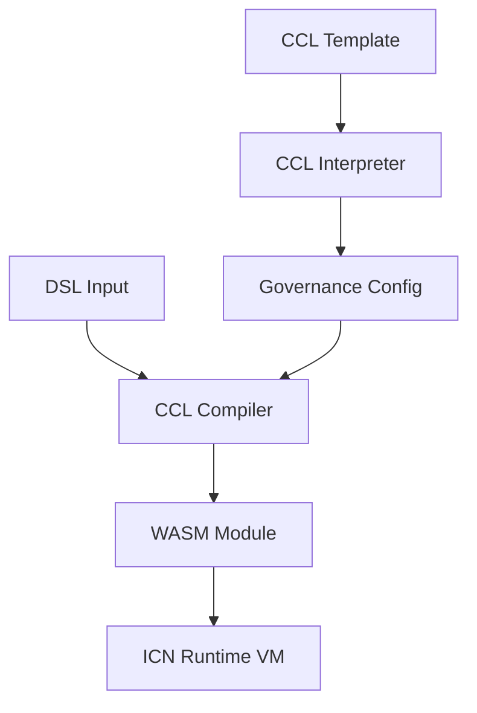

# CCL to WASM Compilation Pipeline

This document describes the architecture and usage of the Constitutional Cooperative Language (CCL) to WebAssembly (WASM) compilation pipeline in the ICN Runtime.

## Overview

The CCL to WASM compilation pipeline enables the conversion of declarative Constitutional Cooperative Language (CCL) templates and Domain-Specific Language (DSL) inputs into executable WASM modules. This allows the ICN Runtime to execute governance rules defined in CCL as verifiable, deterministic computations.

The compilation process bridges the gap between:
- **Declarative governance rules** (what should happen)
- **Executable code** (how it happens)

## Architecture



### Components

1. **CCL Templates** - Constitutional rules for cooperatives, communities, and other organizations. These are written in the CCL language and define the governance structure, decision-making processes, and other rules.

2. **CCL Interpreter** - Parses and validates CCL templates, converting them into a structured `GovernanceConfig` representation.

3. **DSL Inputs** - Action-specific parameters that fill in the template. Examples include membership proposals, budget requests, or voting parameters.

4. **CCL Compiler** - Takes a validated `GovernanceConfig` and DSL inputs and compiles them into a WebAssembly module that encapsulates the execution logic.

5. **WASM Module** - The compiled output that can be executed by the ICN Runtime virtual machine. Contains embedded governance rules and action-specific logic derived from the CCL template and DSL input.

6. **ICN Runtime VM** - Executes the WASM module in a secure, sandboxed environment with appropriate resource limits and permissions.

## Compilation Process

The compilation process consists of several steps:

1. **Validation** - Ensuring the DSL input is compatible with the CCL template, checking for required fields, and validating data types.

2. **WASM Generation** - Creating a WebAssembly module with:
   - Function signatures for the ICN Runtime host environment
   - Embedded governance rules and parameters
   - Logic for executing the specific action

3. **Optimization** (optional) - Optimizing the WASM module for size and performance.

### Compiler Backends

The CCL Compiler supports multiple backends for WASM generation:

1. **Basic WASM Encoder** - Directly generates WASM bytecode with minimal logic.
2. **Template-Based** - Uses Rust templates filled with parameters to compile more complex WASM modules (requires the `templating` feature).

## Usage

### Command Line

The `covm` CLI provides a `compile` command for generating WASM modules:

```bash
covm compile --ccl-template examples/cooperative_bylaws.ccl \
             --dsl-input examples/dsl/propose_join.dsl \
             --output target/wasm/proposal.wasm \
             --scope cooperative
```

Optional flags:
- `--debug` - Include debug information in the WASM
- `--optimize=false` - Disable optimization

### Programmatic API

```rust
use icn_ccl_compiler::{CclCompiler, CompilationOptions};
use icn_governance_kernel::{CclInterpreter, config::GovernanceConfig};
use icn_identity::IdentityScope;
use serde_json::Value as JsonValue;

// Parse the CCL template
let interpreter = CclInterpreter::new();
let governance_config = interpreter.interpret_ccl(&ccl_content, IdentityScope::Cooperative)?;

// Parse the DSL input
let dsl_input: JsonValue = serde_json::from_str(&dsl_content)?;

// Configure compilation options
let options = CompilationOptions {
    include_debug_info: false,
    optimize: true,
    memory_limits: None, // Use default memory limits
};

// Compile to WASM
let compiler = CclCompiler::new();
let wasm_bytes = compiler.compile_to_wasm(&governance_config, &dsl_input, Some(options))?;
```

## DSL Input Schema

DSL input files are JSON documents that contain the parameters for a specific governance action. Different actions require different parameters, as defined by the CCL template.

### Common Actions

1. **Membership Proposal**
   ```json
   {
     "action": "propose_membership",
     "applicant_did": "did:icn:applicant123",
     "name": "Alice Johnson",
     "skills": ["software_development", "community_facilitation"],
     "reason": "I want to join this cooperative..."
   }
   ```

2. **Budget Proposal**
   ```json
   {
     "action": "propose_budget",
     "amount": 5000,
     "category": "development",
     "title": "Web Infrastructure Development",
     "purpose": "Develop and deploy a new website..."
   }
   ```

3. **Resolution**
   ```json
   {
     "action": "propose_resolution",
     "title": "Update Membership Requirements",
     "text": "Whereas current membership requirements...",
     "effective_date": "2025-07-01"
   }
   ```

## Future Enhancements

1. **Advanced Templating** - More sophisticated templates for complex governance actions.
2. **Schema Validation** - JSON Schema validation for DSL inputs.
3. **Security Features** - Embedding signatures and authorization checks in the WASM.
4. **Optimization** - Better optimization of the generated WASM modules.
5. **Debugging Tools** - Tools for debugging and inspecting the compiled WASM modules.

## Security Considerations

The CCL compiler implements several security measures:

1. **Input Validation** - All DSL inputs are validated before compilation.
2. **Memory Limits** - Compiled WASM modules have configurable memory limits.
3. **Host API Restrictions** - Only necessary host functions are exposed to WASM modules.
4. **Resource Metering** - Execution is monitored and limited by the ICN Runtime VM.

## Related Documentation

- [CCL Language Reference](CCL_LANGUAGE.md)
- [ICN Runtime VM](RUNTIME_VM.md)
- [Governance Kernel](GOVERNANCE_KERNEL.md) 