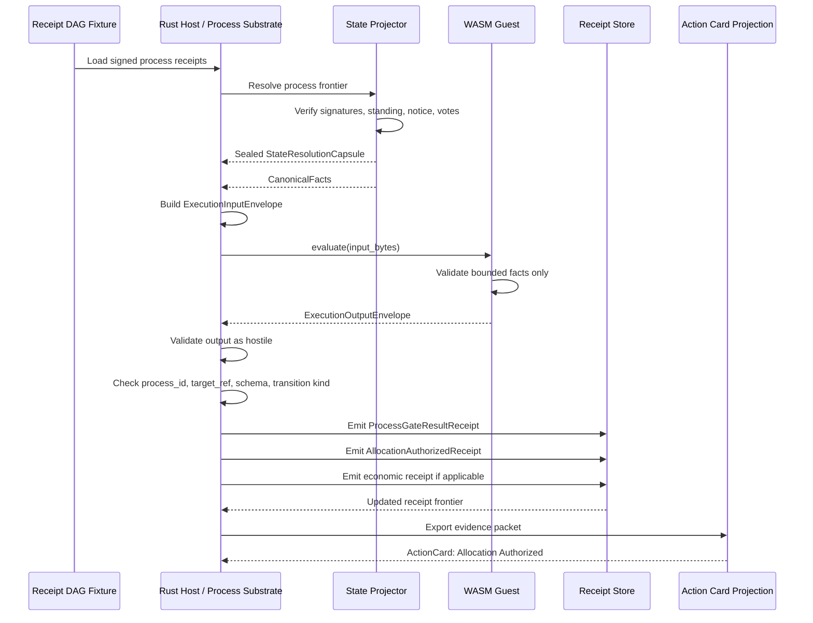

# Foundational Manual: Executable Baseline-Lock Loop

This note captures the current drafting doctrine for the first executable baseline-lock loop.

It is not a production-readiness claim.

It is not a Phase 2 completion claim.

It is not formal partner authorization.

It is not an implementation issue.

It complements:

- [`FOUNDATIONAL_MANUAL_BASELINE_LOCK.md`](FOUNDATIONAL_MANUAL_BASELINE_LOCK.md)
- [`FOUNDATIONAL_MANUAL_STATE_PROJECTION_AND_COMPACTION.md`](FOUNDATIONAL_MANUAL_STATE_PROJECTION_AND_COMPACTION.md)
- [`FOUNDATIONAL_MANUAL_IDENTITY_RECOVERY_AND_CAPABILITIES.md`](FOUNDATIONAL_MANUAL_IDENTITY_RECOVERY_AND_CAPABILITIES.md)
- [`FOUNDATIONAL_MANUAL_TRUSTLESS_CLIENT_BOUNDARY.md`](FOUNDATIONAL_MANUAL_TRUSTLESS_CLIENT_BOUNDARY.md)
- [`FOUNDATIONAL_MANUAL_ECONOMIC_STATE_RESOLUTION.md`](FOUNDATIONAL_MANUAL_ECONOMIC_STATE_RESOLUTION.md)

The goal is to turn the Foundational Manual from doctrine into an executable proof.

## Proposed first PR

Recommended PR title:

```text
test(runtime): add executable baseline-lock loop fixture
```

Purpose:

> Prove one institution-local process can move from receipted history to sealed facts to WASM validation to Rust authorization to new receipts to evidence export to member-legible Action Card state.

This PR should not attempt the whole system.

It should not include live federation, live gossip, production mobile routing, real bridge execution, or production readiness claims.

It should prove one spine.

If the test does not pass, the doctrine is not yet real.

## Core target

The first executable proof should deliberately ignore the network.

No federation.

No live gossip.

No mobile multipath routing.

No external bridge.

No production persistence claims.

The first sprint should prove the core constitutional spine in a single-node, deterministically mocked integration test.

The test should be named something like:

```text
cargo test test_baseline_lock_loop
```

The goal:

> Prove that ICN can move one institution-local process from receipted history to canonical facts to WASM validation to Rust authorization to new receipts to evidence export to member-legible Action Card state.

If that loop works, the manual has a runtime spine.

## Runtime sequence



The Meaning Firewall is enforced at the narrowest point:

```text
WASM receives facts.
WASM returns evaluation.
Rust owns authority.
Rust emits receipts.
The institution supplies meaning.
```

## Test fixture: build the receipt DAG

Before the host can resolve state, there must be state to resolve.

The first test fixture should manually instantiate a hardcoded Merkle-DAG of process receipts.

The fixture should fake history, not final state.

The fixture should create:

```text
test cooperative key
test host key
three dummy member keys
one process id
one target allocation object
one simple charter rule: approvals > 50%
one simple economic limit
```

The fixture should manually sign and link:

```text
ProcessSessionOpenedReceipt
StandingContextSnapshotReceipt or StandingContextHash
Recovery/identity material omitted or mocked for this first loop
NoticeDeliveredReceipt entries
DeliberationEntryRecordedReceipt entries representing votes
```

For the first test:

```text
eligible members = 3
approvals = 2
rejections = 1
threshold rule = approvals > 50%
allocation requested = within local limit
```

This creates a static, mathematically valid, offline history that the Rust host can traverse.

No database magic.

No ambient state.

Just receipts.

## Fixture safety notes

Toy cryptography is acceptable only for an early smoke-test sketch.

The actual PR should use deterministic test helpers backed by the project's real hash/signature primitives where possible.

Avoid collision-prone helpers like:

```text
Hash([data.len() as u8; 32])
```

That proves nothing about content addressing.

Use a stable hash over canonical bytes.

Mock signers may be test-only, but they should still bind:

```text
receipt type
receipt fields
prior receipt hash
process_id
target_ref
signer id
```

Otherwise the test can pass while the causal chain is fake.

## Rust projector and envelope builder

The Rust host then runs a pure projection function against the fixture.

The projector takes:

```text
receipt_dag
process_id
target_ref
required_rule_ref
```

It verifies:

```text
receipt signatures
receipt hashes
causal links
process_id matches the target process
receipt target_ref matches the target object where relevant
standing snapshot exists
eligible voter set
notice receipts
vote receipt validity
vote signers are eligible at the standing frontier
notice was delivered to every eligible voter
no duplicate votes unless an explicit rule resolves replacement
vote receipts belong to the process window
allocation request is linked to the target object
reservation has not already been consumed
frontier sufficiency for this mocked institution-local process
```

It outputs a sealed fact snapshot:

```text
CanonicalFacts
  eligible_voters = 3
  votes_cast = 3
  approvals = 2
  rejections = 1
  abstentions = 0
  required_approvals = 2
  notice_delivered = true
  allocation_requested = N
  allocation_limit = M
  reservation_not_consumed = true
```

The projector should fail before WASM if the institutional history is insufficient.

Missing notice should not merely become a polite `false` unless the process rule explicitly allows the guest to evaluate that condition.

For baseline lock, the stronger rule is:

> If a required due-process fact is missing, the host does not seal the envelope.

This keeps civil-rights constraints out of the guest's discretion.

The host then wraps sealed facts in an `ExecutionInputEnvelope`:

```text
ExecutionInputEnvelopeV1
  abi_version
  schema_id
  workload_id
  module_hash
  process_id
  target_ref
  state_resolution_capsule_hash
  canonical_fact_snapshot_hash
  authority_context_hash
  standing_context_hash
  agreement_context_hash
  mandate_ref
  rule_ref
  determinism_class
  privacy_class
  finality_class
  fuel_limit
  input_artifact_refs
  canonical_facts
  expected_output_schema
```

Serialization must be deterministic.

Use a typed canonical binary format.

No JSON for the governance-grade envelope unless it is strictly canonicalized.

No unordered maps.

No floating point.

No timestamps generated inside the WASM guest.

## WASM validation guest

The first WASM guest should be intentionally stupid.

That is the point.

It should not know cooperatives.

It should not know democracy.

It should not know Alice.

It should not know money.

It should expose one function:

```text
evaluate(input_bytes) -> output_bytes
```

The actual ABI must return both output pointer and output length, either through a packed return, an out-parameter, or an allocation ABI.

A naked output pointer is not sufficient.

It deserializes the input envelope, performs bounded checks, and returns an output envelope.

For the first test, it checks:

```text
approvals >= required_approvals
notice_delivered == true
allocation_requested <= allocation_limit
reservation_not_consumed == true
```

It returns:

```text
ExecutionOutputEnvelopeV1
  abi_version
  schema_id
  workload_id
  process_id
  result_kind = GateValidation
  passed = true
  diagnostics
  proposed_transition_ref
  consumed_fuel
```

The guest does not write receipts.

The guest does not query state.

The guest does not call authority functions.

The guest does not mutate anything.

It computes over bounded facts.

That is all.

## Host orchestrator

The Rust host runs the WASM module as untrusted code.

The runtime must disable ambient authority.

No WASI filesystem.

No network.

No host clock.

No random source.

No environment variables.

No database handle.

No callback to fetch state.

No callback to write receipts.

The host configures:

```text
fuel limit
memory limit
expected ABI version
expected input schema
expected output schema
module hash
runtime profile
```

The host passes the serialized input envelope into the guest and receives output bytes.

Then the host treats those bytes as hostile until validated.

It must check more than `process_id`:

```text
abi_version
schema_id
expected_output_schema
workload_id
process_id
target_ref when present
result_kind
finality_class where encoded
module_hash binding
allowed proposed_transition_ref
consumed_fuel within limit
```

Only after that should the host consider `passed` meaningful.

Only after that should the host emit receipts.

## Receipt emitter

If the WASM result passes and the host independently validates the output envelope, Rust binds the result to institutional reality.

The host emits:

```text
ProcessGateResultReceipt
```

Then it applies the authorized mutation plan and emits:

```text
AllocationAuthorizedReceipt
```

If the allocation consumes or reserves a scarce claim, the host also emits the appropriate economic receipt:

```text
ResourceReservationOpenedReceipt
```

or:

```text
ResourceReservationConsumedReceipt
```

Each new receipt must link to:

```text
prior_receipt_hash
process_id
target_ref
state_resolution_capsule_hash
canonical_fact_snapshot_hash
input_envelope_hash
output_envelope_hash
module_hash
authority_context_hash
agreement_context_hash
mandate_ref
signature
```

This proves the central law:

> WASM validates bounded facts.
>
> Rust authorizes state transition.
>
> Receipts preserve institutional memory.

## Evidence packet and Action Card export

The final step is human legibility.

The test should export an evidence packet containing:

```text
process_id
target_ref
input_envelope_hash
output_envelope_hash
module_hash
state_resolution_capsule_hash
canonical_fact_snapshot_hash
ProcessGateResultReceipt
AllocationAuthorizedReceipt
economic receipt if applicable
signature set
frontier hash
```

Then it should project member-facing Action Card state:

```text
ActionCard
  title = "Allocation authorized"
  status = InstitutionFinal or InstitutionReserved
  authority_summary
  decision_summary
  receipt_refs
  evidence_packet_ref
  challenge_path
  accessibility_summary
```

This proves that the system did not merely execute.

It explained itself.

A constitutional machine that cannot explain itself to a member is just admin software with better cryptography.

## Acceptance criteria

The first baseline-lock integration test passes only if all of the following are true:

1. Receipt fixture signatures verify.
2. Receipt causal links verify.
3. Standing projection produces the expected eligible set.
4. Vote projection produces the expected canonical facts.
5. State Resolution Capsule seals only after required facts are present.
6. Execution input envelope hash is stable across repeated runs.
7. WASM module hash is stable.
8. WASM executes without WASI, network, filesystem, host clock, or database access.
9. WASM output envelope hash is stable across repeated runs.
10. Host rejects malformed or mismatched output envelopes.
11. Host emits `ProcessGateResultReceipt` only after validating the output.
12. Host emits `AllocationAuthorizedReceipt` only after the process gate passes.
13. Economic validation rejects an over-limit or double-reserved allocation in a negative test.
14. Evidence packet exports all required hashes and receipt refs.
15. Action Card projection renders the final status and receipt references.
16. Re-running the test from the same fixture produces identical hashes.
17. Changing one vote, signature, module hash, or allocation limit fails the expected validation path.

This is baseline lock in miniature.

Not the full system.

The seed crystal.

## Negative tests

The first executable loop should include negative cases immediately.

Required negative tests:

```text
invalid member signature is rejected
non-member vote is excluded or rejected
duplicate vote is rejected or resolved by rule
missing notice prevents gate sealing
threshold failure prevents ProcessGateResultReceipt
WASM output with wrong process_id is rejected
WASM output with unexpected transition kind is rejected
allocation above limit is rejected
double reservation is rejected
changed module hash invalidates expected execution
stale state frontier prevents envelope sealing where freshness is required
wrong process_id in fixture receipt is rejected
wrong target_ref in fixture receipt is rejected
broken prior_receipt link is rejected
```

The negative tests matter as much as the happy path.

A constitutional substrate that only proves success has not proven safety.

## First runtime spine

The implementation target can be summarized as:

```text
receipt fixture
  ↓
state projector
  ↓
StateResolutionCapsule
  ↓
CanonicalFacts
  ↓
ExecutionInputEnvelope
  ↓
WASM evaluate(bytes)
  ↓
ExecutionOutputEnvelope
  ↓
Rust validation
  ↓
ProcessGateResultReceipt
  ↓
AllocationAuthorizedReceipt
  ↓
evidence packet
  ↓
Action Card projection
```

That is the first runtime spine.

If this passes in a terminal, the manual is no longer only a manual.

It is documentation for a functioning digital constitution.

## Suggested first implementation tasks

The first code PR should stay small enough to review.

Suggested task breakdown:

1. Add or reuse typed test-only receipt structs for the fixture.
2. Add deterministic hashing helpers for the fixture receipts.
3. Add test key generation and signing helpers.
4. Build a fixture receipt DAG for one institution-local proposal.
5. Implement a pure projection function that derives `CanonicalFacts`.
6. Add deterministic envelope serialization.
7. Add a tiny WASM guest crate with `evaluate(input_bytes) -> output_bytes`.
8. Add host-side WASM execution with no WASI imports.
9. Add output-envelope validation and hostile-output rejection.
10. Emit `ProcessGateResultReceipt` and `AllocationAuthorizedReceipt` in the test harness.
11. Export a minimal evidence packet.
12. Project a minimal Action Card JSON object.
13. Add negative tests before expanding scope.

Review rule:

> Any change that requires live networking, federation, bridge execution, production persistence, or real mobile routing is out of scope for the first PR.

## Immediate next priority

After the boundary crate and fixture/projector skeleton exist, build the `wasmtime` host orchestrator before CI polish.

CI should run the test once it exists.

But the next architectural risk is not whether CI can execute `cargo test`.

The next architectural risk is whether the Rust host can run the WASM guest in a silent vacuum:

```text
no WASI
no filesystem
no network
no host clock
no random source
no environment variables
no database handle
no authority callback
no receipt-writing callback
```

The build order is:

```text
boundary crate
receipt DAG fixture
state projector
WASM guest
wasmtime host orchestrator
full integration test
CI gate
```

CI is the enforcement layer.

The host orchestrator is the firewall layer.

Build the firewall first.

## Manual insertion points

When integrating this into the full Foundational Manual:

1. Add this after economic state resolution and before field-demonstration readiness.
2. Keep it explicitly single-node and mocked.
3. Do not include live gossip, federation, bridge execution, or production persistence claims.
4. Treat negative tests as baseline-lock requirements, not optional hardening.
5. Preserve the no-overclaim rule: this document is doctrine and drafting guidance, not a claim that the runtime is complete.

## Closing doctrine

Do not start with the whole world.

Start with one honest loop.

Receipts first.

Facts sealed.

WASM bounded.

Rust authoritative.

Evidence exported.

Member state legible.

Then expand.
