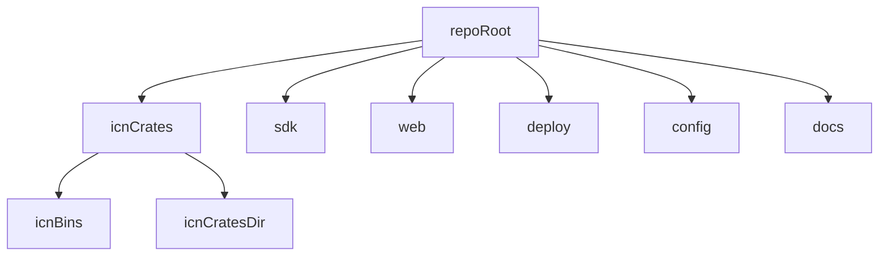

# Module 0: Setup and Tooling

## Objectives
- Build ICN binaries locally
- Run tests and linting
- Identify repo layout and key directories

## Prerequisites
- None

## Key reading
- `README.md`
- `docs/DEV_ENVIRONMENT.md`
- `CONTRIBUTING.md`

## Walkthrough
ICN is a multi-crate Rust workspace with supporting SDK and web UI. Start by
building the main daemon (`icnd`) and CLI (`icnctl`), then review contributor
guidelines and dev setup.

## Concepts (textbook style)

### Workspace layout
The repository is organized by function: core Rust crates live in `icn/`, client
SDKs in `sdk/`, UI in `web/`, and operational artifacts in `deploy/` and
`config/`. This layout separates runtime logic from integration layers and
deployment concerns.

### Repository map (diagram)

### Tooling goals
Tooling ensures consistent builds, linting, and tests. The onboarding emphasizes
repeatable environment setup so developers can focus on system behavior rather
than environment drift.

## Detailed walkthrough (first setup)

### 1) Install tooling
Run `scripts/dev-setup.sh` to install required tools and pre‑commit hooks.

### 2) Build the core binaries
From `icn/`, run `cargo build --release`. This produces `icnd` and `icnctl` in
`icn/target/release/`.

### 3) Locate key directories
- `icn/` Rust workspace and runtime crates
- `sdk/` client SDKs
- `web/` web UI assets
- `config/` runtime configuration examples
- `deploy/` deployment scripts and manifests

### 4) Run a quick local test (optional)
Use the demo configs (`config/icn-alpha.toml`, `config/icn-beta.toml`) to run a
two‑node network and verify discovery.

## Reference files (follow-up)
- `scripts/dev-setup.sh`
- `icn/Cargo.toml`
- `icn/bins/icnd/src/main.rs`
- `icn/bins/icnctl/src/main.rs`
- `config/icn.toml.example`
- `config/icn-alpha.toml`
- `config/icn-beta.toml`
- `docs/DEV_ENVIRONMENT.md`
- `CONTRIBUTING.md`

## Code map
- `scripts/dev-setup.sh`: installs development tooling and hooks.
- `icn/Cargo.toml`: workspace manifest for Rust crates.
- `config/`: example runtime configs for local and multi-node use.

## Exercises
- Run `cargo build --release` in `icn/`
- Locate the `icnd` and `icnctl` binaries
- Find the config examples in `config/`

## Checkpoints
- You can build `icnd` without errors
- You can locate and explain the purpose of `icn/`, `sdk/`, `web/`
