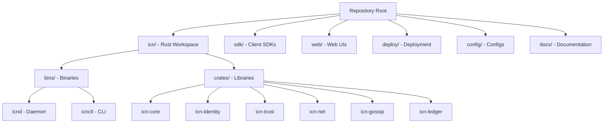

# Module 0: Setup and Tooling

## Overview
This module gets your development environment ready for ICN work. By the end,
you'll have built the ICN daemon and CLI tools, understand the repository layout,
and be ready to explore the codebase.

## Objectives
- Install required development tools
- Build ICN binaries locally
- Run tests and linting
- Understand repo layout and key directories
- Verify your setup with a simple test

## Prerequisites
- A Unix-like environment (Linux, macOS, or WSL2)
- Basic command-line familiarity
- Git installed

## System Requirements

### Minimum
- 8 GB RAM (16 GB recommended for faster builds)
- 10 GB disk space (for dependencies and build artifacts)
- Rust 1.75+ (install via rustup)

### Required Tools
| Tool | Purpose | Installation |
|------|---------|--------------|
| Rust toolchain | Build ICN | `curl --proto '=https' --tlsv1.2 -sSf https://sh.rustup.rs \| sh` |
| Git | Version control | Package manager |
| Node.js 20+ | SDK and UI | `nvm install 20` or package manager |
| Make | Build automation | Package manager |

### Optional Tools
| Tool | Purpose | Installation |
|------|---------|--------------|
| cargo-watch | Auto-rebuild on changes | `cargo install cargo-watch` |
| cargo-nextest | Faster test runner | `cargo install cargo-nextest` |
| pre-commit | Git hooks | `pip install pre-commit` |

## Key Reading
- `README.md` - Project overview
- `CLAUDE.md` - Developer guidance and conventions
- `CONTRIBUTING.md` - How to contribute
- `docs/DEV_ENVIRONMENT.md` - Detailed environment setup

## Walkthrough

ICN is a multi-crate Rust workspace with supporting SDK and web UI. The core
system is built in Rust, with TypeScript SDKs for client applications and a
web UI for cooperative members.

### What You're Building

| Binary | Purpose |
|--------|---------|
| `icnd` | The ICN daemon - runs a node in the network |
| `icnctl` | CLI tool for managing identity and interacting with nodes |

> **Note**: The workspace also builds `icn-console` (interactive debugging console),
> but it's not required for normal development.

## Step-by-Step Setup

### Step 1: Clone the Repository
```bash
git clone https://github.com/InterCooperative-Network/icn.git
cd icn
```

### Step 2: Install Rust (if not already installed)
```bash
curl --proto '=https' --tlsv1.2 -sSf https://sh.rustup.rs | sh
source ~/.cargo/env

# Verify installation
rustc --version
cargo --version
```

### Step 3: Install Rust Components
```bash
rustup component add rustfmt clippy
```

### Step 4: Build the Project
```bash
cd icn
cargo build
```

First build will take 5-15 minutes depending on your system.

### Step 5: Run Tests
```bash
cargo test --workspace --lib
```

### Step 6: Verify Binaries Exist
```bash
ls -la target/debug/icnd target/debug/icnctl
```

### Step 7: Initialize an Identity (Optional)
```bash
export ICN_PASSPHRASE="test-passphrase-for-development"
./target/debug/icnctl id init
./target/debug/icnctl id show
```

## Repository Layout

```
icn/                          # Root directory
├── icn/                      # Rust workspace (core system)
│   ├── Cargo.toml            # Workspace manifest
│   ├── bins/                 # Binary crates
│   │   ├── icnd/             # Daemon binary
│   │   └── icnctl/           # CLI tool
│   └── crates/               # Library crates
│       ├── icn-core/         # Runtime, supervisor, orchestration
│       ├── icn-identity/     # DID, keystore, key management
│       ├── icn-trust/        # Trust graph, scoring
│       ├── icn-net/          # QUIC transport, mDNS
│       ├── icn-gossip/       # Topic-based gossip protocol
│       ├── icn-ledger/       # Mutual credit ledger
│       ├── icn-ccl/          # Contract language
│       ├── icn-gateway/      # REST/WebSocket API
│       ├── icn-federation/   # Inter-cooperative federation
│       └── ...               # Other subsystems
├── sdk/                      # Client SDKs
│   └── typescript/           # TypeScript SDK
├── web/                      # Web interfaces
│   └── pilot-ui/             # Member dashboard
├── config/                   # Configuration examples
├── deploy/                   # Deployment manifests (K8s, Docker)
├── docs/                     # Documentation
│   └── onboarding/           # This curriculum
└── examples/                 # Runnable examples
```

### Key Files to Know
| File | Purpose |
|------|---------|
| `icn/Cargo.toml` | Workspace manifest - lists all crates |
| `config/icn.toml.example` | Configuration reference |
| `CLAUDE.md` | Developer guidance and conventions |
| `docs/ARCHITECTURE.md` | System design documentation |

## Repository Structure Diagram



## Common Commands

```bash
# Build (debug)
cargo build

# Build (release)
cargo build --release

# Run all tests
cargo test --workspace

# Run specific crate tests
cargo test -p icn-gossip

# Format code
cargo fmt --all

# Lint code
cargo clippy --workspace --all-targets

# Check without building
cargo check --workspace
```

## Troubleshooting

### "linker `cc` not found"
Install build essentials:
```bash
# Ubuntu/Debian
sudo apt install build-essential

# macOS (install Xcode command line tools)
xcode-select --install
```

### "error: failed to run rustc"
Update your Rust toolchain:
```bash
rustup update stable
```

### Build is very slow
- Ensure you have enough RAM (close other applications)
- Use a release profile cache: `cargo build --release` (slower first time, faster incremental)
- Consider using `sccache` for distributed caching

### Tests fail with "port already in use"
Previous test run may have left a process running:
```bash
# Find and kill processes on common test ports
lsof -i :8080 | awk 'NR>1 {print $2}' | xargs kill
```

### Keystore errors
Ensure `ICN_PASSPHRASE` environment variable is set:
```bash
export ICN_PASSPHRASE="your-test-passphrase"
```

## Exercises
1. Build `icnd` in both debug and release modes
2. Run `icnctl --help` and explore available commands
3. List the crates in `icn/crates/` and match them to the architecture diagram
4. Find and read `config/icn.toml.example`

## Checkpoints
- [ ] Rust toolchain installed (rustc 1.75+)
- [ ] `cargo build` completes without errors
- [ ] `cargo test --workspace --lib` passes
- [ ] You can locate `target/debug/icnd` and `target/debug/icnctl`
- [ ] You understand the difference between `icn/bins/` and `icn/crates/`

## Next Steps
Proceed to **Module 1: Rust Fundamentals** to learn ICN's Rust patterns, or
skip to **Module 2: Architecture** if you're already comfortable with Rust.
