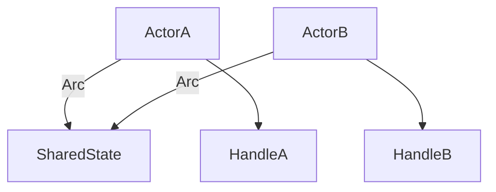
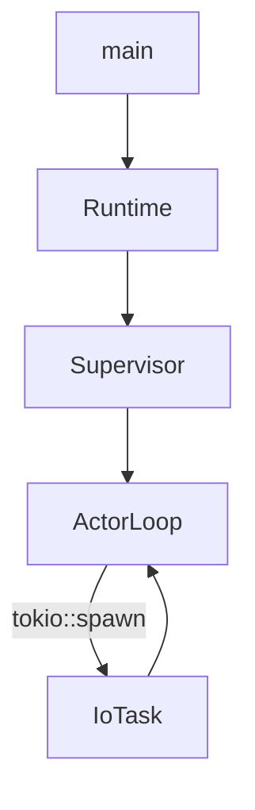

# Module 1: Rust Fundamentals

## Objectives
- Understand ownership, borrowing, and lifetimes
- Use `Result` and `Option` effectively
- Read async Rust code using Tokio

## Prerequisites
- Module 0

## Key reading
- `icn/bins/icnd/src/main.rs`
- `icn/crates/icn-core/src/runtime.rs`
- `icn/crates/icn-core/src/supervisor/mod.rs`

## Walkthrough
Start by reading `icnd` entrypoint and trace how it constructs configuration,
opens the keystore, and starts the runtime. Focus on how errors are handled and
how async tasks are spawned.

## Concepts (textbook style)

### Ownership and borrowing in ICN
ICN uses explicit ownership boundaries to keep state isolated inside actors.
Shared state is wrapped in `Arc` and synchronized with `RwLock` or `Mutex` for
async-safe access. This enables safe concurrency without global mutable state.

### Ownership and sharing (diagram)


### Error handling
Most entrypoints return `Result` and use `?` for propagation. This encourages
explicit handling at boundaries (CLI, network, storage) and keeps error paths
visible and testable.

### Async execution
Tokio provides the async runtime. Actors are long-lived tasks; short-lived tasks
are spawned for IO-bound operations (e.g., network handlers). This separation
keeps system flow responsive without blocking critical loops.

### Async task flow (diagram)


## Detailed walkthrough (Rust patterns in ICN)

### 1) Error propagation
Find `?` usage in `icnd` startup. Trace how a failure propagates back to `main`
and results in a clean process exit.

### 2) Shared ownership
Inspect `Supervisor` initialization and note how handles are shared with `Arc`.
These `Arc<RwLock<T>>` types allow concurrent read access and controlled writes.

### 3) Async tasks
Locate `tokio::spawn` in network/gossip code. These spawns handle IO without
blocking the core actor loop.

## Annotated code excerpts

### Error propagation via `Result` and `?`
Source: `icn/bins/icnd/src/main.rs`
```rust
let mut config = if let Some(config_path) = &args.config {
    Config::from_file(config_path).context("Failed to load config file")?
} else {
    Config::default()
};
```
This shows how `?` propagates errors from config loading back to `main`,
preserving context for diagnostics.

### Runtime handoff to the Supervisor
Source: `icn/crates/icn-core/src/runtime.rs`
```rust
pub async fn run(self) -> Result<()> {
    info!("ICNd runtime starting");

    let supervisor = crate::supervisor::Supervisor::new(
        self.config.clone(),
        self.identity_bundle,
        self.shutdown_tx.clone(),
    );

    supervisor.run().await?;
    info!("ICNd runtime stopped");
    Ok(())
}
```
This is the core async flow: the runtime constructs the Supervisor and awaits
its lifecycle, returning `Result` to the caller.

## Reference files (follow-up)
- `icn/bins/icnd/src/main.rs`
- `icn/crates/icn-core/src/runtime.rs`
- `icn/crates/icn-core/src/supervisor/mod.rs`
- `icn/crates/icn-core/src/supervisor/init_network.rs`
- `icn/crates/icn-gossip/src/gossip.rs`

## Code map
- `icn/bins/icnd/src/main.rs`: `main` shows error handling with `anyhow::Result`.
- `icn/crates/icn-core/src/runtime.rs`: async runtime entrypoint.
- `icn/crates/icn-core/src/supervisor/mod.rs`: shared ownership patterns with
  `Arc` and `RwLock`.

## Exercises
- Identify uses of `?` in `icnd` main and explain the error path.
- Find a `struct` in `icn-core` and describe its ownership model.
- Explain why `Arc` is used for shared handles.

## Checkpoints
- You can explain `Result` propagation in `icnd`
- You can describe async task spawning in `Runtime::run`
