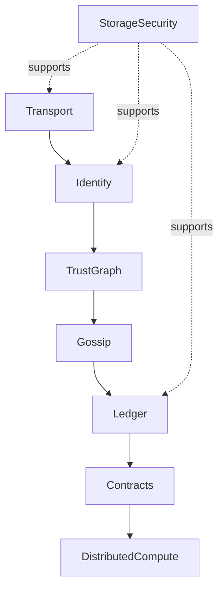

# Module 2: ICN Architecture Overview

## Objectives
- Describe the ICN layer stack
- Understand the core subsystems and their responsibilities

## Prerequisites
- Module 1 (or equivalent Rust familiarity)

## Key reading
- `docs/ARCHITECTURE.md`
- `docs/README.md`
- `README.md`

## Walkthrough
ICN is a decentralized coordination substrate. The architecture document
describes the layer stack: identity, trust, network transport, gossip, ledger,
contracts, storage, security, and distributed compute.

## Concepts (textbook style)

### Layered substrate
ICN is designed as a stack of layers, each providing guarantees to the layer
above. Identity provides authenticity; trust provides social weighting; transport
provides secure connectivity; gossip provides synchronization; ledger provides
accounting; contracts provide programmable rules; storage and security support
durability and resilience.

### Layer stack (diagram)

### Separation of concerns
Each crate implements a focused subsystem. The architecture doc explains the
interfaces between these subsystems, which helps contributors reason about
changes without understanding the entire system at once.

## Detailed walkthrough (architecture mapping)

### 1) Read the layer stack
Start in `docs/ARCHITECTURE.md` and identify the layer stack and the main
responsibilities of each layer.

### 2) Map layers to crates
Use the crate list in `README.md` to map each layer to its primary crate (e.g.,
identity → `icn-identity`, trust → `icn-trust`, ledger → `icn-ledger`).

### 3) Identify integration points
Look for crates that bridge layers (e.g., `icn-core` for runtime orchestration,
`icn-gateway` for external API integration).

## Reference files (follow-up)
- `docs/ARCHITECTURE.md`
- `docs/architecture/`
- `README.md`
- `icn/crates/icn-core/src/lib.rs`
- `icn/crates/icn-gateway/README.md`

## Code map
- `README.md`: high-level crate list and subsystem summary.
- `icn/crates/`: each crate maps to a layer in `docs/ARCHITECTURE.md`.
- `docs/architecture/`: deeper design docs for specific subsystems.

## Exercises
- Draw the layer stack from memory
- Map each layer to a crate name in `icn/crates/`

## Checkpoints
- You can explain what problems ICN solves
- You can map major crates to the architecture layers
