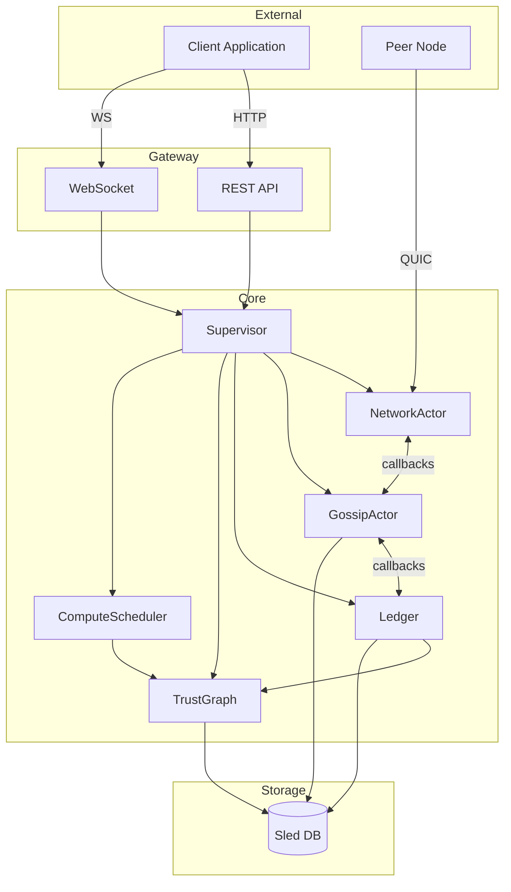
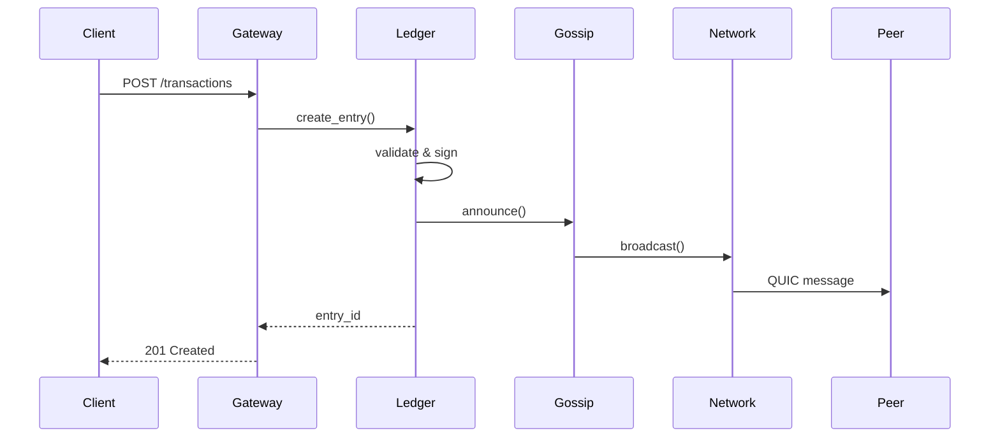

# Module 2: ICN Architecture Overview

## Overview
This module teaches you ICN's layered architecture—how the system is organized,
why each layer exists, and how they work together. Understanding this architecture
is essential for contributing to any part of the codebase.

## Objectives
- Understand ICN's design principles and how they shape the system
- Learn the complete layer stack from transport to distributed compute
- Map each layer to its corresponding Rust crate
- Understand how layers communicate via actor model
- Know where to look when implementing or debugging features

## Prerequisites
- Module 0 (Setup)
- Module 1 (Rust Fundamentals) - especially async and smart pointers

## Key Reading
- `docs/ARCHITECTURE.md` - Complete architectural reference
- `icn/Cargo.toml` - Workspace members list
- `icn/crates/icn-core/src/supervisor/mod.rs` - Actor wiring

---

## Core Concepts

### 1. What is ICN?

**ICN is a decentralized coordination substrate for cooperative organizations.**

Unlike blockchains that focus on trustless consensus, ICN is designed for:

| ICN Approach | Blockchain Approach |
|--------------|---------------------|
| **Trust-native**: Social relationships inform behavior | Trustless: Assumes all actors are adversaries |
| **Local-first**: Nodes operate independently, sync via gossip | Global consensus: All nodes agree on state |
| **Cooperative economics**: Mutual credit, clearing, fair exchange | Token economics: Cryptocurrencies, gas fees |
| **Human-governed**: Democratic policy changes | Code-governed: Hard forks for changes |

**What "substrate" means:**

ICN provides foundational capabilities that applications build on:
- **Identity**: Who are you? (cryptographic proof)
- **Trust**: How much should we trust them? (social graph)
- **Communication**: How do we talk? (encrypted P2P)
- **Coordination**: How do we agree? (gossip + contracts)
- **Economics**: How do we exchange value? (mutual credit)

Think of ICN as the "operating system" for cooperative applications.

### 2. Design Principles

ICN's architecture follows five foundational principles:

#### Local-First
Nodes operate independently and reconcile via gossip. This means:
- **Offline operation**: Your node works even without network
- **No single point of failure**: No central server to go down
- **Eventually consistent**: Changes propagate through the network
- **Resilience**: Network partitions don't break the system

#### Trust-Native
Security and coordination derive from social trust, not global consensus:
- **Web-of-participation**: Trust spreads through relationships
- **Reputation matters**: Behavior affects future interactions
- **Graduated access**: More trusted peers get more capabilities
- **Human relationships**: Mirrors real-world cooperative dynamics

#### Deterministic Compute
Same inputs always produce same outputs:
- **Reproducible state**: Any node can verify results
- **Contract execution**: Deterministic interpretation
- **No randomness in core**: Predictable behavior

#### Capability-Based Security
Contracts can only do what they're explicitly permitted:
- **Principle of least privilege**: Minimal access by default
- **Explicit grants**: Capabilities must be given
- **Revocable**: Capabilities can be withdrawn
- **Auditable**: Clear record of what can do what

#### Human-Governed
Cooperative governance makes policy democratic:
- **Proposals and voting**: Changes require community approval
- **Transparent process**: All governance on the record
- **Configurable**: Each cooperative sets its own rules

---

## The ICN Layer Stack

ICN is organized as a stack of layers, each building on the ones below:

```
┌────────────────────────────────────────────────────────┐
│               DISTRIBUTED COMPUTE                       │
│        Trust-gated task execution (icn-compute)        │
├────────────────────────────────────────────────────────┤
│                   CONTRACTS                             │
│        CCL interpreter, capabilities (icn-ccl)         │
├────────────────────────────────────────────────────────┤
│                    LEDGER                               │
│     Mutual credit, double-entry (icn-ledger)           │
├────────────────────────────────────────────────────────┤
│                    GOSSIP                               │
│      Causal sync, anti-entropy (icn-gossip)            │
├────────────────────────────────────────────────────────┤
│                 TRUST GRAPH                             │
│     Web-of-participation scores (icn-trust)            │
├────────────────────────────────────────────────────────┤
│                   IDENTITY                              │
│      DID, Ed25519, keystore (icn-identity)             │
├────────────────────────────────────────────────────────┤
│                  TRANSPORT                              │
│     QUIC/TLS, mDNS, NAT traversal (icn-net)            │
├────────────────────────────────────────────────────────┤
│          STORAGE  +  SECURITY                           │
│   Sled persistence    Production hardening             │
│    (icn-store)         (icn-security)                  │
└────────────────────────────────────────────────────────┘
```

**Each layer provides guarantees to the layer above:**

1. **Transport** → "I can establish secure connections"
2. **Identity** → "I can prove who I am"
3. **Trust** → "I know how much to trust you"
4. **Gossip** → "I can synchronize state with peers"
5. **Ledger** → "I can record transactions"
6. **Contracts** → "I can execute programmatic rules"
7. **Compute** → "I can distribute work across nodes"

---

## Layer Details

### 3. Transport Layer (icn-net)

**What it does:** Establishes secure, encrypted connections between nodes.

**Key components:**
- **QUIC protocol**: Modern transport with built-in encryption
- **TLS 1.3**: Certificate-based authentication
- **mDNS discovery**: Find peers on local network
- **NAT traversal**: Connect through firewalls

**Why QUIC instead of TCP?**
- Multiplexed streams (multiple conversations on one connection)
- Built-in encryption (no separate TLS handshake)
- Connection migration (survives IP changes)
- Faster connection establishment (0-RTT)

```rust
// From icn-net: Connection establishment
pub struct NetworkActor {
    // QUIC endpoint for connections
    endpoint: quinn::Endpoint,
    // Active peer sessions
    sessions: HashMap<Did, PeerSession>,
    // Message routing
    router: MessageRouter,
}
```

**DID-TLS Binding:**
Every TLS connection proves the peer's DID ownership:
1. TLS certificate contains DID
2. Node signs challenge with DID private key
3. Verifier checks signature matches certificate
4. Connection is now authenticated

### 4. Identity Layer (icn-identity)

**What it does:** Manages cryptographic identities (DIDs) and key material.

**DID Format:**
```
did:icn:5KQwrPbwdL6PhXujxW37FSSQZ1JiwsST4cqQzDeyXtP
        ├─ Scheme: "icn"
        └─ Base58-encoded Ed25519 public key
```

**Why this format?**
- **Self-certifying**: No registry lookup needed
- **Verifiable**: Anyone can verify signatures
- **Simple**: DID = public key (direct mapping)

**Key components:**
- **KeyPair**: Ed25519 signing key + X25519 encryption key
- **KeyStore**: Age-encrypted file storage
- **Key Rotation**: Protocol for changing keys safely

```rust
// From icn-identity: Keystore interface
pub trait KeyStore: Send + Sync {
    fn unlock(&mut self, passphrase: &[u8]) -> Result<()>;
    fn lock(&mut self);
    fn get_keypair(&self) -> Result<&KeyPair>;
    fn sign(&self, message: &[u8]) -> Result<Signature>;
}
```

**Keystore security:**
1. Private keys never leave keystore
2. Age encryption (passphrase or YubiKey)
3. Locked by default (requires unlock)
4. Rotation creates signed transition record

### 5. Trust Layer (icn-trust)

**What it does:** Computes trust scores based on social relationships.

**The trust graph:**
```
       Alice ─────0.8────── Bob
         │                   │
        0.6                 0.5
         │                   │
         └──── Charlie ─────┘
                  │
                 0.3
                  │
                David
```

Edges represent direct trust (0.0 to 1.0). Trust propagates transitively.

**Trust computation:**
- **Direct trust**: You vouch for someone (Alice trusts Bob 0.8)
- **Transitive trust**: Trust through intermediaries (Alice → Bob → David)
- **Decay**: Trust decreases with distance
- **Multiple paths**: Combines trust from different routes

```rust
// Trust score computation
pub fn compute_trust(&self, from: &Did, to: &Did) -> f64 {
    // Direct trust if exists
    if let Some(direct) = self.get_direct_trust(from, to) {
        return direct;
    }

    // Transitive trust through graph traversal
    // Uses decay factor and path combination
    self.compute_transitive_trust(from, to, MAX_DEPTH)
}
```

**Trust classes:**
| Class | Score Range | Rate Limit | Use Case |
|-------|-------------|------------|----------|
| Isolated | < 0.1 | 10/sec | Unknown peers |
| Known | 0.1 - 0.4 | 50/sec | Casual contacts |
| Partner | 0.4 - 0.7 | 100/sec | Regular collaborators |
| Federated | > 0.7 | 200/sec | Trusted federation |

### 6. Gossip Layer (icn-gossip)

**What it does:** Synchronizes state across nodes without central coordination.

**How gossip works:**
1. **Push**: Node announces "I have new data"
2. **Pull**: Other nodes request data they don't have
3. **Anti-entropy**: Periodic sync to catch missed updates

**Key concepts:**

**Topics**: Namespaced channels for different data types
```
ledger:entries      # Ledger transactions
trust:edges         # Trust graph updates
governance:votes    # Voting events
```

**Vector clocks**: Track causality (what happened before what)
```rust
pub struct VectorClock {
    // Each peer's logical time
    clock: HashMap<Did, u64>,
}

impl VectorClock {
    pub fn happened_before(&self, other: &VectorClock) -> bool {
        // All our entries ≤ theirs, at least one <
    }
}
```

**Bloom filters**: Efficiently check "do you have this?"
- Compact representation of what a node has
- False positives possible (might re-send)
- False negatives impossible (won't miss data)

```rust
// From icn-gossip: Message handling
pub struct GossipActor {
    subscriptions: HashMap<Topic, Vec<Subscription>>,
    vector_clock: VectorClock,
    pending_announcements: Vec<Announcement>,
}
```

### 7. Ledger Layer (icn-ledger)

**What it does:** Records economic transactions using mutual credit.

**Mutual credit explained:**

Unlike currency, mutual credit creates money through transactions:
```
Before: Alice: 0, Bob: 0, Carol: 0

Alice buys from Bob (10 units):
After: Alice: -10, Bob: +10, Carol: 0

Bob buys from Carol (5 units):
After: Alice: -10, Bob: +5, Carol: +5

Carol buys from Alice (10 units):
After: Alice: 0, Bob: +5, Carol: -5
```

**The system always sums to zero.** No external money supply needed.

**Double-entry accounting:**
Every transaction creates two entries:
```rust
pub struct LedgerEntry {
    debit_account: Did,   // Money leaves here
    credit_account: Did,  // Money arrives here
    amount: i64,
    timestamp: u64,
    signature: Signature,
}
```

**Merkle-DAG structure:**
Entries form a directed acyclic graph where each entry references its parents:
```
    Entry A
       │
       ▼
    Entry B ◄── Entry C
       │         │
       ▼         ▼
    Entry D ────►┘
```

This enables:
- **Cryptographic integrity**: Can't modify without detection
- **Efficient sync**: Request missing branches
- **Parallel entries**: Multiple valid orderings

### 8. Contract Layer (icn-ccl)

**What it does:** Executes programmable rules for cooperative agreements.

**CCL (Cooperative Contract Language):**
- Domain-specific, not Turing-complete
- Deterministic execution
- Capability-based security
- Fuel metering (prevents infinite loops)

**Contract structure:**
```rust
pub struct Contract {
    name: String,
    parties: Vec<Did>,
    rules: Vec<Rule>,
    state: ContractState,
}

pub struct Rule {
    name: String,
    conditions: Vec<Expr>,  // When this rule applies
    effects: Vec<Stmt>,     // What happens
}
```

**Capability system:**
```rust
pub enum Capability {
    ReadLedger,           // Can query balances
    WriteLedger(i64),     // Can transfer up to N
    ReadTrust,            // Can check trust scores
    SendMessage(Topic),   // Can publish to topic
}
```

Contracts declare required capabilities. The runtime grants them based on
authorization rules.

### 9. Distributed Compute Layer (icn-compute)

**What it does:** Distributes computational tasks across trusted nodes.

**Trust-gated execution:**
- Tasks specify minimum trust requirements
- Scheduler assigns to qualifying nodes
- Results are verified by trust threshold

```rust
pub struct ComputeTask {
    function: ComputeFunction,
    inputs: Vec<Input>,
    trust_threshold: f64,     // Minimum executor trust
    timeout: Duration,
}
```

**Scheduling policies:**
- **RoundRobin**: Distribute evenly across nodes
- **LowestLoad**: Prefer nodes with capacity
- **TrustWeighted**: Prefer higher-trust nodes
- **Locality**: Prefer nodes near data

---

## Supporting Layers

### 10. Storage Layer (icn-store)

**What it does:** Provides persistent key-value storage.

**Implementation:** Sled embedded database
- Embedded (no separate process)
- ACID transactions
- Concurrent reads
- Automatic compaction

```rust
pub trait Store: Send + Sync {
    fn get(&self, key: &[u8]) -> Result<Option<Vec<u8>>>;
    fn put(&self, key: &[u8], value: &[u8]) -> Result<()>;
    fn delete(&self, key: &[u8]) -> Result<()>;
    fn scan_prefix(&self, prefix: &[u8]) -> Result<Vec<(Vec<u8>, Vec<u8>)>>;
}
```

**Namespaced keys:** Each subsystem uses a prefix:
```
trust:edge:{from}:{to}    # Trust edges
ledger:entry:{hash}       # Ledger entries
gossip:state:{topic}      # Gossip metadata
```

### 11. Security Layer

**Three-tier security model:**

1. **Transport security**: QUIC/TLS with DID binding
2. **Message security**: Signed envelopes with replay protection
3. **Application security**: E2E encryption for sensitive data

**Signed messages:**
```rust
pub struct SignedEnvelope {
    payload: Vec<u8>,
    sender: Did,
    signature: Signature,
    sequence: u64,  // Replay protection
}
```

**Replay guard:**
- Each sender has a sequence counter
- Receivers track last seen sequence
- Reject messages with old or duplicate sequences

---

## Integration Architecture

### 12. The Actor Model

ICN uses actors for concurrent subsystems:

```
┌──────────────────────────────────────────────────────────┐
│                     SUPERVISOR                            │
│  Creates and manages actors, handles shutdown             │
├──────────────────────────────────────────────────────────┤
│                                                          │
│  ┌─────────────┐   ┌─────────────┐   ┌─────────────┐    │
│  │ NetworkActor│   │ GossipActor │   │   Ledger    │    │
│  │   (icn-net) │   │(icn-gossip) │   │(icn-ledger) │    │
│  └──────┬──────┘   └──────┬──────┘   └──────┬──────┘    │
│         │                 │                 │            │
│         │    callbacks    │                 │            │
│         └────────────────►│◄────────────────┘            │
│                           │                              │
│         ┌─────────────────┼─────────────────┐            │
│         │                 │                 │            │
│  ┌──────▼──────┐   ┌──────▼──────┐   ┌──────▼──────┐    │
│  │ TrustGraph  │   │   Gateway   │   │ Governance  │    │
│  │ (icn-trust) │   │(icn-gateway)│   │  (icn-gov)  │    │
│  └─────────────┘   └─────────────┘   └─────────────┘    │
│                                                          │
└──────────────────────────────────────────────────────────┘
```

**Actor characteristics:**
- Encapsulates state (no shared mutable state)
- Communicates via messages (channels, callbacks)
- Has a handle for external interaction
- Managed lifecycle (spawn, run, shutdown)

### 13. Actor Communication Patterns

**Message passing via channels:**
```rust
// Actor receives commands via channel
pub struct MyActorHandle {
    tx: mpsc::Sender<MyCommand>,
}

enum MyCommand {
    DoSomething { data: Vec<u8>, reply: oneshot::Sender<Result<()>> },
    Shutdown,
}
```

**Callbacks for cross-actor communication:**
```rust
// Network → Gossip: When message arrives
let incoming_handler: IncomingHandler = Arc::new(move |msg| {
    gossip_handle.handle_incoming(msg)
});

// Gossip → Network: When message needs sending
let send_callback: SendCallback = Arc::new(move |peer, msg| {
    network_handle.send_to(peer, msg)
});
```

**Why callbacks instead of direct references?**
- Avoids circular dependencies
- Actors remain independent
- Easy to mock for testing
- Allows late binding

### 14. The Supervisor

The Supervisor (`icn-core`) orchestrates all actors:

```rust
// From icn-core/src/supervisor/mod.rs
pub struct Supervisor {
    config: Config,
    identity: IdentityBundle,
    shutdown_tx: broadcast::Sender<()>,

    // Actor handles
    network: Arc<RwLock<NetworkActor>>,
    gossip: Arc<RwLock<GossipActor>>,
    ledger: Arc<RwLock<Ledger>>,
    trust_graph: Arc<RwLock<TrustGraph>>,
    // ... more actors
}

impl Supervisor {
    pub async fn run(self) -> Result<()> {
        // 1. Initialize actors
        self.init_network().await?;
        self.init_gossip().await?;
        self.init_ledger().await?;

        // 2. Wire up callbacks
        self.wire_network_to_gossip().await?;
        self.wire_gossip_to_ledger().await?;

        // 3. Start actor loops
        self.start_all().await?;

        // 4. Wait for shutdown
        self.wait_for_shutdown().await
    }
}
```

**Initialization order matters:**
1. Storage (foundation)
2. Identity (needed by everyone)
3. Trust (needed for access control)
4. Network (needed for gossip)
5. Gossip (needed for sync)
6. Ledger (needs gossip sync)
7. Gateway (exposes everything)

---

## Crate Map

### 15. Mapping Layers to Crates

| Layer | Crate | Primary Responsibility |
|-------|-------|------------------------|
| Transport | `icn-net` | QUIC connections, mDNS, message routing |
| Identity | `icn-identity` | DID management, keystore, signatures |
| Trust | `icn-trust` | Trust graph storage, score computation |
| Gossip | `icn-gossip` | Topic sync, vector clocks, anti-entropy |
| Ledger | `icn-ledger` | Double-entry accounting, Merkle-DAG |
| Contracts | `icn-ccl` | CCL parser, interpreter, capabilities |
| Compute | `icn-compute` | Task scheduling, executor selection |
| Storage | `icn-store` | Sled wrapper, namespaced access |
| Security | `icn-security` | Rate limiting, access control |
| Runtime | `icn-core` | Supervisor, actor lifecycle |
| API | `icn-gateway` | REST/WebSocket, JWT auth |
| Metrics | `icn-obs` | Prometheus, tracing, logging |
| Governance | `icn-governance` | Proposals, voting, policy |
| Federation | `icn-federation` | Inter-coop agreements |
| Testing | `icn-testkit` | Multi-node test helpers |

### 16. Binary Crates

| Binary | Purpose |
|--------|---------|
| `icnd` | The daemon - runs a network node |
| `icnctl` | CLI - manage identity, interact with node |

---

## Data Flow Examples

### 17. Incoming Message Flow

```
External Peer
     │
     │ QUIC packet
     ▼
┌────────────────┐
│  NetworkActor  │ ─── Decrypt, verify TLS
└───────┬────────┘
        │ NetworkMessage
        ▼
┌────────────────┐
│ IncomingHandler│ ─── Route by payload type
└───────┬────────┘
        │ GossipMessage
        ▼
┌────────────────┐
│  GossipActor   │ ─── Process announcement
└───────┬────────┘
        │ LedgerEntry (if ledger topic)
        ▼
┌────────────────┐
│    Ledger      │ ─── Validate, store entry
└────────────────┘
```

### 18. Outgoing Transaction Flow

```
Client (SDK/UI)
     │
     │ HTTP POST /transactions
     ▼
┌────────────────┐
│    Gateway     │ ─── Auth, validate
└───────┬────────┘
        │ CreateTransaction
        ▼
┌────────────────┐
│    Ledger      │ ─── Create entry, sign
└───────┬────────┘
        │ LedgerEntry
        ▼
┌────────────────┐
│  GossipActor   │ ─── Announce to peers
└───────┬────────┘
        │ GossipMessage
        ▼
┌────────────────┐
│  NetworkActor  │ ─── Send to subscribed peers
└───────┬────────┘
        │
        ▼
    Other Nodes
```

---

## Diagrams

### ICN Component Interaction



### Request Lifecycle



---

## Exercises

1. **Layer Stack**: Draw the ICN layer stack from memory, labeling each layer
   with its crate name and primary responsibility.

2. **Data Flow**: Trace what happens when a node receives a gossip message
   containing a new ledger entry. List each component touched.

3. **Crate Mapping**: Given a feature request "add rate limiting to the gossip
   layer," identify which crates would need changes.

4. **Trust Propagation**: If Alice trusts Bob at 0.8, Bob trusts Carol at 0.6,
   and decay per hop is 0.5, what is Alice's transitive trust of Carol?

5. **Actor Communication**: Find a callback definition in the codebase
   (`icn-core/src/supervisor/`) and explain what two actors it connects.

---

## Checkpoints

- [ ] You can explain ICN's five design principles
- [ ] You can draw the layer stack and name each layer's crate
- [ ] You understand why ICN uses gossip instead of consensus
- [ ] You can trace a message from network to ledger
- [ ] You know the difference between transport and gossip layers
- [ ] You understand why actors use callbacks for communication
- [ ] You can map a feature to the appropriate crate(s)

---

## Quick Reference

| Concept | Definition |
|---------|------------|
| DID | Decentralized Identifier - cryptographic identity |
| Trust Graph | Network of trust relationships between DIDs |
| Gossip | Peer-to-peer state synchronization protocol |
| Mutual Credit | Economic system where transactions create money |
| CCL | Cooperative Contract Language |
| Actor | Concurrent component with encapsulated state |
| Supervisor | Orchestrates actor lifecycle |
| Capability | Permission grant for specific action |

---

## Next Steps

Proceed to **Module 3: Runtime & Actors** to understand how the Supervisor
initializes actors, manages their lifecycle, and coordinates shutdown.
