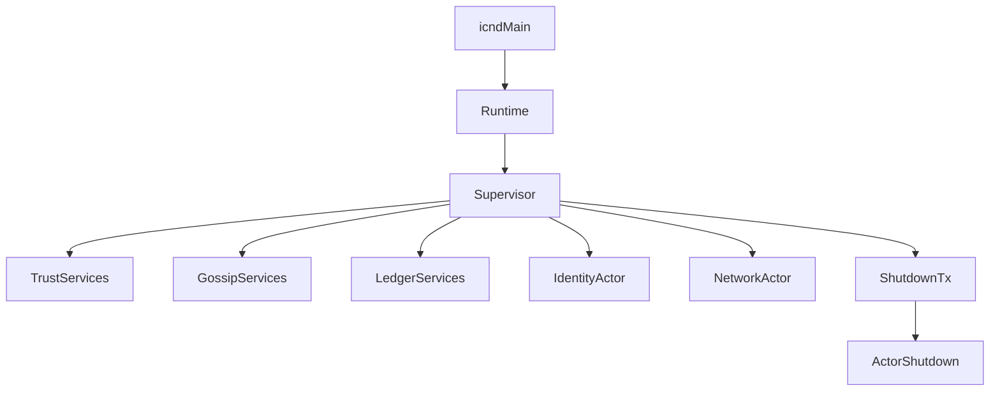

# Module 3: Runtime and Actor Model

## Objectives
- Trace the startup flow from `icnd` to Supervisor
- Understand actor initialization order and dependencies

## Prerequisites
- Module 2

## Key reading
- `icn/bins/icnd/src/main.rs`
- `icn/crates/icn-core/src/runtime.rs`
- `icn/crates/icn-core/src/supervisor/mod.rs`

## Walkthrough
`icnd` loads configuration, opens the keystore, and starts `Runtime::run`, which
creates a `Supervisor`. The supervisor initializes core services in sequence and
maintains handles needed for the daemon lifetime.

## Concepts (textbook style)

### Runtime
The runtime is the boundary between process-level concerns and ICN system logic.
It owns configuration, optional identity, and the shutdown broadcast channel.
The runtime does not implement the system itself; it is a thin lifecycle shell
that starts the Supervisor and waits until the system is asked to stop.

### Supervisor
The Supervisor is the orchestration layer. It is responsible for creating
subsystems in the correct order, wiring dependencies between them, and ensuring
long-lived handles are retained for the daemon's lifetime.

Key responsibilities:
- instantiate core actors and services
- pass shared resources across subsystems (trust graph, gossip handle, etc.)
- start background tasks and keep them alive
- enforce initialization order and availability constraints

### Actor model in ICN
ICN actors are long-lived async tasks that encapsulate state and expose a handle
for interaction. Handles are shared with `Arc`/`RwLock` to allow concurrent use
across subsystems. This style provides clear ownership boundaries and avoids
global state while enabling non-blocking, event-driven behavior.

### Handles and lifetime
Handles are intentionally stored at the Supervisor scope because dropping a
handle can terminate or unsubscribe the associated subsystem. This is why the
Supervisor keeps long-lived subscription handles and service handles.

### Shutdown flow
Shutdown is coordinated through a broadcast channel. Actors subscribe to the
shutdown receiver and stop cleanly, allowing final persistence and metrics
flushes before exit.

### Runtime orchestration (diagram)

### Flow breakdown
1. Parse CLI args and load `Config` (file or defaults)
2. Initialize tracing/metrics and validate config
3. Open keystore and load `IdentityBundle`
4. Start runtime and spawn supervisor
5. Supervisor initializes actors in dependency order

## Dependency model
Some subsystems depend on identity (network, gossip, ledger). When the keystore
is missing or locked, the daemon can start in a limited mode where identity-
dependent actors are skipped. This keeps the process healthy while signaling
missing identity to the operator.

## Initialization order (why this order matters)
1. **Trust services**: trust gating is needed before accepting network or gossip
2. **Gossip services**: sync requires trust and is used by ledger
3. **Ledger services**: ledger uses gossip for replication
4. **Coop and community**: higher-level domain logic depends on ledger/gossip
5. **Identity actor**: provides signing and DID context
6. **Network actor**: transport is started after routing and trust are ready

## Code map
- `icn/bins/icnd/src/main.rs`: `main` loads config, initializes tracing, opens
  keystore, constructs `Runtime`, handles shutdown signals.
- `icn/crates/icn-core/src/runtime.rs`: `Runtime::run` creates a `Supervisor`
  and calls `Supervisor::run`.
- `icn/crates/icn-core/src/supervisor/mod.rs`: `Supervisor::run` orchestrates
  init order and holds actor handles.
- `icn/crates/icn-core/src/supervisor/init_network.rs`:
  `create_incoming_handler` routes network messages into gossip.

## Reference files (follow-up)
- `icn/bins/icnd/src/main.rs`
- `icn/crates/icn-core/src/runtime.rs`
- `icn/crates/icn-core/src/supervisor/mod.rs`
- `icn/crates/icn-core/src/supervisor/init_*`
- `icn/crates/icn-core/src/config/`

## Example trace (ICN startup)
- `icnd` parses CLI args and loads config.
- Tracing and metrics initialize before actor startup.
- Keystore is unlocked and `IdentityBundle` is loaded (if present).
- `Runtime::run` starts the Supervisor.
- Supervisor creates trust, gossip, ledger, coop/community, identity, network.
- Runtime waits for shutdown; Supervisor handles actor lifecycle.

## Exercises
- Trace the creation order of trust, gossip, ledger, and network services
- Explain why the Supervisor keeps long-lived subscription handles

## Checkpoints
- You can describe the startup sequence from main to actors
- You can identify which subsystems depend on identity
