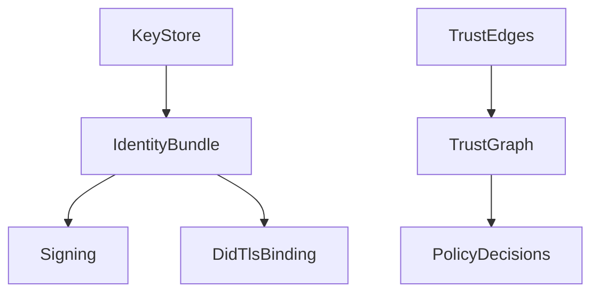

# Module 4: Identity and Trust

## Objectives
- Understand ICN DID format and keystore usage
- Understand trust graph concepts and policy usage

## Prerequisites
- Module 3

## Key reading
- `icn/crates/icn-identity/`
- `icn/crates/icn-trust/`
- `docs/ARCHITECTURE.md` (Identity, Trust sections)
- `docs/multi-device-identity-design.md`

## Walkthrough
Identity in ICN is DID-based and uses Ed25519 keys. Trust derives from social
edges and is used for access control and rate limiting.

## Concepts (textbook style)

### Identity
Identity is the root of accountability and authentication. ICN uses DID-style
identifiers derived from Ed25519 keys. This makes identity self-certifying: the
public key is the identity.

### Key storage
Private keys are stored in an encrypted keystore. The keystore is unlocked at
startup to obtain an `IdentityBundle`, which is then used for signing and TLS
binding.

### Trust graph
Trust is modeled as a weighted graph of social edges. Trust scores influence
rate limits, access control, and other policy decisions. This aligns system
behavior with community relationships rather than global consensus.

### Identity and trust flow (diagram)


## Detailed walkthrough (identity lifecycle)

### 1) Identity creation
An operator initializes identity via `icnctl id init`, which generates a keypair
and writes an encrypted keystore.

### 2) Keystore unlock at startup
`icnd` loads the keystore from the data directory and unlocks it using a
passphrase. The result is an `IdentityBundle` (DID + keypair + metadata).

### 3) Identity usage
The identity bundle is used for:
- signing messages
- DID‑TLS binding for transport
- authoring ledger entries and contracts

## Detailed walkthrough (trust usage)

### 1) Trust graph maintenance
Trust edges are stored and updated through trust services. They may be modified
via governance or operator tools.

### 2) Trust in enforcement
Trust scores are consulted by subsystems for:
- rate limiting and admission control
- topic subscription policies
- ledger acceptance thresholds (optional)

## Failure modes and safeguards
- **Missing keystore**: daemon starts in limited mode and logs warnings.
- **Invalid passphrase**: keystore remains locked and identity is unavailable.
- **Low trust**: peers may be rate‑limited or denied access to topics.

## Annotated code excerpts

### Keystore interface defines the security boundary
Source: `icn/crates/icn-identity/src/keystore.rs`
```rust
pub trait KeyStore: Send + Sync {
    /// Unlock the keystore with a passphrase
    fn unlock(&mut self, passphrase: &[u8]) -> Result<()>;

    /// Lock the keystore (clear in-memory keys)
    fn lock(&mut self);

    /// Get the keypair (fails if locked)
    fn get_keypair(&self) -> Result<&KeyPair>;
}
```
This trait marks the boundary between encrypted storage and runtime use.

### IdentityBundle binds DID to TLS
Source: `icn/crates/icn-identity/src/bundle.rs`
```rust
pub struct IdentityBundle {
    /// The DID for this identity
    did: Did,
    /// Ed25519 keypair for DID operations
    did_keypair: KeyPair,
    /// Self-signed TLS certificate
    tls_cert: CertificateDer<'static>,
    /// Binding signature proving ownership
    /// Signature = Sign_did_key(SHA256(tls_cert))
    tls_binding_sig: Vec<u8>,
}
```
This struct ensures the node’s DID and TLS identity are cryptographically tied.

### Trust dimensions are explicit and separate
Source: `icn/crates/icn-trust/src/types.rs`
```rust
pub enum TrustGraphType {
    Social,
    EconomicReliability,
    TechnicalReliability,
}
```
ICN prevents a single trust dimension from dominating by modeling them
independently.

## Code map
- `icn/crates/icn-identity/src/keystore.rs`:
  keystore persistence and unlock flow.
- `icn/crates/icn-identity/src/bundle.rs`:
  `IdentityBundle` aggregates DID, keypair, and metadata.
- `icn/crates/icn-trust/src/types.rs` and `icn/crates/icn-trust/src/lib.rs`:
  trust graph types and public API.

## Reference files (follow-up)
- `icn/crates/icn-identity/src/keystore.rs`
- `icn/crates/icn-identity/src/bundle.rs`
- `icn/crates/icn-identity/src/multi_device.rs`
- `icn/crates/icn-trust/src/lib.rs`
- `icn/crates/icn-trust/src/types.rs`
- `docs/multi-device-identity-design.md`

## Exercises
- Locate the DID type and key storage in `icn-identity`
- Find where trust scores are used to gate behavior

## Checkpoints
- You can explain DID format and key storage
- You can describe how trust influences system behavior
