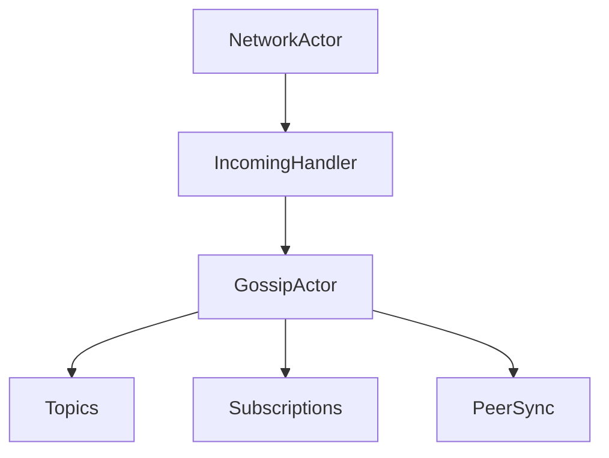

# Module 5: Network and Gossip

## Objectives
- Understand transport vs gossip responsibilities
- Understand topic subscriptions and message routing

## Prerequisites
- Module 4

## Key reading
- `icn/crates/icn-net/`
- `icn/crates/icn-gossip/`
- `docs/ARCHITECTURE.md` (Network, Gossip)
- `docs/gossip-signed-envelope-migration.md`

## Walkthrough
Transport provides secure sessions and peer discovery. Gossip handles topic-
based sync and anti-entropy. Together they move data between nodes.

## Concepts (textbook style)

### Transport vs gossip
Transport is responsible for connectivity and secure sessions (QUIC/TLS, peer
discovery, and message integrity). Gossip is responsible for data movement and
convergence: it disseminates entries, handles anti-entropy, and enforces topic
policies.

### Topics and subscriptions
Gossip is organized around topics. Nodes subscribe to topics to receive relevant
updates. This allows coarse access control and reduces bandwidth for unrelated
data.

### Message routing (diagram)

## Detailed walkthrough (message to gossip)

### 1) Transport receives a network message
The network actor receives a `NetworkMessage` from a peer. This layer already
handles connection security and message integrity.

### 2) Incoming handler routes by payload type
The Supervisor wires a message handler that inspects the payload:
- `Gossip` payloads are forwarded to `GossipActor::handle_message`
- `Subscribe` / `Unsubscribe` update topic membership
- Signed envelopes are decoded and routed by payload type

### 3) Gossip validates and applies
The gossip actor checks topic access and message structure, then updates:
- topic state
- entry sets and bloom filters
- per‑peer sync state

### 4) Notify subscribers
If the message changes topic state, subscribers are notified and sync continues.

## Detailed walkthrough (subscriptions)

1. Peer sends `Subscribe { topics }`
2. Gossip updates subscription lists
3. Optional `SubscribeAck` is returned
4. Future entries in those topics are forwarded to the subscriber

## Anti‑entropy and convergence
Gossip uses anti‑entropy exchanges to reconcile missing entries. This is how
nodes converge even after temporary disconnects or partitions.

## Failure modes and safeguards
- **Unauthorized subscriptions** are rejected based on access policies.
- **Invalid payloads** are dropped or logged.
- **Partition detection** triggers healing strategies when enabled.

### Flow breakdown
1. Network actor receives a `NetworkMessage`
2. Incoming handler routes payloads to gossip
3. Gossip validates and applies message to topic state
4. Notifications and subscriptions are updated

## Code map
- `icn/crates/icn-core/src/supervisor/init_network.rs`:
  `create_incoming_handler` routes `MessagePayload::Gossip`, `Subscribe`, and
  `Unsubscribe` into `GossipActor`.
- `icn/crates/icn-gossip/src/gossip.rs`:
  `GossipActor::handle_message` processes incoming gossip messages.
- `icn/crates/icn-gossip/src/gossip.rs`:
  `GossipActor::subscribe` and `GossipActor::unsubscribe` manage topic listeners.

## Reference files (follow-up)
- `icn/crates/icn-net/`
- `icn/crates/icn-gossip/src/gossip.rs`
- `icn/crates/icn-core/src/supervisor/init_network.rs`
- `docs/gossip-signed-envelope-migration.md`

## Exercises
- Find where incoming network messages are routed to gossip
- Identify how topic subscriptions are created and used

## Checkpoints
- You can describe the difference between transport and gossip
- You can explain how a message is accepted and routed
