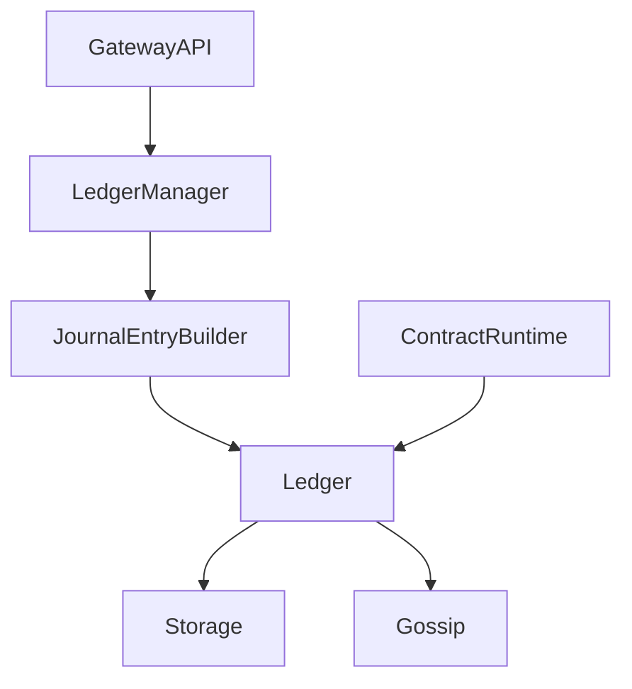

# Module 6: Ledger and Contracts

## Objectives
- Understand mutual credit ledger flow
- Understand contract runtime integration

## Prerequisites
- Module 5

## Key reading
- `icn/crates/icn-ledger/`
- `icn/crates/icn-ccl/`
- `docs/ARCHITECTURE.md` (Ledger, Contracts)
- `docs/governance-primitives.md`

## Walkthrough
The ledger is a double-entry mutual credit system. Contracts execute with
capability-based permissions and can write to the ledger.

## Concepts (textbook style)

### Mutual credit ledger
The ledger records transfers as balanced debit/credit pairs. Every entry is a
journal record with a cryptographic hash. This provides an auditable history and
supports replicated state across peers.

### Journal entries
Journal entries enforce the double-entry invariant: total debits must equal
total credits per currency. Validation happens before entries are accepted and
persisted.

### Contracts and capabilities
Contracts provide programmable rules. Capabilities define what contracts are
allowed to do. When a contract emits ledger operations, the runtime validates
them and applies them as ledger entries.

### Ledger flow (diagram)


## Detailed walkthrough (ledger payment path)

### 1) Request enters the system
A payment commonly enters via the gateway API. The endpoint validates:
- the caller has `ledger:write` scope
- the caller’s DID matches the `from` field
- the coop context matches the request (prevents cross‑coop writes)
- amount, currency, and memo are valid

These checks happen in the gateway layer, before the ledger is touched.

### 2) Journal entry is built
The gateway’s `LedgerManager` creates a `JournalEntry` using
`JournalEntryBuilder`. This enforces:
- **double‑entry**: debits equal credits per currency
- **non‑negative**: amounts must be positive
- **time validity**: timestamps must be valid

The builder computes a content hash so the entry is immutable and auditable.

### 3) Append and persist
`Ledger::append_entry` persists the entry and updates in‑memory indices. The
ledger uses:
- a key/value store for journal entries and indexes
- cached balances for fast read queries
- quarantine and fork detectors for safety under divergence

### 4) Gossip replication
Once appended, the ledger can publish the entry via gossip (when a gossip handle
is configured). This propagates the update to peers, enabling eventual
convergence without centralized coordination.

## Detailed walkthrough (contract‑driven transfer)

### 1) Contract execution
`ContractRuntime::execute_rule` runs the interpreter for a contract rule and
produces an `ExecutionResult`.

### 2) Ledger operations emitted
The execution result may include `LedgerOperation`s (e.g., transfers). These
operations are mapped to journal entries using the same builder and validation
logic as direct payments.

### 3) Ledger update and replication
Each operation becomes a journal entry appended to the ledger, which then
propagates via gossip if configured.

## Key data structures

### JournalEntry
A signed, hashed record containing:
- author DID
- timestamp
- account deltas (debits/credits)
- parent hashes (for DAG structure)

### Ledger
Owns storage, cached balances, and validation hooks. It enforces:
- trust thresholds (optional)
- credit policy limits (optional)
- invariant checks on entries

### ContractRuntime
Executes contracts and bridges interpreter outputs into ledger entries.

## Failure modes and safeguards
- **Unbalanced entries** are rejected by the builder.
- **Invalid DID or currency** is rejected at gateway validation.
- **Policy violations** (credit limits, freezes) are enforced by ledger managers.
- **Forks** are detected and resolved through fork detectors and resolvers.

## Annotated code excerpts

### JournalEntryBuilder enforces double-entry invariants
Source: `icn/crates/icn-ledger/src/entry.rs`
```rust
pub fn build(self) -> Result<JournalEntry> {
    // Validate double-entry invariant: Σ debits == Σ credits per currency
    validate_double_entry(&self.accounts)?;
    // Validate that amounts are positive
    validate_positive_amounts(&self.accounts)?;
    // Get current timestamp in milliseconds
    let timestamp = icn_time::try_current_timestamp_millis()
        .map_err(|e| anyhow::anyhow!("Cannot create journal entry: {e}"))?;
    let mut entry = JournalEntry {
        id: None,
        timestamp,
        author: self.author,
        contract_ref: self.contract_ref,
        accounts: self.accounts,
        parents: self.parents,
        signature: None,
    };
    entry.compute_hash()?;
    Ok(entry)
}
```
This guarantees all ledger entries are balanced and timestamped before acceptance.

### Contract runtime applies ledger operations
Source: `icn/crates/icn-ccl/src/runtime.rs`
```rust
match op {
    LedgerOperation::Transfer { from, to, amount, currency } => {
        let entry = JournalEntryBuilder::new(from.clone())
            .debit(to.clone(), currency.clone(), *amount)
            .credit(from.clone(), currency.clone(), *amount)
            .build()?;
        ledger.append_entry(entry).await?;
    }
    LedgerOperation::SetCreditLimit { .. } => {
        // Credit limit updates are recorded separately
    }
}
```
Contract outputs are converted into the same journal entry format as direct API
payments, keeping the ledger path consistent.

### Flow breakdown
1. Ledger API or contract runtime builds a `JournalEntry`
2. Entry validation enforces double-entry invariants
3. Ledger appends entry and persists state
4. Gossip publishes updates to peers

## Code map
- `icn/crates/icn-ledger/src/entry.rs`:
  `JournalEntryBuilder` builds and validates double-entry invariants.
- `icn/crates/icn-ledger/src/ledger.rs`:
  `Ledger::append_entry` persists entries and triggers gossip.
- `icn/crates/icn-ccl/src/runtime.rs`:
  `ContractRuntime::execute_rule` applies `LedgerOperation` updates.
- `icn/crates/icn-gateway/src/ledger_mgr.rs`:
  `LedgerManager::create_payment` builds a journal entry and appends it.

## Reference files (follow-up)
- `icn/crates/icn-ledger/src/entry.rs`
- `icn/crates/icn-ledger/src/ledger.rs`
- `icn/crates/icn-ledger/src/types.rs`
- `icn/crates/icn-ccl/src/runtime.rs`
- `icn/crates/icn-gateway/src/ledger_mgr.rs`

## Exercises
- Find the ledger actor entry points for creating a payment
- Trace how contract execution produces ledger effects

## Checkpoints
- You can describe ledger state changes for a payment
- You can explain where contracts are executed and authorized
