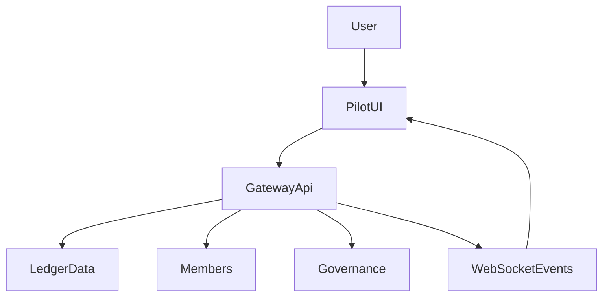

# Module 8: Web UI Integration

## Objectives
- Understand how the Pilot UI connects to ICN
- Trace how UI actions map to gateway APIs

## Prerequisites
- Module 7

## Key reading
- `web/pilot-ui/README.md`
- `web/pilot-ui/GETTING-STARTED.md`
- `web/pilot-ui/SUMMARY.md`

## Walkthrough
The Pilot UI is a static web app that talks to the gateway using JWTs. It
surfaces ledger activity, membership, and governance operations.

## Concepts (textbook style)

### UI as client of the gateway
The Pilot UI is a thin client: it does not implement ICN logic. Instead, it
authenticates with the gateway and renders responses. This separation keeps the
UI simple and the ICN substrate authoritative.

### Session and token handling
The UI stores the JWT and attaches it to requests. Token expiry handling is a
core UX concern because it determines when users must re-authenticate.

### UI data flow (diagram)

## Detailed walkthrough (login and data flow)

### 1) User inputs connection details
The user provides gateway URL, coop ID, DID, and JWT. These are stored in
in‑memory state and validated for presence.

### 2) Connection verification
The UI validates connectivity by calling:
- `GET /health` (gateway liveness)
- `GET /ledger/{coopId}/balance/{did}` (auth check)

### 3) Session persistence
On success, the UI stores gateway URL, coop ID, DID, token, and token expiry in
`localStorage` for persistence across reloads.

### 4) Data loading and live updates
The UI loads balance, members, transactions, and proposals, then connects a
WebSocket for real‑time events.

## Failure modes and safeguards
- **Missing fields**: login is blocked with a friendly error.
- **Auth failure**: login fails and displays a user‑friendly message.
- **Expired token**: UI warns and requires re‑authentication.

## Code map
- `web/pilot-ui/index.html`: app entry and layout.
- `web/pilot-ui/app.js`: gateway interaction and core UI logic.
- `web/pilot-ui/components/`: feature-level UI modules.

## Reference files (follow-up)
- `web/pilot-ui/index.html`
- `web/pilot-ui/app.js`
- `web/pilot-ui/README.md`
- `web/pilot-ui/GETTING-STARTED.md`
- `web/pilot-ui/SUMMARY.md`

## Exercises
- Identify how the UI obtains and stores the JWT
- Map UI actions to gateway endpoints

## Checkpoints
- You can explain the UI login flow
- You can trace a UI action to a gateway API call
