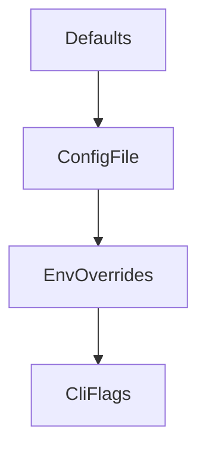
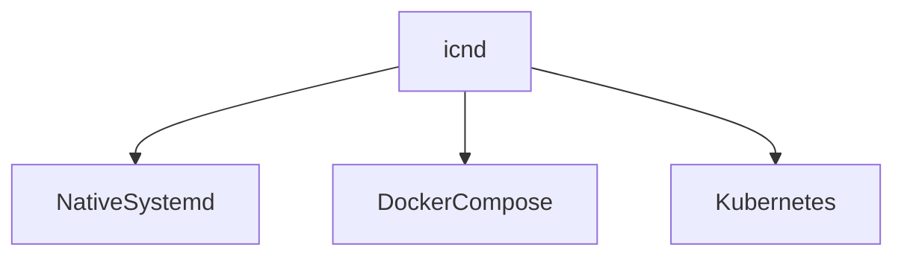

# Module 9: Operations and Deployment

## Objectives
- Understand configuration and deployment options
- Understand observability and hardening basics

## Prerequisites
- Module 8

## Key reading
- `deploy/README.md`
- `config/README.md`
- `docs/production-hardening.md`
- `docs/ops/`

## Walkthrough
ICN supports native, Docker, and Kubernetes deployment. Configuration is layered
and can be validated before startup. Observability includes metrics and health
endpoints.

## Concepts (textbook style)

### Configuration layering
ICN loads defaults, then file config, then environment overrides, then CLI flags.
This allows a safe baseline with flexible overrides for deployment environments.

### Configuration precedence (diagram)

### Observability
Metrics and health endpoints are required for production readiness. They provide
insight into node liveness and subsystem behavior.

### Deployment models
Native, Docker, and Kubernetes deployments serve different operational needs.
The core runtime remains the same; only the surrounding infrastructure changes.

### Deployment options (diagram)

## Detailed walkthrough (config and validation)

### 1) Choose a config file
Start from `config/icn.toml.example` or the minimal template and customize
network ports, data directory, and gateway settings.

### 2) Validate before running
Use `icnd --validate-config` to catch missing or invalid configuration early.

### 3) Start the daemon
Run `icnd` with `--config` and check logs for initialization warnings.

### 4) Verify health and metrics
Check `/health` and `/metrics` endpoints to confirm liveness and observability.

## Code map
- `deploy/README.md`: deployment options and quickstart.
- `deploy/docker-compose.yml`: local stack composition.
- `config/icn.toml.example`: full config reference.
- `docs/production-hardening.md`: security and hardening guidance.

## Reference files (follow-up)
- `deploy/README.md`
- `deploy/docker-compose.yml`
- `deploy/kubernetes/`
- `deploy/helm/`
- `config/README.md`
- `config/icn.toml.example`
- `docs/production-hardening.md`

## Exercises
- Validate a config file with `--validate-config`
- Identify the ports used for transport, RPC, metrics, and health

## Checkpoints
- You can explain config precedence
- You can describe how to deploy locally with Docker
