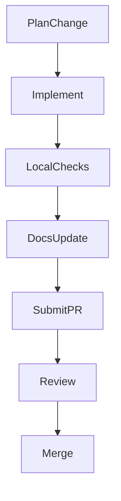

# Module 10: Contributor Workflow

## Objectives
- Understand tests, linting, and CI expectations
- Follow the repo contribution process

## Prerequisites
- Module 9

## Key reading
- `CONTRIBUTING.md`
- `docs/testing/`
- `docs/ci/`

## Walkthrough
ICN uses a standard Rust workflow with formatting, linting, and tests. CI
enforces checks for core crates and integration points.

## Concepts (textbook style)

### Contribution discipline
The contribution workflow ensures changes remain safe and reviewable. Formatting
and linting enforce consistency; tests validate behavior; CI provides a shared
gate for quality.

### Test scope
Tests are scoped by crate and feature area. Understanding where a change lands
helps decide which tests are required before review.

### Contribution loop (diagram)


## Detailed walkthrough (contribution loop)

### 1) Prepare the change
Create a small, focused diff aligned with an issue or decision.

### 2) Run local checks
Use `cargo fmt`, `cargo clippy`, and relevant tests for impacted crates.

### 3) Verify documentation
If the change affects behavior or public APIs, update docs and onboarding
materials (see `docs/onboarding/update-process.md`).

### 4) Submit for review
Follow the PR checklist in `CONTRIBUTING.md`, including test results and
motivation.

## Annotated code excerpts

### Local quality gates before pushing
Source: `CONTRIBUTING.md`
```bash
# Run tests
cargo test --workspace

# Run clippy (linter)
cargo clippy --workspace --all-targets

# Check formatting
cargo fmt --all -- --check
```
These commands are the minimum expected checks before submitting a PR.

### Quick verification for security-critical areas
Source: `docs/testing/TESTING_SUMMARY.md`
```bash
# Test scope allowlist
cargo test -p icn-gateway --test scope_validation_integration

# Test TLS config
cargo test -p icn-net --lib test_create

# Verify build
cargo check --release
```
This is a fast path for validating key security invariants.

## Code map
- `CONTRIBUTING.md`: contribution process and expectations.
- `docs/testing/TESTING_SUMMARY.md`: test suite guidance.
- `docs/ci/`: CI status and reports.

## Reference files (follow-up)
- `CONTRIBUTING.md`
- `docs/testing/TESTING_SUMMARY.md`
- `docs/testing/`
- `docs/ci/`
- `docs/onboarding/update-process.md`

## Exercises
- Run `cargo fmt` and `cargo clippy` (if tooling is installed)
- Identify which tests to run for a change in `icn-core`

## Checkpoints
- You can describe the PR checklist
- You can identify the right test scope for a change
