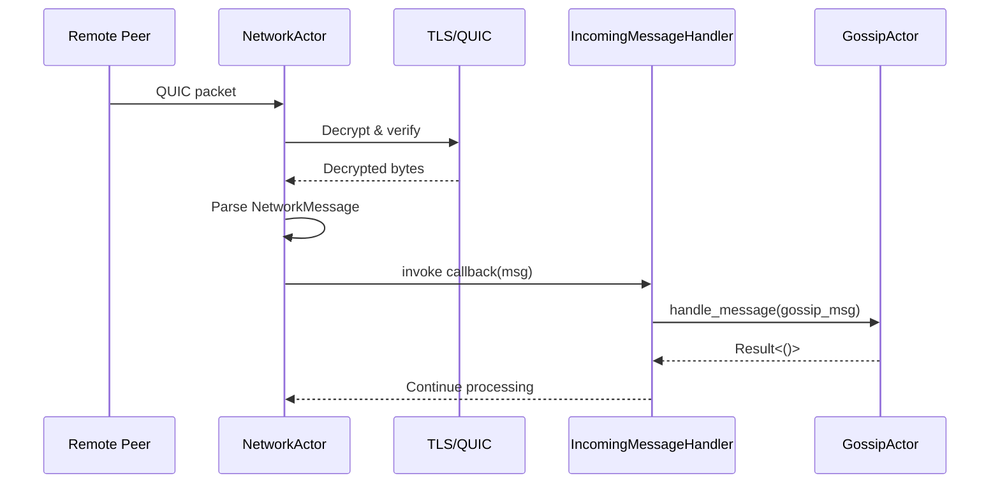

# Workshop 3: Runtime and Actor Lifecycle

## Learning Objectives

By the end of this workshop, you will be able to:

1. **Trace startup flow** - Follow the daemon from `main()` to running actors
2. **Explain initialization order** - Know why actors start in a specific sequence
3. **Use handle patterns** - Understand message-passing vs shared-state handles
4. **Coordinate shutdown** - Know how graceful shutdown works across actors
5. **Run the daemon** - Start and interact with a local ICN node

## Goal
Trace the daemon startup path, understand actor initialization order, and explore
how the supervisor manages the actor lifecycle.

## Prerequisites
- Completed [Module 3: Runtime Architecture](../reference/module-03-runtime-actors.md)
- ICN binaries built (`cargo build`)

## Estimated time
2-3 hours

## Related Materials
- [Module 3: Runtime Architecture](../reference/module-03-runtime-actors.md) - Background reading
- [Workshop 4: Identity and Trust](./workshop-04-identity-trust.md) - Next workshop
- [CLAUDE.md Architecture Section](../../CLAUDE.md) - Actor communication patterns

## Part 1: Startup Path Walkthrough

### Steps
1. Open `icn/bins/icnd/src/main.rs`
2. Identify the config loading and validation flow
3. Find where the keystore is unlocked
4. Trace the call to the runtime

### Questions to answer
1. What happens if the keystore passphrase is incorrect?
2. How is the config file located?
3. What signal handlers are registered?

### Code to find
```rust
// Look for the runtime entry point
Runtime::new(config, identity).await?.run().await
```

### Checkpoint
- [ ] You can identify where config is loaded
- [ ] You understand keystore unlock flow

## Part 2: Supervisor Initialization

### Steps
1. Open `icn/crates/icn-core/src/supervisor/mod.rs`
2. Find the `Supervisor::new()` method
3. List all actors that are created

### Expected initialization order
1. Storage layer (Sled)
2. Identity (load from keystore)
3. Trust graph
4. Network actor
5. Gossip actor
6. Ledger
7. Gateway/RPC servers

### Questions to answer
1. Why does trust initialize before gossip?
2. What would break if network started before identity?
3. How are actors connected to each other?

### Code to trace
```rust
// Find the actor wiring section
self.wire_network_to_gossip().await?;
self.wire_gossip_to_ledger().await?;
```

### Checkpoint
- [ ] You can list the actor initialization order
- [ ] You understand why the order matters

## Part 3: Actor Handle Pattern

### Steps
1. Search for `Handle` structs in the codebase:
   ```bash
   grep -r "pub struct.*Handle" icn/crates/ --include="*.rs" | head -10
   ```
   > **Note**: These shell commands are for learning purposes. When automating
   > searches in ICN development, prefer using IDE search or dedicated tools.

2. Open `icn/crates/icn-gossip/src/gossip.rs`
3. Find the `GossipHandle` definition
4. Identify how external code interacts with the actor

### Questions to answer
1. What channel type is used for actor communication?
2. How does the handle pattern prevent shared mutable state?
3. What happens when a handle's sender is dropped?

### Actual pattern

**Note**: ICN uses two patterns for actor handles:

1. **Message-passing handles** (e.g., `NetworkActor`):
   ```rust
   // icn/crates/icn-net/src/actor.rs:122
   pub struct NetworkHandle {
       tx: mpsc::Sender<NetworkCommand>,
   }

   impl NetworkHandle {
       pub async fn send_message(&self, msg: NetworkMessage) -> Result<()> {
           let (reply_tx, reply_rx) = oneshot::channel();
           self.tx.send(NetworkCommand::Send { msg, reply: reply_tx }).await?;
           reply_rx.await?
       }
   }
   ```

2. **Shared-state handles** (e.g., `GossipActor`):
   ```rust
   // icn/crates/icn-gossip/src/gossip.rs:1876
   pub type GossipHandle = Arc<RwLock<GossipActor>>;

   // Usage requires acquiring lock:
   let mut gossip = gossip_handle.write().await;
   gossip.subscribe(topic, subscriber_did).await?;
   ```

The gossip actor uses the shared-state pattern with `Arc<RwLock<>>` rather than
message passing. Different actors use different patterns based on their needs.

### Checkpoint
- [ ] You understand both handle patterns (message-passing and shared-state)
- [ ] You know which pattern GossipActor uses

## Part 4: Shutdown Coordination

### Steps
1. Search for shutdown handling:
   ```bash
   grep -r "shutdown" icn/crates/icn-core/src/ --include="*.rs" | head -15
   ```

2. Find the broadcast channel for shutdown signals
3. Trace how each actor receives the shutdown signal

### Questions to answer
1. What type of channel is used for shutdown?
2. How do actors clean up resources on shutdown?
3. What order do actors shut down?

### Expected pattern
```rust
// See icn/crates/icn-core/src/runtime.rs:24 for broadcast channel creation
// Broadcast allows multiple receivers
let (shutdown_tx, _) = broadcast::channel::<()>(1);

// Each actor receives a receiver
let mut shutdown_rx = shutdown_tx.subscribe();
tokio::select! {
    _ = shutdown_rx.recv() => {
        // Cleanup and exit
    }
    // ... other branches
}
```

### Checkpoint
- [ ] You can trace the shutdown signal path
- [ ] You understand graceful shutdown ordering

## Part 5: Callback Wiring

### Steps
1. Open `icn/crates/icn-core/src/supervisor/mod.rs`
2. Find the callback wiring code
3. Trace how network messages reach the gossip actor

### Diagram



> **Why callbacks?** The callback pattern allows the supervisor to wire actors
> together without either actor knowing about the other's implementation details.
> This enables testing actors in isolation and swapping implementations.

### Questions to answer
1. Why use callbacks instead of direct actor references?
2. How is the callback type defined (trait or closure)?
3. What happens if the callback fails?

### Checkpoint
- [ ] You can explain the network-to-gossip bridge
- [ ] You understand why callbacks enable loose coupling

## Part 6: Running the Daemon

### Steps
1. Build the daemon:
   ```bash
   cd icn && cargo build
   ```

2. Create a test config (or use default):
   ```bash
   export ICN_DATA=$(mktemp -d)
   export ICN_PASSPHRASE="workshop-test"
   ./target/debug/icnctl --data-dir "$ICN_DATA" id init
   ```

3. Start the daemon:
   ```bash
   ./target/debug/icnd --data-dir "$ICN_DATA"
   ```

4. In another terminal, check status:
   ```bash
   ./target/debug/icnctl --data-dir "$ICN_DATA" status
   ```

### Expected output
- Daemon starts and logs initialization steps
- Status shows node DID and connection info

### Questions to answer
1. What log messages appear during startup?
2. What ports are opened?
3. What happens if you start a second daemon with the same data dir?

### Checkpoint
- [ ] You successfully started the daemon
- [ ] You can query its status

## Cleanup

```bash
rm -rf "$ICN_DATA"
```

## Summary

After completing this workshop you should be able to:
- Trace the complete daemon startup path
- Explain the actor initialization order and why it matters
- Understand the handle pattern for actor communication
- Describe how shutdown is coordinated across actors
- Run and interact with the daemon

## Key Takeaways

| Concept | Key Point |
|---------|-----------|
| **Startup Order** | Storage → Identity → Trust → Network → Gossip → Ledger → Gateway |
| **Handle Patterns** | Message-passing (mpsc) for commands, Arc<RwLock> for shared state |
| **Shutdown** | Broadcast channel notifies all actors; reverse initialization order |
| **Callback Wiring** | Enables loose coupling; supervisor connects actors without dependencies |
| **Config Loading** | Data directory contains keystore, config, and database |

## Try It Yourself

**Challenge 1**: Add debug logging to trace message flow
```bash
RUST_LOG=icn_gossip=debug,icn_net=debug ./target/debug/icnd --data-dir "$ICN_DATA"
```
Watch the logs as you interact with the daemon. Can you identify:
- When a peer connects?
- When gossip messages are exchanged?
- When the ledger processes an entry?

**Challenge 2**: Explore the actor handles
Use `grep` to find all the different handle types in the codebase. Which ones use
message-passing and which use shared state?

## Troubleshooting

### "Failed to unlock keystore"
Ensure `ICN_PASSPHRASE` is set correctly before starting the daemon.

### "Address already in use"
Another process (possibly another icnd) is using the port. Check with `lsof -i :<port>`.

### "Config file not found"
Use `--data-dir` to specify where ICN should look for configuration.

## Next steps
Proceed to Workshop 4: Identity and Trust Hands-On
