# RFC 0017: Tool Install Infrastructure (ToolManifest, ToolBinding, ToolInstall lifecycle)

## Status

`active` — open for review and comments. This RFC explores the L2 install infrastructure already named in [`docs/architecture/COOPERATIVE_TOOL_COMMONS.md`](../architecture/COOPERATIVE_TOOL_COMMONS.md) § *Missing buildout*: `ToolManifest`, `ToolBinding`, `ToolInstall` lifecycle, tool capability registry per `InstitutionalDomain`, and service identity audit trail.

**Accepted RFC does not mean implemented.** Implementation lands under follow-up ADR(s) and issues with code/test evidence.

### What changed in this revision (draft → active)

This revision adds reviewable substance to the previous stub:

- **Type contract sketches** — Rust pseudocode for the infrastructure objects (§ *Type contract sketches*). Pre-binding states (`Submitted`/`Reviewing`/`Approved`/`Rejected`) live on a `ToolInstallRequest` object; post-binding states (`Bound`/`Running`/`Suspended`/`Upgrading`/`Removed`) live on `ToolBinding`. Whether to keep this split is a Bucket B open question.
- **Install-flow lifecycle** — state diagram + per-transition receipt-emit table (§ *Install flow lifecycle*). The table is authoritative: most transitions emit a receipt, but steady-state activations (e.g. `Bound → Running`) do not.
- **Serialization clarification** — YAML is the package-authored manifest format; the runtime contract is typed Rust structs parsed and validated from serialization (§ *Manifest serialization*).
- **Worked example** — generic L2 sponsor / fundraising suite pattern + a fictional NYCN-style L3 binding, expressed entirely in this RFC (no NYCN files added by this PR). All `apiVersion`, `kind`, path, and receipt-name strings inside the YAML blocks are illustrative.
- **Open questions reorganized** by bucket — questions that block PR B (substrate types) vs questions deferable to a successor RFC.

### Reviewer roles needed

Repository convention keeps `reviewers:` empty in frontmatter until reviewers are formally assigned. The roles this RFC most needs at the `active` phase:

- **Architecture reviewer** — placement decisions per [`INSTITUTION_PACKAGE_BOUNDARY.md`](../architecture/INSTITUTION_PACKAGE_BOUNDARY.md) *Reusable Primitive Set*, kernel/app firewall preservation per [`KERNEL_APP_SEPARATION.md`](../architecture/KERNEL_APP_SEPARATION.md).
- **MCP-savvy reviewer** — `ToolBinding` interacts with `vault_ids` and MCP server attachments; the audit trail integration with vaulted credentials needs scrutiny.
- **Receipt-envelope reviewer** — alignment with [ADR-0026](../adr/ADR-0026-receipt-and-provenance-proof-envelope.md) for the new install-lifecycle receipt classes.

## Summary

`COOPERATIVE_TOOL_COMMONS.md` (status: design-direction, last reviewed 2026-04-27) names a base-tool catalog (`icn-domain-admin`, `icn-member-directory`, `icn-governance`, `icn-meetings`, `icn-action-cards`, `icn-drive`, `icn-docs`, `icn-tables`, `icn-forms`, `icn-calendar`, `icn-publish`, `icn-search`, `icn-agreements`, `icn-budget`, `icn-signals`, `icn-compute-jobs`, `icn-directory`) and a *Missing buildout* section listing five infrastructure objects that need to land before any tool can be installed by a coop on its own ICN node:

- `ToolManifest` — declares capabilities, data touched, storage needs, privacy classes, UI surfaces, compute jobs, schemas, receipts emitted.
- `ToolBinding` — per-institution configuration record. Carries the institution's specific values that fill a generic tool's slots.
- `ToolInstall` lifecycle — submit → review → approve → bind → run → suspend → upgrade → fork → remove.
- Tool capability registry per `InstitutionalDomain` — what tools exist in this domain, what scopes they hold, what receipts they emit.
- Service identity audit trail — per-tool history visible through the existing receipt query path.

This RFC explores how to land those five infrastructure objects coherently, integrated with the existing receipt envelope (ADR-0026), action card contract (ADR-0027), authority scope plumbing (PRs #1626/#1627/#1630), and the meaning firewall (`KERNEL_APP_SEPARATION.md`). The recommended direction is to land all five as a single substrate package (one new crate or extension of an existing crate, decided by architecture review), with the lifecycle integrated as governance-driven `Activity` records — install is a governance act, not a marketplace transaction.

## Problem statement

ICN today has no mechanism for an institution to declare which cooperative tools it has installed, what scopes those tools hold, or how those tools' actions are audited. Every base tool named in `COOPERATIVE_TOOL_COMMONS.md` will need this infrastructure to exist *before* it can ship as an installable tool package with institution-specific bindings for downstream deployment. (Some of the named surfaces — e.g. the governance runtime under `icn-governance` and the HTTP app under `apps/governance` — already exist as in-repo runtime capability; what does not yet exist is the install / binding / audit packaging that lets a coop *declare and govern* their use as installable tools.)

The downstream consequence is that the second-adopter narrative — "RegionalCoopNet spins up an ICN node and installs `icn-member-directory` + `icn-tables`" — has no install verb today. Without `ToolManifest`/`ToolBinding`/`ToolInstall`, the only adoption path is "fork the entire NYCN repo and run it," which is exactly the failure mode the cooperative-tool architecture is meant to avoid.

The five infrastructure objects above were named in the parent doc explicitly: *"Each of these will land via its own ADR or RFC. This document does not pre-commit shapes."* This RFC takes up that work by advancing the missing-buildout list into a structured design exploration.

## Goals

- Define `ToolManifest` such that a tool author can declare what their tool needs (capabilities, data scopes, storage, privacy classes, UI surfaces, schemas, receipts) without the kernel pattern-matching on tool-specific keys.
- Define `ToolBinding` such that an institution can record how *their* domain has chosen to use a generic tool (e.g. "NYCN binds `icn-tables` to its sponsor pipeline schema with these field overrides"). Per `INSTITUTION_PACKAGE_BOUNDARY.md`: institution-specific values stay in the binding, never in the tool.
- Define the `ToolInstall` lifecycle states and the governance-act mapping for each transition.
- Define the tool capability registry: a per-`InstitutionalDomain` view of installed tools, granted scopes, and emitted receipts.
- Define service identity audit trail integration with the ADR-0026 receipt envelope so that every tool action is provenance-bearing.
- Preserve the anti-capture rule (per `COOPERATIVE_TOOL_COMMONS.md`): a tool that cannot answer "how does the institution leave you cleanly?" is not installable.
- Preserve the no-marketplace stance: tool install is a governance act, not a transaction.

## Non-goals

- **No tool runtime sandboxing details.** WASM, OS-level isolation, capability-based security mechanics belong in adjacent RFCs/ADRs and reference the existing `icn-compute-jobs` substrate (ADR-0030).
- **No specific tool implementation.** This RFC is about the install/binding mechanism; `icn-member-directory`, `icn-tables`, etc. land under their own implementation work.
- **No marketplace, app store, ranking, or recommendation logic.** Install is governance.
- **No third-party tool registry beyond the per-domain `InstitutionalDomain` capability list.** A federation-wide tool catalog may emerge later but is not in this RFC's scope.

## Background / current state

- [`COOPERATIVE_TOOL_COMMONS.md`](../architecture/COOPERATIVE_TOOL_COMMONS.md) — names the buildout. Defines the install flow conceptually (`tool package submitted → manifest declares capabilities → institution reviews authority request → governance / admin approves install → tool receives ServiceIdentity → tool accesses only granted scopes → tool actions produce receipts → tool can be suspended, upgraded, forked, removed`). Defines tool runtime modes (local node service, frontend-only view, compute workload, bridge adapter, shared service, workstation app, mobile app, package template).
- [`COOPERATIVE_DOMAIN_INFRASTRUCTURE.md`](../architecture/COOPERATIVE_DOMAIN_INFRASTRUCTURE.md) — parent doc; `InstitutionalDomain` is the per-coop runtime container that tools install into.
- [`INSTITUTION_PACKAGE_BOUNDARY.md`](../architecture/INSTITUTION_PACKAGE_BOUNDARY.md) — pins the rule: generic shapes in ICN, institution-specific values in packages. `ToolManifest` is generic; `ToolBinding` is the institution's binding.
- [`KERNEL_APP_SEPARATION.md`](../architecture/KERNEL_APP_SEPARATION.md) — kernel never branches on tool-specific keys; capabilities and scopes are typed; meaning firewall preserved.
- ADR-0026 (Receipt and Provenance Proof Envelope) — the receipt path tools emit into.
- ADR-0027 (Action Card Contract) — action cards are derived views over institutional state; tools may compose action cards; this RFC must not contradict the contract.
- ADR-0030 (Compute Workload Manifest and Authority Boundary) — bridge adapter and compute-job tool runtime modes plug into existing compute manifest constraints.
- ADR-0031 (Commons Compute Admission and Settlement Policy) — shared-service tool runtime mode references this.
- PR #1626 (person-directory overlay), PR #1627 (`/me/standing`), PR #1630 (authority scope plumbing) — substrate that `ToolBinding` capability grants extend.

## Type contract sketches

These are sketches, not commitments. **Every type, field, and enum variant below is illustrative — names like `ToolManifestVersion`, `ToolBindingId`, `InstitutionalDomainId`, `ServiceIdentityRef`, `CapabilityDeclaration`, `SchemaSlot`, `ReceiptClassRef`, `McpServerRef`, `SlotValue`, `VaultId`, `PrivacyClass`, `ToolRuntimeMode` are proposals only.** Final naming, field shapes, and trait surfaces are decided in *Outcome* once Bucket B questions are resolved. The kernel-discipline review against [`KERNEL_APP_SEPARATION.md`](../architecture/KERNEL_APP_SEPARATION.md) and the placement review against [`INSTITUTION_PACKAGE_BOUNDARY.md`](../architecture/INSTITUTION_PACKAGE_BOUNDARY.md) *Reusable Primitive Set* may rename, restructure, or split these. The intent is to give reviewers something concrete to react to.

**Pre-binding vs post-binding state split (proposed).** The install flow has two distinct lifecycles: an *install request* lifecycle (Submitted → Reviewing → Approved | Rejected) that runs *before* any `ToolBinding` exists, and a *binding* lifecycle (Bound → Running ↔ Suspended → Upgrading → Removed) that runs *after* approval. The sketches below split these onto two objects (`ToolInstallRequest` and `ToolBinding`) so an unbound install never has to live as a placeholder `ToolBinding`. Whether to keep this split, collapse to a single object with nullable binding fields, or reuse the `Activity + Milestone` substrate is a Bucket B open question — see § *Open questions* Q3.

**Note on `ToolBindingPattern` in the worked example.** The L2 generic suite pattern in § *Worked example: sponsor / fundraising suite* uses an illustrative `kind: ToolBindingPattern` that is **not** sketched as a separate object above. It represents a *publishable template* an institution adopts and fills in as a `ToolBinding` — analogous to a Helm chart vs a Helm release. Whether `ToolBindingPattern` lands as a first-class object distinct from `ToolBinding`, or as a YAML-only template form that resolves to a `ToolBinding` at install time, is a follow-up question; the active phase deliberately does not commit either way.

The six objects compose as follows:

```text
ToolManifest        ─────► declared by tool author; describes the tool itself
       │
       │ (referenced by id + version)
       ▼
ToolInstallRequest  ─────► one per install attempt; carries Submitted/Reviewing/
       │                  Approved/Rejected. No ToolBinding exists yet.
       │ (on Approved, instantiates)
       ▼
ToolBinding         ─────► authored by an institution package; binds a specific
       │                  ToolManifest into a specific InstitutionalDomain.
       │ (carries Bound/Running/Suspended/Upgrading/Removed states inline)
       ▼
CapabilityRegistryEntry     ─────► per-domain index of installed bindings + scopes
       │
       │ (tool actions surface as)
       ▼
ServiceIdentityAuditEntry   ─────► append-only log of acts performed under the
                                   tool's service identity
```

### `ToolManifest`

Declared by a tool author, ideally checked into version control. Identity is the (`id`, `version`) pair: every `ToolBinding` pins to a specific manifest version, and upgrades produce a new version. The manifest itself is **not** institution-specific — it describes what the tool needs to function on *any* `InstitutionalDomain`.

```rust
/// Declared by a tool author. Describes what the tool needs to function on
/// any InstitutionalDomain. Carries no institution-specific values.
pub struct ToolManifest {
    /// Stable identifier for the tool. Convention: `icn-<name>` for base
    /// tools listed in COOPERATIVE_TOOL_COMMONS.md; arbitrary-but-namespaced
    /// for third-party tools.
    pub id: ToolId,

    /// Manifest version. Monotonic per `id`. Each upgrade produces a new
    /// version; existing bindings keep their pinned version.
    pub version: ToolManifestVersion,

    /// Human-readable name and description. Surfaced at install-review time.
    pub name: String,
    pub description: String,

    /// Author identity (DID), used for manifest signing (signing model
    /// itself is deferred to a successor RFC; field reserved here).
    pub authored_by: Did,

    /// Capabilities the tool requests. Each declaration is opaque to the
    /// kernel; the institution's governance reviews them at approve time
    /// and the CapabilityRegistry indexes them at bind time. Per the
    /// anti-ontology-laundering rule, capability vocabulary is opaque
    /// strings — the kernel never branches on these values.
    pub capabilities: Vec<CapabilityDeclaration>,

    /// Tool runtime mode. Closed enum for now; matches the eight modes
    /// named in COOPERATIVE_TOOL_COMMONS.md § Tool runtime modes.
    pub runtime_mode: ToolRuntimeMode,

    /// Schemas the tool defines for institution-package binding (e.g.
    /// `icn-tables` declares the row-record schema slot; package fills it).
    /// Slot names are free strings; schema bodies are JSON Schema (or the
    /// project's chosen schema language — see § Manifest serialization).
    pub binding_schema_slots: Vec<SchemaSlot>,

    /// Receipt classes the tool emits. Each class must already exist in
    /// the ADR-0026 receipt envelope, or be proposed in a follow-up ADR.
    pub emits_receipts: Vec<ReceiptClassRef>,

    /// MCP server dependencies, if any. Vaulted credentials attach at
    /// session/binding time, not in the manifest.
    pub mcp_servers: Vec<McpServerRef>,
}

pub struct CapabilityDeclaration {
    pub name: String,                   // opaque to kernel
    pub description: String,            // for governance review
    pub privacy_class: PrivacyClass,    // opaque-string-style enum (see open questions)
}

pub enum ToolRuntimeMode {
    LocalNodeService,
    FrontendOnlyView,
    ComputeWorkload,
    BridgeAdapter,
    SharedService,
    WorkstationApp,
    MobileApp,
    PackageTemplate,
}
```

### `ToolBinding`

Authored by the institution's package (e.g. NYCN's `institution/package.yaml` would point at one or more bindings). Pins a specific manifest version into a specific domain; carries the institution-specific values that fill the manifest's `binding_schema_slots`.

```rust
/// Per-institution configuration. Created at install time, mutated by
/// upgrade and fork transitions, archived at removal. Carries the
/// institution-specific values that fill the manifest's slots.
pub struct ToolBinding {
    /// Stable binding identifier; stable across upgrades.
    pub id: ToolBindingId,

    /// The manifest this binding installs. Pinned to a version at install
    /// time; rebound to a new version on upgrade.
    pub manifest_ref: (ToolId, ToolManifestVersion),

    /// The InstitutionalDomain this binding belongs to.
    pub domain_id: InstitutionalDomainId,

    /// Filled-in slot values, opaque to the kernel. The manifest's slot
    /// schema validates these at parse time (see § Manifest serialization).
    pub slot_values: Vec<SlotValue>,

    /// Capabilities granted by this binding. Subset of the manifest's
    /// requested capabilities; the institution's governance may grant
    /// fewer than were requested.
    pub granted_capabilities: Vec<CapabilityDeclaration>,

    /// Service identity provisioned for this binding. Stable across run
    /// and suspend; rotated on upgrade per the chosen service-identity
    /// rotation model (open question).
    pub service_identity: ServiceIdentityRef,

    /// Vault references for any MCP servers the manifest declares.
    /// Vaulted credentials are attached at session-create time and
    /// auto-refreshed by a credential-proxy / auth-broker the binding
    /// runtime delegates to; the binding itself never holds credential
    /// bytes. The specific proxy implementation is operational and
    /// out of scope for this RFC.
    pub vault_ids: Vec<VaultId>,

    /// Parent binding, if this binding was forked from another.
    pub forked_from: Option<ToolBindingId>,

    /// Back-reference to the install request that approved this binding.
    /// None for forked bindings if forks bypass a fresh request cycle —
    /// Bucket B Q3(c) decides whether forks require their own request.
    pub approved_via: Option<ToolInstallRequestId>,

    /// Current lifecycle state. Constrained to post-bind states only;
    /// pre-binding states live on ToolInstallRequest.
    pub lifecycle_state: ToolBindingLifecycleState,
}
```

### `ToolInstallRequest` (proposed)

The pre-binding object. One per install attempt; carries the Submitted → Reviewing → Approved | Rejected lifecycle. On `Approved`, the request transitions terminate and a `ToolBinding` is instantiated; on `Rejected`, no binding ever exists. Modeling the request as its own object keeps `ToolBinding` from carrying placeholder values for installs that haven't bound yet.

```rust
/// One install request per (target_domain_id, manifest_ref) attempt.
/// Terminal states (Approved | Rejected) — Approved spawns a ToolBinding;
/// Rejected is final and binding never exists.
pub struct ToolInstallRequest {
    pub id: ToolInstallRequestId,
    pub manifest_ref: (ToolId, ToolManifestVersion),
    pub target_domain_id: InstitutionalDomainId,
    pub requested_by: Did,
    pub state: ToolInstallRequestState,
}

pub enum ToolInstallRequestState {
    /// Author has submitted the manifest for review. No binding exists yet.
    Submitted { submitted_at: Timestamp },

    /// Domain governance has opened review. May produce review notes via
    /// governance comment threads (out of scope for this RFC).
    Reviewing { opened_at: Timestamp },

    /// Governance approved. Terminal on the approval branch. A
    /// ToolBinding is created in a follow-up step; the binding's
    /// `approved_via` field back-references this request id, so
    /// traceability runs binding → request rather than embedding a
    /// binding id here (which would imply the binding existed at the
    /// moment Approved fired).
    Approved {
        approved_at: Timestamp,
        decision_receipt: GovernanceDecisionReceiptRef,
    },

    /// Governance rejected. Terminal on the rejection branch;
    /// no ToolBinding is ever created.
    Rejected { rejected_at: Timestamp, decision_receipt: GovernanceDecisionReceiptRef },
}
```

### `ToolBindingLifecycleState`

The state machine for an existing `ToolBinding`. Pre-binding states (Submitted/Reviewing/Approved/Rejected) live on `ToolInstallRequest` above and are **not** represented here. The sketch shows this as a fresh enum for clarity; alternatives (reusing `Activity + Milestone` from `icn-governance`, or collapsing back to a single state machine) are tracked in § *Open questions* Q3.

```rust
/// Lifecycle states for a ToolBinding (post-bind only).
/// Most transitions emit a receipt; see § Install flow lifecycle for the
/// transition→receipt mapping. Steady-state activations (e.g. Bound→Running)
/// are NOT receipt-bearing — the table is authoritative.
pub enum ToolBindingLifecycleState {
    /// Binding written; service identity provisioned; capability registry
    /// entry recorded; vault attachments verified.
    Bound { bound_at: Timestamp },

    /// Binding actively held by the domain. Tool actions emit their own
    /// receipts under the binding's service identity. No transition event
    /// fires while in this state; ongoing operation is the steady state.
    Running { entered_at: Timestamp },

    /// Capabilities revoked; binding intact. Tool actions blocked. May
    /// resume back to Running.
    Suspended { suspended_at: Timestamp, reason: String },

    /// New manifest version submitted; transient state until rebind to
    /// the new version completes. The new manifest version goes through
    /// its own ToolInstallRequest (Submitted → Reviewing → Approved) before
    /// the binding rebinds.
    Upgrading { from_version: ToolManifestVersion, to_version: ToolManifestVersion, started_at: Timestamp },

    /// Binding removed; service identity destroyed; capability registry
    /// entry archived. Terminal state.
    Removed { removed_at: Timestamp },
}
```

Forks are **not** a state on the parent binding — a fork creates a *new* `ToolBinding` whose `forked_from` field points at the parent. The parent stays in `Running` (or whatever state it was in). Whether forks require a fresh `ToolInstallRequest` cycle (governance review for the new binding) or can short-circuit through the parent's prior approval is a Bucket B open question — see § *Open questions* Q3.

### `CapabilityRegistryEntry`

Per-`InstitutionalDomain` index of installed bindings and the capabilities each holds. The registry is the answer to "what tools does this domain currently have, and what can they do?" — read by audit, by `icn-domain-admin` UIs, and by the kernel for capability checks at action time.

```rust
/// One entry per (domain_id, binding_id) pair. The registry as a whole
/// is owned by the InstitutionalDomain and updated on every lifecycle
/// transition.
pub struct CapabilityRegistryEntry {
    pub domain_id: InstitutionalDomainId,
    pub binding_id: ToolBindingId,
    pub manifest_ref: (ToolId, ToolManifestVersion),
    pub service_identity: ServiceIdentityRef,

    /// Capabilities currently active for this binding. Mirrors the
    /// binding's granted_capabilities, but reflects suspension —
    /// capabilities go to the empty set in Suspended state.
    pub active_capabilities: Vec<CapabilityDeclaration>,

    /// Status snapshot for fast queries. Authoritative state lives on
    /// the binding itself; this is a denormalized view.
    pub status: CapabilityRegistryStatus,
}

pub enum CapabilityRegistryStatus {
    Active,        // binding in Running
    Upgrading,     // binding in Upgrading; capabilities active under the previous manifest version until rebind completes
    Suspended,     // binding in Suspended
    Archived,      // binding in Removed (kept for audit)
}
```

### `ServiceIdentityAuditEntry`

Append-only log of acts performed under a tool's service identity. Integrates with the existing receipt envelope ([ADR-0026](../adr/ADR-0026-receipt-and-provenance-proof-envelope.md)) — every entry references a receipt, and the receipt envelope is the authoritative log; this entry is the per-identity index into the envelope.

```rust
/// One entry per action the tool's service identity performs. Indexed
/// by service_identity for "what has this tool done?" queries; indexed
/// by domain_id for "what tools have acted in this domain?" queries.
pub struct ServiceIdentityAuditEntry {
    pub service_identity: ServiceIdentityRef,
    pub domain_id: InstitutionalDomainId,
    pub binding_id: ToolBindingId,

    /// Timestamp of the act.
    pub at: Timestamp,

    /// Capability the act invoked. Opaque to the kernel.
    pub capability: String,

    /// Reference to the receipt the act produced. The receipt envelope
    /// is the authoritative log; this audit entry is the per-identity
    /// index into the envelope.
    pub receipt_ref: ReceiptRef,
}
```

The audit trail is not a parallel receipt mechanism — it indexes the existing receipt envelope. Avoiding a parallel store is a deliberate choice: the receipt envelope is already the authoritative log, and the kernel-discipline review is easier when there's one place to verify.

## Design options

### Option A — Single combined RFC, single substrate crate

Land all five infrastructure objects (`ToolManifest`, `ToolBinding`, `ToolInstall` lifecycle, capability registry, service identity audit trail) as one substrate package. New crate `icn-tools` (location TBD; may be `icn/crates/icn-tools/` or a new module under existing crate per architecture review). Single PR per phase; one mental model for adopters.

### Option B — Split into separate RFCs and crates

Each of the five objects gets its own RFC and its own crate. Slower but lower per-PR review surface. Risk: bindings depend on manifests, lifecycle depends on bindings, registry depends on lifecycle — sequencing dependencies make the split painful.

### Option C — Hybrid: one RFC, multiple crates

Single RFC for coherent design; implementation split across two or three crates (e.g. `icn-tool-manifest`, `icn-tool-runtime`, `icn-tool-registry`) if the crate review concludes a single crate is too large.

## Tradeoffs

| Option | Easier | Harder | Invariants preserved | Invariants stressed | New failure modes |
|---|---|---|---|---|---|
| A — single crate | one mental model; one review thread; coherent type contract | larger initial PR; one place that holds all five concepts | meaning firewall (single-crate discipline easy to enforce) | none new beyond crate-size norms | a single point of failure in the crate's evolution |
| B — split RFCs/crates | smaller per-PR surface; independent evolution | sequencing pain (manifest → binding → lifecycle → registry → audit); five separate review threads; risk of inconsistent shape | none new | meaning firewall (more places to enforce) | divergence across the five surfaces; "where is `ToolManifest` defined" question |
| C — hybrid | single design coherence; smaller crate granularity | crate boundaries must be carefully drawn; slightly more wiring | same as A | same as A | crate-boundary drift over time |

## Install flow lifecycle

The flow spans two objects: a `ToolInstallRequest` (Submitted → Reviewing → Approved | Rejected), and — on Approved — a `ToolBinding` whose own `ToolBindingLifecycleState` carries Bound → Running → (Suspended ↔ Running) → Upgrading → Removed. **Forks are not a state on the parent**; they create a new `ToolBinding` with `forked_from` set, and the parent stays in whatever state it was in.

```mermaid
stateDiagram-v2
    state ToolInstallRequest {
        [*] --> Submitted: author submits ToolManifest
        Submitted --> Reviewing: governance opens review
        Reviewing --> Approved: governance accept
        Reviewing --> Rejected: governance reject
    }
    Rejected --> [*]
    Approved --> Bound: write ToolBinding;\nprovision ServiceIdentity;\nrecord CapabilityRegistryEntry
    state ToolBinding {
        Bound --> Running: capabilities active\n(steady-state, no transition receipt)
        Running --> Suspended: suspend (revoke capabilities;\nbinding intact)
        Suspended --> Running: resume
        Running --> Upgrading: author submits manifest v2
        Upgrading --> Running: rebind to new manifest version
        Running --> Removed: remove
        Suspended --> Removed: remove
    }
    Removed --> [*]
```



### Transition → receipt-emit mapping

Most lifecycle transitions emit a receipt through the existing receipt envelope ([ADR-0026](../adr/ADR-0026-receipt-and-provenance-proof-envelope.md)). The table below is authoritative — steady-state activations (notably `Bound → Running`) are **not** receipt-bearing transitions; ongoing tool actions in `Running` emit their own per-action receipts under the bound service identity, indexed via `ServiceIdentityAuditEntry`. The receipt classes below are **proposed names only** (every `*Receipt` introduced in this table is illustrative); whether each is a new class or a kind-discriminated extension of an existing class is part of the *active*-phase question set (see § *Open questions* Q4).

| Transition | Receipt class (proposed) | Notes |
|---|---|---|
| `[*] → Submitted` | `ToolInstallSubmittedReceipt` | Author identity + manifest hash. Indexes the install request. |
| `Submitted → Reviewing` | `ToolInstallReviewOpenedReceipt` | Domain governance acknowledges receipt of the request. May be optional / collapsed into `Submitted` for simple flows. |
| `Reviewing → Approved` | `GovernanceDecisionReceipt` (existing) + `ToolInstallApprovedReceipt` | Governance act produces the decision receipt; install receipt cross-links to it. |
| `Reviewing → Rejected` | `GovernanceDecisionReceipt` (existing) + `ToolInstallRejectedReceipt` | Same dual-receipt pattern; terminal on the rejection branch. |
| `Approved → Bound` | `ToolBindingCreatedReceipt` + `ServiceIdentityProvisionedReceipt` | Binding written; service identity provisioned; capability registry entry created. The two receipts may be one composite — open question. |
| `Bound → Running` | (no transition receipt) | Steady state. Tool actions in `Running` emit their own per-action receipts under the bound service identity, indexed via `ServiceIdentityAuditEntry`. |
| `Running → Suspended` | `ToolInstallSuspendedReceipt` | Reason field surfaces in audit. Capability registry entry status flips to `Suspended`. |
| `Suspended → Running` | `ToolInstallResumedReceipt` | Capability registry entry status flips back to `Active`. |
| `Running → Upgrading` | `ToolUpgradeRequestedReceipt` | Records (`from_version`, `to_version`); binding still operates under the old version while review proceeds. |
| `Upgrading → Running` | `ToolUpgradeCompletedReceipt` | Binding rebound to new manifest version. Service identity rotation policy is an open question — see § *Open questions*. |
| `(any) → fork creation` | `ToolForkReceipt` | Created when a new `ToolBinding` is written with `forked_from = parent_binding_id`. Parent binding's state is unchanged. |
| `Running / Suspended → Removed` | `ToolInstallRemovedReceipt` + `ServiceIdentityDestroyedReceipt` | Service identity destroyed; capability registry entry archived (kept for audit, status `Archived`). Terminal state. |

### Authority required for each transition

Each transition requires a specific authority scope under the existing `authority_scope` plumbing (PRs #1626/#1627/#1630). **Authority strings below are illustrative** — final naming is part of the capability vocabulary open question.

| Transition | Authority required (proposed) |
|---|---|
| `[*] → Submitted` | None (any authenticated DID may submit; review is the gate) |
| `Submitted → Reviewing` | `tool_install:open_review` (held by `icn-domain-admin` role assignments) |
| `Reviewing → Approved` / `Rejected` | Governance decision per the domain's charter; binds to existing proposal/vote machinery |
| `Approved → Bound` | `tool_install:bind` (typically held by the same role that holds approve, but split allowed) |
| `Bound → Running` | None (automatic on successful bind) |
| `Running ↔ Suspended` | `tool_install:suspend`, `tool_install:resume` |
| `Running → Upgrading → Running` | `tool_install:upgrade` (or governance act for higher-risk capability changes) |
| Fork creation | `tool_install:fork` |
| Removal | `tool_install:remove` (typically governance act for non-trivial bindings) |

## Manifest serialization (proposed default)

**The runtime contract is the typed Rust struct, not the YAML file.** YAML is the package-authored serialization format that institutions edit; a YAML manifest is parsed and validated against the typed struct before any runtime operation reads it.

Recommendation:

- **Authoring format**: YAML, matching the `*.yaml` package convention NYCN already uses (`institution/package.yaml`, `institution/communication-groups.example.yaml`, etc.).
- **Runtime contract**: typed Rust structs as sketched in § *Type contract sketches*.
- **Parser surface**: serde-driven YAML → typed struct with explicit per-field validation, plus a JSON Schema (or equivalent) for editor tooling and CI validation.
- **Schema location**: under `schemas/` in either ICN or the institution package, depending on whose schema slot is being declared. The manifest's own schema is canonical to the tool author and ships alongside the manifest.

This split matters: it lets institutions author manifests by hand (YAML), validates them mechanically (typed parse), and keeps the kernel-discipline review honest (the kernel only sees the typed struct, never the YAML bytes). It also keeps parser implementation out of the kernel — parsing is an app-layer concern, the kernel receives already-typed data.

Alternatives (kept open in § *Open questions*):
- **JSON** instead of YAML — same typed-struct discipline, slightly less ergonomic to author by hand. Acceptable.
- **CCL** for portions that need to be governance-evaluated (e.g. capability grants, milestone-style approval gates). Out of scope for the *active*-phase decision; deferred.
- **Rust-typed declaration** (the manifest *is* a `.rs` file in the tool's repo, generated from a derive macro). Strongest type safety, weakest non-Rust-native authoring story. Likely a poor fit for institution packages but possible for tool authors who happen to be Rust crates.

The decision criterion is "can a non-Rust institution package author a manifest?" — yes for YAML/JSON, no for Rust-typed-declaration.

## Core/package boundary

- **What lives in ICN core** under this RFC: the five infrastructure objects (manifest, binding, lifecycle, registry, audit trail). All five are generic shapes, not institution-specific.
- **What lives in institution packages**: the binding *content* — NYCN's specific schemas for the bound tools, the institution's specific capability requests, the institution's specific approval-flow values per its charter. The eventual `tool_bindings` block in NYCN's `institution/package.yaml` (planned follow-up work; see *Follow-up implementation issues* below) will be the first concrete example of this pattern.
- **What stays opaque to the kernel**: the contents of capability declarations beyond their type-safe shape. Tools may declare `custom_capability: "review-sponsor-recognition"` and the kernel must not branch on the string.

## Accessibility implications

The install flow is governance-mediated — it surfaces in `icn-domain-admin` and the institution's governance process. Per ADR-0028 (accessibility baseline): the install flow's UI must be plain-language, mobile-first, and operable on low-bandwidth devices for organizers reviewing tool authority requests.

## Conflict / dispute path

- **Disputed install approval.** Reverse the install through a new governance act (lifecycle: `installed` → `suspended` → `removed`). The audit trail preserves the original install.
- **Disputed tool action.** Tools emit receipts; the receipt envelope (ADR-0026) is the authoritative log. Disputes resolve through the existing dispute surface (ADR-0029 candidate).
- **Tool fork after disagreement.** The lifecycle includes `fork`; an institution may fork a tool's binding without removing the canonical tool. The fork has its own `ToolBinding`.

## Security / privacy implications

- **Capability over-grant risk.** A `ToolManifest` declaring excessive scopes could be approved by inattentive governance. Mitigation: standardized scope declarations, plain-language summaries surfaced at approval time, and a default deny-by-default posture that requires explicit grant per scope.
- **Service identity capture.** A compromised tool with a service identity could act on the institution's behalf. Mitigation: receipts on every action, suspension lifecycle state, and a capability registry that lets the domain answer "what does this tool currently hold?" at any time.
- **Bridge adapter exfiltration risk.** Tool runtime mode "bridge adapter" moves data between ICN and external systems. Mitigation: every bridge action emits a `BridgeImportReceipt` (per `COOPERATIVE_TOOL_COMMONS.md`); no tool can move data silently.

## Compute / automation boundary

- Tools may compute over institution-owned state with declared capabilities. Tools may not mutate state without producing a receipt.
- Compute workloads (per ADR-0030) used by tools follow the existing compute manifest constraints; this RFC does not introduce a parallel compute path.
- Determinism and fuel bounds apply where compute is invoked (per ADR-0030 / ADR-0031).

## Website / public truth implications

Once accepted and implemented, the canonical site can claim that ICN supports cooperative-tool install and binding as a substrate primitive. The site does **not** claim a marketplace, an app store, a tool ranking, or any tool catalog beyond the per-domain capability list. Maturity band moves from "design-direction only" to "early" once the install lifecycle has at least one shipped tool flowing through it (probably PR C1 in the build plan: `icn-member-directory`).

## Migration / compatibility

Greenfield substrate. No migration cost for existing deployments, governance proposals, CCL contracts, API consumers, or test surfaces. The first tools to consume this infrastructure (`icn-member-directory`, `icn-tables`) are themselves unbuilt at the time of this RFC.

## Worked example: sponsor / fundraising suite

Two artifacts illustrate the L2 / L3 split. **Both live in this RFC body only — no NYCN files are added by this PR.** They use fictional values throughout.

### Generic L2 suite pattern (no institution-specific values)

A "specialized suite" in `COOPERATIVE_TOOL_COMMONS.md` terms is **not** a base tool — it's a published `ToolBinding` skeleton that composes base tools and declares schema slots for institutions to fill. The L2 sponsor / fundraising pattern is generic across cooperative networks:

```yaml
# L2 PATTERN — published in ICN, no institution-specific values.
# Path, apiVersion, and kind names below are ALL illustrative — final
# names land in *Outcome* once Bucket B is resolved.
# Path (illustrative): docs/tool-patterns/sponsor-fundraising/pattern.yaml
apiVersion: icn.tools/v0alpha1   # illustrative; not a committed API version
kind: ToolBindingPattern         # illustrative; not a committed kind name
metadata:
  id: sponsor-fundraising
  version: 1
  name: "Sponsor / fundraising suite pattern"
  description: |
    Generic composition for cooperative networks running sponsor or
    funder pipelines. Composes icn-member-directory, icn-tables, and
    icn-action-cards. Settlement and recognition phases are gated on
    icn#1634 (obligation/allocation/settlement primitives).

# Which base tools this suite composes. Each entry pins a manifest id
# and a version range; the institution's binding pins to a concrete
# version at install time.
composes:
  - tool_id: icn-member-directory
    version_range: ">=1, <2"
    purpose: "Sponsor + funder relationship records"
  - tool_id: icn-tables
    version_range: ">=1, <2"
    purpose: "Tier catalog, obligation lifecycle records, follow-up queue"
  - tool_id: icn-action-cards
    version_range: ">=1, <2"
    purpose: "Follow-up cards, recognition tasks, thank-you tasks"

# Schema slots the institution fills. Names are free strings; bodies
# are JSON Schema fragments that validate the institution's filled-in
# value at parse time.
binding_schema_slots:
  - name: tier_catalog
    description: "Tier names + scoped benefits. Tier values are L3-local."
    schema_ref: "schemas/tier-catalog.schema.json"
  - name: obligation_lifecycle_template
    description: |
      State machine for one sponsor obligation. Pre-#1634, the suite
      supports outreach -> draft -> confirmed lifecycle transitions only.
      Settlement / recognition / thank-you phases are declared here but
      gated on the obligation/allocation/settlement primitive landing.
    schema_ref: "schemas/obligation-lifecycle.schema.json"
  - name: recognition_workflow
    description: "How recognition obligations surface (post-#1634)."
    schema_ref: "schemas/recognition-workflow.schema.json"

# Receipts the suite emits, by composing receipts from the underlying
# base tools. The suite itself does not emit a new receipt class; it
# documents which receipts a binding will produce. Names marked
# (proposed) are illustrative — they belong to RFCs / base tools that
# have not shipped yet.
emits_receipts:
  - RelationshipLifecycleStateChangeReceipt    # (proposed; from icn-member-directory; gated on RFC-0016)
  - TableRowProvenanceReceipt                   # (proposed; from icn-tables; not yet built)
  - ActionItemCompletionReceipt                 # existing (icn-governance, #1661)
  - GovernanceDecisionReceipt                   # existing (icn-governance) — for above-threshold approvals
  # Settlement / recognition receipts gated on icn#1634 — listed in the
  # binding for forward-compatibility but never emitted pre-#1634.

# Phases that are gated on substrate not yet shipped. Bindings that
# reference a gated phase declare blocked_on: <issue> and the install
# review surfaces the gate at approve time.
gated_phases:
  - phase: settlement
    blocked_on: "icn#1634"
  - phase: recognition_fulfillment
    blocked_on: "icn#1634"
  - phase: thank_you_receipt
    blocked_on: "icn#1634"
```

This pattern carries no NYCN values: no tier amounts, no specific committee names, no recognition obligations, no charter references. It declares which base tools compose, what schema slots exist, and what receipts a binding will produce. Any cooperative network adopting it writes their own L3 binding (below).

### Fictional L3 binding (NYCN-shaped, illustrative only)

The institution's package authors a `ToolBinding` that fills the L2 pattern's slots with institution-specific values. Below is what NYCN's binding *would look like* once both this RFC and the underlying base tools have shipped — **it is illustrative only; no NYCN files are added by this PR.**

```yaml
# L3 BINDING — fictional NYCN-shaped example. NOT a real file.
# Path, apiVersion, and kind names below are ALL illustrative.
# Eventual path (illustrative): nycn/institution/specialized-suites/sponsor-fundraising.yaml
apiVersion: icn.tools/v0alpha1   # illustrative; not a committed API version
kind: ToolBinding                # illustrative; matches the type sketch above, but final naming is pending Outcome
metadata:
  id: nycn-sponsor-fundraising
  domain_id: nycn-organizing
  binds_pattern:
    id: sponsor-fundraising
    version: 1

# Concrete versions of the base tools the institution accepts.
manifest_refs:
  icn-member-directory: { version: 1 }
  icn-tables:           { version: 1 }
  icn-action-cards:     { version: 1 }

# Slot fills. These are NYCN-specific values; another cooperative
# network adopting or forking the L2 pattern writes their own.
slot_values:
  tier_catalog:
    - name: anchor
      example_amount: 2000
      benefits: ["registrations:8", "logo_size:large", "table:reserved", "recognition:keynote_thank_you"]
    - name: program
      example_amount: 1000
      benefits: ["registrations:4", "logo_size:medium", "recognition:program_listing"]
    - name: supporter
      example_amount: 500
      benefits: ["registrations:2", "logo_size:small"]
    - name: friend
      example_amount: 250
      benefits: ["recognition:program_listing"]
  obligation_lifecycle_template:
    # State names below are NYCN-specific values; another network forking
    # this binding writes their own state names. The pattern only enforces
    # which slots exist, not which values fill them.
    states:
      - outreach
      - draft
      - confirmed
      # Phases below are pinned to shape but gated on icn#1634.
      - { name: contribution_settled, blocked_on: "icn#1634" }
      - { name: logo_received,        blocked_on: "icn#1634" }
      - { name: recognition_fulfilled, blocked_on: "icn#1634" }
      - { name: thank_you_sent,       blocked_on: "icn#1634" }
  recognition_workflow:
    blocked_on: "icn#1634"   # gated on obligation/allocation/settlement primitives

# Capabilities granted to the suite's bound tools. Subset of the
# capabilities the manifests requested; institution's governance may
# grant fewer.
granted_capabilities:
  icn-member-directory:
    - read:relationships
    - write:relationships
    - emit:relationship-receipts
  icn-tables:
    - read:tables.sponsors
    - write:tables.sponsors
    - emit:table-row-provenance
  icn-action-cards:
    - emit:action-cards.followup
    - emit:action-cards.recognition

# Vault references for any MCP servers the manifests declare.
vault_ids: []
```

(Capability strings above — `read:relationships`, `emit:action-cards.followup`, etc. — are illustrative; the capability vocabulary itself is a Bucket B open question, see § *Open questions* Q5.)

The split is the architectural firewall. The L2 pattern is a **publishable artifact** other cooperative networks can adopt or fork — they adopt or fork the generic L2 pattern, not NYCN's L3 binding. The L3 binding is the institution's specific configuration; its values stay local. If a value in the L3 binding would be the same for every adopter, it should have been a slot default in the L2 pattern instead.

## Open questions

Questions are organized by whether they gate the first downstream PR (PR B — substrate types implementation per the cooperative tooling build plan). **Bucket B** items must be answered in this RFC's `Outcome` section before it moves to `accepted`. **Bucket C** items are valid but don't gate substrate work; they should be deferred to a successor RFC to keep this one bounded.

### Bucket B — must resolve before `accepted` (BLOCKS-PR-B)

1. **Crate placement** — Option A (single new `icn-tools` crate) vs Option B (split) vs Option C (hybrid). Architecture review per `INSTITUTION_PACKAGE_BOUNDARY.md` *Reusable Primitive Set* discipline decides. Default recommendation: Option A.
2. **Manifest format default** — YAML / JSON / CCL / Rust-typed-declaration. Recommended in this revision: YAML for authoring + typed Rust struct as runtime contract (see § *Manifest serialization*). Reviewers may push back; pick concretely before `accepted`.
3. **Lifecycle representation and request/binding split** — three sub-questions, all blocking PR B:
   - **(a) Request vs binding split.** The sketches above show the install request and the binding as two distinct objects (`ToolInstallRequest` carrying Submitted/Reviewing/Approved/Rejected; `ToolBinding` carrying Bound/Running/Suspended/Upgrading/Removed). Alternatives: (i) collapse to a single object with nullable post-bind fields, (ii) reuse the existing `Activity + Milestone` substrate from `icn-governance`. Pick before substrate types land.
   - **(b) Lifecycle representation.** If the split is kept, are the two state machines fresh enums (as sketched) or expressed against `Activity + Milestone`? Affects whether install transitions live in governance state or a parallel state machine.
   - **(c) Forks and re-approval.** A fork creates a new `ToolBinding` from an existing one. Does the fork require its own `ToolInstallRequest` cycle (governance review of the new binding) or can it short-circuit through the parent's prior approval? The sketches do not commit either way.
4. **Receipt class hierarchy** — for each transition in § *Install flow lifecycle*, decide whether to introduce a new receipt class in the ADR-0026 envelope or extend an existing class with a `kind` discriminator. Specifically: does `Approved` use `GovernanceDecisionReceipt` alone, or pair it with a separate `ToolInstallApprovedReceipt`? Decide per row; envelope review with ADR-0026 author.
5. **Capability declaration model** — typed enum vs opaque-string-per-anti-ontology-laundering. Likely opaque string per the firewall rule, but pin the choice. Affects how `CapabilityRegistry` indexes and how the kernel validates capability checks at action time.
6. **Service identity model** — new entity-kind variant, `RoleAssignment` over a synthetic DID, or a new `ServiceIdentity` type? The kernel-discipline review hinges on this not leaking app semantics. Decide before substrate types land.

### Bucket C — deferred to successor RFC

7. **Manifest signing** — who signs a `ToolManifest` (author / distributor / institution at install time)? Trust-graph and supply-chain-security implications justify a separate RFC. Note here as `out of scope; tracked for follow-up`. The `authored_by` field on `ToolManifest` is reserved for this; signature attachment is a successor-RFC decision.
8. **Service identity rotation and revocation** — when a tool is suspended or removed, how is its service identity invalidated across the network? Reuse existing key rotation patterns, or new mechanism? Operationally important; not type-contract-blocking.
9. **Cross-domain tool installation** — a federation may want to share a tool install across member entities. Out of scope here; future RFC under the federation domain.

## Decision criteria

The RFC moves to `accepted` when every Bucket B open question above has a concrete answer in the *Outcome* section. Bucket C questions may stay open and will be tracked as candidate rows in `ops/coordination/rfc_candidates.yaml` for successor RFCs.

For the crate-placement question specifically:

- Pick **A (single crate)** if the architecture review concludes the five concepts evolve coherently and the crate is small enough to maintain. Default expectation.
- Pick **B (split)** if architecture review identifies distinct lifecycles for the five objects (e.g. `ToolManifest` is mostly static while audit trail evolves continuously). Unlikely.
- Pick **C (hybrid)** if architecture review concludes a single crate would exceed reasonable size after first-cycle implementation; split along natural seams (manifest+binding vs lifecycle vs registry+audit).

For the manifest-format question: pick **YAML + typed Rust struct** unless reviewers identify a concrete reason a non-Rust institution package cannot author its bindings — in which case escalate to a follow-up question rather than picking JSON/CCL/Rust-typed-declaration without justification.

## Outcome

To be filled when the RFC moves to `accepted` or `rejected`.

## Follow-up ADRs

If accepted: at least one new ADR recording the crate-placement decision and the type contract. Possibly additional ADRs for capability vocabulary and service identity audit trail integration with ADR-0026.

## Follow-up implementation issues

If accepted:

- New issue: implement `ToolManifest` per chosen option.
- New issue: implement `ToolBinding` and the per-domain capability registry.
- New issue: implement `ToolInstall` lifecycle with governance-act integration.
- New issue: integrate service identity audit trail with ADR-0026 receipt envelope.
- New issue: add `tool_bindings` block to NYCN's `institution/package.yaml` once binding format is concrete (this is NYCN-side work that depends on PR B landing).

## Validation / proof plan

- Unit tests in the new crate(s) covering: manifest parse, binding validation, lifecycle state transitions, capability registry queries, audit trail receipt formation.
- Integration test: an end-to-end install of a fictional tool (smallest possible scope) goes through the lifecycle, emits receipts at each transition, appears in the capability registry, and can be cleanly suspended and removed.
- CI check: kernel crates do not import the tools crate (firewall preserved).
- CI check: forbidden module paths (`icn-governance::sponsor`, etc., per `INSTITUTION_PACKAGE_BOUNDARY.md`) are not introduced via tool-binding back-doors.
- Documentation update: `COOPERATIVE_TOOL_COMMONS.md` § *Missing buildout* table marked as landed (or partially landed per option chosen).

---

## Notes

This RFC moved from `draft` to `active` on 2026-04-30. The active-phase revision added type contract sketches (§ *Type contract sketches*), the install-flow lifecycle diagram + receipt-emit table (§ *Install flow lifecycle*), the manifest serialization clarification (§ *Manifest serialization*), and a worked sponsor / fundraising suite example with both L2 pattern and fictional L3 binding (§ *Worked example: sponsor / fundraising suite*). Open questions have been re-bucketed by whether they gate PR B (substrate types implementation) — see § *Open questions*.

A subsequent revision before merge addressed two Codex findings on the active-phase commit:
- **Request/binding split.** Pre-binding states (`Submitted`/`Reviewing`/`Approved`/`Rejected`) were originally bundled with binding states on a single `ToolBinding.lifecycle_state` field, which forced placeholder bindings during early states. Refactored into a `ToolInstallRequest` object (request lifecycle) plus a `ToolBindingLifecycleState` (post-bind only). The request/binding split is presented as the proposed default; alternatives are tracked in Q3 and decided in *Outcome*.
- **Receipt-emit guarantee narrowed.** Earlier prose claimed every lifecycle transition emits a receipt; the table correctly showed `Bound → Running` as no-receipt. The prose was tightened to point at the table as authoritative.
- All `apiVersion`, `kind`, path, capability-string, and receipt-class names inside the worked-example YAML blocks were re-marked as illustrative; the L2 example's `ActionCardCompletionReceipt` was corrected to the actually-existing `ActionItemCompletionReceipt`; the L2 path was changed from `docs/templates/...` to `docs/tool-patterns/...`; "fork the pattern" softened to "adopt or fork the generic L2 pattern."

A second pre-merge round addressed Copilot + Codex findings on the request/binding split commit:
- **`bound_as` removed from `ToolInstallRequestState::Approved`.** The pre-bind Approved state no longer references a `ToolBindingId` (which would have implied the binding existed at the moment Approved fired). Traceability now runs binding → request via a new `ToolBinding.approved_via: Option<ToolInstallRequestId>` field.
- **Vendor-neutral vault docstring.** The `vault_ids` docstring no longer hardcodes "Anthropic-side proxy"; replaced with a generic credential-proxy / auth-broker reference and an explicit note that the proxy implementation is operational and out of scope.
- **Mode count corrected.** The `runtime_mode` field's docstring said "seven modes"; the source `COOPERATIVE_TOOL_COMMONS.md` § Tool runtime modes lists eight (the enum was already correct). Comment fixed.
- **`CapabilityRegistryStatus::Upgrading` added.** The registry status enum was missing a state for the binding's `Upgrading` phase, so the registry's denormalized view couldn't distinguish "active under previous manifest version while rebind completes" from "active and stable." Added the `Upgrading` variant.
- **`ToolBindingPattern` note added.** Copilot flagged that the worked example introduces `kind: ToolBindingPattern` which isn't sketched as a separate object. Added a clarifying note in the type-sketch intro: it represents a publishable template (analogous to a Helm chart vs release) and whether it lands as a first-class object or a YAML-only template form is a follow-up question.

The recommended options carried forward from the draft phase are unchanged:
- Crate placement: **Option A** (single combined `icn-tools` crate) as default; Option C (hybrid) as fallback if size demands.
- Manifest format: **YAML authoring + typed Rust struct runtime contract** (introduced in the active-phase revision; the draft left this entirely open).
- Lifecycle representation: presented as two state machines (`ToolInstallRequestState` + `ToolBindingLifecycleState`) for clarity; reusing `Activity + Milestone` is plausible and remains a Bucket B question.

What stays out of this RFC:
- Manifest signing model (trust-graph / supply-chain-security RFC; deferred).
- Service identity rotation and revocation specifics (operational, not type-contract-blocking).
- Cross-domain / federation-wide tool installation (federation-domain RFC).
- Specific tool implementations — `icn-member-directory`, `icn-tables`, `icn-meetings`, etc. land under their own work, downstream of this RFC.
