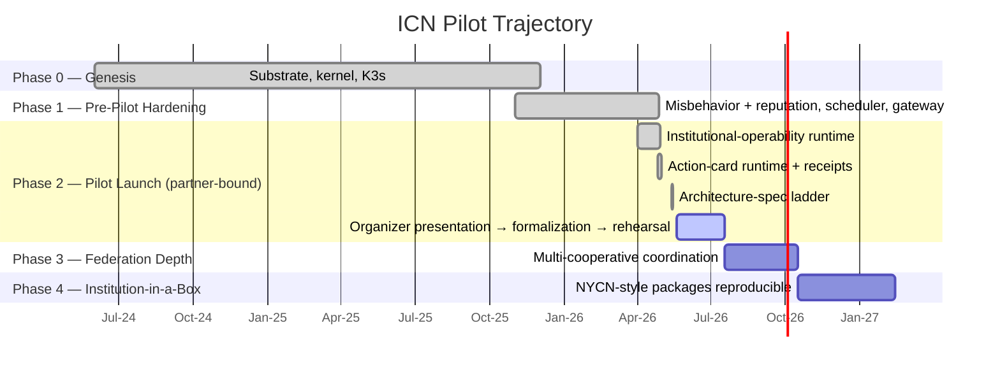

# ICN System Dashboard

> Where we are. What comes next. Across what area.
>
> This is a bird's-eye view of the InterCooperative Network across all four org repos. It compresses the per-PR truth that lives in [`STATE.md`](../STATE.md), [`PHASE_PROGRESS.md`](../PHASE_PROGRESS.md), and [`PHASE_HISTORY.md`](../PHASE_HISTORY.md) into a single orientation page. When those disagree with this dashboard, they win — this is navigation, not state.

**Last refreshed:** 2026-05-19

## You are here

ICN is in **Phase 2 — Pilot Launch**, partner-bound.

The substrate (Phase 1) is done and live: kernel, identity, trust, gossip, mutual-credit ledger, governance, gateway, K3s cluster running since 2025-12-03. The institutional-operability runtime, the action-card runtime, the receipt-retrieval endpoints, and the action-card contract are all in production code. The May 14–15 architecture-spec ladder added thirteen design-level spec documents covering the operating-model spine, effect dispatch, CCL policy registry, member shell, steward cockpit, anti-entropy proof loops, and compute placement.

What's left in Phase 2 is **human procedure**: present the merged ladder to NYCN organizers → formalize the pilot → run the first operator rehearsal. NYCN's drive-ingest operator ladder shipped end-to-end on its repo side (NYCN #21–#34). The ICN side waits for the partner gate.

## Strategic timeline

Pilot trajectory. Each bar is a strategic phase — not the implementation phase numbers below.

The **active bar is Phase 2 → Organizer presentation → formalization → rehearsal**. Everything else in Phase 2 is shipped. The phase doesn't tick to complete until the partner gates close.

## Next 3 phases (month-level)

The implementation phases numbered 1–35 are sprint-grained tactical work. Here are the next three that are scoped and ready:

| # | Phase | Workstream | Status | Est. start | Notes |
|---|---|---|---|---|---|
| **19** | Release Infrastructure | ops | ⏳ scoped | May 2026 | Tag/release pipeline cleanup; not blocked. |
| **20** | Testing Foundation | ops + dev | ⏳ scoped | May 2026 | Multi-node integration test harness expansion. |
| **21** | Network Connectivity | gossip + net | ⏳ scoped | Jun 2026 | IPv6, transport robustness, endpoint sets. |

Phases 22–35 are sequenced in [`PHASE_HISTORY.md`](../PHASE_HISTORY.md) and the dev journal. They will be promoted to the table here as they get start dates.

Pre-RFC framing tracks running in parallel (not on the main phase line):

- **idea-0019** Institutional Process Substrate — partial runtime dogfood (#1755/#1759 emitted `ProcessGateResultReceipt`); three of four RFC gates still open.
- **idea-0020** Democratic Authority Primitives — framing landed (#1751), read-model dogfood landed (#1753); four RFC gates still open.

## Workstream heat

Where activity is concentrating right now. ⚫ shipped & stable, 🟢 active, 🟡 developed but quiet, 🔵 early/pre-build.

| Workstream | Heat | Most recent landings |
|---|---|---|
| kernel | ⚫ | Crate consolidation (Phase 6), strict meaning firewall. Stable. |
| identity | ⚫ | DIDs, Ed25519, age-encrypted keystore. Stable. |
| trust | ⚫ | TrustPolicyOracle, trust-gated rate limits. Stable. |
| gossip / net | ⚫ | QUIC/TLS, anti-entropy, replay guard. Stable. |
| ledger | 🟢 | Opaque receipt storage stack (May 6–7). Active. |
| governance | 🟢 | Action-card runtime, completion receipts, opaque cascade. Active. |
| compute | 🟡 | Placement spec landed (#1826); runtime oracle slice pending. |
| gateway | 🟢 | `/me/standing`, `/me/action-cards`, receipt retrieval. Active. |
| federation | 🔵 | Anti-entropy spec landed (#1829); runtime slice pending. |
| docs / spec | 🟢 | 13-PR architecture-spec ladder May 14–15. Hot. |
| design | 🟢 | Member shell v0 spec (#1830), steward cockpit v0 (#1831/#1832). |
| pilot-ui | 🟡 | Demo-mode tabs verified through demo-audit March 2026. |
| website | 🟡 | intercooperative.network live; periodic claim updates. |
| ops | 🟢 | K3s cluster, deploy makefile, CI pipeline. Active. |
| security | 🟢 | Abuse-case hardening strategy doc landed 2026-05-16. |

## Repos at a glance

This dashboard is the icn-side roadmap. Other repos appear as status badges; their detail lives in their own dashboards or repo docs.

| Repo | Visibility | Status | What's happening |
|---|---|---|---|
| **icn** | Public | 🟢 Active daily | Phase 2 partner-bound. Substrate shipped + spec ladder dense. |
| **nycn** | Private | 🟢 Pre-pilot | Drive-ingest operator ladder shipped #21–#34. Awaiting ICN-side partner gate. |
| **icn-learn** | Private | 🔵 Scaffolding | ICN Academy; role-based learning material in early form. |
| **icn-community-bridge** | Private | 🔵 Scaffold + docs | Discord↔Matrix bridge; scaffold and policy doc only, not deployed. |

Merge order across repos when work crosses boundaries: **`icn` first → `nycn` → `icn-learn`**. See [`docs/reference/project-index/repository-map.md`](../reference/project-index/repository-map.md).

## Next moves (candidate set, not selected)

What's *eligible* to do next. The actual selection happens in the partner-bound gate sequence — none of these is committed.

1. **Organizer presentation** of the merged spec ladder + ICN proof-loop machinery to NYCN organizers (Phase 2 gate; nothing else moves until this happens or is explicitly bypassed).
2. **First implementation slice** off the spec ladder — e.g. `feat(compute): placement policy oracle (read-only proof-loop)` per #1826.
3. **First fixture rehearsal** — one of #1838 (anti-entropy), #1839 (member shell), #1840 (cockpit divergence).
4. **Next spec-ladder doc** — #1837 steward required-action card contract (the ADR-0027 operator-gap the cockpit drift surfaced).
5. **Follow-up batch** — file the remaining 27 deduplicated follow-up drafts from the wrap-up roster.
6. **idea-0019 runtime advance** — emit additional `ProcessTransitionReceipt` classes through the opaque cascade.
7. **DAP runtime dogfood** emitting at least one receipt under ADR-0026 for one DAP primitive.

## Receipts and gates remaining (Phase 2 closure)

What has to happen for Phase 2 to tick to ✅:

- [ ] Organizer presentation to NYCN organizers (Phase 2 gate)
- [ ] Pilot formalization (Phase 2 gate)
- [ ] First operator rehearsal against real (or fixture-equivalent) organizer material (Phase 2 gate)
- [ ] idea-0019 RFC gates: (b) visibility/privacy-boundary run with redaction, (c) accessibility-gate `ProcessGateResult` on a real surface, (d) open-question triage (Q1/Q3/Q4)
- [ ] idea-0020 RFC gates: runtime dogfood emitting at least one receipt under ADR-0026, visibility/privacy run, accessibility-gate run, Q1 or Q5 resolved in writing

## How to use this dashboard

This is **navigation**, not state. To find the actual record of any line above:

- **Per-PR record** → [`STATE.md`](../STATE.md) (every state-changing PR is sync-edited there)
- **Phase status with sync edits** → [`PHASE_PROGRESS.md`](../PHASE_PROGRESS.md)
- **Completed phase summaries** → [`PHASE_HISTORY.md`](../PHASE_HISTORY.md)
- **Strategic context** → [`docs/strategy/ICN-Roadmap-Live.md`](../strategy/ICN-Roadmap-Live.md)
- **Cross-repo orientation** → [`docs/reference/project-index/repository-map.md`](../reference/project-index/repository-map.md)
- **Ecosystem framing** → [`docs/planning/icn-ecosystem-map.md`](../planning/icn-ecosystem-map.md)

When this dashboard and any of the above disagree, the above win. Re-render the dashboard from the source docs to fix the drift.

## How to update this dashboard

When the strategic position shifts (new phase active, partner gate moves, repo status changes), update this file directly. The companion HTML view at `web/dashboard/icn-system-dashboard.html` (and the Cowork artifact) reads from the same data and should be regenerated.

Re-render trigger conditions:
- A phase ticks from ⏳ to ✅, or back.
- A repo moves between status tiers.
- A workstream heat marker shifts.
- The "next 3 phases" table needs a new entry promoted.

This doc is intentionally short. Long content belongs in `STATE.md`, `PHASE_PROGRESS.md`, or the strategy docs.
