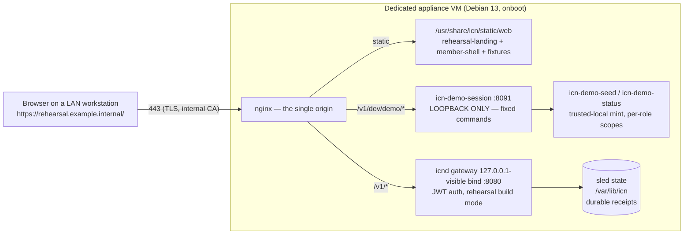

# LAN Rehearsal Node deployment (appliance LAN profile)

**Status: descriptive · non-production.** How to deploy the demo-profile
rehearsal appliance as a dedicated VM on an operator-controlled hypervisor,
reachable from LAN workstations through one stable browser origin. Placeholder
values (`rehearsal.example.internal`, IPs, VM ids) are the operator's; concrete
homelab values are deliberately not recorded in this public repository.

**This deployment may claim:** LAN-hosted development rehearsal · non-production
Rehearsal Node · organizer-to-member workflow · current-main software build ·
local operator-controlled infrastructure · role-scoped sessions · digest-bound
confirmation · receipts and secret-free evidence.
**It may not claim:** production-ready, pilot-ready, organizer-approved,
accessibility-complete, live federation, real institutional deployment, formal
NYCN pilot, production trusted issuance.

## Architecture



- Every browser fetch is **same-origin**; the session credential is held in
  page memory only (never URL, cookie, or storage).
- The session endpoint keeps its loopback bind; nginx is the only LAN path to
  it, and its server-side origin allowlist carries exactly the one deployed
  origin.
- DNS: an A record for the origin host in the operator's **internal** zone.
  TLS: a leaf from the operator's **internal CA** (workstations must already
  trust its root). No public DNS, no tunnel, no port-forward.

## Build the image

From a clean checkout of the intended commit, on a build host with
`qemu-img, virt-customize, virt-sysprep, cargo`:

```bash
ICN_APPLIANCE_BASE_IMAGE=/path/to/debian-13-genericcloud-amd64.qcow2 \
ICN_APPLIANCE_OUTPUT_DIR=/path/to/out \
ICN_APPLIANCE_DEMO_PROFILE=1 \
ICN_APPLIANCE_LAN_PROFILE=1 \
ICN_APPLIANCE_LAN_ORIGIN=https://rehearsal.example.internal \
ICN_APPLIANCE_LAN_TLS_CERT=/path/to/rehearsal.crt \
ICN_APPLIANCE_LAN_TLS_KEY=/path/to/rehearsal.key \
ICN_APPLIANCE_VERSION=0.0.3-lan-$(git rev-parse --short HEAD) \
bash deploy/appliance/build-image.sh --real
```

The typed manifest (`*.manifest.json`) records the exact git commit —
that is the deployment's provenance of record. See
`deploy/appliance/lan/README.md` for the profile contract — including the
build-host networking caveats (`ICN_APPLIANCE_BUILD_DNS`, and pre-staging
`nginx`/`qemu-guest-agent` into the base image when the build host's
libguestfs has no usable appliance network).

## Deploy on Proxmox (reference procedure)

```bash
# on the hypervisor node, with the image copied to /var/lib/vz/
qm create <vmid> --name icn-rehearsal-01 --memory 4096 --cores 2 --cpu host \
  --net0 virtio,bridge=<lan-bridge-or-vnet> --scsihw virtio-scsi-single \
  --serial0 socket --vga serial0 --agent enabled=1 --onboot 1 --ostype l26
qm importdisk <vmid> /var/lib/vz/icn-appliance-<version>-amd64.qcow2 <storage>
qm set <vmid> --scsi0 <storage>:vm-<vmid>-disk-0 --boot order=scsi0
qm disk resize <vmid> scsi0 +17G
qm set <vmid> --ide2 <storage>:cloudinit \
  --ipconfig0 ip=<static-ip>/24,gw=<gateway> \
  --nameserver <internal-dns> --searchdomain <internal-domain> \
  --ciuser icnops --sshkeys /root/operator-key.pub
qm start <vmid>
```

Cloud-init (present in the Debian genericcloud base) applies the static
network, grows the root filesystem, and creates the operator SSH user; the
appliance firstboot unit independently generates per-instance secrets and
initializes `icnd`. First boot takes a few minutes.

Then add the internal DNS A record for the origin host → the VM's static IP.

## Services and restart behavior

| Unit | Role | Restart |
|---|---|---|
| `icnd` | gateway + governance (rehearsal build mode) | on-failure; enabled |
| `icn-member-shell` | loopback-era static server (kept for smoke parity) | always; enabled |
| `icn-demo-session` | loopback session/status endpoint | on-failure; enabled |
| `nginx` | the single LAN origin | Debian default; enabled |
| `icn-appliance-firstboot` | oneshot secret/identity init | first boot only |
| `qemu-guest-agent` | hypervisor integration | enabled |

Everything is `systemctl enable`d — a VM reboot recovers the full stack with
no operator action. Durable receipts (sled, `/var/lib/icn`) survive restarts
and reboots; the rehearsal pending-publish **workspace view** is rebuilt per
process (see `REHEARSAL_RESET_AND_RECOVERY.md`).

## Operate

Use `deploy/appliance/scripts/icn-rehearsal-ctl.sh` from the operator machine
(`REHEARSAL_SSH=icnops@<vm>`): `status`, `start|stop|restart`, `logs [unit]`,
`verify`, `reset` (destructive, confirmed), `update` (prints the procedure).
Logs: `journalctl -u icnd|icn-member-shell|icn-demo-session|nginx` on the VM.

## Update / rollback

Update = rebuild the image from the new commit → copy → stop VM → re-import
disk → boot → re-run the workstation walkthrough. Replacing the disk starts a
**fresh node** (new identity, empty receipts) — the supported, honest update
for a non-production rehearsal appliance. Rollback = re-import the previous
qcow2 (keep at least one prior image). An in-place binary update path is
deliberately not offered.

## Reset / teardown / backup

- Per-run reset: the landing page's **Start a new rehearsal** (workspace
  generation reset; receipts remain).
- Full reset: `sudo icn-demo-reset` on the VM (wipes `/var/lib/icn`,
  regenerates secrets).
- Teardown: `qm stop <vmid> && qm destroy <vmid>`, then remove the DNS record.
- Backup: the appliance is disposable by design — the image + repo commit are
  the recovery path. Snapshot before risky experiments if desired
  (`qm snapshot`), but no backup schedule is warranted for fictional data.

## Known limitations

- The bearer session credential transits the LAN inside TLS when the origin is
  `https`; with a plain-`http` origin it is unencrypted on the LAN — the build
  warns, and `https` with an internal CA is the intended posture.
- Port 8090 (static-only member-shell server) remains open on the VM for smoke
  parity; the launcher on that origin is refused by the session endpoint's
  allowlist. Nothing secret is served there.
- nginx serves no CSP header yet (the static pages set none) — candidate
  follow-up, not a regression versus the witnessed loopback posture.
- The status endpoint (`GET /v1/dev/demo/status`) is unauthenticated by design
  and therefore returns **counts only** — never titles, DIDs, hashes, or
  credentials.
