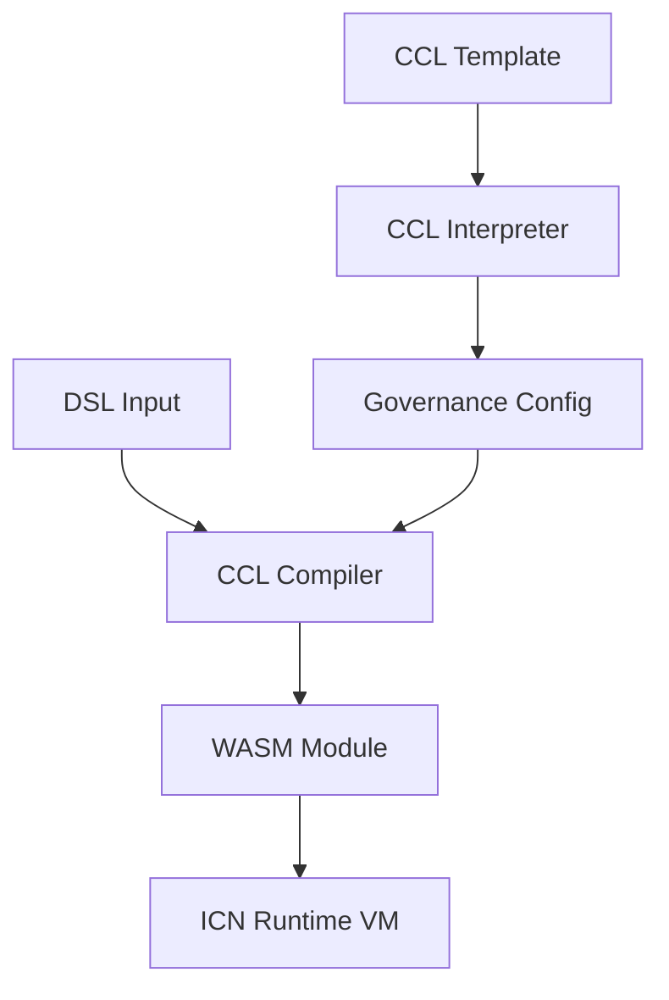

# CCL to WASM Compilation Pipeline

This document describes the architecture and usage of the Constitutional Cooperative Language (CCL) to WebAssembly (WASM) compilation pipeline in the ICN Runtime.

## Overview

The CCL to WASM compilation pipeline enables the conversion of declarative Constitutional Cooperative Language (CCL) templates and Domain-Specific Language (DSL) inputs into executable WASM modules. This allows the ICN Runtime to execute governance rules defined in CCL as verifiable, deterministic computations.

The compilation process bridges the gap between:
- **Declarative governance rules** (what should happen)
- **Executable code** (how it happens)

## Architecture



### Components

1. **CCL Templates** - Constitutional rules for cooperatives, communities, and other organizations. These are written in the CCL language and define the governance structure, decision-making processes, and other rules.

2. **CCL Interpreter** - Parses and validates CCL templates, converting them into a structured `GovernanceConfig` representation.

3. **DSL Inputs** - Action-specific parameters that fill in the template. Examples include membership proposals, budget requests, or voting parameters.

4. **CCL Compiler** - Takes a validated `GovernanceConfig` and DSL inputs and compiles them into a WebAssembly module that encapsulates the execution logic.

5. **WASM Module** - The compiled output that can be executed by the ICN Runtime virtual machine. Contains embedded governance rules and action-specific logic derived from the CCL template and DSL input.

6. **ICN Runtime VM** - Executes the WASM module in a secure, sandboxed environment with appropriate resource limits and permissions.

## WASM Module Structure

The compiled WASM modules have the following structure:

1. **Type Section** - Function signatures for imports and exports
2. **Import Section** - Host functions imported from the runtime
3. **Function Section** - Internal function declarations
4. **Export Section** - Exported functions (`_start` and `invoke`)
5. **Code Section** - Function implementations
6. **Custom Sections**:
   - `icn-metadata`: Essential metadata about the template, action, and execution context
   - `icn-ccl-config`: The full CCL config (when debug info is enabled)
   - `icn-dsl-input`: The full DSL input (when debug info is enabled)

### Metadata

Each compiled WASM module contains embedded metadata in a custom section named `icn-metadata`. This metadata includes:

- **Template Type** - The type of CCL template (e.g., `coop_bylaws`, `community_charter`)
- **Template Version** - The version of the template
- **Action** - The action being performed (e.g., `propose_membership`, `propose_budget`)
- **Caller DID** - The DID of the entity calling the function (if provided at compile time)
- **Compilation Timestamp** - When the WASM was compiled
- **Execution ID** - A unique ID for the execution (if provided at compile time)
- **Additional Data** - Extra metadata fields, including values from the DSL input

This metadata enables:
- Runtime validation of the WASM origin and purpose
- Audit trails for governance actions
- Debugging and tracing of execution
- Version compatibility checking 

## Compilation Process

The compilation process consists of several steps:

1. **Validation** - Ensuring the DSL input is compatible with the CCL template, checking for required fields, and validating data types.

2. **WASM Generation** - Creating a WebAssembly module with:
   - Function signatures for the ICN Runtime host environment
   - Embedded governance rules and parameters
   - Logic for executing the specific action

3. **Optimization** (optional) - Optimizing the WASM module for size and performance.

### Compiler Backends

The CCL Compiler supports multiple backends for WASM generation:

1. **Basic WASM Encoder** - Directly generates WASM bytecode with minimal logic.
2. **Template-Based** - Uses Rust templates filled with parameters to compile more complex WASM modules (requires the `templating` feature).

## DSL Input Schema

DSL input files are JSON documents that contain the parameters for a specific governance action. Different actions require different parameters, as defined by the CCL template.

### Common Actions

1. **Membership Proposal**
   ```json
   {
     "action": "propose_membership",
     "applicant_did": "did:icn:applicant123",
     "name": "Alice Johnson",
     "skills": ["software_development", "community_facilitation"],
     "reason": "I want to join this cooperative..."
   }
   ```

2. **Budget Proposal**
   ```json
   {
     "action": "propose_budget",
     "amount": 5000,
     "category": "development",
     "title": "Web Infrastructure Development",
     "purpose": "Develop and deploy a new website..."
   }
   ```

3. **Resolution**
   ```json
   {
     "action": "propose_resolution",
     "title": "Update Membership Requirements",
     "text": "Whereas current membership requirements...",
     "effective_date": "2025-07-01"
   }
   ```

## DSL Input Schema Validation

DSL inputs are validated against JSON Schema definitions to ensure they match the expected format for each template and action type. This prevents invalid inputs from being compiled into WASM, which could lead to runtime errors.

### Schema Files

The compiler looks for schema files in the `examples/schemas/` directory by default. Schema files are named according to the action they validate:

- `propose_join.schema.json` - For membership proposals (`action: "propose_membership"`)
- `submit_budget.schema.json` - For budget proposals (`action: "propose_budget"`)

### Schema Format

Schema files follow the [JSON Schema specification](https://json-schema.org/) (Draft-07) and define:

- Required properties for a specific action
- Property types and formats
- Constraints (min/max values, string patterns, etc.)
- Enum values for restricted fields

Example schema for a membership proposal:

```json
{
  "$schema": "http://json-schema.org/draft-07/schema#",
  "title": "Membership Proposal DSL",
  "description": "Schema for proposing new membership to a cooperative",
  "type": "object",
  "properties": {
    "action": {
      "type": "string",
      "enum": ["propose_membership"],
      "description": "The action type for membership proposals"
    },
    "applicant_did": {
      "type": "string",
      "pattern": "^did:icn:",
      "description": "The DID of the applicant"
    },
    "name": {
      "type": "string",
      "minLength": 2,
      "description": "Full name of the applicant"
    },
    "reason": {
      "type": "string",
      "minLength": 10,
      "description": "Reason for joining the cooperative"
    }
  },
  "required": ["action", "applicant_did", "name", "reason"],
  "additionalProperties": true
}
```

### Validation Process

1. The compiler extracts the `action` field from the DSL input
2. It looks for a schema file matching the action type
3. If found, it validates the DSL input against that schema
4. If no action-specific schema is found, it falls back to the template type schema
5. If validation fails, compilation is aborted with detailed error messages

### Custom Schemas

You can also specify a custom schema file using the `--schema` option in the CLI or the `schema_path` field in the `CompilationOptions` struct when using the programmatic API.

## Usage

### Command Line

The `covm` CLI provides a `compile` command for generating WASM modules:

```bash
covm compile --ccl-template examples/cooperative_bylaws.ccl \
             --dsl-input examples/dsl/propose_join.dsl \
             --output target/wasm/proposal.wasm \
             --scope cooperative \
             --caller-did "did:icn:member123" \
             --execution-id "exec-20250601-001" \
             --schema examples/schemas/custom_schema.json
```

Optional flags:
- `--debug` - Include debug information in the WASM
- `--optimize=false` - Disable optimization
- `--caller-did` - DID of the entity who will execute this WASM
- `--execution-id` - Custom execution ID for tracing
- `--schema` - Custom schema file to use for validation
- `--skip-schema-validation` - Skip schema validation

### Programmatic API

```rust
use icn_ccl_compiler::{CclCompiler, CompilationOptions};
use icn_governance_kernel::{CclInterpreter, config::GovernanceConfig};
use icn_identity::IdentityScope;
use serde_json::Value as JsonValue;
use std::collections::HashMap;
use std::path::PathBuf;

// Parse the CCL template
let interpreter = CclInterpreter::new();
let governance_config = interpreter.interpret_ccl(&ccl_content, IdentityScope::Cooperative)?;

// Parse the DSL input
let dsl_input: JsonValue = serde_json::from_str(&dsl_content)?;

// Create additional metadata (optional)
let mut additional_metadata = HashMap::new();
additional_metadata.insert("app_version".to_string(), "1.0.0".to_string());
additional_metadata.insert("guild_id".to_string(), "tech-guild-001".to_string());

// Configure compilation options
let options = CompilationOptions {
    include_debug_info: false,
    optimize: true,
    memory_limits: None, // Use default memory limits
    additional_metadata: Some(additional_metadata),
    caller_did: Some("did:icn:member456".to_string()),
    execution_id: Some("exec-2025-06-15-002".to_string()),
    // Schema validation options
    schema_path: Some(PathBuf::from("examples/schemas/custom_schema.json")), // Optional custom schema
    validate_schema: true, // Enable schema validation (default is true)
};

// Compile to WASM
let mut compiler = CclCompiler::new();
let wasm_bytes = compiler.compile_to_wasm(&governance_config, &dsl_input, Some(options))?;

// The compiled WASM now contains embedded metadata in a custom section
```

## Future Enhancements

1. **Advanced Templating** - More sophisticated templates for complex governance actions.
2. **Schema Validation** - JSON Schema validation for DSL inputs.
3. **Security Features** - Embedding signatures and authorization checks in the WASM.
4. **Optimization** - Better optimization of the generated WASM modules.
5. **Debugging Tools** - Tools for debugging and inspecting the compiled WASM modules.

## Security Considerations

The CCL compiler implements several security measures:

1. **Input Validation** - All DSL inputs are validated before compilation.
2. **Memory Limits** - Compiled WASM modules have configurable memory limits.
3. **Host API Restrictions** - Only necessary host functions are exposed to WASM modules.
4. **Resource Metering** - Execution is monitored and limited by the ICN Runtime VM.

## Related Documentation

- [CCL Language Reference](CCL_LANGUAGE.md)
- [ICN Runtime VM](RUNTIME_VM.md)
- [Governance Kernel](GOVERNANCE_KERNEL.md) 