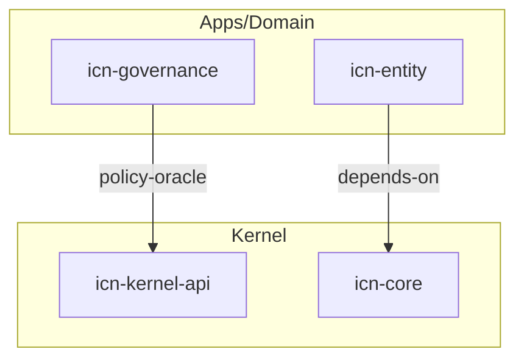

# navigator — reference

Node/edge taxonomy, boundaries, and future-generator notes for the `navigator` skill.

## Node taxonomy

- **Kernel crates** — domain-agnostic (e.g. `icn-kernel-api`, `icn-core`, `icn-net`, `icn-gossip`,
  `icn-store`, `icn-encoding`). These enforce constraints without understanding meaning.
- **App / domain crates** — domain-specific (e.g. `icn-ledger`, `icn-ccl`, `icn-governance`,
  `icn-trust`, `icn-entity`, `icn-federation`). These translate meaning into constraints.
- **Apps** — `apps/governance`, `apps/ledger`, `apps/membership`, `apps/charter`.
- **Binaries** — `icnd`, `icnctl`, `icn-console`.
- **Concepts** — Meaning Firewall, PolicyOracle, ConstraintSet, entity-authority spine, trust class, CCL.
- **Claims / surfaces** — public claims, runtime surface, route inventory, readiness/show maps.

## Edge taxonomy

- **depends-on** — crate dependency (apps may depend on kernel, never the reverse).
- **meaning-firewall** — the boundary where domain semantics become generic constraints.
- **policy-oracle** — app implements `PolicyOracle`; kernel consumes the decision blindly.
- **claim→source** — a public/docs claim and the file(s) that back it.
- **route→artifact** — a gateway route and its OpenAPI / SDK / inventory descendants.

## Boundaries to respect when mapping

- **Never imply a reverse meaning-firewall edge** (kernel importing a domain crate) — that is a
  violation, not a relationship. If the map would draw one, flag it as a defect.
- **Declared ≠ live.** Map nodes/edges from source and the project-index maps are evidence of
  structure, not of runtime liveness. Keep liveness claims out of the structural map; route them to
  `truth-sync`.

## Evidence sources, in order of preference

1. `icn_ops_repo_map`, `icn_ops_state_index`, `icn_ops_agent_brief`, `icn_ops_verification_plan`
   (the `icn-ops` MCP server) — current, read-mostly.
2. `docs/reference/project-index/*.md` — source-of-truth, runtime-surface, website-truth, show-readiness maps.
3. The crate tree (`icn/crates/`, `icn/apps/`, `icn/bins/`) and `CLAUDE.md` topology — fall back only
   when MCP and project-index are unavailable; say so in the output.

## Generated artifacts

The **Agent Context Spine v0** is committed at
`docs/reference/project-index/generated/agent-context-spine.json`, produced by
`scripts/generate-agent-context-spine.py` (validated by `scripts/check-agent-context-spine.py`, and
readable live via the `icn-ops` MCP tool `icn_ops_agent_context_spine`). It is a generated,
non-canonical, evidence-grounded node/edge map — see
[`docs/guides/developer/agent-context-spine.md`](../../../../../../docs/guides/developer/agent-context-spine.md).

- Prefer reading/refreshing the spine over re-deriving structure by hand.
- The spine is v0: it does **not** yet parse the Rust module graph or enumerate per-route nodes. For
  anything it does not cover, produce maps **inline** (markdown node/edge lists + mermaid diagrams)
  and do not fabricate a generated path or claim a generated file exists.
- Refresh only when asked: `python3 scripts/generate-agent-context-spine.py --write`.

## Suggested mermaid skeleton

